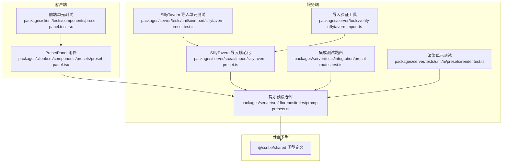
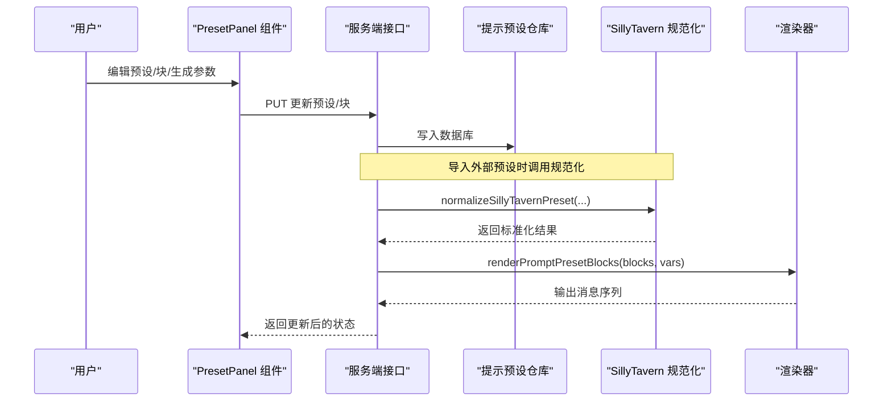
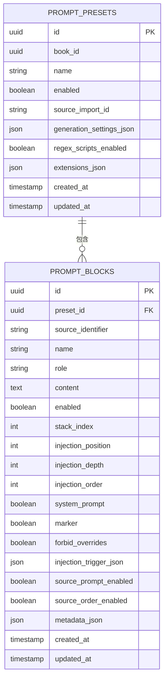
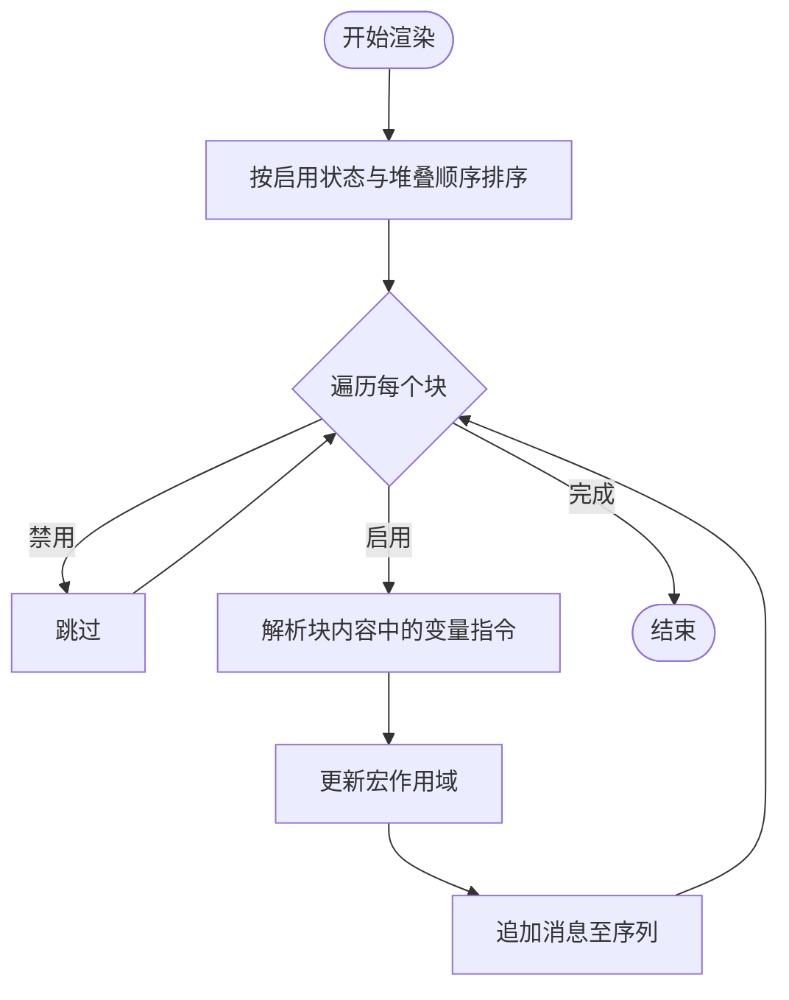
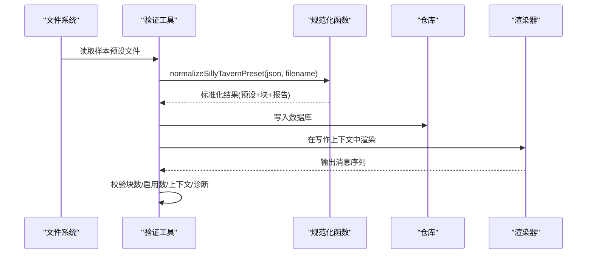
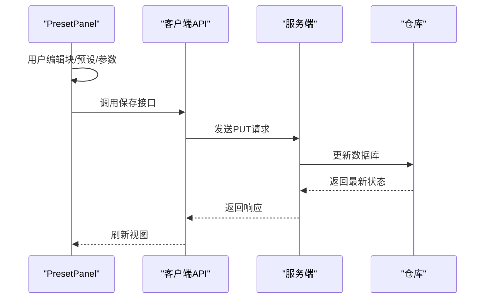
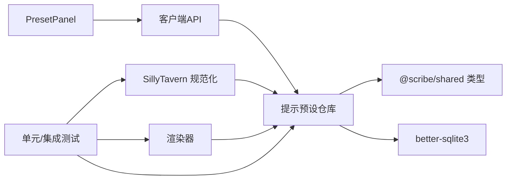

# 提示预设管理

<cite>
**本文档引用的文件**
- [packages/client/src/components/presets/preset-panel.tsx](file://packages/client/src/components/presets/preset-panel.tsx)
- [packages/client/tests/.../preset-panel.test.tsx](file://packages/client/tests/components/preset-panel.test.tsx)
- [packages/server/src/db/repositories/prompt-presets.ts](file://packages/server/src/db/repositories/prompt-presets.ts)
- [packages/server/tests/unit/db/repositories/prompt-presets.test.ts](file://packages/server/tests/unit/db/repositories/prompt-presets.test.ts)
- [packages/server/tests/integration/preset-routes.test.ts](file://packages/server/tests/integration/preset-routes.test.ts)
- [packages/server/tests/unit/ai/presets/render.test.ts](file://packages/server/tests/unit/ai/presets/render.test.ts)
- [packages/server/tests/unit/ai/import/sillytavern-preset.test.ts](file://packages/server/tests/unit/ai/import/sillytavern-preset.test.ts)
- [packages/server/src/ai/import/sillytavern-preset.ts](file://packages/server/src/ai/import/sillytavern-preset.ts)
- [samples/sillytavern/Izumi 0503.json](file://samples/sillytavern/Izumi 0503.json)
- [packages/server/tools/verify-sillytavern-import.ts](file://packages/server/tools/verify-sillytavern-import.ts)
</cite>

## 目录
1. [简介](#简介)
2. [项目结构](#项目结构)
3. [核心组件](#核心组件)
4. [架构总览](#架构总览)
5. [详细组件分析](#详细组件分析)
6. [依赖关系分析](#依赖关系分析)
7. [性能考虑](#性能考虑)
8. [故障排查指南](#故障排查指南)
9. [结论](#结论)
10. [附录](#附录)

## 简介
本文件面向Scribe的“提示预设管理”能力，系统化说明提示预设的结构设计、模板系统、变量替换与参数配置，以及在不同写作场景中的应用方式（创作引导、风格控制、质量检查）。文档还涵盖预设的导入导出、版本与继承机制、最佳实践与性能优化建议，帮助开发者与使用者高效构建与维护高质量的提示工程体系。

## 项目结构
提示预设管理涉及客户端界面、服务端数据模型与仓库、AI渲染管线、以及从外部格式（如SillyTavern）导入的规范化流程。下图展示与提示预设直接相关的模块关系：

图表来源
- [packages/client/src/components/presets/preset-panel.tsx:1-257](file://packages/client/src/components/presets/preset-panel.tsx#L1-L257)
- [packages/server/src/db/repositories/prompt-presets.ts:1-263](file://packages/server/src/db/repositories/prompt-presets.ts#L1-L263)
- [packages/server/src/ai/import/sillytavern-preset.ts:116-154](file://packages/server/src/ai/import/sillytavern-preset.ts#L116-L154)
- [packages/server/tests/unit/ai/import/sillytavern-preset.test.ts:1-42](file://packages/server/tests/unit/ai/import/sillytavern-preset.test.ts#L1-L42)
- [packages/server/tests/integration/preset-routes.test.ts:106-154](file://packages/server/tests/integration/preset-routes.test.ts#L106-L154)
- [packages/server/tests/unit/ai/presets/render.test.ts:1-33](file://packages/server/tests/unit/ai/presets/render.test.ts#L1-L33)
- [packages/server/tools/verify-sillytavern-import.ts:179-199](file://packages/server/tools/verify-sillytavern-import.ts#L179-L199)

章节来源
- [packages/client/src/components/presets/preset-panel.tsx:1-257](file://packages/client/src/components/presets/preset-panel.tsx#L1-L257)
- [packages/server/src/db/repositories/prompt-presets.ts:1-263](file://packages/server/src/db/repositories/prompt-presets.ts#L1-L263)

## 核心组件
- 预设块（Prompt Block）
  - 具备角色（role）、启用状态（enabled）、堆叠顺序（stackIndex）、注入位置/深度/顺序等属性，支持按顺序拼接形成最终提示序列。
  - 支持宏作用域（macro scope），块间可共享变量（例如通过变量设置与读取指令进行跨块通信）。
- 预设（Prompt Preset）
  - 包含名称、启用状态、生成参数（generationSettings）、正则脚本开关（regexScriptsEnabled）及扩展字段（extensions），扩展中常包含正则脚本列表。
- 渲染器（renderPromptPresetBlocks）
  - 按启用状态与堆叠顺序输出消息序列；保留原始角色；跨块共享宏作用域。
- 导入规范化（normalizeSillyTavernPreset）
  - 将外部格式的提示集合转换为内部统一的预设与块结构，保留或纠正启用状态与堆叠顺序，记录警告信息。
- 客户端面板（PresetPanel）
  - 展示与编辑预设及其块内容，支持批量保存、启用/禁用切换、正则脚本开关与生成参数JSON编辑。

章节来源
- [packages/server/tests/unit/ai/presets/render.test.ts:1-33](file://packages/server/tests/unit/ai/presets/render.test.ts#L1-L33)
- [packages/server/tests/unit/ai/import/sillytavern-preset.test.ts:1-42](file://packages/server/tests/unit/ai/import/sillytavern-preset.test.ts#L1-L42)
- [packages/client/src/components/presets/preset-panel.tsx:1-257](file://packages/client/src/components/presets/preset-panel.tsx#L1-L257)

## 架构总览
提示预设管理的端到端流程如下：用户在客户端编辑预设与块；服务端仓库持久化；导入时将外部格式规范化为内部结构；渲染阶段根据启用状态与堆叠顺序生成最终提示；集成测试与单元测试覆盖关键路径。

图表来源
- [packages/client/src/components/presets/preset-panel.tsx:53-138](file://packages/client/src/components/presets/preset-panel.tsx#L53-L138)
- [packages/server/src/db/repositories/prompt-presets.ts:118-263](file://packages/server/src/db/repositories/prompt-presets.ts#L118-L263)
- [packages/server/src/ai/import/sillytavern-preset.ts:120-154](file://packages/server/src/ai/import/sillytavern-preset.ts#L120-L154)
- [packages/server/tests/unit/ai/presets/render.test.ts:30-33](file://packages/server/tests/unit/ai/presets/render.test.ts#L30-L33)

## 详细组件分析

### 数据模型与存储
- 预设实体（PromptPreset）
  - 关键字段：名称、启用状态、生成参数JSON、正则脚本开关、扩展字段、时间戳。
  - 扩展字段用于承载正则脚本等第三方能力。
- 块实体（PromptBlock）
  - 关键字段：所属预设ID、来源标识符（sourceIdentifier）、名称、角色、内容、启用状态、堆叠索引、注入参数、系统提示标记、禁止覆盖标记、触发条件、来源提示/排序开关、元数据、时间戳。
- 仓库方法
  - 创建、查询、更新预设与块；按启用状态与堆叠顺序查询块；块级更新支持部分字段变更。

图表来源
- [packages/server/src/db/repositories/prompt-presets.ts:12-39](file://packages/server/src/db/repositories/prompt-presets.ts#L12-L39)
- [packages/server/src/db/repositories/prompt-presets.ts:93-115](file://packages/server/src/db/repositories/prompt-presets.ts#L93-L115)

章节来源
- [packages/server/src/db/repositories/prompt-presets.ts:1-263](file://packages/server/src/db/repositories/prompt-presets.ts#L1-L263)

### 模板系统与变量替换
- 变量作用域与指令
  - 支持在块内容中使用变量设置与读取指令，实现跨块共享状态（例如先在某块设置变量，再在另一块读取）。
  - 渲染时按启用状态与堆叠顺序依次处理，保持各角色不变。
- 复杂度与性能
  - 变量解析发生在渲染阶段，复杂度与块数量线性相关；建议控制块数量与变量访问层级，避免深层嵌套与重复计算。

图表来源
- [packages/server/tests/unit/ai/presets/render.test.ts:30-33](file://packages/server/tests/unit/ai/presets/render.test.ts#L30-L33)

章节来源
- [packages/server/tests/unit/ai/presets/render.test.ts:1-33](file://packages/server/tests/unit/ai/presets/render.test.ts#L1-L33)

### 参数配置与生成设置
- 生成参数（generationSettings）
  - 以JSON对象形式存储，支持温度、采样比例等参数；客户端提供JSON编辑入口，保存前进行有效性校验。
- 正则脚本开关（regexScriptsEnabled）
  - 控制是否在生成后对输出执行正则替换；可在预设层面开启/关闭。
- 测试覆盖
  - 集成测试验证更新预设时，启用状态、生成参数与正则脚本配置能正确持久化与返回。

章节来源
- [packages/client/src/components/presets/preset-panel.tsx:60-138](file://packages/client/src/components/presets/preset-panel.tsx#L60-L138)
- [packages/server/tests/integration/preset-routes.test.ts:122-154](file://packages/server/tests/integration/preset-routes.test.ts#L122-L154)

### 导入与导出（SillyTavern）
- 导入流程
  - 将外部格式的提示集合映射为内部块与预设；优先采用外部的堆叠顺序与启用状态，同时记录不一致的警告。
  - 单元测试验证导入后块数量、启用块数量、报告统计与警告码。
- 导出与兼容性
  - 导出时应遵循外部格式的字段约定，确保导入时能被正确识别与还原。
- 验证工具
  - 提供专用验证脚本，检查导入后块数、启用块数、世界书条目、上下文进入情况、正则脚本运行与诊断记录等指标。

图表来源
- [packages/server/src/ai/import/sillytavern-preset.ts:120-154](file://packages/server/src/ai/import/sillytavern-preset.ts#L120-L154)
- [packages/server/tests/unit/ai/import/sillytavern-preset.test.ts:1-42](file://packages/server/tests/unit/ai/import/sillytavern-preset.test.ts#L1-L42)
- [packages/server/tools/verify-sillytavern-import.ts:179-199](file://packages/server/tools/verify-sillytavern-import.ts#L179-L199)

章节来源
- [packages/server/src/ai/import/sillytavern-preset.ts:116-154](file://packages/server/src/ai/import/sillytavern-preset.ts#L116-L154)
- [packages/server/tests/unit/ai/import/sillytavern-preset.test.ts:1-42](file://packages/server/tests/unit/ai/import/sillytavern-preset.test.ts#L1-L42)
- [samples/sillytavern/Izumi 0503.json](file://samples/sillytavern/Izumi 0503.json)
- [packages/server/tools/verify-sillytavern-import.ts:179-199](file://packages/server/tools/verify-sillytavern-import.ts#L179-L199)

### 客户端编辑与保存
- 预设面板
  - 列出所有预设，展示块列表并允许逐块编辑内容与启用状态；支持编辑生成参数JSON与正则脚本开关。
  - 保存时进行JSON合法性校验，失败则反馈错误信息。
- 测试验证
  - 前端测试覆盖块启用切换、内容修改、预设设置与正则脚本编辑的保存行为，断言请求体与响应。

图表来源
- [packages/client/src/components/presets/preset-panel.tsx:53-138](file://packages/client/src/components/presets/preset-panel.tsx#L53-L138)
- [packages/client/tests/components/preset-panel.test.tsx:18-109](file://packages/client/tests/components/preset-panel.test.tsx#L18-L109)

章节来源
- [packages/client/src/components/presets/preset-panel.tsx:1-257](file://packages/client/src/components/presets/preset-panel.tsx#L1-L257)
- [packages/client/tests/components/preset-panel.test.tsx:1-120](file://packages/client/tests/components/preset-panel.test.tsx#L1-L120)

### 版本管理与继承机制
- 版本与继承建议
  - 使用来源导入ID（sourceImportId）标识外部来源，便于追踪与回滚。
  - 通过块的堆叠顺序与系统提示标记实现“继承式”提示栈：上游块负责基础设定，下游块负责风格/质量约束。
  - 对于需要复用的通用块，建议以稳定的sourceIdentifier命名，配合元数据（metadata）标注用途与版本号，便于检索与替换。
- 实践要点
  - 启用状态与堆叠顺序需与业务目标一致；当外部来源与本地需求冲突时，优先在本地层调整堆叠顺序而非破坏外部一致性。

章节来源
- [packages/server/src/db/repositories/prompt-presets.ts:12-39](file://packages/server/src/db/repositories/prompt-presets.ts#L12-L39)
- [packages/server/src/db/repositories/prompt-presets.ts:93-115](file://packages/server/src/db/repositories/prompt-presets.ts#L93-L115)

### 应用场景与最佳实践
- 创作引导
  - 使用系统角色块设定基调与任务边界；辅助块负责风格/语气/字数等细节；通过堆叠顺序保证“先框架后细节”。
- 风格控制
  - 将风格约束拆分为独立块，便于在不同场景切换；利用变量指令在块间传递风格参数。
- 质量检查
  - 使用正则脚本在生成后进行一致性与合规性检查；通过开关集中控制是否启用。
- 最佳实践
  - 控制块数量与层级，避免过深的堆叠导致渲染开销与维护成本上升。
  - 明确块的角色与职责，避免多块在同一角色上重复设置相同内容。
  - 为关键块添加元数据与注释，便于后续审计与复用。

## 依赖关系分析
- 组件耦合
  - 客户端面板依赖API与仓库；仓库依赖共享类型与JSON解析工具；导入规范化依赖外部格式约定与报告结构；渲染器依赖块与变量作用域。
- 外部依赖
  - JSON Schema解析与数据库（better-sqlite3）；测试框架（Vitest、Testing Library）。
- 循环依赖
  - 当前结构清晰，无明显循环依赖迹象。

图表来源
- [packages/client/src/components/presets/preset-panel.tsx:1-257](file://packages/client/src/components/presets/preset-panel.tsx#L1-L257)
- [packages/server/src/db/repositories/prompt-presets.ts:1-263](file://packages/server/src/db/repositories/prompt-presets.ts#L1-L263)
- [packages/server/src/ai/import/sillytavern-preset.ts:120-154](file://packages/server/src/ai/import/sillytavern-preset.ts#L120-L154)

章节来源
- [packages/server/src/db/repositories/prompt-presets.ts:1-263](file://packages/server/src/db/repositories/prompt-presets.ts#L1-L263)

## 性能考虑
- 渲染阶段
  - 渲染复杂度与块数量线性相关；建议限制单个预设的块数量，避免过多堆叠与深层变量作用域。
- 存储与查询
  - 查询块时按启用状态与堆叠顺序排序，SQL已包含有序索引字段；建议在高频查询场景下增加复合索引以提升性能。
- 导入与验证
  - 导入时进行规范化与报告生成，建议在后台异步执行并提供进度反馈；验证工具可用于批量回归检查。

## 故障排查指南
- 常见问题
  - 生成参数JSON无效：检查JSON对象格式与字段名；客户端保存前会进行校验并抛出错误。
  - 块未生效：确认启用状态与堆叠顺序；检查是否存在禁用覆盖标记（forbidOverrides）导致被上游块覆盖。
  - 导入后块数/启用数异常：查看导入报告中的警告码，定位不一致项并手动修正。
- 排查步骤
  - 使用验证工具检查块计数、启用计数、上下文进入与诊断记录。
  - 查看仓库中块的堆叠顺序与启用状态，确认与预期一致。
  - 在渲染单元测试中复现问题，逐步缩小范围。

章节来源
- [packages/client/src/components/presets/preset-panel.tsx:60-73](file://packages/client/src/components/presets/preset-panel.tsx#L60-L73)
- [packages/server/tools/verify-sillytavern-import.ts:179-199](file://packages/server/tools/verify-sillytavern-import.ts#L179-L199)
- [packages/server/tests/unit/db/repositories/prompt-presets.test.ts:39-67](file://packages/server/tests/unit/db/repositories/prompt-presets.test.ts#L39-L67)

## 结论
Scribe的提示预设管理以“块+预设”的结构为核心，结合变量作用域与堆叠顺序实现灵活的提示组合；通过导入规范化与渲染器保障了从外部格式到内部执行的一致性；客户端提供直观的编辑体验与完善的测试覆盖。遵循本文档的结构设计、参数配置与最佳实践，可有效提升提示工程的可维护性与性能表现。

## 附录
- 关键测试用例参考
  - 预设渲染：[packages/server/tests/unit/ai/presets/render.test.ts:30-33](file://packages/server/tests/unit/ai/presets/render.test.ts#L30-L33)
  - SillyTavern 导入：[packages/server/tests/unit/ai/import/sillytavern-preset.test.ts:1-42](file://packages/server/tests/unit/ai/import/sillytavern-preset.test.ts#L1-L42)
  - 预设更新集成测试：[packages/server/tests/integration/preset-routes.test.ts:122-154](file://packages/server/tests/integration/preset-routes.test.ts#L122-L154)
  - 前端编辑保存测试：[packages/client/tests/components/preset-panel.test.tsx:66-120](file://packages/client/tests/components/preset-panel.test.tsx#L66-L120)