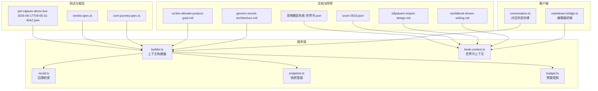
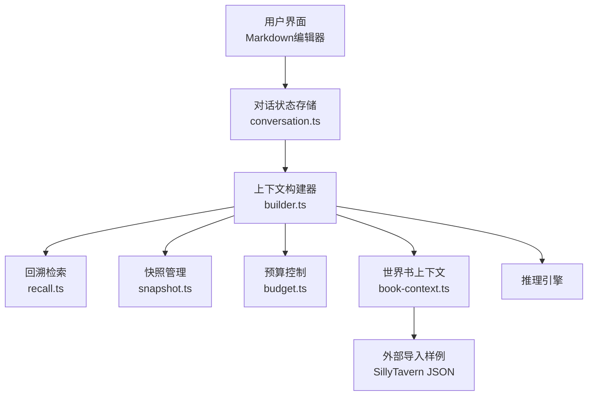
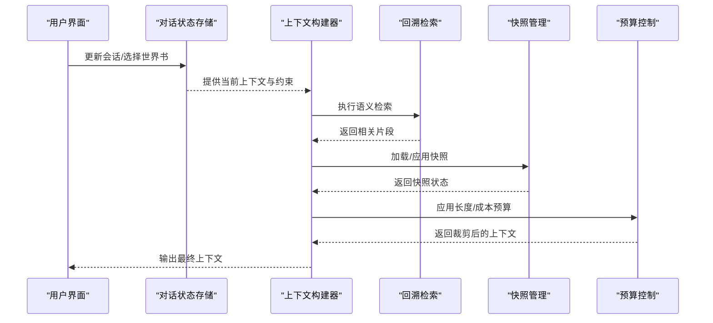
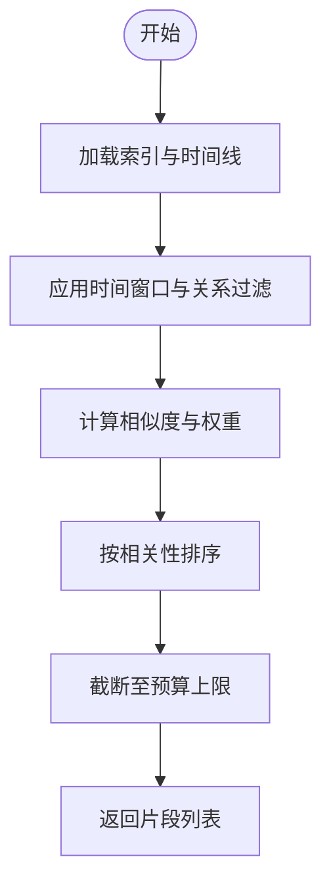
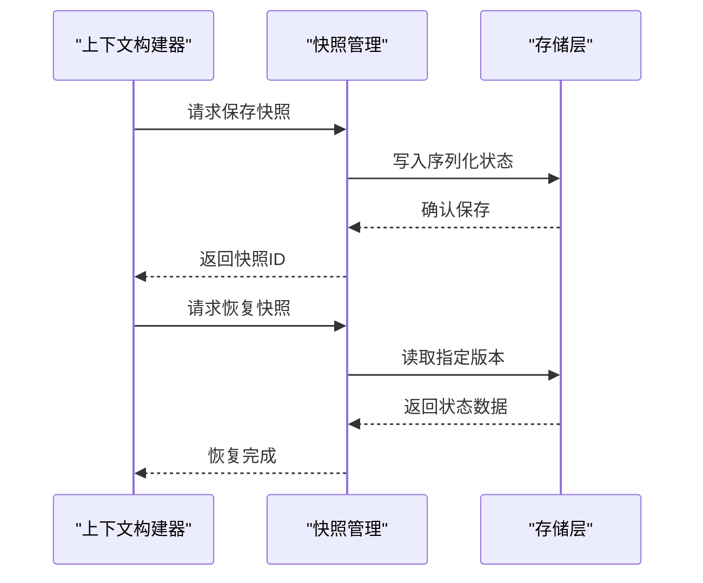
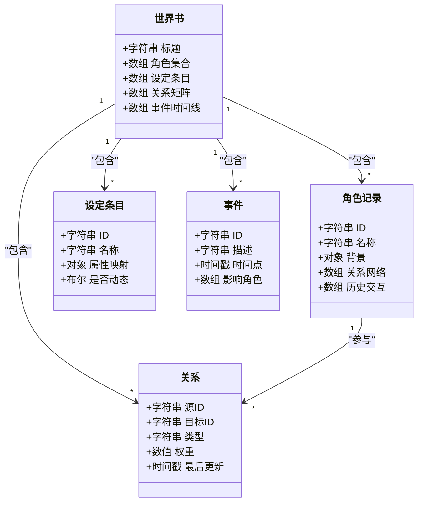
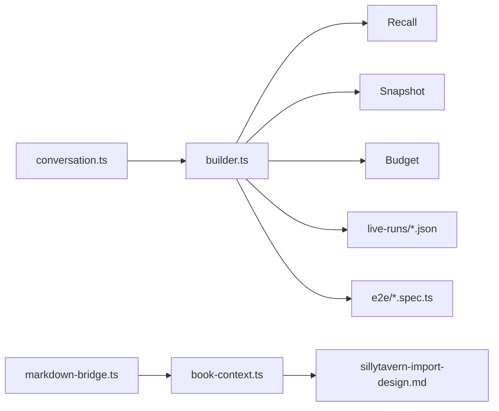

# 知识管理系统

<cite>
**本文引用的文件**
- [README.md](file://README.md)
- [packages/server/src/ai/context-builder/builder.ts](file://packages/server/src/ai/context-builder/builder.ts)
- [packages/server/src/ai/context-builder/recall.ts](file://packages/server/src/ai/context-builder/recall.ts)
- [packages/server/src/ai/context-builder/snapshot.ts](file://packages/server/src/ai/context-builder/snapshot.ts)
- [packages/server/src/ai/context-builder/book-context.ts](file://packages/server/src/ai/context-builder/book-context.ts)
- [packages/server/src/ai/context-builder/budget.ts](file://packages/server/src/ai/context-builder/budget.ts)
- [packages/client/src/stores/conversation.ts](file://packages/client/src/stores/conversation.ts)
- [packages/client/src/components/editor/markdown-bridge.ts](file://packages/client/src/components/editor/markdown-bridge.ts)
- [samples/sillytavern/Izumi 0503.json](file://samples/sillytavern/Izumi 0503.json)
- [samples/sillytavern/宠物捕捉系统-世界书.json](file://samples/sillytavern/宠物捕捉系统-世界书.json)
- [docs/superpowers/plans/2026-06-15-generic-record-architecture.md](file://docs/superpowers/plans/2026-06-15-generic-record-architecture.md)
- [docs/superpowers/plans/2026-06-15-worldbook-driven-writing.md](file://docs/superpowers/plans/2026-06-15-worldbook-driven-writing.md)
- [docs/superpowers/specs/2026-06-16-sillytavern-import-design.md](file://docs/superpowers/specs/2026-06-16-sillytavern-import-design.md)
- [docs/superpowers/specs/2026-06-17-scribe-ultimate-product-goal.md](file://docs/superpowers/specs/2026-06-17-scribe-ultimate-product-goal.md)
- [e2e/tests/core-journey.spec.ts](file://e2e/tests/core-journey.spec.ts)
- [e2e/tests/smoke.spec.ts](file://e2e/tests/smoke.spec.ts)
- [reports/live-runs/pet-capture-demo-live-2026-06-17T09-05-31-454Z.json](file://reports/live-runs/pet-capture-demo-live-2026-06-17T09-05-31-454Z.json)
</cite>

## 目录
1. [简介](#简介)
2. [项目结构](#项目结构)
3. [核心组件](#核心组件)
4. [架构总览](#架构总览)
5. [详细组件分析](#详细组件分析)
6. [依赖关系分析](#依赖关系分析)
7. [性能考虑](#性能考虑)
8. [故障排除指南](#故障排除指南)
9. [结论](#结论)
10. [附录](#附录)

## 简介
本文件面向Scribe知识管理系统，聚焦长期记忆管理、通用记录架构与上下文构建（快照与回溯）等核心能力，系统性梳理状态持久化、关系维护与时间线追踪机制；解释世界书（Worldbook）、角色记录与提示预设的实现要点；给出数据模型、API接口与使用示例，并总结数据一致性与性能优化策略。

## 项目结构
仓库采用多包工作区布局，核心模块包括：
- packages/server：AI上下文构建、预算控制与快照/回溯逻辑
- packages/client：对话状态存储、编辑器桥接与用户界面交互
- docs：产品规划与设计规范文档
- samples：外部导入样例（如SillyTavern）
- e2e：端到端测试用例
- reports：运行时报告与演示数据

**图表来源**
- [packages/server/src/ai/context-builder/builder.ts](file://packages/server/src/ai/context-builder/builder.ts)
- [packages/server/src/ai/context-builder/recall.ts](file://packages/server/src/ai/context-builder/recall.ts)
- [packages/server/src/ai/context-builder/snapshot.ts](file://packages/server/src/ai/context-builder/snapshot.ts)
- [packages/server/src/ai/context-builder/book-context.ts](file://packages/server/src/ai/context-builder/book-context.ts)
- [packages/server/src/ai/context-builder/budget.ts](file://packages/server/src/ai/context-builder/budget.ts)
- [packages/client/src/stores/conversation.ts](file://packages/client/src/stores/conversation.ts)
- [packages/client/src/components/editor/markdown-bridge.ts](file://packages/client/src/components/editor/markdown-bridge.ts)
- [docs/superpowers/plans/2026-06-15-generic-record-architecture.md](file://docs/superpowers/plans/2026-06-15-generic-record-architecture.md)
- [docs/superpowers/plans/2026-06-15-worldbook-driven-writing.md](file://docs/superpowers/plans/2026-06-15-worldbook-driven-writing.md)
- [docs/superpowers/specs/2026-06-16-sillytavern-import-design.md](file://docs/superpowers/specs/2026-06-16-sillytavern-import-design.md)
- [docs/superpowers/specs/2026-06-17-scribe-ultimate-product-goal.md](file://docs/superpowers/specs/2026-06-17-scribe-ultimate-product-goal.md)
- [samples/sillytavern/Izumi 0503.json](file://samples/sillytavern/Izumi 0503.json)
- [samples/sillytavern/宠物捕捉系统-世界书.json](file://samples/sillytavern/宠物捕捉系统-世界书.json)
- [e2e/tests/core-journey.spec.ts](file://e2e/tests/core-journey.spec.ts)
- [e2e/tests/smoke.spec.ts](file://e2e/tests/smoke.spec.ts)
- [reports/live-runs/pet-capture-demo-live-2026-06-17T09-05-31-454Z.json](file://reports/live-runs/pet-capture-demo-live-2026-06-17T09-05-31-454Z.json)

**章节来源**
- [README.md](file://README.md)
- [packages/server/src/ai/context-builder/builder.ts](file://packages/server/src/ai/context-builder/builder.ts)
- [packages/server/src/ai/context-builder/recall.ts](file://packages/server/src/ai/context-builder/recall.ts)
- [packages/server/src/ai/context-builder/snapshot.ts](file://packages/server/src/ai/context-builder/snapshot.ts)
- [packages/server/src/ai/context-builder/book-context.ts](file://packages/server/src/ai/context-builder/book-context.ts)
- [packages/server/src/ai/context-builder/budget.ts](file://packages/server/src/ai/context-builder/budget.ts)
- [packages/client/src/stores/conversation.ts](file://packages/client/src/stores/conversation.ts)
- [packages/client/src/components/editor/markdown-bridge.ts](file://packages/client/src/components/editor/markdown-bridge.ts)
- [docs/superpowers/plans/2026-06-15-generic-record-architecture.md](file://docs/superpowers/plans/2026-06-15-generic-record-architecture.md)
- [docs/superpowers/plans/2026-06-15-worldbook-driven-writing.md](file://docs/superpowers/plans/2026-06-15-worldbook-driven-writing.md)
- [docs/superpowers/specs/2026-06-16-sillytavern-import-design.md](file://docs/superpowers/specs/2026-06-16-sillytavern-import-design.md)
- [docs/superpowers/specs/2026-06-17-scribe-ultimate-product-goal.md](file://docs/superpowers/specs/2026-06-17-scribe-ultimate-product-goal.md)
- [samples/sillytavern/Izumi 0503.json](file://samples/sillytavern/Izumi 0503.json)
- [samples/sillytavern/宠物捕捉系统-世界书.json](file://samples/sillytavern/宠物捕捉系统-世界书.json)
- [e2e/tests/core-journey.spec.ts](file://e2e/tests/core-journey.spec.ts)
- [e2e/tests/smoke.spec.ts](file://e2e/tests/smoke.spec.ts)
- [reports/live-runs/pet-capture-demo-live-2026-06-17T09-05-31-454Z.json](file://reports/live-runs/pet-capture-demo-live-2026-06-17T09-05-31-454Z.json)

## 核心组件
- 上下文构建器：聚合回溯检索、快照管理与预算控制，形成可注入LLM的上下文。
- 回溯检索：基于时间线与关系图谱进行语义检索，返回相关片段。
- 快照管理：对当前知识状态进行快照保存与恢复，支撑连续性与可回滚。
- 世界书上下文：以“世界书”为中心的知识组织形式，承载角色、设定与关系。
- 预算控制：限制上下文长度与成本，确保性能与稳定性。
- 客户端对话状态：维护会话历史与当前上下文，驱动UI与服务端交互。
- 编辑器桥接：Markdown内容与内部记录模型之间的双向转换与同步。

**章节来源**
- [packages/server/src/ai/context-builder/builder.ts](file://packages/server/src/ai/context-builder/builder.ts)
- [packages/server/src/ai/context-builder/recall.ts](file://packages/server/src/ai/context-builder/recall.ts)
- [packages/server/src/ai/context-builder/snapshot.ts](file://packages/server/src/ai/context-builder/snapshot.ts)
- [packages/server/src/ai/context-builder/book-context.ts](file://packages/server/src/ai/context-builder/book-context.ts)
- [packages/server/src/ai/context-builder/budget.ts](file://packages/server/src/ai/context-builder/budget.ts)
- [packages/client/src/stores/conversation.ts](file://packages/client/src/stores/conversation.ts)
- [packages/client/src/components/editor/markdown-bridge.ts](file://packages/client/src/components/editor/markdown-bridge.ts)

## 架构总览
系统通过“客户端-服务端”协作实现知识管理闭环：客户端负责用户交互与状态存储，服务端负责知识抽取、回溯检索、快照与预算控制，并输出标准化上下文供推理引擎使用。

**图表来源**
- [packages/client/src/stores/conversation.ts](file://packages/client/src/stores/conversation.ts)
- [packages/server/src/ai/context-builder/builder.ts](file://packages/server/src/ai/context-builder/builder.ts)
- [packages/server/src/ai/context-builder/recall.ts](file://packages/server/src/ai/context-builder/recall.ts)
- [packages/server/src/ai/context-builder/snapshot.ts](file://packages/server/src/ai/context-builder/snapshot.ts)
- [packages/server/src/ai/context-builder/budget.ts](file://packages/server/src/ai/context-builder/budget.ts)
- [packages/server/src/ai/context-builder/book-context.ts](file://packages/server/src/ai/context-builder/book-context.ts)
- [samples/sillytavern/Izumi 0503.json](file://samples/sillytavern/Izumi 0503.json)

## 详细组件分析

### 上下文构建器（Context Builder）
职责
- 聚合回溯检索结果与快照信息，结合预算策略生成最终上下文。
- 维护时间线顺序与关系优先级，确保关键信息优先保留。

关键流程
- 输入：当前会话、世界书、角色记录、提示预设、预算约束。
- 处理：按优先级排序、裁剪与合并、去重与规范化。
- 输出：标准化上下文片段序列，供推理调用。

**图表来源**
- [packages/server/src/ai/context-builder/builder.ts](file://packages/server/src/ai/context-builder/builder.ts)
- [packages/server/src/ai/context-builder/recall.ts](file://packages/server/src/ai/context-builder/recall.ts)
- [packages/server/src/ai/context-builder/snapshot.ts](file://packages/server/src/ai/context-builder/snapshot.ts)
- [packages/server/src/ai/context-builder/budget.ts](file://packages/server/src/ai/context-builder/budget.ts)

**章节来源**
- [packages/server/src/ai/context-builder/builder.ts](file://packages/server/src/ai/context-builder/builder.ts)

### 回溯检索（Recall）
职责
- 基于时间线与关系图谱进行语义检索，返回与当前请求最相关的知识片段。
- 支持关键词、时间窗口与关系权重的组合查询。

算法流程
- 输入：查询向量/关键词、时间范围、关系过滤条件。
- 处理：向量相似度计算、时间衰减、关系权重叠加。
- 输出：按相关性排序的片段列表。

**图表来源**
- [packages/server/src/ai/context-builder/recall.ts](file://packages/server/src/ai/context-builder/recall.ts)

**章节来源**
- [packages/server/src/ai/context-builder/recall.ts](file://packages/server/src/ai/context-builder/recall.ts)

### 快照管理（Snapshot）
职责
- 对当前知识状态进行快照保存与恢复，支持连续性与可回滚。
- 维护快照版本链，避免覆盖关键历史。

工作流
- 触发：显式保存或达到阈值自动保存。
- 持久化：序列化状态并写入存储层。
- 恢复：根据版本号加载对应状态。
- 清理：过期快照清理与空间回收。

**图表来源**
- [packages/server/src/ai/context-builder/snapshot.ts](file://packages/server/src/ai/context-builder/snapshot.ts)

**章节来源**
- [packages/server/src/ai/context-builder/snapshot.ts](file://packages/server/src/ai/context-builder/snapshot.ts)

### 世界书上下文（Book Context）
职责
- 将角色、设定、关系与事件组织为“世界书”，作为知识中心。
- 支持从外部格式（如SillyTavern）导入，统一为内部表示。

数据模型要点
- 世界书：包含角色集合、设定条目、关系矩阵与事件时间线。
- 角色记录：包含身份、背景、关系网络与历史交互。
- 设定条目：规范化属性与动态字段，支持跨场景复用。
- 关系建模：有向边表示角色间关系，权重随交互更新。

**图表来源**
- [packages/server/src/ai/context-builder/book-context.ts](file://packages/server/src/ai/context-builder/book-context.ts)
- [docs/superpowers/plans/2026-06-15-worldbook-driven-writing.md](file://docs/superpowers/plans/2026-06-15-worldbook-driven-writing.md)

**章节来源**
- [packages/server/src/ai/context-builder/book-context.ts](file://packages/server/src/ai/context-builder/book-context.ts)
- [docs/superpowers/plans/2026-06-15-worldbook-driven-writing.md](file://docs/superpowers/plans/2026-06-15-worldbook-driven-writing.md)

### 预算控制（Budget）
职责
- 控制上下文长度与成本，防止越界与资源耗尽。
- 支持动态预算分配与优先级调整。

策略
- 长度预算：限制最大token数或消息条数。
- 成本预算：按模型计费参数限制总费用。
- 优先级：重要角色、最近事件、高权重关系优先保留。

**章节来源**
- [packages/server/src/ai/context-builder/budget.ts](file://packages/server/src/ai/context-builder/budget.ts)

### 客户端对话状态（Conversation Store）
职责
- 维护当前会话历史、当前上下文与用户偏好。
- 与服务端协同，驱动上下文构建与渲染。

**章节来源**
- [packages/client/src/stores/conversation.ts](file://packages/client/src/stores/conversation.ts)

### 编辑器桥接（Markdown Bridge）
职责
- 将Markdown内容与内部记录模型进行双向转换与同步。
- 支持富文本编辑与知识结构化存储。

**章节来源**
- [packages/client/src/components/editor/markdown-bridge.ts](file://packages/client/src/components/editor/markdown-bridge.ts)

### 外部导入与样例
- SillyTavern导入设计：定义导入映射规则与字段对齐策略，确保外部设定无缝进入内部世界书。
- 导入样例：Izumi与“宠物捕捉系统-世界书”JSON，验证导入与一致性。

**章节来源**
- [docs/superpowers/specs/2026-06-16-sillytavern-import-design.md](file://docs/superpowers/specs/2026-06-16-sillytavern-import-design.md)
- [samples/sillytavern/Izumi 0503.json](file://samples/sillytavern/Izumi 0503.json)
- [samples/sillytavern/宠物捕捉系统-世界书.json](file://samples/sillytavern/宠物捕捉系统-世界书.json)

## 依赖关系分析
- 组件内聚：上下文构建器聚合回溯、快照与预算，降低耦合度。
- 数据流向：客户端提供输入，服务端处理并输出标准化上下文。
- 外部依赖：通过导入样例与规范文档对接第三方格式。

**图表来源**
- [packages/client/src/stores/conversation.ts](file://packages/client/src/stores/conversation.ts)
- [packages/client/src/components/editor/markdown-bridge.ts](file://packages/client/src/components/editor/markdown-bridge.ts)
- [packages/server/src/ai/context-builder/builder.ts](file://packages/server/src/ai/context-builder/builder.ts)
- [packages/server/src/ai/context-builder/recall.ts](file://packages/server/src/ai/context-builder/recall.ts)
- [packages/server/src/ai/context-builder/snapshot.ts](file://packages/server/src/ai/context-builder/snapshot.ts)
- [packages/server/src/ai/context-builder/budget.ts](file://packages/server/src/ai/context-builder/budget.ts)
- [packages/server/src/ai/context-builder/book-context.ts](file://packages/server/src/ai/context-builder/book-context.ts)
- [docs/superpowers/specs/2026-06-16-sillytavern-import-design.md](file://docs/superpowers/specs/2026-06-16-sillytavern-import-design.md)
- [reports/live-runs/pet-capture-demo-live-2026-06-17T09-05-31-454Z.json](file://reports/live-runs/pet-capture-demo-live-2026-06-17T09-05-31-454Z.json)
- [e2e/tests/core-journey.spec.ts](file://e2e/tests/core-journey.spec.ts)
- [e2e/tests/smoke.spec.ts](file://e2e/tests/smoke.spec.ts)

**章节来源**
- [packages/server/src/ai/context-builder/builder.ts](file://packages/server/src/ai/context-builder/builder.ts)
- [packages/server/src/ai/context-builder/recall.ts](file://packages/server/src/ai/context-builder/recall.ts)
- [packages/server/src/ai/context-builder/snapshot.ts](file://packages/server/src/ai/context-builder/snapshot.ts)
- [packages/server/src/ai/context-builder/budget.ts](file://packages/server/src/ai/context-builder/budget.ts)
- [packages/server/src/ai/context-builder/book-context.ts](file://packages/server/src/ai/context-builder/book-context.ts)
- [packages/client/src/stores/conversation.ts](file://packages/client/src/stores/conversation.ts)
- [packages/client/src/components/editor/markdown-bridge.ts](file://packages/client/src/components/editor/markdown-bridge.ts)
- [docs/superpowers/specs/2026-06-16-sillytavern-import-design.md](file://docs/superpowers/specs/2026-06-16-sillytavern-import-design.md)
- [reports/live-runs/pet-capture-demo-live-2026-06-17T09-05-31-454Z.json](file://reports/live-runs/pet-capture-demo-live-2026-06-17T09-05-31-454Z.json)
- [e2e/tests/core-journey.spec.ts](file://e2e/tests/core-journey.spec.ts)
- [e2e/tests/smoke.spec.ts](file://e2e/tests/smoke.spec.ts)

## 性能考虑
- 向量化检索：使用近似最近邻（ANN）加速相似度计算，减少O(N)扫描。
- 分页与缓存：对常用检索结果与快照进行缓存，降低重复计算。
- 动态预算：根据上下文长度与成本实时调整，避免超限。
- 异步处理：回溯与快照操作异步执行，避免阻塞主线程。
- 数据压缩：对历史片段进行压缩与归档，控制存储与传输开销。

## 故障排除指南
- 导入失败：检查SillyTavern JSON字段映射是否符合导入规范，核对必填项与类型。
- 上下文过长：启用预算裁剪，优先保留高权重关系与最近事件。
- 快照丢失：确认快照存储路径与权限，定期备份关键版本。
- 回溯无结果：扩大时间窗口或降低关系权重阈值，检查索引完整性。
- 端到端测试异常：运行核心旅程与冒烟测试，定位具体步骤与错误日志。

**章节来源**
- [docs/superpowers/specs/2026-06-16-sillytavern-import-design.md](file://docs/superpowers/specs/2026-06-16-sillytavern-import-design.md)
- [e2e/tests/core-journey.spec.ts](file://e2e/tests/core-journey.spec.ts)
- [e2e/tests/smoke.spec.ts](file://e2e/tests/smoke.spec.ts)

## 结论
本系统通过“世界书”为中心的知识组织与“上下文构建器”的统一调度，实现了长期记忆的持久化、关系维护与时间线追踪。配合回溯检索、快照管理与预算控制，既保障了数据一致性与性能，又提供了灵活的外部导入与扩展能力。未来可在向量化检索与动态预算上进一步优化，以适配更复杂的知识规模与场景。

## 附录

### 数据模型概览
- 世界书：标题、角色集合、设定条目、关系矩阵、事件时间线
- 角色记录：ID、名称、背景、关系网络、历史交互
- 设定条目：ID、名称、属性映射、是否动态
- 关系：源ID、目标ID、类型、权重、最后更新
- 事件：ID、描述、时间点、影响角色

**章节来源**
- [packages/server/src/ai/context-builder/book-context.ts](file://packages/server/src/ai/context-builder/book-context.ts)
- [docs/superpowers/plans/2026-06-15-worldbook-driven-writing.md](file://docs/superpowers/plans/2026-06-15-worldbook-driven-writing.md)

### API 接口（概念性说明）
- POST /api/worldbook/import：导入外部世界书（SillyTavern JSON）
- GET /api/context/build：构建上下文（传入会话ID、时间窗口、预算）
- POST /api/snapshot/save：保存快照
- POST /api/snapshot/restore：恢复快照
- GET /api/recall/search：语义检索（关键词/向量、时间窗口、关系过滤）

**章节来源**
- [docs/superpowers/specs/2026-06-16-sillytavern-import-design.md](file://docs/superpowers/specs/2026-06-16-sillytavern-import-design.md)
- [packages/server/src/ai/context-builder/builder.ts](file://packages/server/src/ai/context-builder/builder.ts)
- [packages/server/src/ai/context-builder/snapshot.ts](file://packages/server/src/ai/context-builder/snapshot.ts)
- [packages/server/src/ai/context-builder/recall.ts](file://packages/server/src/ai/context-builder/recall.ts)

### 使用示例（概念性说明）
- 创建世界书：在编辑器中编写角色背景与设定，保存为世界书。
- 导入外部设定：上传SillyTavern JSON，系统自动映射字段并生成内部表示。
- 构建上下文：选择世界书与角色，设置时间窗口与预算，触发上下文构建。
- 快照保存：在关键节点保存快照，便于后续回滚与对比。
- 运行演示：参考运行报告中的演示数据，验证上下文质量与连续性。

**章节来源**
- [packages/client/src/components/editor/markdown-bridge.ts](file://packages/client/src/components/editor/markdown-bridge.ts)
- [samples/sillytavern/Izumi 0503.json](file://samples/sillytavern/Izumi 0503.json)
- [reports/live-runs/pet-capture-demo-live-2026-06-17T09-05-31-454Z.json](file://reports/live-runs/pet-capture-demo-live-2026-06-17T09-05-31-454Z.json)