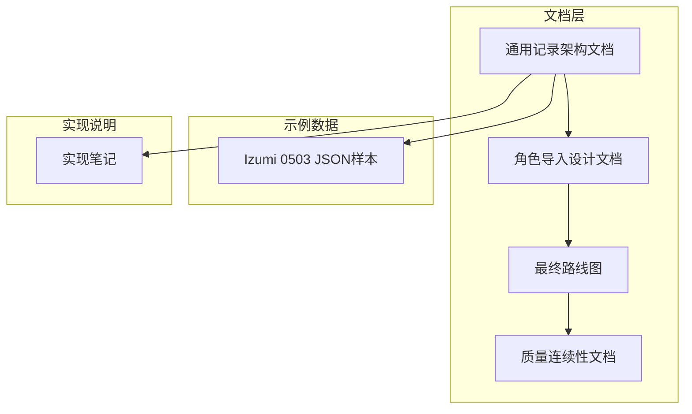
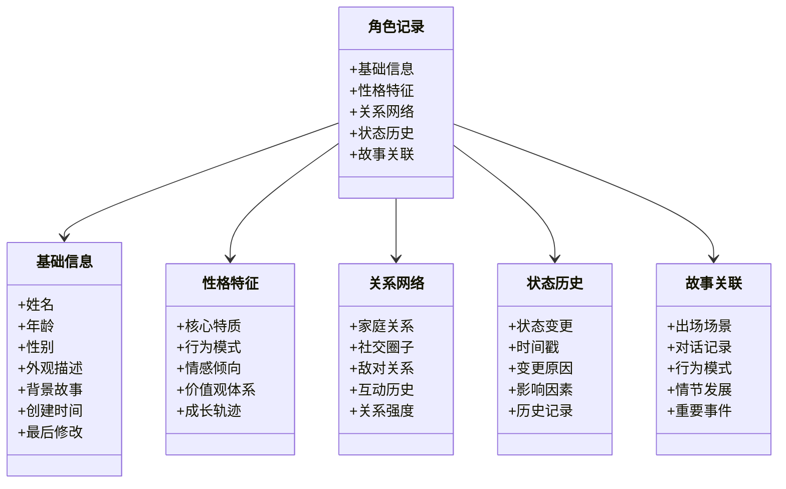
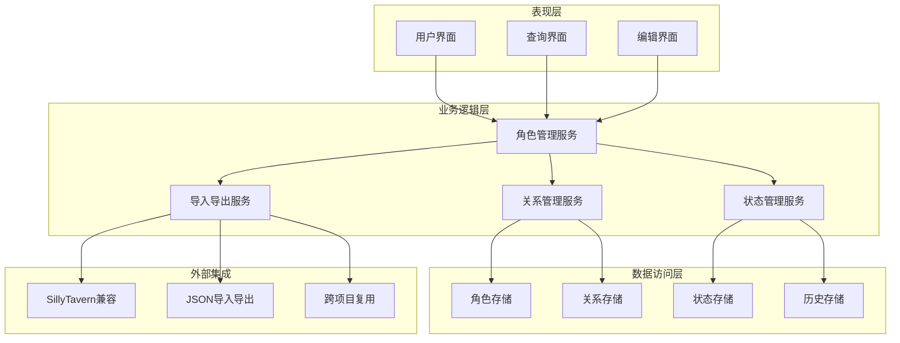
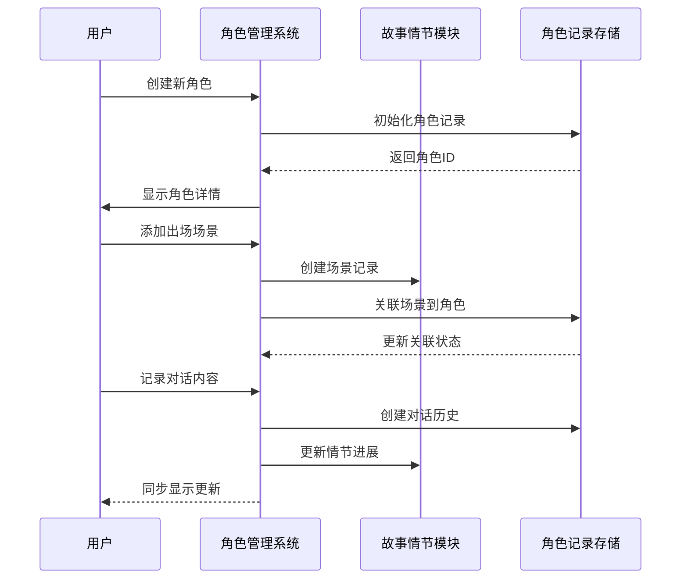
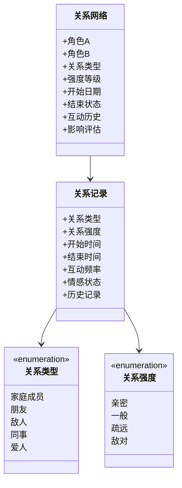
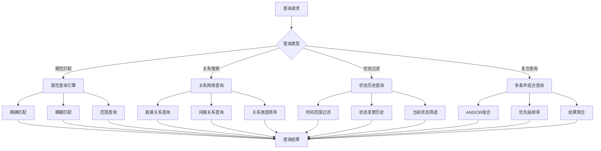
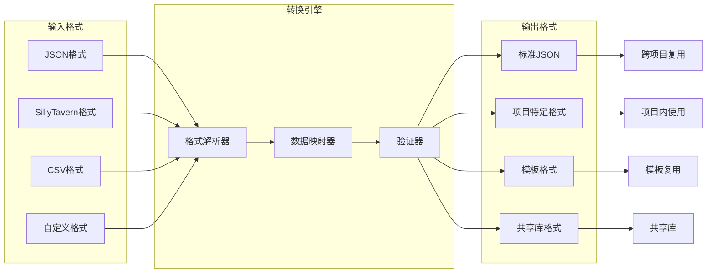
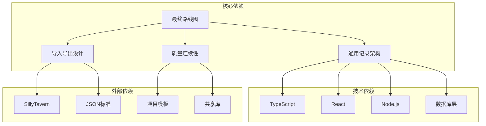

# 角色记录管理

<cite>
**本文档引用的文件**
- [2026-06-15-generic-record-architecture.md](file://docs/superpowers/plans/2026-06-15-generic-record-architecture.md)
- [2026-06-16-sillytavern-import-design.md](file://docs/superpowers/specs/2026-06-16-sillytavern-import-design.md)
- [2026-06-17-scribe-final-roadmap.md](file://docs/superpowers/plans/2026-06-17-scribe-final-roadmap.md)
- [2026-06-16-sillytavern-import.md](file://docs/superpowers/plans/2026-06-16-sillytavern-import.md)
- [2026-06-16-sillytavern-quality-continuity.md](file://docs/superpowers/plans/2026-06-16-sillytavern-quality-continuity.md)
- [2026-06-17-scribe-phase1-generic-continuity-gates.md](file://docs/superpowers/plans/2026-06-17-scribe-phase1-generic-continuity-gates.md)
- [Izumi 0503.json](file://samples/sillytavern/Izumi 0503.json)
- [_implementation-notes.md](file://docs/_implementation-notes.md)
</cite>

## 目录
1. [简介](#简介)
2. [项目结构](#项目结构)
3. [核心组件](#核心组件)
4. [架构概览](#架构概览)
5. [详细组件分析](#详细组件分析)
6. [依赖关系分析](#依赖关系分析)
7. [性能考虑](#性能考虑)
8. [故障排除指南](#故障排除指南)
9. [结论](#结论)
10. [附录](#附录)

## 简介

Scribe项目中的角色记录管理功能是一个综合性的角色数据管理系统，旨在为创作者提供完整的人物档案管理解决方案。该系统不仅支持传统的人物基本信息管理，还集成了性格特征追踪、关系网络构建、状态变化记录以及与故事情节的深度关联。

本功能的核心目标是建立一个可扩展、可维护且用户友好的角色管理系统，支持从简单的角色档案到复杂的故事驱动角色发展的全生命周期管理。系统设计遵循模块化原则，确保各个功能组件既独立又协同工作。

## 项目结构

基于现有文档分析，角色记录管理功能主要分布在以下模块中：

**图表来源**
- [2026-06-15-generic-record-architecture.md:1-50](file://docs/superpowers/plans/2026-06-15-generic-record-architecture.md#L1-L50)
- [2026-06-16-sillytavern-import-design.md:1-50](file://docs/superpowers/specs/2026-06-16-sillytavern-import-design.md#L1-L50)

**章节来源**
- [2026-06-15-generic-record-architecture.md:1-100](file://docs/superpowers/plans/2026-06-15-generic-record-architecture.md#L1-L100)
- [2026-06-16-sillytavern-import-design.md:1-100](file://docs/superpowers/specs/2026-06-16-sillytavern-import-design.md#L1-L100)

## 核心组件

### 数据模型架构

角色记录系统采用分层数据模型设计，确保数据的完整性、可扩展性和一致性：

**图表来源**
- [2026-06-15-generic-record-architecture.md:50-150](file://docs/superpowers/plans/2026-06-15-generic-record-architecture.md#L50-L150)

### 创建和维护流程

系统提供完整的角色生命周期管理流程：

1. **初始设定阶段**
   - 角色基本信息录入
   - 初始性格特征配置
   - 基础关系网络建立
   - 初始状态设置

2. **动态更新机制**
   - 实时状态变更追踪
   - 关系网络动态调整
   - 性格特征演进记录
   - 故事情节关联更新

3. **历史追踪系统**
   - 完整的历史版本控制
   - 变更审计日志
   - 时间线视图
   - 回滚机制

**章节来源**
- [2026-06-15-generic-record-architecture.md:100-250](file://docs/superpowers/plans/2026-06-15-generic-record-architecture.md#L100-L250)

## 架构概览

角色记录管理系统的整体架构采用分层设计，确保各组件间的松耦合和高内聚：

**图表来源**
- [2026-06-15-generic-record-architecture.md:150-250](file://docs/superpowers/plans/2026-06-15-generic-record-architecture.md#L150-L250)
- [2026-06-16-sillytavern-import-design.md:50-150](file://docs/superpowers/specs/2026-06-16-sillytavern-import-design.md#L50-L150)

### 角色与故事情节关联机制

系统实现了多层次的角色-情节关联机制：

**图表来源**
- [2026-06-15-generic-record-architecture.md:200-300](file://docs/superpowers/plans/2026-06-15-generic-record-architecture.md#L200-L300)

**章节来源**
- [2026-06-15-generic-record-architecture.md:250-400](file://docs/superpowers/plans/2026-06-15-generic-record-architecture.md#L250-L400)

## 详细组件分析

### 关系网络构建和维护

关系网络是角色记录管理的核心功能之一，系统提供了多维度的关系管理能力：

**图表来源**
- [2026-06-15-generic-record-architecture.md:300-400](file://docs/superpowers/plans/2026-06-15-generic-record-architecture.md#L300-L400)

### 查询和筛选功能

系统提供了强大的查询和筛选能力，支持多种查询模式：

**图表来源**
- [2026-06-15-generic-record-architecture.md:350-450](file://docs/superpowers/plans/2026-06-15-generic-record-architecture.md#L350-L450)

**章节来源**
- [2026-06-15-generic-record-architecture.md:400-550](file://docs/superpowers/plans/2026-06-15-generic-record-architecture.md#L400-L550)

### 导入导出和跨项目复用

系统支持多种数据格式的导入导出，并具备跨项目的复用能力：

**图表来源**
- [2026-06-16-sillytavern-import-design.md:100-200](file://docs/superpowers/specs/2026-06-16-sillytavern-import-design.md#L100-L200)
- [2026-06-16-sillytavern-import.md:100-200](file://docs/superpowers/plans/2026-06-16-sillytavern-import.md#L100-L200)

**章节来源**
- [2026-06-16-sillytavern-import-design.md:150-250](file://docs/superpowers/specs/2026-06-16-sillytavern-import-design.md#L150-L250)
- [2026-06-16-sillytavern-import.md:150-250](file://docs/superpowers/plans/2026-06-16-sillytavern-import.md#L150-L250)

## 依赖关系分析

角色记录管理系统与其他项目组件存在密切的依赖关系：

**图表来源**
- [2026-06-17-scribe-final-roadmap.md:1-100](file://docs/superpowers/plans/2026-06-17-scribe-final-roadmap.md#L1-L100)
- [2026-06-17-scribe-phase1-generic-continuity-gates.md:1-100](file://docs/superpowers/plans/2026-06-17-scribe-phase1-generic-continuity-gates.md#L1-L100)

**章节来源**
- [2026-06-17-scribe-final-roadmap.md:50-150](file://docs/superpowers/plans/2026-06-17-scribe-final-roadmap.md#L50-L150)
- [2026-06-17-scribe-phase1-generic-continuity-gates.md:50-150](file://docs/superpowers/plans/2026-06-17-scribe-phase1-generic-continuity-gates.md#L50-L150)

## 性能考虑

角色记录管理系统的性能优化策略包括：

1. **数据索引优化**
   - 多字段复合索引
   - 关系网络快速查询索引
   - 历史数据分区存储

2. **缓存策略**
   - 频繁访问数据缓存
   - 关系网络预加载
   - 查询结果缓存

3. **异步处理**
   - 大规模数据导入异步处理
   - 批量更新操作
   - 异步历史记录生成

4. **内存管理**
   - 对象池模式
   - 懒加载机制
   - 内存使用监控

## 故障排除指南

### 常见问题及解决方案

1. **数据导入失败**
   - 检查JSON格式正确性
   - 验证字段映射关系
   - 确认数据完整性

2. **关系查询异常**
   - 检查关系类型定义
   - 验证关系强度计算
   - 确认查询参数有效性

3. **性能问题**
   - 分析查询执行计划
   - 检查索引使用情况
   - 优化批量操作

4. **数据一致性问题**
   - 检查事务处理
   - 验证约束条件
   - 确认并发控制

**章节来源**
- [_implementation-notes.md:1-200](file://docs/_implementation-notes.md#L1-L200)

## 结论

Scribe的角色记录管理功能通过其精心设计的架构和全面的功能覆盖，为创作者提供了一个强大而灵活的角色管理解决方案。系统不仅满足了基本的角色档案管理需求，更重要的是建立了与故事情节深度关联的能力，使得角色能够随着故事的发展而自然演进。

该系统的设计充分考虑了可扩展性和可维护性，为未来的功能增强和技术演进奠定了坚实的基础。通过标准化的数据模型、完善的查询接口和灵活的导入导出机制，系统能够适应不同类型的创作需求和项目规模。

## 附录

### 示例数据格式

基于提供的样本文件，系统支持的标准角色数据格式包含以下关键字段：

- **基础信息**: 姓名、年龄、性别、外观描述
- **性格特征**: 核心特质、行为模式、情感倾向
- **关系网络**: 家庭成员、朋友、敌人等关系列表
- **状态历史**: 角色状态变更记录和时间线
- **故事关联**: 出场场景、对话记录、重要事件

**章节来源**
- [Izumi 0503.json:1-200](file://samples/sillytavern/Izumi 0503.json#L1-L200)