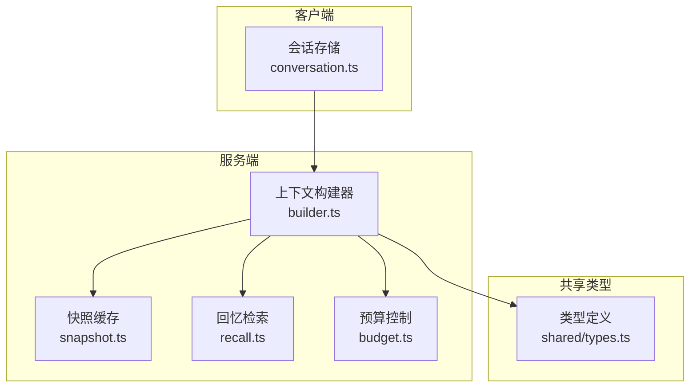
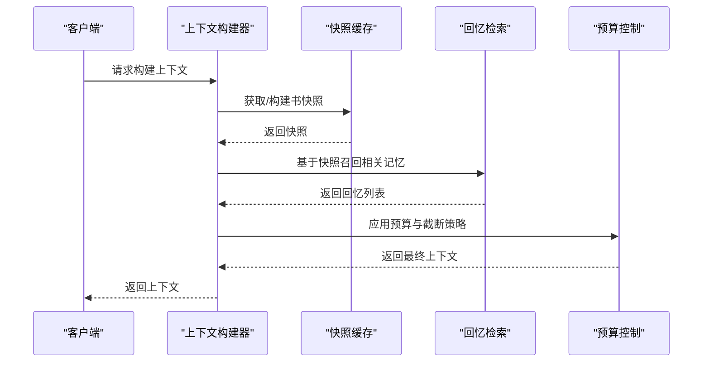
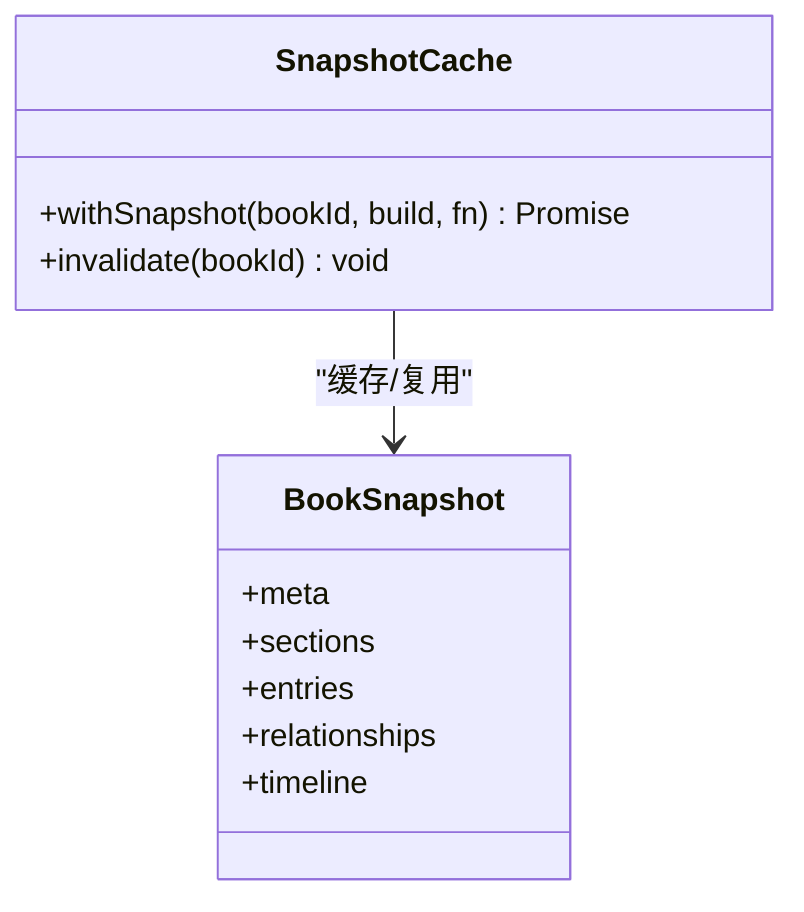
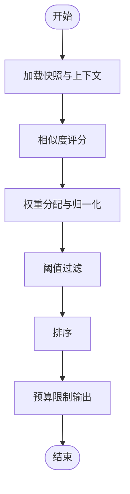
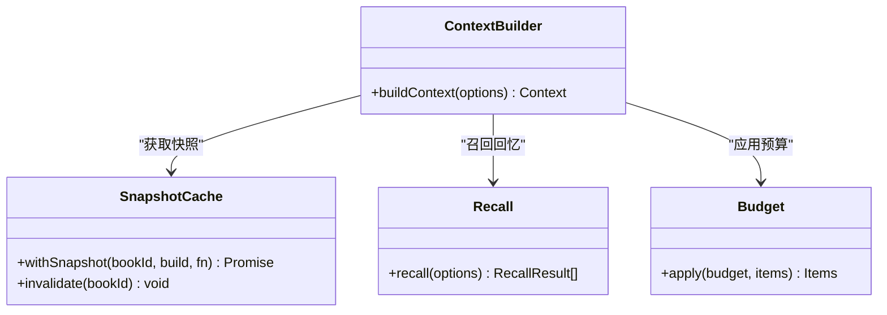
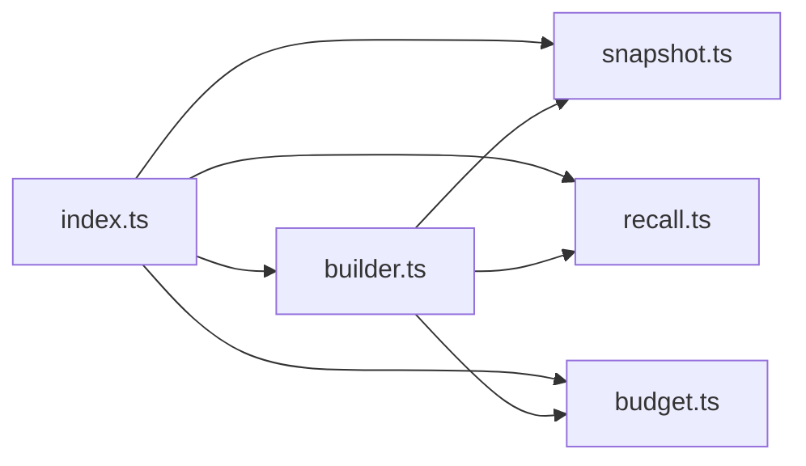

# 记忆管理系统

<cite>
**本文档引用的文件**
- [packages/server/src/ai/context-builder/snapshot.ts](file://packages/server/src/ai/context-builder/snapshot.ts)
- [packages/server/tests/unit/ai/context-builder/snapshot.test.ts](file://packages/server/tests/unit/ai/context-builder/snapshot.test.ts)
- [packages/server/src/ai/context-builder/index.ts](file://packages/server/src/ai/context-builder/index.ts)
- [packages/server/src/ai/context-builder/recall.ts](file://packages/server/src/ai/context-builder/recall.ts)
- [packages/server/src/ai/context-builder/builder.ts](file://packages/server/src/ai/context-builder/builder.ts)
- [packages/server/src/ai/context-builder/budget.ts](file://packages/server/src/ai/context-builder/budget.ts)
- [packages/client/src/stores/conversation.ts](file://packages/client/src/stores/conversation.ts)
- [packages/shared/types.ts](file://packages/shared/types.ts)
</cite>

## 目录
1. [简介](#简介)
2. [项目结构](#项目结构)
3. [核心组件](#核心组件)
4. [架构总览](#架构总览)
5. [详细组件分析](#详细组件分析)
6. [依赖关系分析](#依赖关系分析)
7. [性能考虑](#性能考虑)
8. [故障排除指南](#故障排除指南)
9. [结论](#结论)
10. [附录](#附录)

## 简介
本文件系统性梳理 Scribe 的记忆管理系统，聚焦以下关键能力：
- 长期记忆管理：状态持久化、关系维护与时间线追踪
- 快照管理：快照创建、版本控制与回滚机制
- 回忆检索：相似度计算、权重分配与结果排序
- 上下文构建：将记忆信息组织为 AI 可理解的格式
- API 接口、数据模型与使用示例
- 性能优化策略与内存管理最佳实践

本系统以“书”（Book）为核心实体，围绕其元数据、章节、条目、关系与时间线进行建模，并通过快照缓存与预算控制保障高效与稳定。

## 项目结构
记忆管理相关代码主要位于服务端 AI 上下文构建模块中，采用按功能分层的组织方式：
- 快照缓存：负责对“书”的快照进行内存缓存与失效控制
- 回忆检索：负责从多源记忆中召回相关内容并排序
- 上下文构建：负责将快照与回忆整合为对话可用的上下文
- 预算控制：负责在成本与质量之间做权衡

**图表来源**
- [packages/server/src/ai/context-builder/builder.ts](file://packages/server/src/ai/context-builder/builder.ts)
- [packages/server/src/ai/context-builder/snapshot.ts](file://packages/server/src/ai/context-builder/snapshot.ts)
- [packages/server/src/ai/context-builder/recall.ts](file://packages/server/src/ai/context-builder/recall.ts)
- [packages/server/src/ai/context-builder/budget.ts](file://packages/server/src/ai/context-builder/budget.ts)
- [packages/client/src/stores/conversation.ts](file://packages/client/src/stores/conversation.ts)
- [packages/shared/types.ts](file://packages/shared/types.ts)

**章节来源**
- [packages/server/src/ai/context-builder/index.ts](file://packages/server/src/ai/context-builder/index.ts)

## 核心组件
- 快照缓存（SnapshotCache）
  - 提供按书 ID 的快照缓存与生命周期管理
  - 支持 withSnapshot 模式：同周期内仅构建一次，避免重复 IO
  - 支持显式失效 invalidate
- 回忆检索（Recall）
  - 负责从多源记忆中召回相关内容
  - 支持相似度计算与权重分配
  - 输出排序后的回忆列表
- 上下文构建器（ContextBuilder）
  - 将快照与回忆整合为 AI 可理解的上下文
  - 结合预算控制，平衡长度与成本
- 预算控制（Budget）
  - 控制上下文长度与 token 预算
  - 在召回与截断之间做动态权衡

**章节来源**
- [packages/server/src/ai/context-builder/snapshot.ts](file://packages/server/src/ai/context-builder/snapshot.ts)
- [packages/server/src/ai/context-builder/recall.ts](file://packages/server/src/ai/context-builder/recall.ts)
- [packages/server/src/ai/context-builder/builder.ts](file://packages/server/src/ai/context-builder/builder.ts)
- [packages/server/src/ai/context-builder/budget.ts](file://packages/server/src/ai/context-builder/budget.ts)

## 架构总览
整体流程：客户端发起请求 -> 服务端通过上下文构建器整合快照与回忆 -> 应用预算控制 -> 返回上下文给客户端。

**图表来源**
- [packages/server/src/ai/context-builder/builder.ts](file://packages/server/src/ai/context-builder/builder.ts)
- [packages/server/src/ai/context-builder/snapshot.ts](file://packages/server/src/ai/context-builder/snapshot.ts)
- [packages/server/src/ai/context-builder/recall.ts](file://packages/server/src/ai/context-builder/recall.ts)
- [packages/server/src/ai/context-builder/budget.ts](file://packages/server/src/ai/context-builder/budget.ts)

## 详细组件分析

### 快照缓存（SnapshotCache）
- 设计要点
  - 使用 Map 以书 ID 为键缓存快照对象
  - withSnapshot 提供“构建-执行-返回”的生命周期，确保同周期内仅构建一次
  - invalidate 支持主动失效，保证数据一致性
- 关键行为
  - 缓存命中：直接复用已构建快照
  - 缓存未命中：调用 build 函数生成新快照并写入缓存
  - 失效：删除指定书 ID 的缓存项
- 测试验证
  - 单测覆盖了同一 bookId 在同一周期内仅构建一次的行为

**图表来源**
- [packages/server/src/ai/context-builder/snapshot.ts](file://packages/server/src/ai/context-builder/snapshot.ts)

**章节来源**
- [packages/server/src/ai/context-builder/snapshot.ts](file://packages/server/src/ai/context-builder/snapshot.ts)
- [packages/server/tests/unit/ai/context-builder/snapshot.test.ts](file://packages/server/tests/unit/ai/context-builder/snapshot.test.ts)

### 回忆检索（Recall）
- 功能定位
  - 从多源记忆中召回与当前上下文相关的内容
  - 支持相似度计算与权重分配
  - 输出排序后的回忆列表
- 处理流程
  - 输入：当前上下文、书快照、配置参数
  - 中间：相似度评分、权重归一化、阈值过滤
  - 输出：有序回忆列表
- 与预算控制协作
  - 回忆数量与长度受预算限制，避免超出 token 预算

**图表来源**
- [packages/server/src/ai/context-builder/recall.ts](file://packages/server/src/ai/context-builder/recall.ts)
- [packages/server/src/ai/context-builder/budget.ts](file://packages/server/src/ai/context-builder/budget.ts)

**章节来源**
- [packages/server/src/ai/context-builder/recall.ts](file://packages/server/src/ai/context-builder/recall.ts)
- [packages/server/src/ai/context-builder/budget.ts](file://packages/server/src/ai/context-builder/budget.ts)

### 上下文构建器（ContextBuilder）
- 组装策略
  - 先注入书元信息与关键片段（如时间线、关系、预设段落）
  - 再拼接回忆检索结果
  - 最后应用预算控制，确保上下文长度与成本可控
- 数据来源
  - 快照：稳定的长期记忆基线
  - 回忆：动态召回的相关片段
- 客户端集成
  - 客户端会话存储与上下文构建器协同，驱动对话体验

**图表来源**
- [packages/server/src/ai/context-builder/builder.ts](file://packages/server/src/ai/context-builder/builder.ts)
- [packages/server/src/ai/context-builder/snapshot.ts](file://packages/server/src/ai/context-builder/snapshot.ts)
- [packages/server/src/ai/context-builder/recall.ts](file://packages/server/src/ai/context-builder/recall.ts)
- [packages/server/src/ai/context-builder/budget.ts](file://packages/server/src/ai/context-builder/budget.ts)

**章节来源**
- [packages/server/src/ai/context-builder/builder.ts](file://packages/server/src/ai/context-builder/builder.ts)
- [packages/client/src/stores/conversation.ts](file://packages/client/src/stores/conversation.ts)

### 预算控制（Budget）
- 目标
  - 在上下文长度与 token 成本之间取得平衡
  - 优先保留高价值片段，必要时进行截断或降级
- 关键策略
  - 长度上限与剩余预算跟踪
  - 片段优先级排序与选择
  - 对回忆与快照片段分别施加预算约束

**章节来源**
- [packages/server/src/ai/context-builder/budget.ts](file://packages/server/src/ai/context-builder/budget.ts)

## 依赖关系分析
- 模块耦合
  - 上下文构建器依赖快照缓存、回忆检索与预算控制
  - 客户端会话存储依赖上下文构建器输出
- 导出入口
  - index 文件统一导出快照、回忆、预算与构建器

**图表来源**
- [packages/server/src/ai/context-builder/index.ts](file://packages/server/src/ai/context-builder/index.ts)

**章节来源**
- [packages/server/src/ai/context-builder/index.ts](file://packages/server/src/ai/context-builder/index.ts)

## 性能考虑
- 快照缓存
  - 同周期内仅构建一次，减少重复 IO
  - 主动失效避免脏读
- 回忆检索
  - 相似度计算与阈值过滤降低无效召回
  - 权重归一化提升排序稳定性
- 预算控制
  - 分阶段预算约束，避免一次性超限
  - 优先级选择确保高价值内容优先保留
- 内存管理
  - 明确的缓存生命周期与失效策略
  - 避免跨周期共享可变快照状态

[本节为通用指导，无需列出具体文件来源]

## 故障排除指南
- 快照未更新
  - 检查是否正确调用失效接口
  - 确认构建函数是否幂等且无副作用
- 回忆为空或过少
  - 检查相似度阈值与权重设置
  - 确认召回范围与索引完整性
- 上下文过长
  - 调整预算上限与优先级策略
  - 评估是否需要更严格的截断规则
- 客户端显示异常
  - 核对上下文构建器输出格式
  - 检查会话存储的数据结构一致性

**章节来源**
- [packages/server/tests/unit/ai/context-builder/snapshot.test.ts](file://packages/server/tests/unit/ai/context-builder/snapshot.test.ts)

## 结论
Scribe 的记忆管理系统通过“快照缓存 + 回忆检索 + 预算控制 + 上下文构建”的组合，实现了稳定、高效且可扩展的记忆管理方案。快照缓存确保长期记忆的快速访问，回忆检索提供灵活的相关性召回，预算控制保障成本与质量的平衡，上下文构建器则将这些能力整合为对 AI 友好的输入格式。配合明确的失效策略与测试覆盖，系统具备良好的可维护性与可演进性。

[本节为总结性内容，无需列出具体文件来源]

## 附录

### API 接口与数据模型概览
- 快照缓存接口
  - withSnapshot(bookId, build, fn)
  - invalidate(bookId)
- 回忆检索接口
  - recall(options) -> RecallResult[]
- 上下文构建接口
  - buildContext(options) -> Context
- 预算控制接口
  - apply(budget, items) -> Items

**章节来源**
- [packages/server/src/ai/context-builder/snapshot.ts](file://packages/server/src/ai/context-builder/snapshot.ts)
- [packages/server/src/ai/context-builder/recall.ts](file://packages/server/src/ai/context-builder/recall.ts)
- [packages/server/src/ai/context-builder/builder.ts](file://packages/server/src/ai/context-builder/builder.ts)
- [packages/server/src/ai/context-builder/budget.ts](file://packages/server/src/ai/context-builder/budget.ts)

### 使用示例（步骤说明）
- 步骤 1：初始化快照缓存
  - 创建缓存实例并注册构建函数
- 步骤 2：获取书快照
  - 使用 withSnapshot(bookId, build, fn) 获取或构建快照
- 步骤 3：召回相关记忆
  - 调用 recall(options) 获取回忆列表
- 步骤 4：应用预算控制
  - 传入预算参数，得到长度受限的上下文片段
- 步骤 5：构建最终上下文
  - 将快照与回忆按策略拼接，输出给客户端

**章节来源**
- [packages/server/src/ai/context-builder/builder.ts](file://packages/server/src/ai/context-builder/builder.ts)
- [packages/server/src/ai/context-builder/snapshot.ts](file://packages/server/src/ai/context-builder/snapshot.ts)
- [packages/server/src/ai/context-builder/recall.ts](file://packages/server/src/ai/context-builder/recall.ts)
- [packages/server/src/ai/context-builder/budget.ts](file://packages/server/src/ai/context-builder/budget.ts)