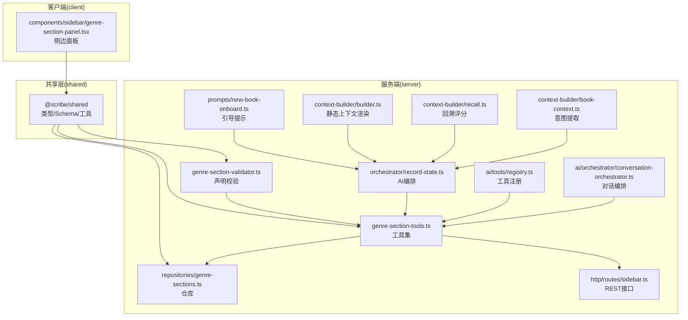
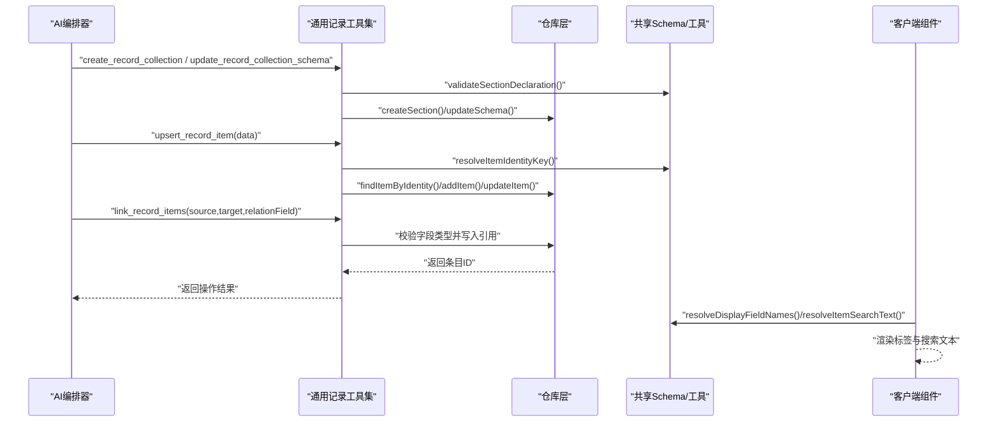
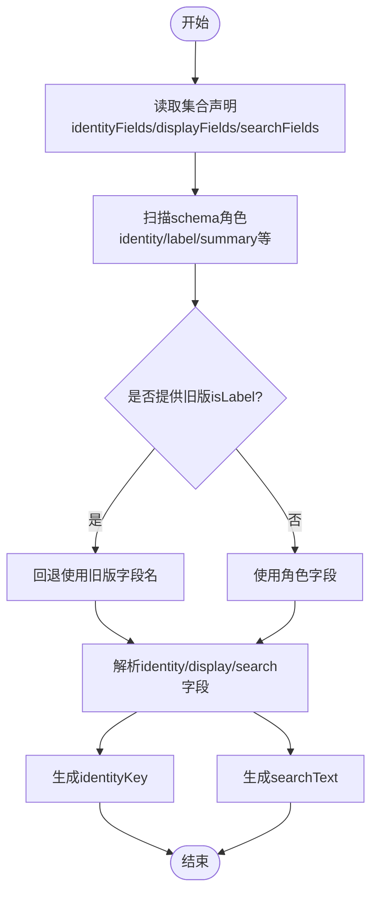
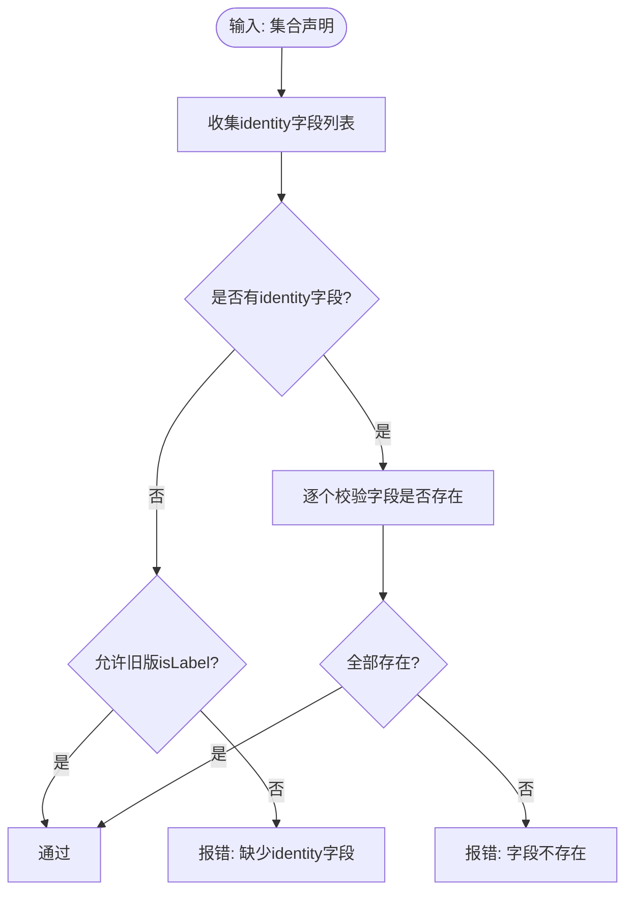
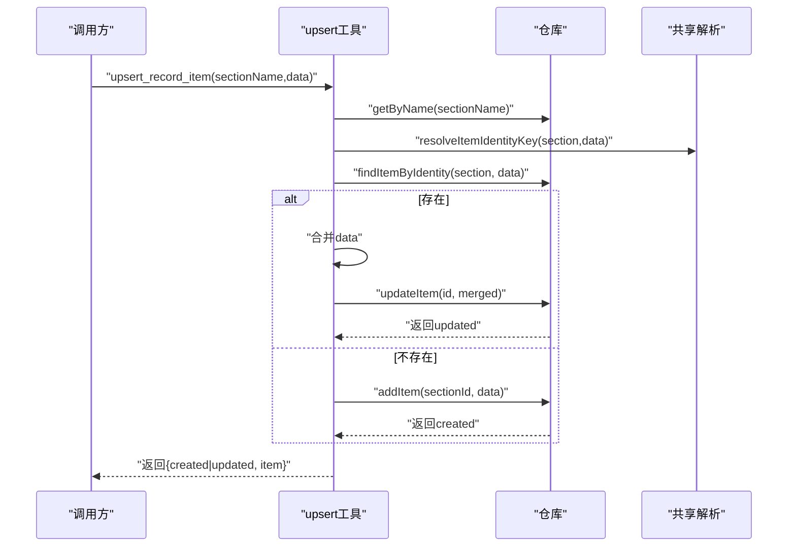
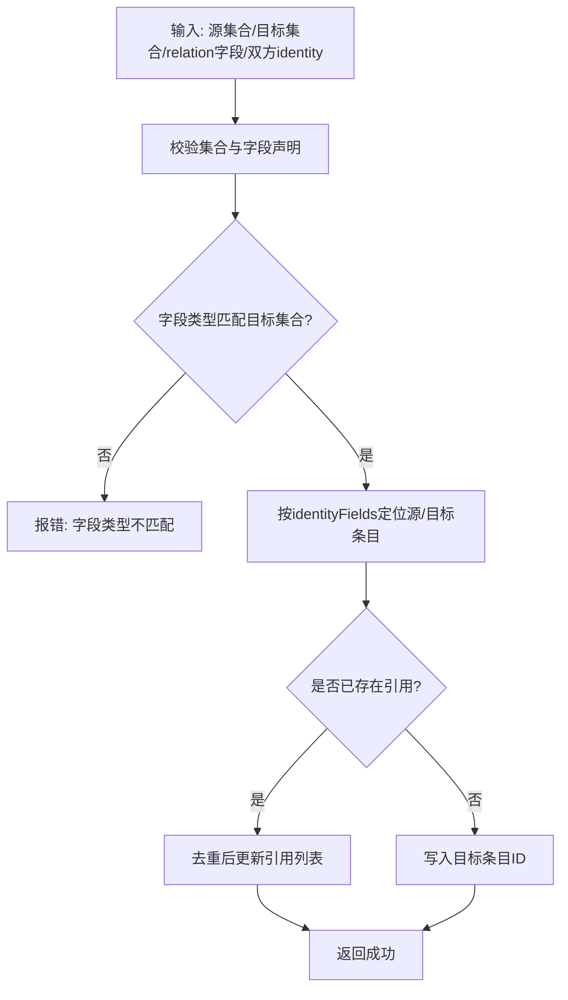
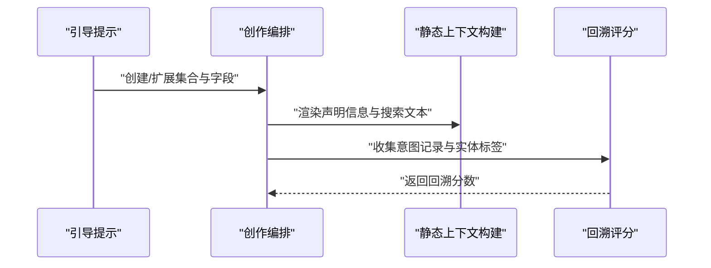
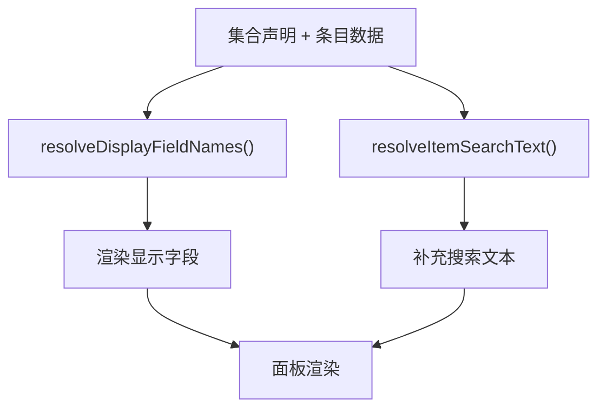
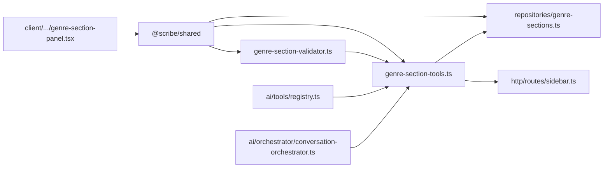

# 通用记录架构

<cite>
**本文档引用的文件**
- [README.md](file://README.md)
- [package.json](file://package.json)
- [packages/shared/package.json](file://packages/shared/package.json)
- [docs/superpowers/plans/2026-06-15-generic-record-architecture.md](file://docs/superpowers/plans/2026-06-15-generic-record-architecture.md)
- [docs/superpowers/specs/2026-06-17-scribe-ultimate-product-goal.md](file://docs/superpowers/specs/2026-06-17-scribe-ultimate-product-goal.md)
- [packages/server/src/ai/tools/genre-section-tools.ts](file://packages/server/src/ai/tools/genre-section-tools.ts)
- [packages/server/src/ai/genre-section-validator.ts](file://packages/server/src/ai/genre-section-validator.ts)
- [packages/server/src/db/repositories/genre-sections.ts](file://packages/server/src/db/repositories/genre-sections.ts)
- [packages/server/src/ai/prompts/new-book-onboard.ts](file://packages/server/src/ai/prompts/new-book-onboard.ts)
- [packages/server/src/ai/orchestrator/record-state.ts](file://packages/server/src/ai/orchestrator/record-state.ts)
- [packages/server/src/ai/context-builder/recall.ts](file://packages/server/src/ai/context-builder/recall.ts)
- [packages/server/src/ai/context-builder/book-context.ts](file://packages/server/src/ai/context-builder/book-context.ts)
- [packages/server/src/ai/context-builder/builder.ts](file://packages/server/src/ai/context-builder/builder.ts)
- [packages/client/src/components/sidebar/genre-section-panel.tsx](file://packages/client/src/components/sidebar/genre-section-panel.tsx)
- [packages/server/src/http/routes/sidebar.ts](file://packages/server/src/http/routes/sidebar.ts)
- [packages/server/src/ai/tools/registry.ts](file://packages/server/src/ai/tools/registry.ts)
- [packages/server/src/ai/orchestrator/conversation-orchestrator.ts](file://packages/server/src/ai/orchestrator/conversation-orchestrator.ts)
</cite>

## 目录
1. [引言](#引言)
2. [项目结构](#项目结构)
3. [核心组件](#核心组件)
4. [架构总览](#架构总览)
5. [详细组件分析](#详细组件分析)
6. [依赖分析](#依赖分析)
7. [性能考虑](#性能考虑)
8. [故障排查指南](#故障排查指南)
9. [结论](#结论)
10. [附录](#附录)

## 引言
本文件面向Scribe的“通用记录架构”，系统化阐述其无域特定的灵活数据模型设计与实现：包括动态字段支持、关系建模、数据规范化；记录类型的层次结构（基础字段、关系字段、计算字段）；记录间关联关系（一对一、一对多、多对多）；记录生命周期（创建、更新、删除、版本控制）；API接口、查询语言与使用示例；以及数据一致性与完整性约束策略。该架构以声明式Schema为核心，通过AI推断所需集合与字段，本地仅提供通用集合、字段、条目、关系、Upsert与回溯能力，确保跨题材、可演进且可审计。

## 项目结构
Scribe采用多包分层与声明驱动的工程组织方式：
- packages/shared：前后端共享类型、Zod Schema、工具函数与兼容别名
- packages/server：后端服务、SQLite存储、AI编排、质量门禁、HTTP路由
- packages/client：前端React组件与工作台UI
- docs：规格、计划、路线图与交接文档
- e2e：端到端测试与运行证据
- samples：可复现导入样例

图表来源
- [packages/server/src/ai/tools/genre-section-tools.ts:1-600](file://packages/server/src/ai/tools/genre-section-tools.ts#L1-L600)
- [packages/server/src/ai/genre-section-validator.ts:1-200](file://packages/server/src/ai/genre-section-validator.ts#L1-L200)
- [packages/server/src/db/repositories/genre-sections.ts:1-300](file://packages/server/src/db/repositories/genre-sections.ts#L1-L300)
- [packages/server/src/ai/prompts/new-book-onboard.ts:1-120](file://packages/server/src/ai/prompts/new-book-onboard.ts#L1-L120)
- [packages/server/src/ai/orchestrator/record-state.ts:1-200](file://packages/server/src/ai/orchestrator/record-state.ts#L1-L200)
- [packages/server/src/ai/context-builder/builder.ts:1-200](file://packages/server/src/ai/context-builder/builder.ts#L1-L200)
- [packages/server/src/ai/context-builder/recall.ts:1-200](file://packages/server/src/ai/context-builder/recall.ts#L1-L200)
- [packages/server/src/ai/context-builder/book-context.ts:1-200](file://packages/server/src/ai/context-builder/book-context.ts#L1-L200)
- [packages/client/src/components/sidebar/genre-section-panel.tsx:1-200](file://packages/client/src/components/sidebar/genre-section-panel.tsx#L1-L200)
- [packages/server/src/http/routes/sidebar.ts:1-220](file://packages/server/src/http/routes/sidebar.ts#L1-L220)
- [packages/server/src/ai/tools/registry.ts:1-100](file://packages/server/src/ai/tools/registry.ts#L1-L100)
- [packages/server/src/ai/orchestrator/conversation-orchestrator.ts:1-120](file://packages/server/src/ai/orchestrator/conversation-orchestrator.ts#L1-L120)

章节来源
- [README.md:44-56](file://README.md#L44-L56)
- [package.json:1-21](file://package.json#L1-L21)
- [packages/shared/package.json:1-19](file://packages/shared/package.json#L1-L19)

## 核心组件
- 通用记录Schema与角色体系：通过共享层定义字段角色（identity、label、summary、description、status、rank、relation、tag、evidence），并提供解析函数从声明中推导身份、显示与搜索字段。
- 声明式校验器：强制要求集合声明identityFields/displayFields/searchFields与字段role，兼容旧版isLabel标记用于只读兼容。
- 通用Upsert与去重：基于identityFields进行查找与合并更新，避免重复；提供create/update/delete等集合管理工具。
- 关系链接原语：通过声明为relation的字段建立记录间链接，支持一对一与列表型一对多；链接时严格校验引用集合与字段类型。
- 提示与编排：引导AI在新书初始化与持续创作中，基于声明创建/扩展集合与写入条目；在归档摘要、静态上下文与回溯中体现声明信息。
- 客户端渲染：依据声明渲染标签与搜索文本，提升可读性与可编辑性。
- HTTP接口：暴露集合与条目的增删改查REST接口，供前端与外部集成使用。

章节来源
- [docs/superpowers/plans/2026-06-15-generic-record-architecture.md:55-245](file://docs/superpowers/plans/2026-06-15-generic-record-architecture.md#L55-L245)
- [packages/server/src/ai/genre-section-validator.ts:318-344](file://packages/server/src/ai/genre-section-validator.ts#L318-L344)
- [packages/server/src/db/repositories/genre-sections.ts:407-415](file://packages/server/src/db/repositories/genre-sections.ts#L407-L415)
- [packages/server/src/ai/tools/genre-section-tools.ts:477-499](file://packages/server/src/ai/tools/genre-section-tools.ts#L477-L499)
- [packages/server/src/ai/tools/genre-section-tools.ts:914-950](file://packages/server/src/ai/tools/genre-section-tools.ts#L914-L950)
- [packages/client/src/components/sidebar/genre-section-panel.tsx:812-831](file://packages/client/src/components/sidebar/genre-section-panel.tsx#L812-L831)
- [packages/server/src/http/routes/sidebar.ts:128-199](file://packages/server/src/http/routes/sidebar.ts#L128-L199)

## 架构总览
通用记录架构围绕“声明驱动 + 本地通用工具”展开，形成如下闭环：
- AI在引导阶段与创作阶段，依据声明创建/扩展集合与写入条目
- 本地工具执行去重、校验、关系链接与持久化
- 上下文构建与回溯利用声明信息增强检索与意图识别
- 客户端基于声明渲染，保证可读性与一致性

图表来源
- [packages/server/src/ai/orchestrator/record-state.ts:1-120](file://packages/server/src/ai/orchestrator/record-state.ts#L1-L120)
- [packages/server/src/ai/tools/genre-section-tools.ts:477-499](file://packages/server/src/ai/tools/genre-section-tools.ts#L477-L499)
- [packages/server/src/db/repositories/genre-sections.ts:407-415](file://packages/server/src/db/repositories/genre-sections.ts#L407-L415)
- [packages/client/src/components/sidebar/genre-section-panel.tsx:812-831](file://packages/client/src/components/sidebar/genre-section-panel.tsx#L812-L831)

## 详细组件分析

### 组件A：通用记录Schema与角色体系
- 设计要点
  - 字段角色枚举：identity、label、summary、description、status、rank、relation、tag、evidence
  - 集合声明：identityFields/displayFields/searchFields可直接声明，否则回退到role匹配或旧版isLabel兼容
  - 解析工具：resolveIdentityFieldNames、resolveDisplayFieldNames、resolveItemIdentityKey、resolveItemSearchText
- 复杂度与性能
  - 字段解析为O(n)扫描集合schema，常数级字段数量，整体近似O(1)
  - identityKey拼接与searchText拼接为线性复杂度，受字段数量与值长度影响
- 错误处理
  - 未声明identity或字段不存在时抛出错误
  - 旧版兼容模式仅允许只读场景

图表来源
- [docs/superpowers/plans/2026-06-15-generic-record-architecture.md:163-225](file://docs/superpowers/plans/2026-06-15-generic-record-architecture.md#L163-L225)

章节来源
- [docs/superpowers/plans/2026-06-15-generic-record-architecture.md:55-245](file://docs/superpowers/plans/2026-06-15-generic-record-architecture.md#L55-L245)

### 组件B：声明式校验器
- 功能
  - 校验集合是否声明identityFields或存在role=identity字段
  - 校验displayFields与identityFields均存在于schema
  - 兼容旧版仅isLabel的只读场景
- 实现策略
  - 使用Set快速校验字段存在性
  - 抛出ValidationError并携带字段定位

图表来源
- [packages/server/src/ai/genre-section-validator.ts:318-344](file://packages/server/src/ai/genre-section-validator.ts#L318-L344)

章节来源
- [packages/server/src/ai/genre-section-validator.ts:318-344](file://packages/server/src/ai/genre-section-validator.ts#L318-L344)

### 组件C：通用Upsert与去重
- 工作流
  - 输入：sectionName + data
  - 解析：通过resolveItemIdentityKey生成identityKey
  - 查找：findItemByIdentity(section, data)
  - 更新：合并现有data与新data，二次校验后updateItem
  - 新增：addItem
- 一致性保障
  - 基于声明的identityFields进行去重
  - 二次校验防止schema违规

图表来源
- [packages/server/src/ai/tools/genre-section-tools.ts:477-499](file://packages/server/src/ai/tools/genre-section-tools.ts#L477-L499)
- [packages/server/src/db/repositories/genre-sections.ts:407-415](file://packages/server/src/db/repositories/genre-sections.ts#L407-L415)

章节来源
- [packages/server/src/ai/tools/genre-section-tools.ts:477-499](file://packages/server/src/ai/tools/genre-section-tools.ts#L477-L499)
- [packages/server/src/db/repositories/genre-sections.ts:407-415](file://packages/server/src/db/repositories/genre-sections.ts#L407-L415)

### 组件D：通用记录关系链接
- 字段约定
  - relation字段role必须为relation
  - 类型前缀为ref:section:{目标集合名}或list:ref:section:{目标集合名}
- 链接流程
  - 校验两集合声明与relation字段类型
  - 通过identityFields定位源/目标条目
  - 写入目标条目ID（或去重后的ID列表）
- 关系类型
  - 一对一：ref:section:Target
  - 一对多：list:ref:section:Target

图表来源
- [packages/server/src/ai/tools/genre-section-tools.ts:914-950](file://packages/server/src/ai/tools/genre-section-tools.ts#L914-L950)

章节来源
- [packages/server/src/ai/tools/genre-section-tools.ts:914-950](file://packages/server/src/ai/tools/genre-section-tools.ts#L914-L950)

### 组件E：提示与编排中的声明感知
- 新书引导提示：强调“通用记录集合”的创建与字段声明，禁止使用题材清单
- 创作编排提示：指导AI在出现长期关系时优先使用声明的relation字段并调用link_record_items
- 归档摘要与静态上下文：渲染声明的identity/display/search字段与搜索文本
- 回溯评分：将意图记录与实体标签纳入评分

图表来源
- [packages/server/src/ai/prompts/new-book-onboard.ts:560-580](file://packages/server/src/ai/prompts/new-book-onboard.ts#L560-L580)
- [packages/server/src/ai/orchestrator/record-state.ts:580-592](file://packages/server/src/ai/orchestrator/record-state.ts#L580-L592)
- [packages/server/src/ai/context-builder/builder.ts:660-671](file://packages/server/src/ai/context-builder/builder.ts#L660-L671)
- [packages/server/src/ai/context-builder/recall.ts:743-757](file://packages/server/src/ai/context-builder/recall.ts#L743-L757)

章节来源
- [packages/server/src/ai/prompts/new-book-onboard.ts:560-580](file://packages/server/src/ai/prompts/new-book-onboard.ts#L560-L580)
- [packages/server/src/ai/orchestrator/record-state.ts:580-592](file://packages/server/src/ai/orchestrator/record-state.ts#L580-L592)
- [packages/server/src/ai/context-builder/builder.ts:660-671](file://packages/server/src/ai/context-builder/builder.ts#L660-L671)
- [packages/server/src/ai/context-builder/recall.ts:743-757](file://packages/server/src/ai/context-builder/recall.ts#L743-L757)

### 组件F：客户端渲染与声明感知
- 渲染策略
  - 使用resolveDisplayFieldNames获取显示字段
  - 使用resolveItemSearchText生成搜索文本
  - 在面板中优先展示显示字段，非显示字段作为补充信息
- 兼容性
  - 保持旧版isLabel的降级路径，确保只读兼容

图表来源
- [packages/client/src/components/sidebar/genre-section-panel.tsx:812-831](file://packages/client/src/components/sidebar/genre-section-panel.tsx#L812-L831)
- [docs/superpowers/plans/2026-06-15-generic-record-architecture.md:810-831](file://docs/superpowers/plans/2026-06-15-generic-record-architecture.md#L810-L831)

章节来源
- [packages/client/src/components/sidebar/genre-section-panel.tsx:812-831](file://packages/client/src/components/sidebar/genre-section-panel.tsx#L812-L831)

### 组件G：API接口与使用示例
- 接口概览
  - GET /api/books/:bookId/genre-sections：列出集合
  - POST /api/books/:bookId/genre-sections：创建集合（需声明identityFields/displayFields/searchFields）
  - POST /api/books/:bookId/genre-sections/:sectionId/items：新增条目（使用upsert语义）
  - PUT /api/books/:bookId/genre-sections/items/:itemId：更新条目
  - DELETE /api/books/:bookId/genre-sections/items/:itemId：删除条目
  - DELETE /api/books/:bookId/genre-sections/:sectionId：删除集合
- 使用示例（步骤化）
  - 创建集合：声明identityFields/displayFields/searchFields与字段roles
  - Upsert条目：传入数据，系统按identityFields去重并合并
  - 关系链接：指定relation字段与目标条目identity，写入引用ID
  - 删除集合/条目：清理不再使用的记录

章节来源
- [packages/server/src/http/routes/sidebar.ts:128-199](file://packages/server/src/http/routes/sidebar.ts#L128-L199)

## 依赖分析
- 组件耦合
  - shared为唯一依赖源，server与client均依赖其Schema与工具
  - server内部模块高度内聚：tools依赖validator与repo；context-builder依赖archive与prompt；UI依赖shared
- 外部依赖
  - Zod用于Schema校验
  - better-sqlite3用于SQLite访问
  - Hono用于HTTP路由
- 循环依赖
  - 通过工具注册与编排器解耦，避免循环导入

图表来源
- [packages/server/src/ai/tools/genre-section-tools.ts:1-60](file://packages/server/src/ai/tools/genre-section-tools.ts#L1-L60)
- [packages/server/src/ai/genre-section-validator.ts:1-40](file://packages/server/src/ai/genre-section-validator.ts#L1-L40)
- [packages/server/src/db/repositories/genre-sections.ts:1-60](file://packages/server/src/db/repositories/genre-sections.ts#L1-L60)
- [packages/server/src/http/routes/sidebar.ts:1-40](file://packages/server/src/http/routes/sidebar.ts#L1-L40)
- [packages/server/src/ai/tools/registry.ts:1-20](file://packages/server/src/ai/tools/registry.ts#L1-L20)
- [packages/server/src/ai/orchestrator/conversation-orchestrator.ts:1-20](file://packages/server/src/ai/orchestrator/conversation-orchestrator.ts#L1-L20)
- [packages/client/src/components/sidebar/genre-section-panel.tsx:1-40](file://packages/client/src/components/sidebar/genre-section-panel.tsx#L1-L40)

章节来源
- [packages/server/src/ai/tools/registry.ts:1-20](file://packages/server/src/ai/tools/registry.ts#L1-L20)
- [packages/server/src/ai/orchestrator/conversation-orchestrator.ts:1-20](file://packages/server/src/ai/orchestrator/conversation-orchestrator.ts#L1-L20)

## 性能考虑
- 查询与索引
  - identityKey生成与解析为O(n)，建议在仓库层缓存常用字段映射
  - 对频繁查询的集合建立SQLite索引（如identityKey组合索引）
- 写入路径
  - Upsert合并为浅合并，避免深层递归；必要时在工具层做字段白名单校验
  - 关系字段写入为O(1)更新，列表型关系需去重操作
- 上下文构建
  - resolveItemSearchText按字段聚合，建议限制单条目搜索文本长度或分页渲染
- 并发与事务
  - 仓库层使用事务包裹Upsert与关系写入，保证原子性

## 故障排查指南
- 常见错误与定位
  - “缺少identity字段”：检查集合声明或字段role=identity
  - “字段不存在”：确认字段名大小写与schema一致
  - “relation字段未声明”：确认字段role=relation且类型匹配目标集合
  - “找不到记录”：确认identity数据与声明一致，或先创建目标条目
- 调试建议
  - 使用resolveItemIdentityKey与resolveItemSearchText在共享层验证字段解析
  - 在工具层打印输入参数与返回结果，核对集合名与字段名
  - 在HTTP层开启日志，观察请求与响应体
- 兼容性检查
  - 确保提示中不再包含题材清单，仅使用通用术语
  - 运行全量测试与类型检查，确保无特殊化分支

章节来源
- [packages/server/src/ai/genre-section-validator.ts:318-344](file://packages/server/src/ai/genre-section-validator.ts#L318-L344)
- [packages/server/src/ai/tools/genre-section-tools.ts:914-950](file://packages/server/src/ai/tools/genre-section-tools.ts#L914-L950)
- [docs/superpowers/plans/2026-06-15-generic-record-architecture.md:1072-1081](file://docs/superpowers/plans/2026-06-15-generic-record-architecture.md#L1072-L1081)

## 结论
Scribe的通用记录架构以声明式Schema为核心，通过严格的校验、去重与关系链接原语，实现了跨题材、可演进且可审计的记录系统。配合AI编排与上下文构建，系统在新书初始化与持续创作中，能够自动推断所需集合与字段，减少人工干预，同时保证长期连续性与可编辑性。客户端渲染与HTTP接口进一步提升了可读性与可集成性。未来可在仓库层引入索引优化与批量写入，以支撑更大规模的记录集。

## 附录
- 术语
  - 集合：记录的逻辑分组，包含字段声明与行为元数据
  - 条目：集合中的具体记录实例
  - 关系字段：role=relation的字段，用于建立记录间引用
  - identityFields：用于唯一标识条目的字段集合
  - displayFields：用于界面展示的字段集合
  - searchFields：用于检索的字段集合
- 最佳实践
  - 在创建集合时明确声明identityFields/displayFields/searchFields
  - 优先使用relation字段表达长期关系，避免硬编码关系语义
  - 定期对集合schema进行演进，避免字段冗余
  - 在客户端渲染中优先展示displayFields，补充搜索文本以提升检索效率