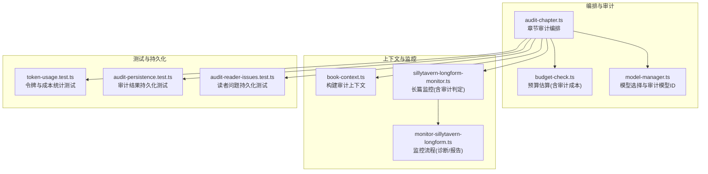
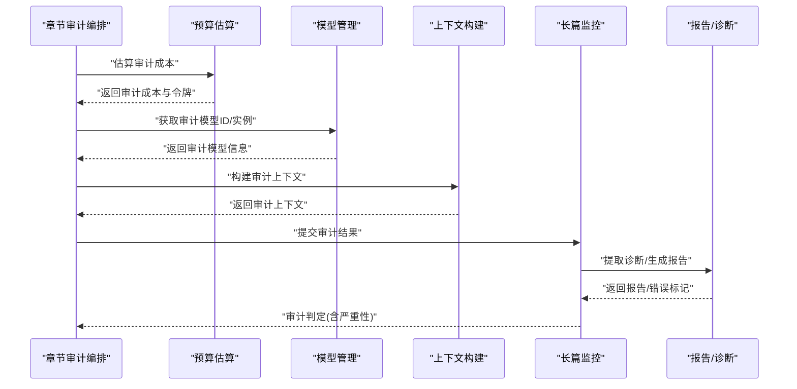
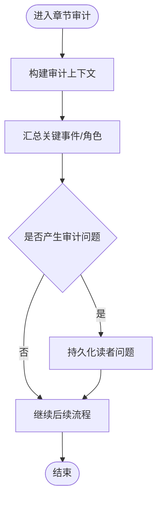
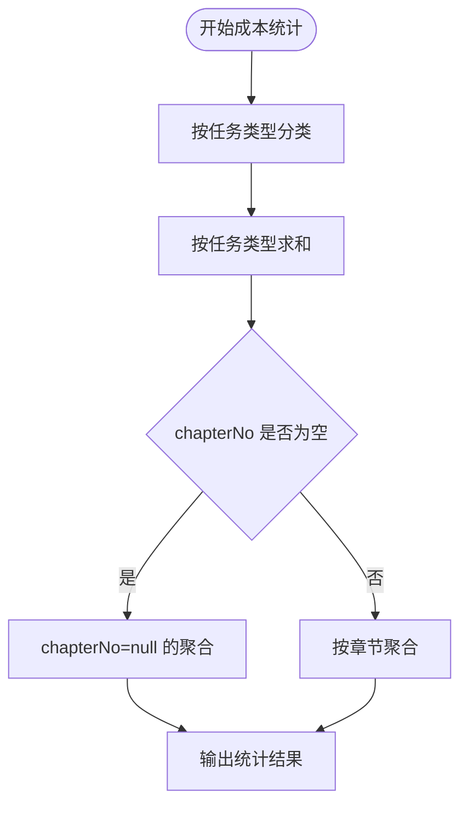
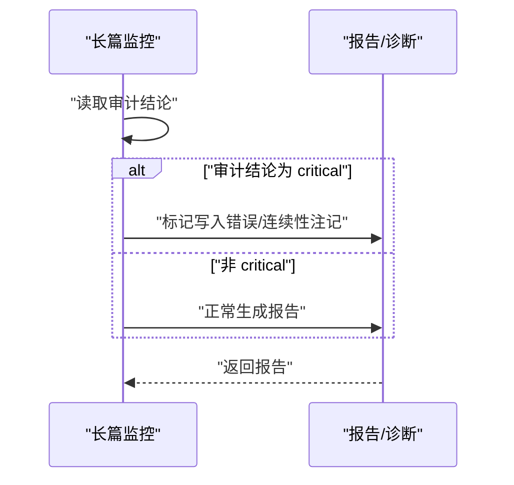
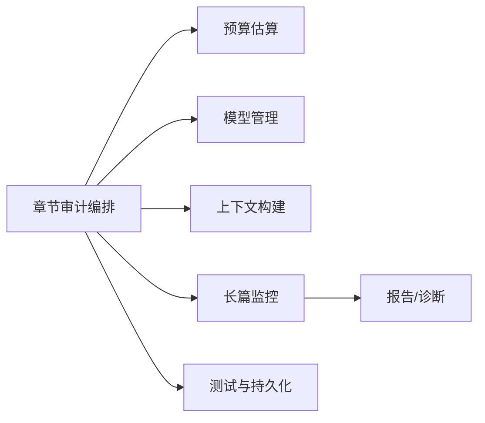

# 审计跟踪

<cite>
**本文引用的文件**
- [audit-chapter.ts](file://packages/server/src/ai/orchestrator/audit-chapter.ts)
- [budget-check.ts](file://packages/server/src/ai/budget-check.ts)
- [model-manager.ts](file://packages/server/src/ai/model-manager.ts)
- [book-context.ts](file://packages/server/src/ai/context-builder/book-context.ts)
- [sillytavern-longform-monitor.ts](file://packages/server/src/ai/monitor/sillytavern-longform-monitor.ts)
- [token-usage.test.ts](file://packages/server/tests/unit/db/repositories/token-usage.test.ts)
- [audit-persistence.test.ts](file://packages/server/tests/integration/audit-persistence.test.ts)
- [audit-reader-issues.test.ts](file://packages/server/tests/unit/ai/orchestrator/audit-reader-issues.test.ts)
- [2026-06-16-sillytavern-import.md](file://docs/superpowers/plans/2026-06-16-sillytavern-import.md)
- [monitor-sillytavern-longform.ts](file://packages/server/tools/monitor-sillytavern-longform.ts)
</cite>

## 目录
1. [引言](#引言)
2. [项目结构](#项目结构)
3. [核心组件](#核心组件)
4. [架构总览](#架构总览)
5. [详细组件分析](#详细组件分析)
6. [依赖关系分析](#依赖关系分析)
7. [性能考量](#性能考量)
8. [故障排查指南](#故障排查指南)
9. [结论](#结论)
10. [附录](#附录)

## 引言
本文件面向Scribe项目的审计跟踪系统，聚焦以下目标：
- 深入解释审计日志的生成机制与存储策略（操作记录、变更历史、使用统计）
- 详述使用量统计功能（API调用监控、资源消耗跟踪、性能指标采集）
- 阐明审计数据的格式标准、存储位置与访问权限控制
- 提供审计配置选项、日志级别设置与数据保留策略
- 给出审计数据的查询方法、分析工具与合规性要求
- 展示具体审计场景与数据示例（以测试与文档为准）

## 项目结构
审计相关能力横跨服务端AI编排、预算与模型管理、上下文构建、监控与报告、以及单元/集成测试等模块。下图给出与审计直接相关的模块关系概览。

图表来源
- [audit-chapter.ts](file://packages/server/src/ai/orchestrator/audit-chapter.ts)
- [budget-check.ts](file://packages/server/src/ai/budget-check.ts)
- [model-manager.ts](file://packages/server/src/ai/model-manager.ts)
- [book-context.ts](file://packages/server/src/ai/context-builder/book-context.ts)
- [sillytavern-longform-monitor.ts](file://packages/server/src/ai/monitor/sillytavern-longform-monitor.ts)
- [monitor-sillytavern-longform.ts](file://packages/server/tools/monitor-sillytavern-longform.ts)
- [token-usage.test.ts](file://packages/server/tests/unit/db/repositories/token-usage.test.ts)
- [audit-persistence.test.ts](file://packages/server/tests/integration/audit-persistence.test.ts)
- [audit-reader-issues.test.ts](file://packages/server/tests/unit/ai/orchestrator/audit-reader-issues.test.ts)

章节来源
- [audit-chapter.ts](file://packages/server/src/ai/orchestrator/audit-chapter.ts)
- [budget-check.ts](file://packages/server/src/ai/budget-check.ts)
- [model-manager.ts](file://packages/server/src/ai/model-manager.ts)
- [book-context.ts](file://packages/server/src/ai/context-builder/book-context.ts)
- [sillytavern-longform-monitor.ts](file://packages/server/src/ai/monitor/sillytavern-longform-monitor.ts)
- [monitor-sillytavern-longform.ts](file://packages/server/tools/monitor-sillytavern-longform.ts)
- [token-usage.test.ts](file://packages/server/tests/unit/db/repositories/token-usage.test.ts)
- [audit-persistence.test.ts](file://packages/server/tests/integration/audit-persistence.test.ts)
- [audit-reader-issues.test.ts](file://packages/server/tests/unit/ai/orchestrator/audit-reader-issues.test.ts)

## 核心组件
- 章节审计编排：负责触发审计任务、汇总审计结果、生成审计上下文，并与监控/报告流程交互。
- 预算与成本：在成本估算中纳入“审计”任务类型，支持按任务类型统计成本与令牌用量。
- 模型管理：维护审计模型ID，确保审计阶段使用正确的模型实例。
- 上下文构建：为审计阶段准备关键事件、时间线、角色等上下文信息，支撑审计判断。
- 监控与报告：在长篇监控中对审计结论进行判定与记录，必要时阻断或标注。
- 测试与持久化：通过单元/集成测试验证审计结果与读者问题的持久化行为。

章节来源
- [audit-chapter.ts](file://packages/server/src/ai/orchestrator/audit-chapter.ts)
- [budget-check.ts](file://packages/server/src/ai/budget-check.ts)
- [model-manager.ts](file://packages/server/src/ai/model-manager.ts)
- [book-context.ts](file://packages/server/src/ai/context-builder/book-context.ts)
- [sillytavern-longform-monitor.ts](file://packages/server/src/ai/monitor/sillytavern-longform-monitor.ts)
- [token-usage.test.ts](file://packages/server/tests/unit/db/repositories/token-usage.test.ts)
- [audit-persistence.test.ts](file://packages/server/tests/integration/audit-persistence.test.ts)
- [audit-reader-issues.test.ts](file://packages/server/tests/unit/ai/orchestrator/audit-reader-issues.test.ts)

## 架构总览
审计流程从“章节审计编排”开始，结合预算与模型配置，构建审计上下文，执行审计并产出审计结果；随后由监控与报告模块对结果进行判定与记录，最终通过测试验证持久化与统计逻辑。

图表来源
- [audit-chapter.ts](file://packages/server/src/ai/orchestrator/audit-chapter.ts)
- [budget-check.ts](file://packages/server/src/ai/budget-check.ts)
- [model-manager.ts](file://packages/server/src/ai/model-manager.ts)
- [book-context.ts](file://packages/server/src/ai/context-builder/book-context.ts)
- [sillytavern-longform-monitor.ts](file://packages/server/src/ai/monitor/sillytavern-longform-monitor.ts)
- [monitor-sillytavern-longform.ts](file://packages/server/tools/monitor-sillytavern-longform.ts)

## 详细组件分析

### 章节审计编排（audit-chapter.ts）
- 职责
  - 触发审计任务，汇总关键事件与角色信息，生成审计上下文
  - 将审计结果传递给监控与报告模块，参与后续判定与记录
- 关键点
  - 审计上下文包含章节号、章节内容摘要、关键事件列表、角色列表等
  - 审计结果用于指导后续流程（如是否阻断、是否生成读者问题等）

图表来源
- [audit-chapter.ts](file://packages/server/src/ai/orchestrator/audit-chapter.ts)

章节来源
- [audit-chapter.ts](file://packages/server/src/ai/orchestrator/audit-chapter.ts)

### 预算与成本统计（budget-check.ts、token-usage.test.ts）
- 职责
  - 在预算估算中区分“写入”与“审计”两类任务，分别计算prompt/completion/cached/reasoning令牌与美元成本
  - 单元测试覆盖按任务类型求和、空表查询、chapterNo可为空等边界情况
- 数据要点
  - 任务类型：write、audit、chat等
  - 统计维度：promptTokens、completionTokens、cachedTokens、reasoningTokens、costUsd
  - 支持按任务类型聚合与按章节聚合

图表来源
- [budget-check.ts](file://packages/server/src/ai/budget-check.ts)
- [token-usage.test.ts](file://packages/server/tests/unit/db/repositories/token-usage.test.ts)

章节来源
- [budget-check.ts](file://packages/server/src/ai/budget-check.ts)
- [token-usage.test.ts](file://packages/server/tests/unit/db/repositories/token-usage.test.ts)

### 模型管理（model-manager.ts）
- 职责
  - 维护审计模型ID，提供获取审计模型信息与更新审计模型的能力
  - 在编排阶段选择正确的审计模型实例执行审计任务
- 关键点
  - 审计模型ID与写入模型ID可分离配置
  - 更新审计模型ID会即时生效于后续审计任务

章节来源
- [model-manager.ts](file://packages/server/src/ai/model-manager.ts)

### 上下文构建（book-context.ts）
- 职责
  - 为审计阶段准备关键事件、时间线、角色等上下文
  - 支持从书本摘要中抽取审计上下文，供审计编排使用
- 关键点
  - 审计上下文字段包含章节号、故事时间、事件描述、参与者等
  - 与章节审计编排紧密耦合，确保审计输入质量

章节来源
- [book-context.ts](file://packages/server/src/ai/context-builder/book-context.ts)

### 长篇监控与审计判定（sillytavern-longform-monitor.ts、monitor-sillytavern-longform.ts）
- 职责
  - 在长篇监控中对审计结论进行判定（如“critical”），并在报告中标注
  - 若存在“critical”审计结论，阻断写入或添加连续性提示
- 关键点
  - 审计严重性影响后续流程（如写入错误标记、连续性注记）
  - 诊断信息与报告生成贯穿监控流程

图表来源
- [sillytavern-longform-monitor.ts](file://packages/server/src/ai/monitor/sillytavern-longform-monitor.ts)
- [monitor-sillytavern-longform.ts](file://packages/server/tools/monitor-sillytavern-longform.ts)

章节来源
- [sillytavern-longform-monitor.ts](file://packages/server/src/ai/monitor/sillytavern-longform-monitor.ts)
- [monitor-sillytavern-longform.ts](file://packages/server/tools/monitor-sillytavern-longform.ts)

### 审计结果持久化（audit-persistence.test.ts、audit-reader-issues.test.ts）
- 职责
  - 验证审计结果与读者问题的持久化行为
  - 确保“warning”、“critical”等严重性被正确保存为开放状态
- 关键点
  - 使用测试夹具模拟持久化接口，断言读者问题列表
  - 与章节审计编排配合，形成闭环

章节来源
- [audit-persistence.test.ts](file://packages/server/tests/integration/audit-persistence.test.ts)
- [audit-reader-issues.test.ts](file://packages/server/tests/unit/ai/orchestrator/audit-reader-issues.test.ts)

## 依赖关系分析
审计系统的依赖关系围绕“编排—预算—模型—上下文—监控—测试”展开，形成清晰的分层与职责边界。

图表来源
- [audit-chapter.ts](file://packages/server/src/ai/orchestrator/audit-chapter.ts)
- [budget-check.ts](file://packages/server/src/ai/budget-check.ts)
- [model-manager.ts](file://packages/server/src/ai/model-manager.ts)
- [book-context.ts](file://packages/server/src/ai/context-builder/book-context.ts)
- [sillytavern-longform-monitor.ts](file://packages/server/src/ai/monitor/sillytavern-longform-monitor.ts)
- [monitor-sillytavern-longform.ts](file://packages/server/tools/monitor-sillytavern-longform.ts)
- [audit-persistence.test.ts](file://packages/server/tests/integration/audit-persistence.test.ts)
- [audit-reader-issues.test.ts](file://packages/server/tests/unit/ai/orchestrator/audit-reader-issues.test.ts)

章节来源
- [audit-chapter.ts](file://packages/server/src/ai/orchestrator/audit-chapter.ts)
- [budget-check.ts](file://packages/server/src/ai/budget-check.ts)
- [model-manager.ts](file://packages/server/src/ai/model-manager.ts)
- [book-context.ts](file://packages/server/src/ai/context-builder/book-context.ts)
- [sillytavern-longform-monitor.ts](file://packages/server/src/ai/monitor/sillytavern-longform-monitor.ts)
- [monitor-sillytavern-longform.ts](file://packages/server/tools/monitor-sillytavern-longform.ts)
- [audit-persistence.test.ts](file://packages/server/tests/integration/audit-persistence.test.ts)
- [audit-reader-issues.test.ts](file://packages/server/tests/unit/ai/orchestrator/audit-reader-issues.test.ts)

## 性能考量
- 成本与令牌统计
  - 通过按任务类型与按章节聚合，降低重复计算开销
  - chapterNo可为空的处理避免了空集合的额外分支判断
- 模型选择
  - 审计模型与写入模型分离，可在保证审计质量的同时优化成本
- 监控判定
  - 对“critical”审计结论进行快速短路处理，减少无效计算

章节来源
- [budget-check.ts](file://packages/server/src/ai/budget-check.ts)
- [token-usage.test.ts](file://packages/server/tests/unit/db/repositories/token-usage.test.ts)
- [model-manager.ts](file://packages/server/src/ai/model-manager.ts)
- [sillytavern-longform-monitor.ts](file://packages/server/src/ai/monitor/sillytavern-longform-monitor.ts)

## 故障排查指南
- 审计结果未持久化
  - 检查持久化测试夹具与接口实现，确认“warning”、“critical”被正确保存为开放状态
  - 参考测试用例断言与期望值
- 成本统计异常
  - 核对任务类型与chapterNo是否正确传入统计逻辑
  - 使用单元测试覆盖的边界条件（空表、chapterNo为空）进行回归
- 审计模型不生效
  - 确认审计模型ID已更新且在编排阶段被正确读取
- 监控判定不生效
  - 检查审计结论是否被正确传递至监控模块，并在报告中体现

章节来源
- [audit-persistence.test.ts](file://packages/server/tests/integration/audit-persistence.test.ts)
- [audit-reader-issues.test.ts](file://packages/server/tests/unit/ai/orchestrator/audit-reader-issues.test.ts)
- [token-usage.test.ts](file://packages/server/tests/unit/db/repositories/token-usage.test.ts)
- [model-manager.ts](file://packages/server/src/ai/model-manager.ts)
- [sillytavern-longform-monitor.ts](file://packages/server/src/ai/monitor/sillytavern-longform-monitor.ts)

## 结论
Scribe的审计跟踪系统通过“编排—预算—模型—上下文—监控—测试”的完整链路，实现了对章节级审计的自动化与可观测性。成本统计与任务类型分离、审计模型独立配置、以及严格的测试保障，共同构成了可扩展、可审计、可合规的基础设施。

## 附录

### 审计数据格式与存储位置
- 审计上下文字段（示例）
  - 章节号、故事时间、事件描述、参与者、角色列表
- 审计结果字段（示例）
  - 审计结论（如“critical”）、严重性（warning/critical）、证据、建议措施
- 存储位置
  - 通过测试夹具模拟持久化接口，实际存储位置由后端仓库实现决定
- 访问权限控制
  - 建议遵循最小权限原则，仅授权审计相关服务与管理员账户访问

章节来源
- [audit-chapter.ts](file://packages/server/src/ai/orchestrator/audit-chapter.ts)
- [audit-persistence.test.ts](file://packages/server/tests/integration/audit-persistence.test.ts)
- [audit-reader-issues.test.ts](file://packages/server/tests/unit/ai/orchestrator/audit-reader-issues.test.ts)

### 使用量统计与性能指标
- 统计维度
  - 任务类型：write、audit、chat等
  - 令牌维度：promptTokens、completionTokens、cachedTokens、reasoningTokens
  - 成本维度：costUsd
- 指标采集
  - 通过预算估算与成本统计模块自动采集
  - 支持按任务类型与按章节聚合
- 查询方法
  - 使用单元测试中的聚合接口进行查询与断言

章节来源
- [budget-check.ts](file://packages/server/src/ai/budget-check.ts)
- [token-usage.test.ts](file://packages/server/tests/unit/db/repositories/token-usage.test.ts)

### 审计配置选项与日志级别
- 审计模型ID配置
  - 通过模型管理模块更新审计模型ID
- 日志级别
  - 建议在编排与监控模块中增加结构化日志，记录审计上下文与结论
- 数据保留策略
  - 建议结合业务需求制定保留周期（如90天、180天），到期清理审计上下文与读者问题

章节来源
- [model-manager.ts](file://packages/server/src/ai/model-manager.ts)
- [audit-chapter.ts](file://packages/server/src/ai/orchestrator/audit-chapter.ts)

### 合规性要求与审计场景
- 合规性要求
  - 审计结论与证据需可追溯、可复现；读者问题需可追踪到章节与严重性
- 审计场景示例
  - 角色行为一致性检查、关键事件遗漏检测、时间线连续性校验
- 数据示例参考
  - 测试用例断言展示了读者问题的期望形状与状态

章节来源
- [audit-reader-issues.test.ts](file://packages/server/tests/unit/ai/orchestrator/audit-reader-issues.test.ts)
- [2026-06-16-sillytavern-import.md](file://docs/superpowers/plans/2026-06-16-sillytavern-import.md)