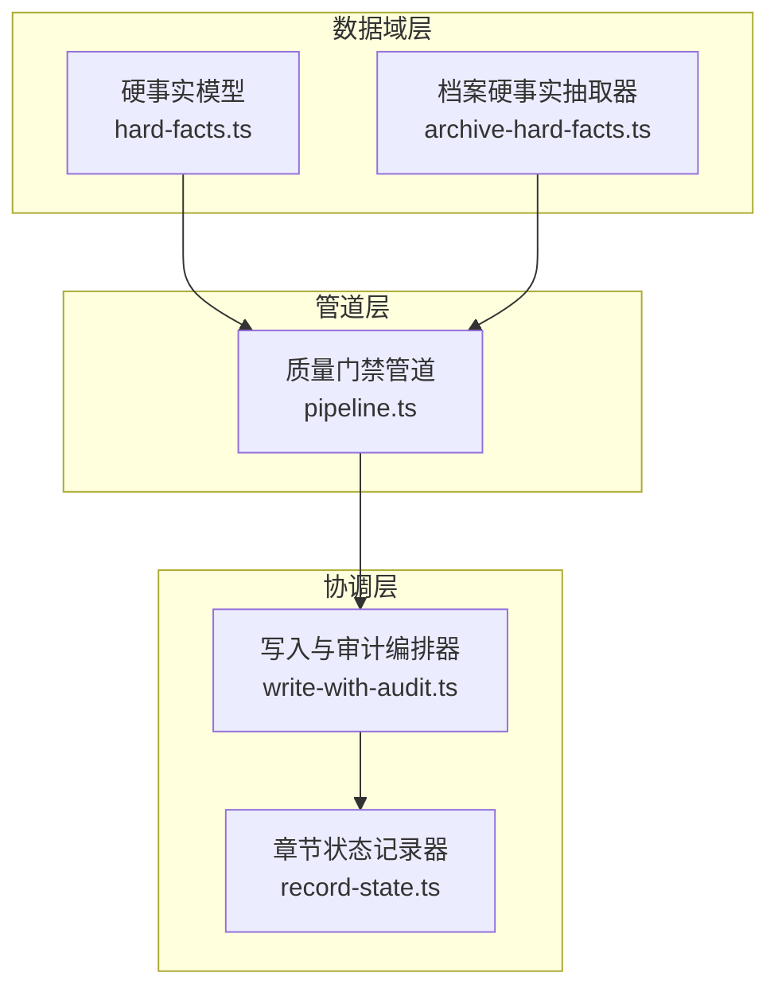
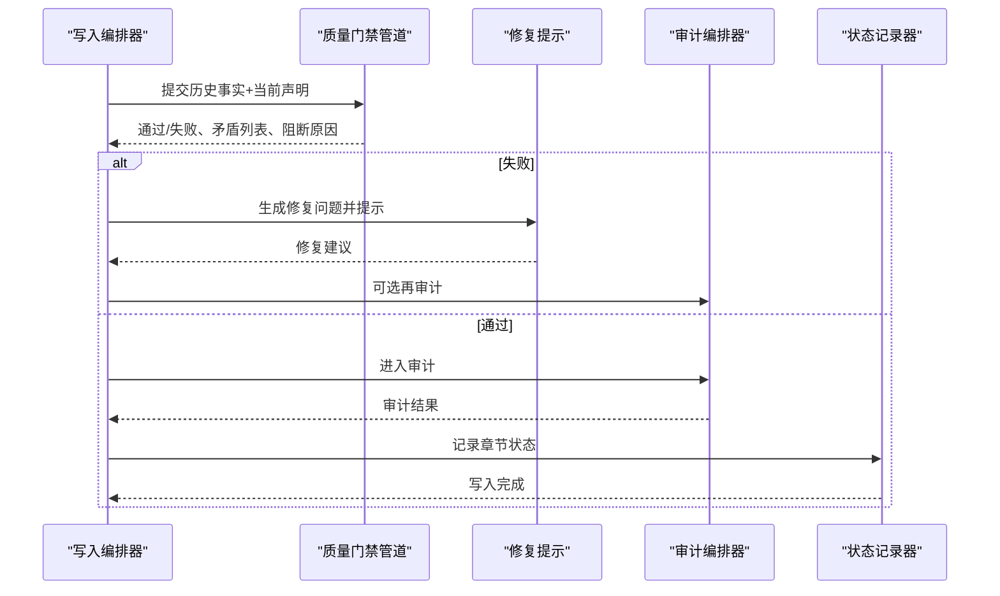
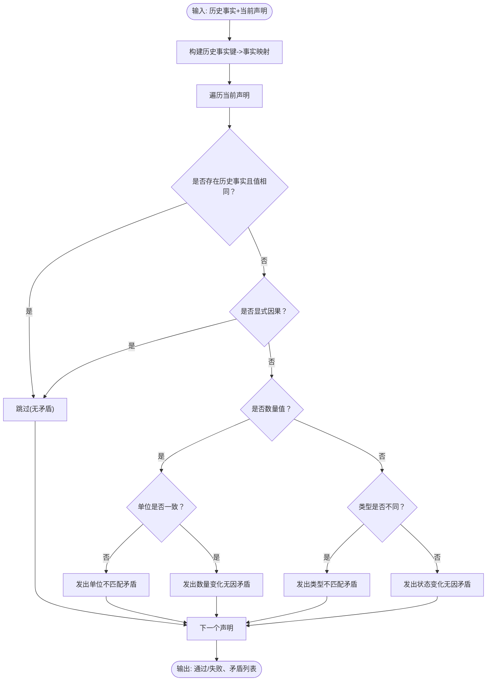
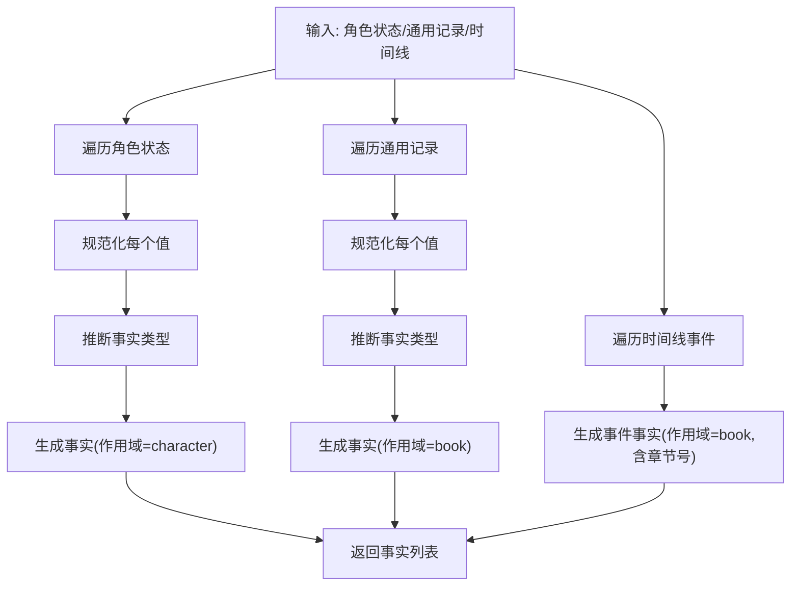
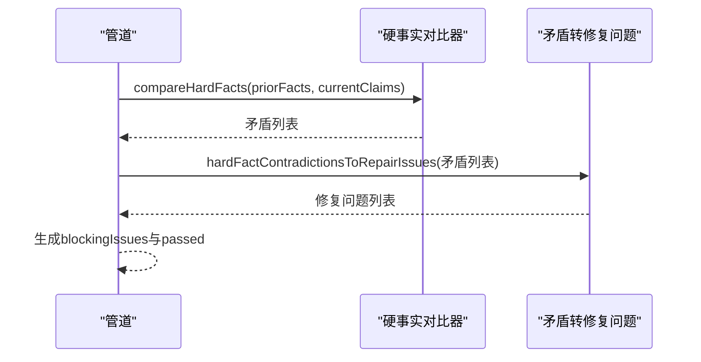
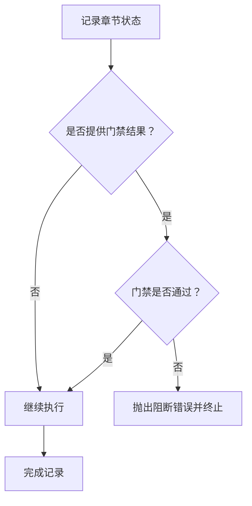
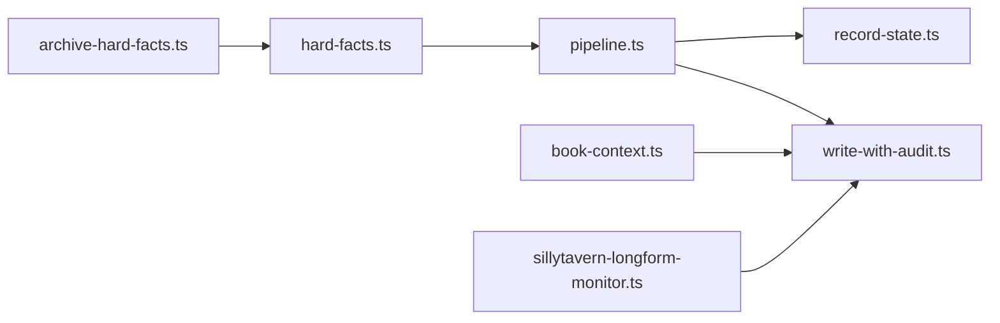

# 质量控制系统

<cite>
**本文引用的文件**
- [packages/server/src/ai/quality-gates/hard-facts.ts](file://packages/server/src/ai/quality-gates/hard-facts.ts)
- [packages/server/src/ai/quality-gates/archive-hard-facts.ts](file://packages/server/src/ai/quality-gates/archive-hard-facts.ts)
- [packages/server/src/ai/quality-gates/pipeline.ts](file://packages/server/src/ai/quality-gates/pipeline.ts)
- [packages/server/src/ai/orchestrator/record-state.ts](file://packages/server/src/ai/orchestrator/record-state.ts)
- [packages/server/src/ai/orchestrator/write-with-audit.ts](file://packages/server/src/ai/orchestrator/write-with-audit.ts)
- [packages/server/src/ai/prompts/repair-chapter.ts](file://packages/server/src/ai/prompts/repair-chapter.ts)
- [packages/server/src/ai/context-builder/book-context.ts](file://packages/server/src/ai/context-builder/book-context.ts)
- [packages/server/src/ai/monitor/sillytavern-longform-monitor.ts](file://packages/server/src/ai/monitor/sillytavern-longform-monitor.ts)
- [packages/server/tools/monitor-sillytavern-longform.ts](file://packages/server/tools/monitor-sillytavern-longform.ts)
- [packages/shared/src/types/audit.ts](file://packages/shared/src/types/audit.ts)
- [packages/server/tests/unit/ai/quality-gates/hard-facts.test.ts](file://packages/server/tests/unit/ai/quality-gates/hard-facts.test.ts)
- [packages/server/tests/unit/ai/quality-gates/archive-hard-facts.test.ts](file://packages/server/tests/unit/ai/quality-gates/archive-hard-facts.test.ts)
- [packages/server/tests/unit/ai/quality-gates/pipeline.test.ts](file://packages/server/tests/unit/ai/quality-gates/pipeline.test.ts)
- [packages/server/tests/unit/ai/orchestrator/record-state.test.ts](file://packages/server/tests/unit/ai/orchestrator/record-state.test.ts)
- [packages/server/tests/integration/write-then-audit.test.ts](file://packages/server/tests/integration/write-then-audit.test.ts)
- [packages/server/tests/integration/audit-persistence.test.ts](file://packages/server/tests/integration/audit-persistence.test.ts)
- [docs/superpowers/plans/2026-06-17-scribe-phase1-generic-continuity-gates.md](file://docs/superpowers/plans/2026-06-17-scribe-phase1-generic-continuity-gates.md)
- [docs/superpowers/plans/2026-06-16-sillytavern-quality-continuity.md](file://docs/superpowers/plans/2026-06-16-sillytavern-quality-continuity.md)
</cite>

## 目录
1. [引言](#引言)
2. [项目结构](#项目结构)
3. [核心组件](#核心组件)
4. [架构总览](#架构总览)
5. [详细组件分析](#详细组件分析)
6. [依赖关系分析](#依赖关系分析)
7. [性能考量](#性能考量)
8. [故障排查指南](#故障排查指南)
9. [结论](#结论)
10. [附录](#附录)

## 引言
本技术文档面向Scribe的质量控制系统，聚焦“通用质量门禁系统”的设计与实现，涵盖检查规则定义、问题生成与状态管理、连续性检查算法（硬事实验证、逻辑一致性检查、上下文完整性评估）、预算控制与使用量统计、配置选项、自定义检查器开发指南以及调试方法，并提供质量控制流程图与常见问题解决方案。

## 项目结构
质量控制系统由三层组成：
- 数据域层：通用硬事实模型与抽取器，负责从档案状态中提取可比较的事实条目。
- 管道层：质量门禁管道，将当前章节声明与历史事实进行对比，生成矛盾与修复建议。
- 协调层：编排器与持久化器，负责在门禁失败时阻断状态写入，并在通过后进入审计与记录流程。

图表来源
- [packages/server/src/ai/quality-gates/hard-facts.ts:1-159](file://packages/server/src/ai/quality-gates/hard-facts.ts#L1-L159)
- [packages/server/src/ai/quality-gates/archive-hard-facts.ts:1-92](file://packages/server/src/ai/quality-gates/archive-hard-facts.ts#L1-L92)
- [packages/server/src/ai/quality-gates/pipeline.ts:1-34](file://packages/server/src/ai/quality-gates/pipeline.ts#L1-L34)
- [packages/server/src/ai/orchestrator/write-with-audit.ts](file://packages/server/src/ai/orchestrator/write-with-audit.ts)
- [packages/server/src/ai/orchestrator/record-state.ts](file://packages/server/src/ai/orchestrator/record-state.ts)

章节来源
- [packages/server/src/ai/quality-gates/hard-facts.ts:1-159](file://packages/server/src/ai/quality-gates/hard-facts.ts#L1-L159)
- [packages/server/src/ai/quality-gates/archive-hard-facts.ts:1-92](file://packages/server/src/ai/quality-gates/archive-hard-facts.ts#L1-L92)
- [packages/server/src/ai/quality-gates/pipeline.ts:1-34](file://packages/server/src/ai/quality-gates/pipeline.ts#L1-L34)
- [packages/server/src/ai/orchestrator/write-with-audit.ts](file://packages/server/src/ai/orchestrator/write-with-audit.ts)
- [packages/server/src/ai/orchestrator/record-state.ts](file://packages/server/src/ai/orchestrator/record-state.ts)

## 核心组件
- 硬事实模型与对比器：定义事实类型、值规范化、键合并、相等性判断与矛盾检测。
- 档案硬事实抽取器：从角色状态、通用记录与时间线事件中抽取可比较的事实。
- 质量门禁管道：整合历史与当前事实，输出通过与否、修复问题列表与阻断原因。
- 编排与持久化：在门禁失败时阻断状态写入；通过后进入审计与记录流程。
- 上下文完整性约束：在写作与审计上下文中注入“硬连续性约束”，确保关键状态不被无因变更。
- SillyTavern兼容性监控：检测元输出泄漏、必需输出段缺失、定时器/资源/契约等硬连续性，并在必要时停止后续章节生成。

章节来源
- [packages/server/src/ai/quality-gates/hard-facts.ts:1-159](file://packages/server/src/ai/quality-gates/hard-facts.ts#L1-L159)
- [packages/server/src/ai/quality-gates/archive-hard-facts.ts:1-92](file://packages/server/src/ai/quality-gates/archive-hard-facts.ts#L1-L92)
- [packages/server/src/ai/quality-gates/pipeline.ts:1-34](file://packages/server/src/ai/quality-gates/pipeline.ts#L1-L34)
- [packages/server/src/ai/orchestrator/record-state.ts](file://packages/server/src/ai/orchestrator/record-state.ts)
- [packages/server/src/ai/context-builder/book-context.ts](file://packages/server/src/ai/context-builder/book-context.ts)
- [packages/server/src/ai/monitor/sillytavern-longform-monitor.ts](file://packages/server/src/ai/monitor/sillytavern-longform-monitor.ts)
- [packages/server/tools/monitor-sillytavern-longform.ts](file://packages/server/tools/monitor-sillytavern-longform.ts)

## 架构总览
质量控制贯穿“生成—审计—修复—记录”闭环，门禁位于生成与记录之间，作为第一道防线阻止不可接受的连续性破坏进入长期记忆。

图表来源
- [packages/server/src/ai/quality-gates/pipeline.ts:21-33](file://packages/server/src/ai/quality-gates/pipeline.ts#L21-L33)
- [packages/server/src/ai/orchestrator/write-with-audit.ts](file://packages/server/src/ai/orchestrator/write-with-audit.ts)
- [packages/server/src/ai/orchestrator/record-state.ts](file://packages/server/src/ai/orchestrator/record-state.ts)

## 详细组件分析

### 组件A：硬事实模型与对比器
- 设计要点
  - 值类型统一：字符串、数字、布尔、空值、带单位的数量对象。
  - 键合并：按作用域(scope)+实体(entity)+属性(attribute)三元组唯一标识事实。
  - 相等性：数量值需数值与单位均一致；其他值进行规范化字符串比较。
  - 矛盾类型：数量变化无因、状态变化无因、单位不匹配、类型不匹配。
  - 显式因果：若声明包含操作或原因字段，则跳过矛盾。
- 复杂度
  - 对比复杂度 O(n)，n 为当前声明数量；键映射查找 O(1) 平均。
- 错误处理
  - 忽略无法归一化的值；规范化空值与数量单位以避免误判。
- 性能影响
  - 使用 Map 进行历史事实索引，避免嵌套循环；数量值比较先做单位检查再数值比较。

图表来源
- [packages/server/src/ai/quality-gates/hard-facts.ts:88-143](file://packages/server/src/ai/quality-gates/hard-facts.ts#L88-L143)

章节来源
- [packages/server/src/ai/quality-gates/hard-facts.ts:1-159](file://packages/server/src/ai/quality-gates/hard-facts.ts#L1-L159)

### 组件B：档案硬事实抽取器
- 功能
  - 从角色当前状态抽取事实，推断事实类型（数量/地点/所有权/截止/伤势/关系/状态）。
  - 从通用记录抽取键值对，形成跨章节事实。
  - 从时间线事件抽取证据事实，携带章节号与置信度。
- 规范化策略
  - 非法值过滤：数组转逗号分隔，对象转JSON字符串；仅接受字符串/数字/布尔/null与数量对象。
  - 证据字符串包含来源与原始值，便于审计定位。
- 复杂度
  - 线性扫描所有条目，O(N)。

图表来源
- [packages/server/src/ai/quality-gates/archive-hard-facts.ts:39-91](file://packages/server/src/ai/quality-gates/archive-hard-facts.ts#L39-L91)

章节来源
- [packages/server/src/ai/quality-gates/archive-hard-facts.ts:1-92](file://packages/server/src/ai/quality-gates/archive-hard-facts.ts#L1-L92)

### 组件C：质量门禁管道
- 输入
  - priorFacts：历史硬事实集合。
  - currentClaims：当前章节声明集合。
- 输出
  - passed：是否通过。
  - repairIssues：修复问题列表（用于提示与再审计）。
  - blockingIssues：阻断原因（用于编排器决策）。
  - hardFactContradictions：内部矛盾详情。
- 关键行为
  - 将历史事实按键建立索引，逐条对比当前声明。
  - 将矛盾转换为修复问题，统一格式便于后续流程消费。

图表来源
- [packages/server/src/ai/quality-gates/pipeline.ts:21-33](file://packages/server/src/ai/quality-gates/pipeline.ts#L21-L33)
- [packages/server/src/ai/quality-gates/hard-facts.ts:145-159](file://packages/server/src/ai/quality-gates/hard-facts.ts#L145-L159)

章节来源
- [packages/server/src/ai/quality-gates/pipeline.ts:1-34](file://packages/server/src/ai/quality-gates/pipeline.ts#L1-L34)
- [packages/server/src/ai/quality-gates/hard-facts.ts:145-159](file://packages/server/src/ai/quality-gates/hard-facts.ts#L145-L159)

### 组件D：状态记录阻断与审计集成
- 在记录章节状态前检查质量门禁结果
  - 若门禁失败，抛出阻断错误并终止写入。
  - 若门禁通过，继续进入审计与记录流程。
- 与写入-审计编排器协作
  - 门禁结果作为输入参数传递给记录器，确保一致性。

图表来源
- [packages/server/src/ai/orchestrator/record-state.ts](file://packages/server/src/ai/orchestrator/record-state.ts)

章节来源
- [packages/server/src/ai/orchestrator/record-state.ts](file://packages/server/src/ai/orchestrator/record-state.ts)

### 组件E：上下文完整性评估（硬连续性约束）
- 在写作与审计上下文中注入“硬连续性约束”块，明确禁止无因变更：
  - 数量、定时器、契约、库存、冷却、HP/SP/MP、顺从度、剩余期限等。
- 与档案抽取器配合
  - 档案抽取器将时间线事件与角色状态转化为事实，供对比器识别矛盾。
- 与SiliconTavern监控协同
  - 检测元输出泄漏、必需输出段缺失、定时器/资源/契约等硬连续性。

章节来源
- [packages/server/src/ai/context-builder/book-context.ts](file://packages/server/src/ai/context-builder/book-context.ts)
- [packages/server/src/ai/monitor/sillytavern-longform-monitor.ts](file://packages/server/src/ai/monitor/sillytavern-longform-monitor.ts)
- [packages/server/src/ai/quality-gates/archive-hard-facts.ts:76-88](file://packages/server/src/ai/quality-gates/archive-hard-facts.ts#L76-L88)

### 组件F：预算控制与使用量统计
- 监控工具支持
  - 监控脚本收集章节级指标（字数、预设块数、正则脚本应用次数、世界书条目数、读者问题ID等），并标注审计结论与修复状态。
- 预算控制建议
  - 基于章节报告设置阈值：如单章最大正则脚本应用次数、世界书触发上限、读者问题未解决容忍数等。
  - 当任一指标超过阈值时，标记为“预算超支”，触发阻断或降级策略。
- 使用量统计
  - 指标采集与聚合在监控工具中完成，便于生成报告与趋势分析。

章节来源
- [packages/server/tools/monitor-sillytavern-longform.ts](file://packages/server/tools/monitor-sillytavern-longform.ts)
- [packages/server/src/ai/monitor/sillytavern-longform-monitor.ts](file://packages/server/src/ai/monitor/sillytavern-longform-monitor.ts)

## 依赖关系分析
- 管道依赖硬事实模型与抽取器，输出统一的矛盾与修复问题。
- 编排器依赖管道输出决定是否继续审计与记录。
- 记录器依赖编排器提供的门禁结果，失败即阻断。
- 上下文构建器与监控器共同保证“上下文完整性”。

图表来源
- [packages/server/src/ai/quality-gates/archive-hard-facts.ts:1-92](file://packages/server/src/ai/quality-gates/archive-hard-facts.ts#L1-L92)
- [packages/server/src/ai/quality-gates/hard-facts.ts:1-159](file://packages/server/src/ai/quality-gates/hard-facts.ts#L1-L159)
- [packages/server/src/ai/quality-gates/pipeline.ts:1-34](file://packages/server/src/ai/quality-gates/pipeline.ts#L1-L34)
- [packages/server/src/ai/orchestrator/write-with-audit.ts](file://packages/server/src/ai/orchestrator/write-with-audit.ts)
- [packages/server/src/ai/orchestrator/record-state.ts](file://packages/server/src/ai/orchestrator/record-state.ts)
- [packages/server/src/ai/context-builder/book-context.ts](file://packages/server/src/ai/context-builder/book-context.ts)
- [packages/server/src/ai/monitor/sillytavern-longform-monitor.ts](file://packages/server/src/ai/monitor/sillytavern-longform-monitor.ts)

章节来源
- [packages/server/src/ai/quality-gates/hard-facts.ts:1-159](file://packages/server/src/ai/quality-gates/hard-facts.ts#L1-L159)
- [packages/server/src/ai/quality-gates/pipeline.ts:1-34](file://packages/server/src/ai/quality-gates/pipeline.ts#L1-L34)
- [packages/server/src/ai/orchestrator/record-state.ts](file://packages/server/src/ai/orchestrator/record-state.ts)

## 性能考量
- 时间复杂度
  - 硬事实对比为 O(n)，n 为当前声明数量；键映射查找 O(1) 平均。
  - 抽取器线性扫描所有来源，O(N)。
- 空间复杂度
  - 历史事实映射占用 O(n)。
- 优化建议
  - 对历史事实进行分片或按作用域分区，减少对比范围。
  - 对数量值比较先做单位检查，避免不必要的数值比较。
  - 在编排器侧缓存上一章的硬事实，避免重复抽取。

## 故障排查指南
- 门禁失败但修复无效
  - 检查当前声明是否包含显式因果（操作或原因字段），否则会被视为无因变更。
  - 确认证据字符串是否正确，以便定位历史事实与当前声明。
- 状态未写入
  - 查看门禁结果中的阻断原因，确认是否为“未通过”。
  - 检查记录器是否收到门禁结果参数。
- 元输出泄漏或必需输出段缺失
  - 使用监控器检测器识别泄漏类型（进度标签、AI聊天日志、事件框架等）。
  - 在写作提示中加入“禁止元输出”规则，在修复提示中强调保留“故事内呈现”的系统面板。
- 预算超支
  - 设置章节级阈值，监控正则脚本应用次数、世界书触发次数、读者问题未解决数等。
  - 超限时阻断后续章节生成或降低生成强度。

章节来源
- [packages/server/src/ai/quality-gates/hard-facts.ts:77-79](file://packages/server/src/ai/quality-gates/hard-facts.ts#L77-L79)
- [packages/server/src/ai/orchestrator/record-state.ts](file://packages/server/src/ai/orchestrator/record-state.ts)
- [packages/server/src/ai/monitor/sillytavern-longform-monitor.ts](file://packages/server/src/ai/monitor/sillytavern-longform-monitor.ts)
- [packages/server/tools/monitor-sillytavern-longform.ts](file://packages/server/tools/monitor-sillytavern-longform.ts)

## 结论
Scribe的质量控制系统以“通用硬事实门禁”为核心，结合档案抽取、上下文约束与监控工具，形成“生成—审计—修复—记录”的闭环。通过显式因果与硬连续性约束，系统有效降低了不可接受的连续性破坏进入长期记忆的风险；通过预算控制与使用量统计，保障了生成过程的稳定性与可预测性。后续可在现有基础上扩展更多领域特定检查器与可视化诊断界面。

## 附录

### 配置选项与最佳实践
- 硬事实门禁
  - 启用显式因果字段（操作/原因）以允许合理变更。
  - 对数量值进行单位一致性检查。
- 上下文完整性
  - 在写作与审计上下文中固定注入“硬连续性约束”块。
  - 对定时器、资源、契约等关键状态设置严格约束。
- 预算与统计
  - 为章节设置阈值：正则脚本应用次数、世界书触发次数、读者问题未解决数。
  - 使用监控工具采集指标并生成报告。

章节来源
- [packages/server/src/ai/quality-gates/hard-facts.ts:77-79](file://packages/server/src/ai/quality-gates/hard-facts.ts#L77-L79)
- [packages/server/src/ai/context-builder/book-context.ts](file://packages/server/src/ai/context-builder/book-context.ts)
- [packages/server/tools/monitor-sillytavern-longform.ts](file://packages/server/tools/monitor-sillytavern-longform.ts)

### 自定义检查器开发指南
- 基于硬事实门禁扩展
  - 定义新的事实类型与抽取规则，确保证据可追溯。
  - 在对比器中增加新的矛盾类型与消息模板。
- 基于监控器扩展
  - 新增检测器函数，返回问题类别列表。
  - 在监控器中收集检测结果并纳入最终报告。
- 测试与验证
  - 为新检查器编写单元测试与集成测试。
  - 使用真实样本验证跨风格/题材的适用性。

章节来源
- [packages/server/tests/unit/ai/quality-gates/hard-facts.test.ts](file://packages/server/tests/unit/ai/quality-gates/hard-facts.test.ts)
- [packages/server/tests/integration/write-then-audit.test.ts](file://packages/server/tests/integration/write-then-audit.test.ts)
- [docs/superpowers/plans/2026-06-17-scribe-phase1-generic-continuity-gates.md:36-166](file://docs/superpowers/plans/2026-06-17-scribe-phase1-generic-continuity-gates.md#L36-L166)
- [docs/superpowers/plans/2026-06-16-sillytavern-quality-continuity.md:228-314](file://docs/superpowers/plans/2026-06-16-sillytavern-quality-continuity.md#L228-L314)

### 调试方法
- 单元测试
  - 使用测试用例覆盖典型矛盾场景（数量变化、状态变化、单位不匹配、类型不匹配）。
- 集成测试
  - 在“先写后审”流程中验证门禁失败时的状态记录阻断。
- 日志与诊断
  - 在监控器中输出章节级证据与检测结果，便于定位问题。
  - 在修复提示中包含证据与建议，帮助作者快速修正。

章节来源
- [packages/server/tests/unit/ai/quality-gates/pipeline.test.ts](file://packages/server/tests/unit/ai/quality-gates/pipeline.test.ts)
- [packages/server/tests/unit/ai/orchestrator/record-state.test.ts](file://packages/server/tests/unit/ai/orchestrator/record-state.test.ts)
- [packages/server/tests/integration/audit-persistence.test.ts](file://packages/server/tests/integration/audit-persistence.test.ts)