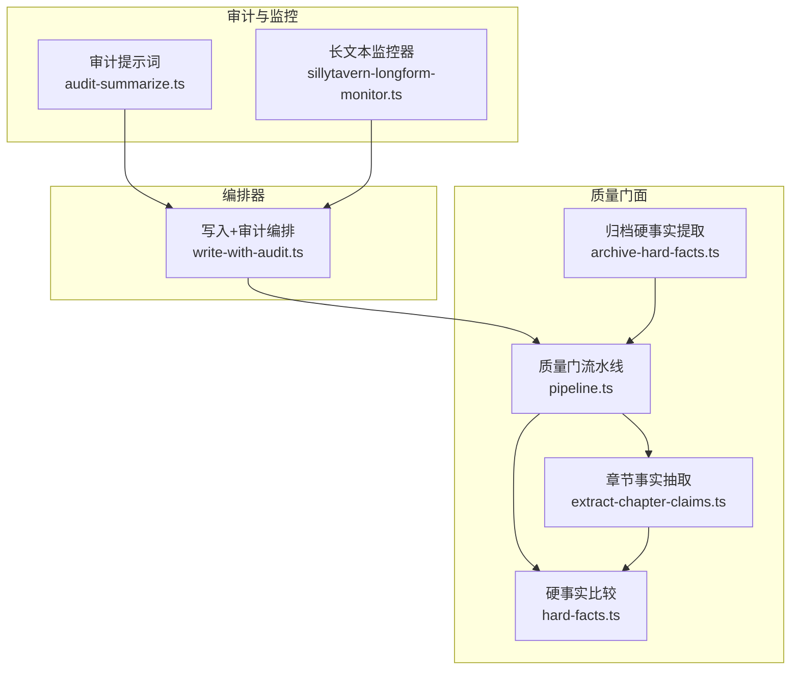
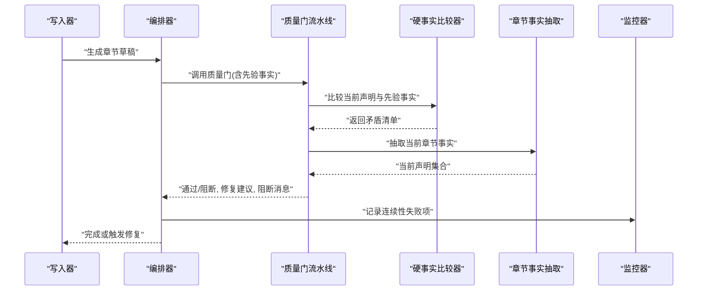
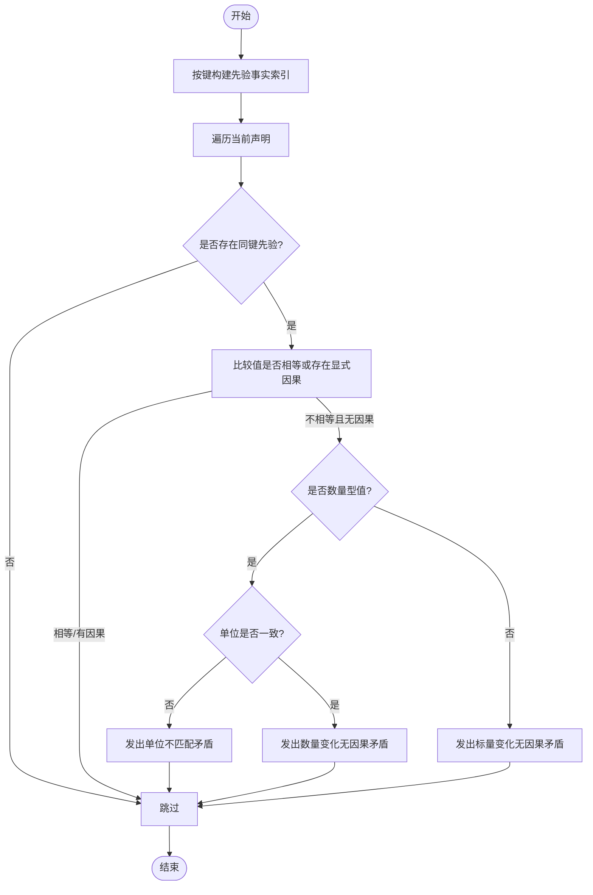
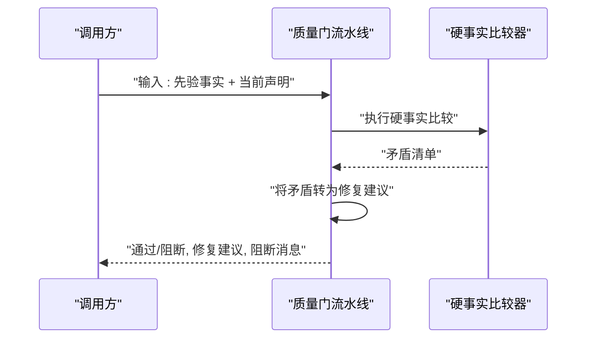
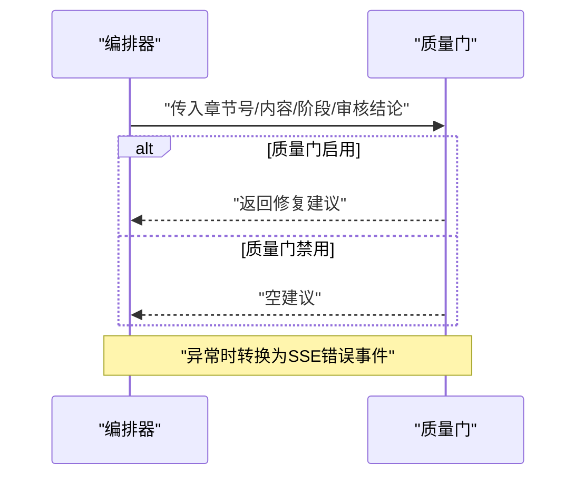
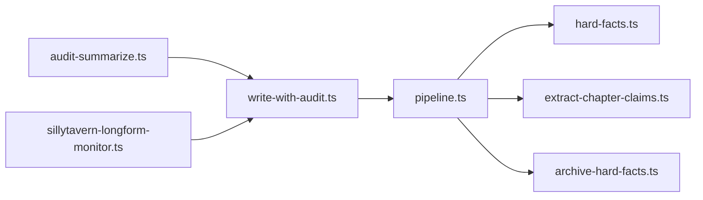

# 连续性验证

<cite>
**本文引用的文件**
- [packages/server/src/ai/quality-gates/hard-facts.ts](file://packages/server/src/ai/quality-gates/hard-facts.ts)
- [packages/server/src/ai/quality-gates/pipeline.ts](file://packages/server/src/ai/quality-gates/pipeline.ts)
- [packages/server/src/ai/orchestrator/write-with-audit.ts](file://packages/server/src/ai/orchestrator/write-with-audit.ts)
- [packages/server/src/ai/prompts/audit-summarize.ts](file://packages/server/src/ai/prompts/audit-summarize.ts)
- [packages/server/src/ai/monitor/sillytavern-longform-monitor.ts](file://packages/server/src/ai/monitor/sillytavern-longform-monitor.ts)
- [packages/server/tests/unit/ai/quality-gates/hard-facts.test.ts](file://packages/server/tests/unit/ai/quality-gates/hard-facts.test.ts)
- [packages/server/tests/unit/ai/quality-gates/pipeline.test.ts](file://packages/server/tests/unit/ai/quality-gates/pipeline.test.ts)
- [packages/server/tests/unit/ai/context-builder/audit-worldbook-context.test.ts](file://packages/server/tests/unit/ai/context-builder/audit-worldbook-context.test.ts)
- [packages/server/tests/unit/ai/context-builder/book-context.test.ts](file://packages/server/tests/unit/ai/context-builder/book-context.test.ts)
- [packages/server/tests/unit/ai/context-builder/reader-issues-context.test.ts](file://packages/server/tests/unit/ai/context-builder/reader-issues-context.test.ts)
- [docs/superpowers/specs/2026-06-17-scribe-ultimate-product-goal.md](file://docs/superpowers/specs/2026-06-17-scribe-ultimate-product-goal.md)
</cite>

## 目录
1. [简介](#简介)
2. [项目结构](#项目结构)
3. [核心组件](#核心组件)
4. [架构总览](#架构总览)
5. [详细组件分析](#详细组件分析)
6. [依赖分析](#依赖分析)
7. [性能考虑](#性能考虑)
8. [故障排查指南](#故障排查指南)
9. [结论](#结论)
10. [附录](#附录)

## 简介
本技术文档聚焦于Scribe的连续性验证系统，系统通过“硬事实验证”“逻辑一致性检查”“上下文完整性评估”三大支柱，确保章节内容在事实层面、逻辑层面与上下文层面保持一致。文档从算法原理、实现机制、工作流程、配置与扩展、问题分类与修复策略等维度进行深入说明，并结合测试用例路径与关键源码位置，帮助开发者与使用者理解并正确使用该系统。

## 项目结构
围绕连续性验证的关键模块主要位于服务端AI质量门面（quality-gates）与编排器（orchestrator），以及审计提示词与监控器中：

- 质量门面：硬事实对比、质量门流水线、归档硬事实提取、章节事实抽取
- 编排器：写入+审计流程中的质量门调用
- 审计提示词：强调以“连续读者视角”进行连续性审查
- 监控器：收集连续性失败项并参与整体判定

图表来源
- [packages/server/src/ai/quality-gates/hard-facts.ts](file://packages/server/src/ai/quality-gates/hard-facts.ts)
- [packages/server/src/ai/quality-gates/pipeline.ts](file://packages/server/src/ai/quality-gates/pipeline.ts)
- [packages/server/src/ai/orchestrator/write-with-audit.ts](file://packages/server/src/ai/orchestrator/write-with-audit.ts)
- [packages/server/src/ai/prompts/audit-summarize.ts](file://packages/server/src/ai/prompts/audit-summarize.ts)
- [packages/server/src/ai/monitor/sillytavern-longform-monitor.ts](file://packages/server/src/ai/monitor/sillytavern-longform-monitor.ts)

章节来源
- [packages/server/src/ai/quality-gates/hard-facts.ts](file://packages/server/src/ai/quality-gates/hard-facts.ts)
- [packages/server/src/ai/quality-gates/pipeline.ts](file://packages/server/src/ai/quality-gates/pipeline.ts)
- [packages/server/src/ai/orchestrator/write-with-audit.ts](file://packages/server/src/ai/orchestrator/write-with-audit.ts)
- [packages/server/src/ai/prompts/audit-summarize.ts](file://packages/server/src/ai/prompts/audit-summarize.ts)
- [packages/server/src/ai/monitor/sillytavern-longform-monitor.ts](file://packages/server/src/ai/monitor/sillytavern-longform-monitor.ts)

## 核心组件
- 硬事实比较器：负责跨章节的事实一致性比对，识别数量单位不匹配、无显式原因的数量变化等矛盾
- 质量门流水线：整合硬事实比较结果，生成修复建议与阻断性问题列表
- 编排器质量门钩子：在写入+审计流程中调用质量门，产出修复事件与错误上报
- 审计提示词：约束审计阶段以连续读者视角审视内容连续性
- 监控器：汇总连续性失败项，参与整体判定与报告

章节来源
- [packages/server/src/ai/quality-gates/hard-facts.ts](file://packages/server/src/ai/quality-gates/hard-facts.ts)
- [packages/server/src/ai/quality-gates/pipeline.ts](file://packages/server/src/ai/quality-gates/pipeline.ts)
- [packages/server/src/ai/orchestrator/write-with-audit.ts](file://packages/server/src/ai/orchestrator/write-with-audit.ts)
- [packages/server/src/ai/prompts/audit-summarize.ts](file://packages/server/src/ai/prompts/audit-summarize.ts)
- [packages/server/src/ai/monitor/sillytavern-longform-monitor.ts](file://packages/server/src/ai/monitor/sillytavern-longform-monitor.ts)

## 架构总览
下图展示了从章节生成到连续性审计与质量门拦截的整体流程，以及质量门内部的硬事实比较与修复建议生成过程。

图表来源
- [packages/server/src/ai/orchestrator/write-with-audit.ts](file://packages/server/src/ai/orchestrator/write-with-audit.ts)
- [packages/server/src/ai/quality-gates/pipeline.ts](file://packages/server/src/ai/quality-gates/pipeline.ts)
- [packages/server/src/ai/quality-gates/hard-facts.ts](file://packages/server/src/ai/quality-gates/hard-facts.ts)

## 详细组件分析

### 硬事实验证器（Hard Facts）
硬事实验证器负责比较“先验事实”与“当前声明”，识别以下类型矛盾：
- 数量单位不一致且无显式原因
- 数值变化但无显式因果（如资源、时间、任务进度等）

实现要点
- 归一化数值与字符串，统一比较口径
- 使用实体-属性-作用域键进行去重与匹配
- 区分数量型值（带单位）与标量值，分别处理单位与数值变化
- 仅当当前声明无显式因果时才视为潜在矛盾

图表来源
- [packages/server/src/ai/quality-gates/hard-facts.ts](file://packages/server/src/ai/quality-gates/hard-facts.ts)

章节来源
- [packages/server/src/ai/quality-gates/hard-facts.ts](file://packages/server/src/ai/quality-gates/hard-facts.ts)
- [packages/server/tests/unit/ai/quality-gates/hard-facts.test.ts](file://packages/server/tests/unit/ai/quality-gates/hard-facts.test.ts)

### 质量门流水线（Quality Gate Pipeline）
质量门流水线整合硬事实比较结果，输出：
- 是否通过
- 修复建议（Repair Issues）
- 阻断性问题（Blocking Issues）
- 矛盾详情（用于诊断）

图表来源
- [packages/server/src/ai/quality-gates/pipeline.ts](file://packages/server/src/ai/quality-gates/pipeline.ts)

章节来源
- [packages/server/src/ai/quality-gates/pipeline.ts](file://packages/server/src/ai/quality-gates/pipeline.ts)
- [packages/server/tests/unit/ai/quality-gates/pipeline.test.ts](file://packages/server/tests/unit/ai/quality-gates/pipeline.test.ts)

### 编排器中的质量门调用
编排器在“写入+审计”流程中调用质量门，若质量门抛出异常则转换为SSE事件错误返回；否则返回修复建议。

图表来源
- [packages/server/src/ai/orchestrator/write-with-audit.ts](file://packages/server/src/ai/orchestrator/write-with-audit.ts)

章节来源
- [packages/server/src/ai/orchestrator/write-with-audit.ts](file://packages/server/src/ai/orchestrator/write-with-audit.ts)

### 审计提示词与上下文注入
审计提示词明确要求以“连续读者视角”进行连续性审查；同时，系统会将世界书上下文、读者未解决的问题、硬事实上下文注入到写作上下文中，增强连续性判断依据。

章节来源
- [packages/server/src/ai/prompts/audit-summarize.ts](file://packages/server/src/ai/prompts/audit-summarize.ts)
- [packages/server/tests/unit/ai/context-builder/audit-worldbook-context.test.ts](file://packages/server/tests/unit/ai/context-builder/audit-worldbook-context.test.ts)
- [packages/server/tests/unit/ai/context-builder/book-context.test.ts](file://packages/server/tests/unit/ai/context-builder/book-context.test.ts)
- [packages/server/tests/unit/ai/context-builder/reader-issues-context.test.ts](file://packages/server/tests/unit/ai/context-builder/reader-issues-context.test.ts)

### 监控器与连续性失败项
监控器收集来自报告的连续性失败项，并将其纳入整体失败原因集合，作为是否继续流程的依据之一。

章节来源
- [packages/server/src/ai/monitor/sillytavern-longform-monitor.ts](file://packages/server/src/ai/monitor/sillytavern-longform-monitor.ts)

## 依赖分析
质量门相关模块之间的依赖关系如下：

图表来源
- [packages/server/src/ai/quality-gates/pipeline.ts](file://packages/server/src/ai/quality-gates/pipeline.ts)
- [packages/server/src/ai/quality-gates/hard-facts.ts](file://packages/server/src/ai/quality-gates/hard-facts.ts)
- [packages/server/src/ai/orchestrator/write-with-audit.ts](file://packages/server/src/ai/orchestrator/write-with-audit.ts)
- [packages/server/src/ai/prompts/audit-summarize.ts](file://packages/server/src/ai/prompts/audit-summarize.ts)
- [packages/server/src/ai/monitor/sillytavern-longform-monitor.ts](file://packages/server/src/ai/monitor/sillytavern-longform-monitor.ts)

章节来源
- [packages/server/src/ai/quality-gates/pipeline.ts](file://packages/server/src/ai/quality-gates/pipeline.ts)
- [packages/server/src/ai/quality-gates/hard-facts.ts](file://packages/server/src/ai/quality-gates/hard-facts.ts)
- [packages/server/src/ai/orchestrator/write-with-audit.ts](file://packages/server/src/ai/orchestrator/write-with-audit.ts)
- [packages/server/src/ai/prompts/audit-summarize.ts](file://packages/server/src/ai/prompts/audit-summarize.ts)
- [packages/server/src/ai/monitor/sillytavern-longform-monitor.ts](file://packages/server/src/ai/monitor/sillytavern-longform-monitor.ts)

## 性能考虑
- 键构建与查找：先验事实通过Map按键索引，避免O(n^2)全量比对，时间复杂度近似O(n+m)
- 值归一化与比较：字符串与数量型值的归一化减少误判，提升稳定性
- 单元测试覆盖：通过单元测试验证边界条件（单位不一致、数量变化、无因果等），降低回归风险

## 故障排查指南
常见问题与定位思路
- 矛盾未被识别
  - 检查实体/属性/作用域键是否一致
  - 确认当前声明是否带有显式因果（显式因果可豁免矛盾）
  - 核对数量型值的单位是否一致
- 修复建议缺失
  - 确认质量门流水线是否正确将矛盾转为修复建议
  - 检查测试用例中对矛盾到修复建议的映射
- 编排器报错
  - 捕获质量门异常并转换为SSE事件错误返回
  - 查看异常堆栈与输入参数（章节号、阶段、审核结论）

参考测试用例路径
- [packages/server/tests/unit/ai/quality-gates/hard-facts.test.ts](file://packages/server/tests/unit/ai/quality-gates/hard-facts.test.ts)
- [packages/server/tests/unit/ai/quality-gates/pipeline.test.ts](file://packages/server/tests/unit/ai/quality-gates/pipeline.test.ts)
- [packages/server/tests/unit/ai/context-builder/audit-worldbook-context.test.ts](file://packages/server/tests/unit/ai/context-builder/audit-worldbook-context.test.ts)
- [packages/server/tests/unit/ai/context-builder/book-context.test.ts](file://packages/server/tests/unit/ai/context-builder/book-context.test.ts)
- [packages/server/tests/unit/ai/context-builder/reader-issues-context.test.ts](file://packages/server/tests/unit/ai/context-builder/reader-issues-context.test.ts)

章节来源
- [packages/server/tests/unit/ai/quality-gates/hard-facts.test.ts](file://packages/server/tests/unit/ai/quality-gates/hard-facts.test.ts)
- [packages/server/tests/unit/ai/quality-gates/pipeline.test.ts](file://packages/server/tests/unit/ai/quality-gates/pipeline.test.ts)
- [packages/server/tests/unit/ai/context-builder/audit-worldbook-context.test.ts](file://packages/server/tests/unit/ai/context-builder/audit-worldbook-context.test.ts)
- [packages/server/tests/unit/ai/context-builder/book-context.test.ts](file://packages/server/tests/unit/ai/context-builder/book-context.test.ts)
- [packages/server/tests/unit/ai/context-builder/reader-issues-context.test.ts](file://packages/server/tests/unit/ai/context-builder/reader-issues-context.test.ts)

## 结论
Scribe的连续性验证体系以“硬事实验证”为核心，辅以“逻辑一致性检查”和“上下文完整性评估”，通过质量门流水线在写入+审计流程中实施拦截与修复。系统通过明确的算法与严格的测试保障，确保章节内容在事实、逻辑与上下文层面保持一致，避免将错误记忆持久化至后续章节。

## 附录

### 连续性检查目标与范围
根据产品规格文档，质量门需保护的内容包括但不限于：
- 硬事实矛盾：数量、位置、所有权、状态、时间、任务进度、伤势、冷却等
- 世界规则矛盾：变更机制、破坏能力限制、不一致约束
- 角色连续性漂移：行为、关系、知识、言谈、动机
- 剧情连续性错误：重复事件、缺失后果、未解决的因果链
- 输出结构缺失：导入预设所需的面板或章节结构
- 元输出污染：聊天日志、进度标签、任务备注、隐藏推理标签、执行追踪
- 风格漂移：重复AI措辞、过度解释、丢失用户选定的散文风格
- 长文本退化：忘记开放问题、丢掉伏笔、重启情节弧线

章节来源
- [docs/superpowers/specs/2026-06-17-scribe-ultimate-product-goal.md](file://docs/superpowers/specs/2026-06-17-scribe-ultimate-product-goal.md)