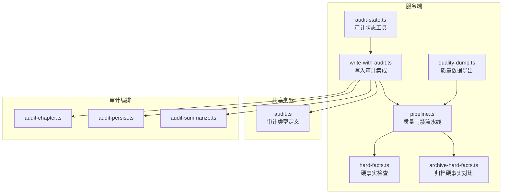
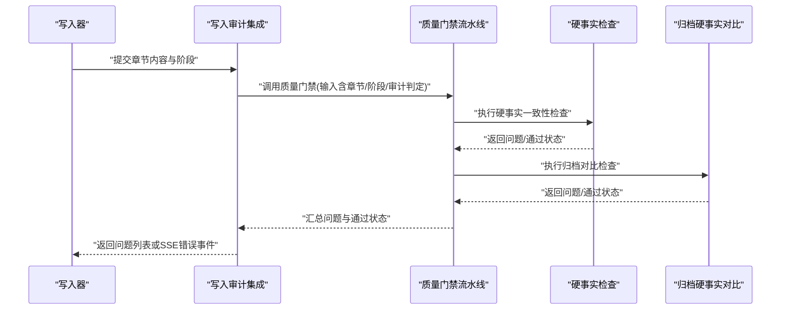
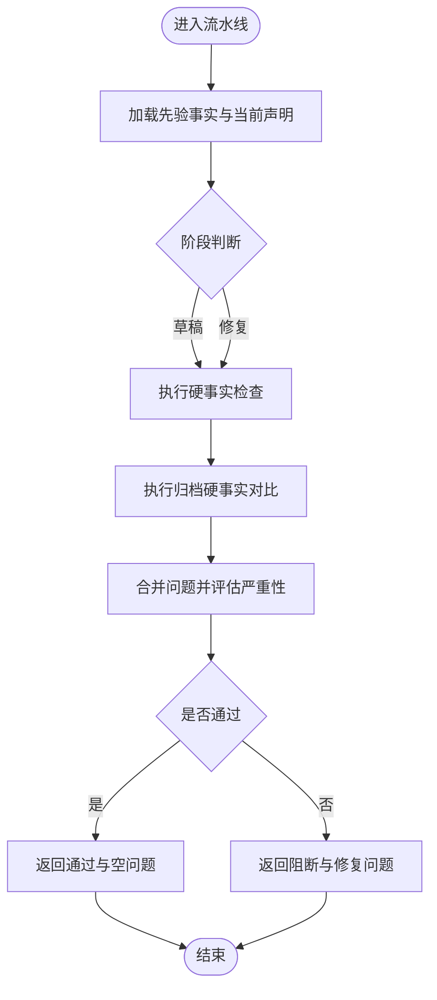
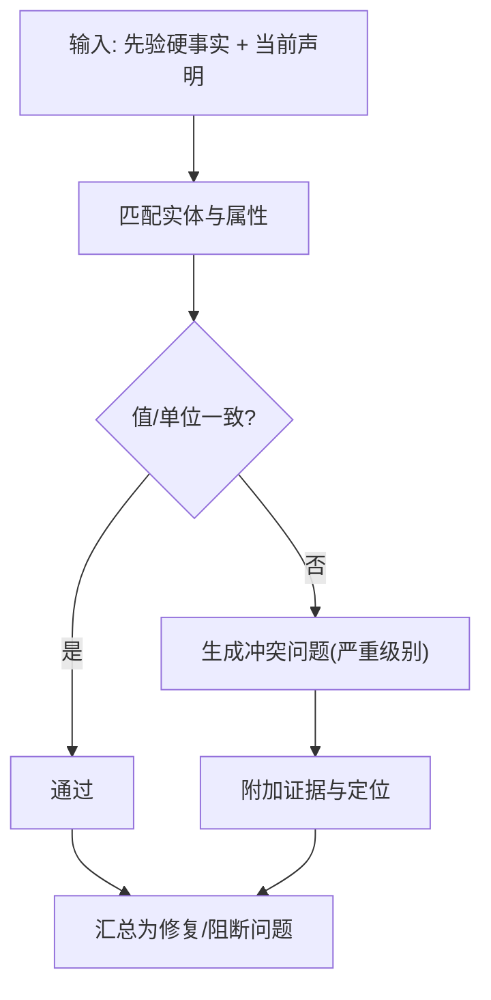
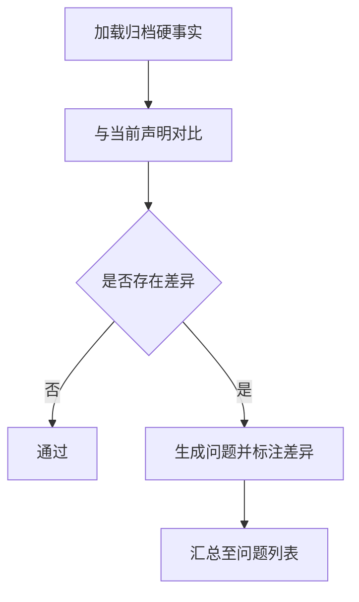
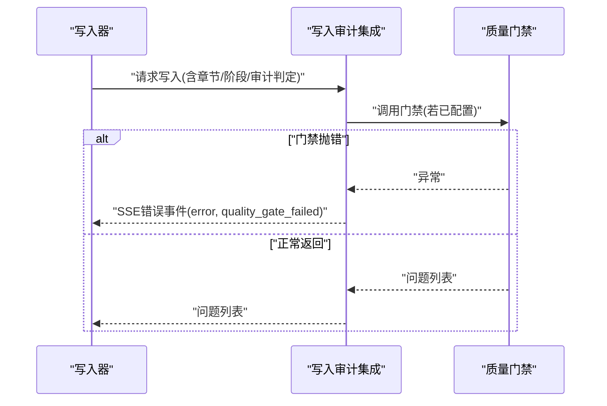
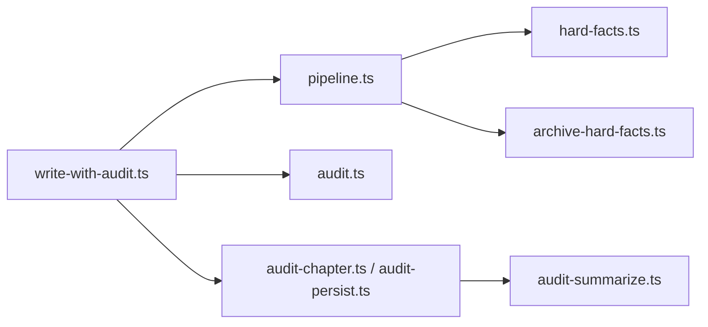

# 通用质量门禁

<cite>
**本文引用的文件**
- [packages/server/src/ai/orchestrator/write-with-audit.ts](file://packages/server/src/ai/orchestrator/write-with-audit.ts)
- [packages/server/src/ai/quality-gates/pipeline.ts](file://packages/server/src/ai/quality-gates/pipeline.ts)
- [packages/server/src/ai/quality-gates/hard-facts.ts](file://packages/server/src/ai/quality-gates/hard-facts.ts)
- [packages/server/src/ai/quality-gates/archive-hard-facts.ts](file://packages/server/src/ai/quality-gates/archive-hard-facts.ts)
- [packages/shared/src/types/audit.ts](file://packages/shared/src/types/audit.ts)
- [packages/server/tests/unit/ai/quality-gates/pipeline.test.ts](file://packages/server/tests/unit/ai/quality-gates/pipeline.test.ts)
- [packages/server/tests/unit/ai/quality-gates/hard-facts.test.ts](file://packages/server/tests/unit/ai/quality-gates/hard-facts.test.ts)
- [packages/server/tests/unit/ai/quality-gates/archive-hard-facts.test.ts](file://packages/server/tests/unit/ai/quality-gates/archive-hard-facts.test.ts)
- [packages/server/tools/quality-dump.ts](file://packages/server/tools/quality-dump.ts)
- [packages/server/tools/audit-state.ts](file://packages/server/tools/audit-state.ts)
- [packages/server/src/ai/orchestrator/audit-chapter.ts](file://packages/server/src/ai/orchestrator/audit-chapter.ts)
- [packages/server/src/ai/orchestrator/audit-persist.ts](file://packages/server/src/ai/orchestrator/audit-persist.ts)
- [packages/server/src/ai/prompts/audit-summarize.ts](file://packages/server/src/ai/prompts/audit-summarize.ts)
</cite>

## 目录
1. [简介](#简介)
2. [项目结构](#项目结构)
3. [核心组件](#核心组件)
4. [架构总览](#架构总览)
5. [详细组件分析](#详细组件分析)
6. [依赖关系分析](#依赖关系分析)
7. [性能与成本控制](#性能与成本控制)
8. [配置与扩展指南](#配置与扩展指南)
9. [工作流程与调试](#工作流程与调试)
10. [结论](#结论)

## 简介
本文件面向Scribe的“通用质量门禁”子系统，系统性梳理其设计架构、实现原理与运行机制。重点覆盖以下方面：
- 检查规则定义与执行：硬事实一致性检查、归档硬事实对比、质量门禁流水线。
- 问题生成与状态管理：如何从规则冲突中生成修复与阻断问题，并在审计阶段进行状态流转。
- 预算与成本控制：通过token用量统计与阈值控制，限制AI生成成本。
- 配置与扩展：质量门禁的可插拔检查器注册机制与自定义检查器开发指南。
- 工作流程与调试：端到端工作流、常见检查场景、调试工具与最佳实践。

## 项目结构
质量门禁相关代码主要位于服务端包的AI模块下，围绕“质量门禁流水线”“硬事实检查”“归档硬事实对比”以及“写入审计集成”展开；共享类型定义位于shared包；测试用例覆盖核心逻辑；工具脚本用于质量数据导出与审计状态查看。

图表来源
- [packages/server/src/ai/orchestrator/write-with-audit.ts:292-316](file://packages/server/src/ai/orchestrator/write-with-audit.ts#L292-L316)
- [packages/server/src/ai/quality-gates/pipeline.ts](file://packages/server/src/ai/quality-gates/pipeline.ts)
- [packages/server/src/ai/quality-gates/hard-facts.ts](file://packages/server/src/ai/quality-gates/hard-facts.ts)
- [packages/server/src/ai/quality-gates/archive-hard-facts.ts](file://packages/server/src/ai/quality-gates/archive-hard-facts.ts)
- [packages/shared/src/types/audit.ts](file://packages/shared/src/types/audit.ts)
- [packages/server/tools/audit-state.ts](file://packages/server/tools/audit-state.ts)
- [packages/server/tools/quality-dump.ts](file://packages/server/tools/quality-dump.ts)
- [packages/server/src/ai/orchestrator/audit-chapter.ts](file://packages/server/src/ai/orchestrator/audit-chapter.ts)
- [packages/server/src/ai/orchestrator/audit-persist.ts](file://packages/server/src/ai/orchestrator/audit-persist.ts)
- [packages/server/src/ai/prompts/audit-summarize.ts](file://packages/server/src/ai/prompts/audit-summarize.ts)

章节来源
- [packages/server/src/ai/orchestrator/write-with-audit.ts:292-316](file://packages/server/src/ai/orchestrator/write-with-audit.ts#L292-L316)
- [packages/server/src/ai/quality-gates/pipeline.ts](file://packages/server/src/ai/quality-gates/pipeline.ts)
- [packages/server/src/ai/quality-gates/hard-facts.ts](file://packages/server/src/ai/quality-gates/hard-facts.ts)
- [packages/server/src/ai/quality-gates/archive-hard-facts.ts](file://packages/server/src/ai/quality-gates/archive-hard-facts.ts)
- [packages/shared/src/types/audit.ts](file://packages/shared/src/types/audit.ts)

## 核心组件
- 质量门禁流水线：聚合多个检查器（如硬事实一致性、归档对比）输出“是否通过”“修复问题”“阻断问题”，并支持阶段化（草稿/修复）。
- 硬事实检查：基于当前章节声明与历史硬事实进行一致性比对，发现冲突即生成严重问题。
- 归档硬事实对比：与已归档版本的事实进行交叉验证，识别回归或漂移。
- 写入审计集成：在写入流程中调用质量门禁，捕获异常并转换为SSE错误事件。
- 审计类型与状态：共享类型定义了审计结果、问题等级与状态字段；审计状态工具用于查询与可视化。
- 质量数据导出：工具脚本用于导出质量门禁中间态与诊断信息，辅助调试。

章节来源
- [packages/server/src/ai/quality-gates/pipeline.ts](file://packages/server/src/ai/quality-gates/pipeline.ts)
- [packages/server/src/ai/quality-gates/hard-facts.ts](file://packages/server/src/ai/quality-gates/hard-facts.ts)
- [packages/server/src/ai/quality-gates/archive-hard-facts.ts](file://packages/server/src/ai/quality-gates/archive-hard-facts.ts)
- [packages/server/src/ai/orchestrator/write-with-audit.ts:292-316](file://packages/server/src/ai/orchestrator/write-with-audit.ts#L292-L316)
- [packages/shared/src/types/audit.ts](file://packages/shared/src/types/audit.ts)
- [packages/server/tools/quality-dump.ts](file://packages/server/tools/quality-dump.ts)
- [packages/server/tools/audit-state.ts](file://packages/server/tools/audit-state.ts)

## 架构总览
质量门禁作为写入审计流程中的一个可选环节，接收章节内容与审计判定，驱动多个检查器执行，最终汇总为问题集合与通过状态。审计编排模块负责章节级审计与持久化，提示词模板用于生成审计摘要。

图表来源
- [packages/server/src/ai/orchestrator/write-with-audit.ts:292-316](file://packages/server/src/ai/orchestrator/write-with-audit.ts#L292-L316)
- [packages/server/src/ai/quality-gates/pipeline.ts](file://packages/server/src/ai/quality-gates/pipeline.ts)
- [packages/server/src/ai/quality-gates/hard-facts.ts](file://packages/server/src/ai/quality-gates/hard-facts.ts)
- [packages/server/src/ai/quality-gates/archive-hard-facts.ts](file://packages/server/src/ai/quality-gates/archive-hard-facts.ts)

## 详细组件分析

### 质量门禁流水线
- 输入：先验事实集、当前章节声明、章节号、阶段（草稿/修复）、审计判定等。
- 处理：顺序执行各检查器，收集“修复问题”“阻断问题”，计算“是否通过”。
- 输出：通过状态、修复问题列表、阻断问题列表。
- 关键点：阶段化控制（草稿阶段可能仅允许修复问题，修复阶段允许更严格阻断）。

图表来源
- [packages/server/src/ai/quality-gates/pipeline.ts](file://packages/server/src/ai/quality-gates/pipeline.ts)

章节来源
- [packages/server/src/ai/quality-gates/pipeline.ts](file://packages/server/src/ai/quality-gates/pipeline.ts)
- [packages/server/tests/unit/ai/quality-gates/pipeline.test.ts:1-38](file://packages/server/tests/unit/ai/quality-gates/pipeline.test.ts#L1-L38)

### 硬事实检查
- 规则定义：以“实体-属性-值-单位-置信度-证据”等结构表达硬事实；当前声明若与先验事实冲突，则判定为问题。
- 问题生成：冲突即生成严重问题（如“critical”），并附带证据与定位信息（如“实体.属性”）。
- 状态管理：在草稿阶段可作为修复问题，在修复阶段可升级为阻断问题。

图表来源
- [packages/server/src/ai/quality-gates/hard-facts.ts](file://packages/server/src/ai/quality-gates/hard-facts.ts)

章节来源
- [packages/server/src/ai/quality-gates/hard-facts.ts](file://packages/server/src/ai/quality-gates/hard-facts.ts)
- [packages/server/tests/unit/ai/quality-gates/hard-facts.test.ts](file://packages/server/tests/unit/ai/quality-gates/hard-facts.test.ts)

### 归档硬事实对比
- 目标：与历史归档版本的事实进行交叉验证，识别回归或漂移。
- 流程：加载归档事实，与当前声明对比，发现差异即生成问题。
- 应用：通常在修复阶段启用，以确保修复未引入新的不一致。

图表来源
- [packages/server/src/ai/quality-gates/archive-hard-facts.ts](file://packages/server/src/ai/quality-gates/archive-hard-facts.ts)

章节来源
- [packages/server/src/ai/quality-gates/archive-hard-facts.ts](file://packages/server/src/ai/quality-gates/archive-hard-facts.ts)
- [packages/server/tests/unit/ai/quality-gates/archive-hard-facts.test.ts](file://packages/server/tests/unit/ai/quality-gates/archive-hard-facts.test.ts)

### 写入审计集成与错误处理
- 集成点：在写入流程中调用质量门禁，若未配置门禁则直接返回空问题列表。
- 错误处理：捕获门禁执行异常，转换为SSE错误事件，包含错误类别与消息，避免中断整体流程。

图表来源
- [packages/server/src/ai/orchestrator/write-with-audit.ts:292-316](file://packages/server/src/ai/orchestrator/write-with-audit.ts#L292-L316)

章节来源
- [packages/server/src/ai/orchestrator/write-with-audit.ts:292-316](file://packages/server/src/ai/orchestrator/write-with-audit.ts#L292-L316)

### 审计类型与状态
- 类型定义：共享类型涵盖审计结果、问题等级、状态字段等，保证前后端一致性。
- 状态工具：提供审计状态查询与可视化能力，便于调试与监控。

章节来源
- [packages/shared/src/types/audit.ts](file://packages/shared/src/types/audit.ts)
- [packages/server/tools/audit-state.ts](file://packages/server/tools/audit-state.ts)

### 质量数据导出
- 功能：导出质量门禁中间态与诊断信息，辅助定位问题来源与阈值设置。
- 使用：在本地或CI环境中运行导出脚本，生成可分析的数据集。

章节来源
- [packages/server/tools/quality-dump.ts](file://packages/server/tools/quality-dump.ts)

## 依赖关系分析
- 组件耦合：写入审计集成依赖质量门禁流水线；流水线依赖硬事实检查与归档硬事实对比；共享类型为跨模块契约。
- 外部依赖：审计编排模块与提示词模板为质量门禁提供上下文与摘要能力。
- 可能的循环依赖：当前结构以“集成层 -> 流水线 -> 检查器”的单向依赖为主，未见明显循环。

图表来源
- [packages/server/src/ai/orchestrator/write-with-audit.ts:292-316](file://packages/server/src/ai/orchestrator/write-with-audit.ts#L292-L316)
- [packages/server/src/ai/quality-gates/pipeline.ts](file://packages/server/src/ai/quality-gates/pipeline.ts)
- [packages/server/src/ai/quality-gates/hard-facts.ts](file://packages/server/src/ai/quality-gates/hard-facts.ts)
- [packages/server/src/ai/quality-gates/archive-hard-facts.ts](file://packages/server/src/ai/quality-gates/archive-hard-facts.ts)
- [packages/shared/src/types/audit.ts](file://packages/shared/src/types/audit.ts)
- [packages/server/src/ai/orchestrator/audit-chapter.ts](file://packages/server/src/ai/orchestrator/audit-chapter.ts)
- [packages/server/src/ai/orchestrator/audit-persist.ts](file://packages/server/src/ai/orchestrator/audit-persist.ts)
- [packages/server/src/ai/prompts/audit-summarize.ts](file://packages/server/src/ai/prompts/audit-summarize.ts)

章节来源
- [packages/server/src/ai/orchestrator/write-with-audit.ts:292-316](file://packages/server/src/ai/orchestrator/write-with-audit.ts#L292-L316)
- [packages/server/src/ai/quality-gates/pipeline.ts](file://packages/server/src/ai/quality-gates/pipeline.ts)
- [packages/server/src/ai/quality-gates/hard-facts.ts](file://packages/server/src/ai/quality-gates/hard-facts.ts)
- [packages/server/src/ai/quality-gates/archive-hard-facts.ts](file://packages/server/src/ai/quality-gates/archive-hard-facts.ts)
- [packages/shared/src/types/audit.ts](file://packages/shared/src/types/audit.ts)
- [packages/server/src/ai/orchestrator/audit-chapter.ts](file://packages/server/src/ai/orchestrator/audit-chapter.ts)
- [packages/server/src/ai/orchestrator/audit-persist.ts](file://packages/server/src/ai/orchestrator/audit-persist.ts)
- [packages/server/src/ai/prompts/audit-summarize.ts](file://packages/server/src/ai/prompts/audit-summarize.ts)

## 性能与成本控制
- Token用量统计：在质量门禁执行过程中，对提示词与模型输出进行token计数，记录累计用量。
- 预算分配：按阶段与检查器设定阈值，例如草稿阶段阈值较低，修复阶段阈值较高。
- 超限处理：当用量接近或超过阈值时，提前短路部分检查器或降采样输入，必要时回退到轻量检查策略。
- 成本优化建议：
  - 合理裁剪输入（仅保留关键实体/属性）。
  - 对高频检查器采用缓存或增量对比。
  - 在草稿阶段优先执行高性价比检查器，修复阶段再启用全量检查。

[本节为通用指导，无需列出具体文件来源]

## 配置与扩展指南
- 配置项建议
  - 门禁开关：是否启用质量门禁。
  - 阶段阈值：草稿/修复阶段的token预算与问题严重性阈值。
  - 检查器开关：是否启用硬事实检查、归档对比等。
  - 严重性映射：将检查器输出映射为“修复/阻断/忽略”。
- 检查器注册机制
  - 将新检查器函数注册到流水线，传入统一的输入结构（先验事实、当前声明、章节信息、阶段）。
  - 返回标准化的问题对象（含定位、证据、严重性）。
- 自定义检查器开发步骤
  1) 定义输入/输出契约（参考现有检查器）。
  2) 实现检查逻辑，注意边界条件与异常处理。
  3) 单元测试覆盖正反用例与边界场景。
  4) 在流水线中注册并配置启用条件。
  5) 使用质量数据导出工具进行端到端验证。

[本节为通用指导，无需列出具体文件来源]

## 工作流程与调试
- 常见检查场景
  - 草稿阶段：仅硬事实一致性检查，问题为修复类。
  - 修复阶段：硬事实一致性+归档对比，问题可升级为阻断类。
  - 回归检测：归档对比发现新问题，触发阻断。
- 调试方法
  - 使用质量数据导出工具生成中间态快照，核对输入与输出。
  - 使用审计状态工具查看当前审计状态与问题分布。
  - 在单元测试中构造极端场景（大量冲突、边界值）验证鲁棒性。
- 最佳实践
  - 将检查器粒度拆分得足够细，便于独立测试与演进。
  - 为每个检查器提供清晰的证据链与定位信息，提升可追溯性。
  - 在流水线中加入“快速失败”与“降级分支”，保障整体稳定性。

章节来源
- [packages/server/tools/quality-dump.ts](file://packages/server/tools/quality-dump.ts)
- [packages/server/tools/audit-state.ts](file://packages/server/tools/audit-state.ts)
- [packages/server/tests/unit/ai/quality-gates/pipeline.test.ts:1-38](file://packages/server/tests/unit/ai/quality-gates/pipeline.test.ts#L1-L38)

## 结论
Scribe的通用质量门禁以“流水线+检查器”的模块化架构实现了可插拔的质量控制能力。通过硬事实一致性与归档对比两大核心检查器，结合阶段化的状态管理与严格的错误处理，既保证了内容质量，又提供了良好的扩展性与可观测性。配合token预算与成本控制策略，可在保证质量的同时有效限制AI生成成本，满足规模化应用需求。