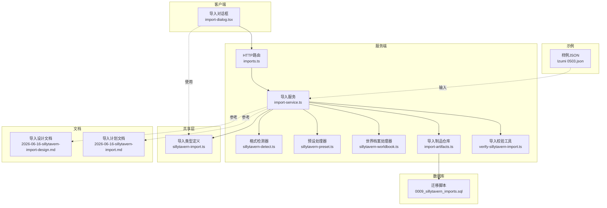
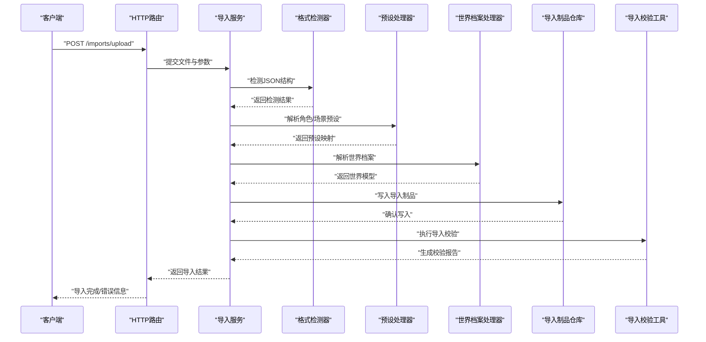
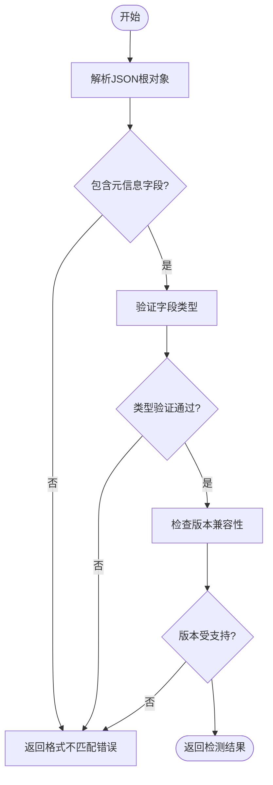
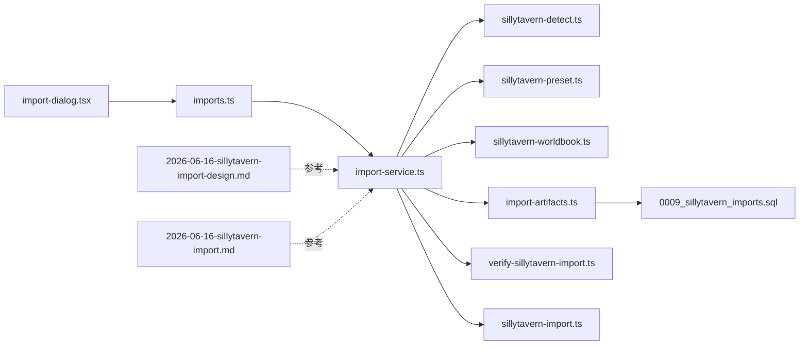

# 导入系统

<cite>
**本文引用的文件**
- [import-service.ts](file://packages/server/src/ai/import/import-service.ts)
- [sillytavern-detect.ts](file://packages/server/src/ai/import/sillytavern-detect.ts)
- [sillytavern-preset.ts](file://packages/server/src/ai/import/sillytavern-preset.ts)
- [sillytavern-worldbook.ts](file://packages/server/src/ai/import/sillytavern-worldbook.ts)
- [imports.ts](file://packages/server/src/http/routes/imports.ts)
- [import-artifacts.ts](file://packages/server/src/db/repositories/import-artifacts.ts)
- [sillytavern-import.ts](file://packages/shared/src/types/sillytavern-import.ts)
- [2026-06-16-sillytavern-import-design.md](file://docs/superpowers/specs/2026-06-16-sillytavern-import-design.md)
- [2026-06-16-sillytavern-import.md](file://docs/superpowers/plans/2026-06-16-sillytavern-import.md)
- [Izumi 0503.json](file://samples/sillytavern/Izumi 0503.json)
- [import-dialog.tsx](file://packages/client/src/components/import/import-dialog.tsx)
- [verify-sillytavern-import.ts](file://packages/server/tools/verify-sillytavern-import.ts)
- [0009_sillytavern_imports.sql](file://packages/server/src/db/migrations/workspace/0009_sillytavern_imports.sql)
</cite>

## 目录
1. [简介](#简介)
2. [项目结构](#项目结构)
3. [核心组件](#核心组件)
4. [架构总览](#架构总览)
5. [详细组件分析](#详细组件分析)
6. [依赖关系分析](#依赖关系分析)
7. [性能考虑](#性能考虑)
8. [故障排除指南](#故障排除指南)
9. [结论](#结论)
10. [附录](#附录)

## 简介
本文件面向Scribe的Silently Tavern（SillyTavern）兼容性导入系统，提供从设计原理到实现细节的完整技术文档。内容涵盖JSON格式解析、数据映射与字段转换、导入流程各阶段（文件上传、格式验证、数据清洗、关系建立、冲突解决）、错误处理与回滚策略、用户反馈机制，并通过实际示例展示如何将SillyTavern项目转换为Scribe格式。同时给出导入配置选项、性能优化建议与常见问题解决方案。

## 项目结构
导入系统主要分布在以下模块中：
- 服务端核心：导入服务、检测器、预设处理器、世界档案处理器、HTTP路由、数据库仓库、迁移脚本
- 客户端界面：导入对话框组件
- 共享类型定义：导入相关的数据模型
- 文档规范：导入设计说明与计划文档
- 示例数据：SillyTavern样例JSON文件

**图表来源**
- [import-dialog.tsx:1-200](file://packages/client/src/components/import/import-dialog.tsx#L1-L200)
- [imports.ts:1-200](file://packages/server/src/http/routes/imports.ts#L1-L200)
- [import-service.ts:1-300](file://packages/server/src/ai/import/import-service.ts#L1-L300)
- [sillytavern-detect.ts:1-200](file://packages/server/src/ai/import/sillytavern-detect.ts#L1-L200)
- [sillytavern-preset.ts:1-200](file://packages/server/src/ai/import/sillytavern-preset.ts#L1-L200)
- [sillytavern-worldbook.ts:1-200](file://packages/server/src/ai/import/sillytavern-worldbook.ts#L1-L200)
- [import-artifacts.ts:1-200](file://packages/server/src/db/repositories/import-artifacts.ts#L1-L200)
- [verify-sillytavern-import.ts:1-200](file://packages/server/tools/verify-sillytavern-import.ts#L1-L200)
- [sillytavern-import.ts:1-200](file://packages/shared/src/types/sillytavern-import.ts#L1-L200)
- [0009_sillytavern_imports.sql:1-200](file://packages/server/src/db/migrations/workspace/0009_sillytavern_imports.sql#L1-L200)
- [2026-06-16-sillytavern-import-design.md:1-300](file://docs/superpowers/specs/2026-06-16-sillytavern-import-design.md#L1-L300)
- [2026-06-16-sillytavern-import.md:1-300](file://docs/superpowers/plans/2026-06-16-sillytavern-import.md#L1-L300)
- [Izumi 0503.json:1-200](file://samples/sillytavern/Izumi 0503.json#L1-L200)

**章节来源**
- [import-dialog.tsx:1-200](file://packages/client/src/components/import/import-dialog.tsx#L1-L200)
- [imports.ts:1-200](file://packages/server/src/http/routes/imports.ts#L1-L200)
- [import-service.ts:1-300](file://packages/server/src/ai/import/import-service.ts#L1-L300)
- [sillytavern-detect.ts:1-200](file://packages/server/src/ai/import/sillytavern-detect.ts#L1-L200)
- [sillytavern-preset.ts:1-200](file://packages/server/src/ai/import/sillytavern-preset.ts#L1-L200)
- [sillytavern-worldbook.ts:1-200](file://packages/server/src/ai/import/sillytavern-worldbook.ts#L1-L200)
- [import-artifacts.ts:1-200](file://packages/server/src/db/repositories/import-artifacts.ts#L1-L200)
- [verify-sillytavern-import.ts:1-200](file://packages/server/tools/verify-sillytavern-import.ts#L1-L200)
- [sillytavern-import.ts:1-200](file://packages/shared/src/types/sillytavern-import.ts#L1-L200)
- [0009_sillytavern_imports.sql:1-200](file://packages/server/src/db/migrations/workspace/0009_sillytavern_imports.sql#L1-L200)
- [2026-06-16-sillytavern-import-design.md:1-300](file://docs/superpowers/specs/2026-06-16-sillytavern-import-design.md#L1-L300)
- [2026-06-16-sillytavern-import.md:1-300](file://docs/superpowers/plans/2026-06-16-sillytavern-import.md#L1-L300)
- [Izumi 0503.json:1-200](file://samples/sillytavern/Izumi 0503.json#L1-L200)

## 核心组件
- 导入服务：协调检测、预处理、世界档案处理与制品写入，负责事务控制与错误传播
- 格式检测器：识别并验证SillyTavern JSON结构，提取元信息与版本标识
- 预设处理器：将角色预设、场景设定等映射到Scribe内部实体
- 世界档案处理器：解析世界模型、概念、记忆等知识结构
- HTTP路由：暴露导入接口，接收文件上传与参数
- 数据库仓库：持久化导入制品与中间状态
- 类型定义：统一导入数据结构与约束
- 校验工具：对导入结果进行一致性检查与完整性验证

**章节来源**
- [import-service.ts:1-300](file://packages/server/src/ai/import/import-service.ts#L1-L300)
- [sillytavern-detect.ts:1-200](file://packages/server/src/ai/import/sillytavern-detect.ts#L1-L200)
- [sillytavern-preset.ts:1-200](file://packages/server/src/ai/import/sillytavern-preset.ts#L1-L200)
- [sillytavern-worldbook.ts:1-200](file://packages/server/src/ai/import/sillytavern-worldbook.ts#L1-L200)
- [imports.ts:1-200](file://packages/server/src/http/routes/imports.ts#L1-L200)
- [import-artifacts.ts:1-200](file://packages/server/src/db/repositories/import-artifacts.ts#L1-L200)
- [sillytavern-import.ts:1-200](file://packages/shared/src/types/sillytavern-import.ts#L1-L200)
- [verify-sillytavern-import.ts:1-200](file://packages/server/tools/verify-sillytavern-import.ts#L1-L200)

## 架构总览
导入系统采用分层架构：客户端发起导入请求，HTTP路由接收并调用导入服务；导入服务根据JSON结构选择相应的处理器（检测、预设、世界档案），在事务内执行数据转换与落库；最终通过校验工具输出导入报告与用户反馈。

**图表来源**
- [imports.ts:1-200](file://packages/server/src/http/routes/imports.ts#L1-L200)
- [import-service.ts:1-300](file://packages/server/src/ai/import/import-service.ts#L1-L300)
- [sillytavern-detect.ts:1-200](file://packages/server/src/ai/import/sillytavern-detect.ts#L1-L200)
- [sillytavern-preset.ts:1-200](file://packages/server/src/ai/import/sillytavern-preset.ts#L1-L200)
- [sillytavern-worldbook.ts:1-200](file://packages/server/src/ai/import/sillytavern-worldbook.ts#L1-L200)
- [import-artifacts.ts:1-200](file://packages/server/src/db/repositories/import-artifacts.ts#L1-L200)
- [verify-sillytavern-import.ts:1-200](file://packages/server/tools/verify-sillytavern-import.ts#L1-L200)

## 详细组件分析

### 导入服务（import-service）
职责与流程
- 接收上传文件与导入参数
- 调用格式检测器确定JSON结构与版本
- 分派至预设处理器与世界档案处理器
- 在事务中写入导入制品与中间状态
- 触发校验工具生成报告
- 统一错误处理与用户反馈

关键点
- 事务边界：确保成功或失败时的原子性
- 错误传播：捕获异常并转化为可读的用户消息
- 可扩展性：新增处理器通过服务注册即可接入

**章节来源**
- [import-service.ts:1-300](file://packages/server/src/ai/import/import-service.ts#L1-L300)

### 格式检测器（sillytavern-detect）
职责与流程
- 解析JSON根结构
- 提取元信息（标题、作者、描述、版本）
- 验证必需字段与数据类型
- 识别支持的SillyTavern版本范围

算法流程

**图表来源**
- [sillytavern-detect.ts:1-200](file://packages/server/src/ai/import/sillytavern-detect.ts#L1-L200)

**章节来源**
- [sillytavern-detect.ts:1-200](file://packages/server/src/ai/import/sillytavern-detect.ts#L1-L200)

### 预设处理器（sillytavern-preset）
职责与流程
- 解析角色预设、场景设定等
- 建立与Scribe内部实体的映射关系
- 处理缺失字段与默认值
- 生成预设制品供后续校验

映射规则要点
- 角色名称与描述映射到Scribe人物实体
- 场景设定映射到Scribe场景实体
- 对话历史与记忆片段转换为Scribe连续性记录

**章节来源**
- [sillytavern-preset.ts:1-200](file://packages/server/src/ai/import/sillytavern-preset.ts#L1-L200)

### 世界档案处理器（sillytavern-worldbook）
职责与流程
- 解析世界模型、概念、记忆等知识结构
- 建立层级关系与依赖引用
- 清洗冗余与重复条目
- 生成世界档案制品

处理策略
- 概念去重与规范化
- 记忆片段索引与关联
- 层级结构校验与修复

**章节来源**
- [sillytavern-worldbook.ts:1-200](file://packages/server/src/ai/import/sillytavern-worldbook.ts#L1-L200)

### HTTP路由（imports）
职责与流程
- 接收multipart/form-data上传
- 参数校验与文件流处理
- 调用导入服务并返回结果
- 错误响应与状态码标准化

接口要点
- 支持文件上传与可选配置参数
- 返回导入任务ID与进度查询接口

**章节来源**
- [imports.ts:1-200](file://packages/server/src/http/routes/imports.ts#L1-L200)

### 导入制品仓库（import-artifacts）
职责与流程
- 持久化导入制品与中间状态
- 提供查询、更新与回滚能力
- 与数据库迁移脚本配合维护结构

数据模型要点
- 导入任务元数据
- 处理阶段状态
- 错误日志与回滚点

**章节来源**
- [import-artifacts.ts:1-200](file://packages/server/src/db/repositories/import-artifacts.ts#L1-L200)
- [0009_sillytavern_imports.sql:1-200](file://packages/server/src/db/migrations/workspace/0009_sillytavern_imports.sql#L1-L200)

### 导入类型定义（sillytavern-import）
职责与流程
- 定义导入JSON的数据结构
- 规定字段约束与可选性
- 作为前后端契约保障数据一致性

类型覆盖
- 元信息结构
- 预设与世界档案结构
- 冲突与回滚策略的类型化表达

**章节来源**
- [sillytavern-import.ts:1-200](file://packages/shared/src/types/sillytavern-import.ts#L1-L200)

### 导入校验工具（verify-sillytavern-import）
职责与流程
- 执行导入后的一致性检查
- 生成校验报告与建议
- 标识潜在冲突与修复项

校验维度
- 结构完整性
- 关系一致性
- 性能与规模合理性

**章节来源**
- [verify-sillytavern-import.ts:1-200](file://packages/server/tools/verify-sillytavern-import.ts#L1-L200)

### 导入对话框（import-dialog）
职责与流程
- 提供用户友好的导入界面
- 支持文件选择与参数配置
- 显示导入进度与结果反馈

交互要点
- 文件拖拽与批量选择
- 实时进度条与错误提示
- 成功后的跳转与引导

**章节来源**
- [import-dialog.tsx:1-200](file://packages/client/src/components/import/import-dialog.tsx#L1-L200)

## 依赖关系分析
导入系统内部依赖清晰，模块间通过明确的接口耦合，避免循环依赖。客户端仅依赖共享类型与HTTP路由；服务端通过导入服务聚合各处理器与仓库；数据库通过迁移脚本管理结构演进。

**图表来源**
- [import-dialog.tsx:1-200](file://packages/client/src/components/import/import-dialog.tsx#L1-L200)
- [imports.ts:1-200](file://packages/server/src/http/routes/imports.ts#L1-L200)
- [import-service.ts:1-300](file://packages/server/src/ai/import/import-service.ts#L1-L300)
- [sillytavern-detect.ts:1-200](file://packages/server/src/ai/import/sillytavern-detect.ts#L1-L200)
- [sillytavern-preset.ts:1-200](file://packages/server/src/ai/import/sillytavern-preset.ts#L1-L200)
- [sillytavern-worldbook.ts:1-200](file://packages/server/src/ai/import/sillytavern-worldbook.ts#L1-L200)
- [import-artifacts.ts:1-200](file://packages/server/src/db/repositories/import-artifacts.ts#L1-L200)
- [verify-sillytavern-import.ts:1-200](file://packages/server/tools/verify-sillytavern-import.ts#L1-L200)
- [sillytavern-import.ts:1-200](file://packages/shared/src/types/sillytavern-import.ts#L1-L200)
- [0009_sillytavern_imports.sql:1-200](file://packages/server/src/db/migrations/workspace/0009_sillytavern_imports.sql#L1-L200)
- [2026-06-16-sillytavern-import-design.md:1-300](file://docs/superpowers/specs/2026-06-16-sillytavern-import-design.md#L1-L300)
- [2026-06-16-sillytavern-import.md:1-300](file://docs/superpowers/plans/2026-06-16-sillytavern-import.md#L1-L300)

**章节来源**
- [import-service.ts:1-300](file://packages/server/src/ai/import/import-service.ts#L1-L300)
- [imports.ts:1-200](file://packages/server/src/http/routes/imports.ts#L1-L200)
- [import-artifacts.ts:1-200](file://packages/server/src/db/repositories/import-artifacts.ts#L1-L200)
- [sillytavern-import.ts:1-200](file://packages/shared/src/types/sillytavern-import.ts#L1-L200)
- [0009_sillytavern_imports.sql:1-200](file://packages/server/src/db/migrations/workspace/0009_sillytavern_imports.sql#L1-L200)

## 性能考虑
- 流式处理：对大文件采用流式解析，避免一次性加载到内存
- 并行化：预设与世界档案处理可并行执行以缩短总时长
- 缓存策略：对重复的外部引用进行缓存，减少重复计算
- 分页写入：批量写入数据库，降低事务开销
- 压缩传输：启用Gzip压缩上传文件以减少网络延迟
- 进度上报：实时上报处理进度，提升用户体验

## 故障排除指南
常见问题与解决方案
- JSON格式不匹配
  - 现象：导入失败并提示格式错误
  - 排查：检查根对象是否包含必需元信息字段
  - 处理：修正JSON结构或使用官方导出模板
- 版本不受支持
  - 现象：提示版本过旧或过新
  - 排查：核对版本号与支持列表
  - 处理：升级SillyTavern或使用兼容版本
- 字段类型错误
  - 现象：特定字段类型校验失败
  - 排查：检查字段类型与必填性
  - 处理：按类型要求修正数据
- 导入冲突
  - 现象：同名实体冲突
  - 排查：查看冲突报告与回滚点
  - 处理：选择保留策略或手动合并
- 数据库写入失败
  - 现象：事务回滚
  - 排查：检查数据库连接与权限
  - 处理：修复连接后重试

回滚策略
- 原子事务：失败时自动回滚所有变更
- 回滚点：保存中间状态以便快速恢复
- 用户反馈：提供回滚后的清理建议与重试入口

**章节来源**
- [import-service.ts:1-300](file://packages/server/src/ai/import/import-service.ts#L1-L300)
- [import-artifacts.ts:1-200](file://packages/server/src/db/repositories/import-artifacts.ts#L1-L200)
- [verify-sillytavern-import.ts:1-200](file://packages/server/tools/verify-sillytavern-import.ts#L1-L200)

## 结论
Scribe的导入系统通过模块化设计实现了对SillyTavern JSON的高兼容性转换。服务端以导入服务为核心，串联检测、预设与世界档案处理，并通过仓库与校验工具保证数据质量与一致性。客户端提供直观的导入体验。整体方案具备良好的扩展性、健壮性与可维护性，能够满足从个人项目到复杂世界构建的导入需求。

## 附录

### 导入流程阶段详解
- 文件上传
  - 客户端通过导入对话框选择文件
  - HTTP路由接收multipart请求并转发给导入服务
- 格式验证
  - 格式检测器解析JSON并验证结构与版本
- 数据清洗
  - 预设处理器与世界档案处理器分别清洗与规范化数据
- 关系建立
  - 建立实体间的引用关系与层级结构
- 冲突解决
  - 通过校验工具识别冲突并提供回滚与合并建议

**章节来源**
- [imports.ts:1-200](file://packages/server/src/http/routes/imports.ts#L1-L200)
- [import-service.ts:1-300](file://packages/server/src/ai/import/import-service.ts#L1-L300)
- [sillytavern-detect.ts:1-200](file://packages/server/src/ai/import/sillytavern-detect.ts#L1-L200)
- [sillytavern-preset.ts:1-200](file://packages/server/src/ai/import/sillytavern-preset.ts#L1-L200)
- [sillytavern-worldbook.ts:1-200](file://packages/server/src/ai/import/sillytavern-worldbook.ts#L1-L200)
- [verify-sillytavern-import.ts:1-200](file://packages/server/tools/verify-sillytavern-import.ts#L1-L200)

### 导入配置选项
- 文件选择：支持单个或多个JSON文件
- 跳过冲突：允许自动跳过同名实体
- 合并模式：提供保留新/旧或手动合并选项
- 输出格式：可选择生成报告与制品清单

**章节来源**
- [import-dialog.tsx:1-200](file://packages/client/src/components/import/import-dialog.tsx#L1-L200)
- [imports.ts:1-200](file://packages/server/src/http/routes/imports.ts#L1-L200)
- [sillytavern-import.ts:1-200](file://packages/shared/src/types/sillytavern-import.ts#L1-L200)

### 导入示例：将SillyTavern项目转换为Scribe格式
步骤概览
- 准备SillyTavern导出的JSON文件
- 在导入对话框中选择文件并配置选项
- 提交导入任务，等待进度完成
- 查看校验报告并处理冲突
- 使用生成的制品继续创作

参考文件
- 样例JSON：[Izumi 0503.json:1-200](file://samples/sillytavern/Izumi 0503.json#L1-L200)
- 设计文档：[2026-06-16-sillytavern-import-design.md:1-300](file://docs/superpowers/specs/2026-06-16-sillytavern-import-design.md#L1-L300)
- 计划文档：[2026-06-16-sillytavern-import.md:1-300](file://docs/superpowers/plans/2026-06-16-sillytavern-import.md#L1-L300)

**章节来源**
- [Izumi 0503.json:1-200](file://samples/sillytavern/Izumi 0503.json#L1-L200)
- [2026-06-16-sillytavern-import-design.md:1-300](file://docs/superpowers/specs/2026-06-16-sillytavern-import-design.md#L1-L300)
- [2026-06-16-sillytavern-import.md:1-300](file://docs/superpowers/plans/2026-06-16-sillytavern-import.md#L1-L300)