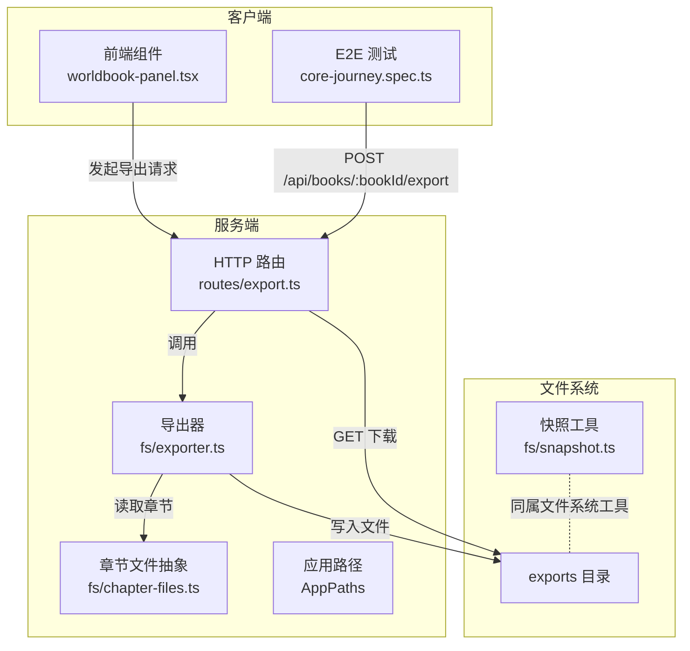
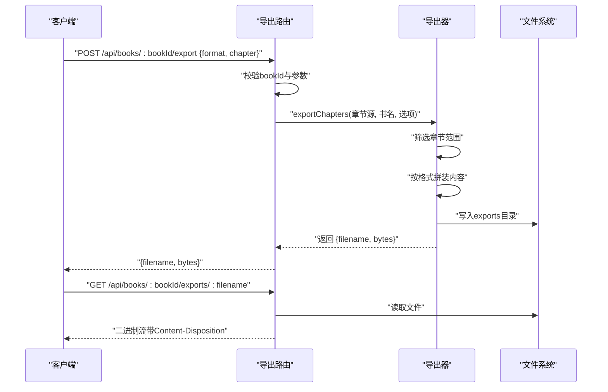
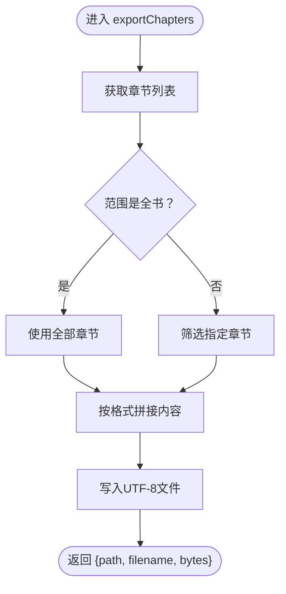
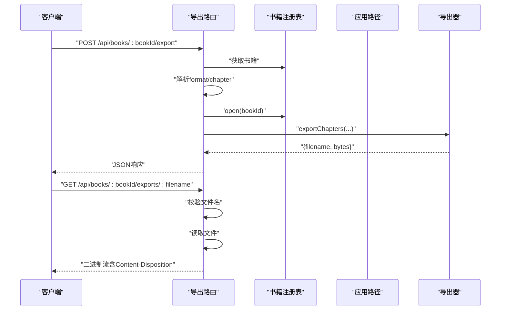
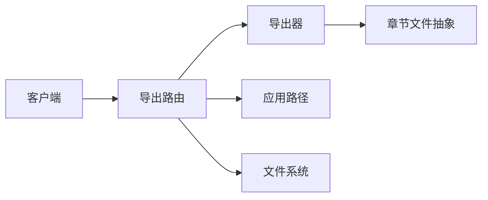

# 导出系统

<cite>
**本文引用的文件**
- [packages/server/src/fs/exporter.ts](file://packages/server/src/fs/exporter.ts)
- [packages/server/src/http/routes/export.ts](file://packages/server/src/http/routes/export.ts)
- [packages/server/src/fs/chapter-files.ts](file://packages/server/src/fs/chapter-files.ts)
- [packages/server/src/fs/snapshot.ts](file://packages/server/src/fs/snapshot.ts)
- [e2e/tests/core-journey.spec.ts](file://e2e/tests/core-journey.spec.ts)
- [packages/client/src/components/worldbook/worldbook-panel.tsx](file://packages/client/src/components/worldbook/worldbook-panel.tsx)
</cite>

## 目录
1. [简介](#简介)
2. [项目结构](#项目结构)
3. [核心组件](#核心组件)
4. [架构总览](#架构总览)
5. [详细组件分析](#详细组件分析)
6. [依赖关系分析](#依赖关系分析)
7. [性能考虑](#性能考虑)
8. [故障排查指南](#故障排查指南)
9. [结论](#结论)
10. [附录](#附录)

## 简介
本文件面向Scribe的导出系统，聚焦“章节内容导出”能力，涵盖数据序列化、文件格式选择、输出组织结构、数据转换与清理、以及HTTP接口与客户端集成方式。当前实现支持文本（txt）与Markdown（md）两种格式，按整书或指定章节导出，并通过本地文件系统进行落盘与下载。

## 项目结构
导出系统主要由以下模块构成：
- HTTP路由层：负责接收导出请求、参数校验与响应返回
- 导出逻辑层：负责章节数据收集、格式化与写入
- 文件系统抽象：提供章节文件访问接口
- 快照工具：提供基于tar.gz的备份/归档能力（与导出同属文件系统范畴）

图表来源
- [packages/server/src/http/routes/export.ts:13-59](file://packages/server/src/http/routes/export.ts#L13-L59)
- [packages/server/src/fs/exporter.ts:29-56](file://packages/server/src/fs/exporter.ts#L29-L56)
- [packages/server/src/fs/chapter-files.ts](file://packages/server/src/fs/chapter-files.ts)
- [packages/server/src/fs/snapshot.ts:74-129](file://packages/server/src/fs/snapshot.ts#L74-L129)

章节来源
- [packages/server/src/http/routes/export.ts:1-60](file://packages/server/src/http/routes/export.ts#L1-L60)
- [packages/server/src/fs/exporter.ts:1-57](file://packages/server/src/fs/exporter.ts#L1-L57)

## 核心组件
- 导出器（exporter）
  - 功能：根据范围筛选章节，按选定格式拼装内容，写入exports目录
  - 关键点：支持“全书”和“单章”两种范围；md格式保留标题层级，txt格式通过简易去Markdown处理
- HTTP路由（export routes）
  - 功能：提供POST导出触发与GET下载接口；对文件名进行安全校验
- 章节文件抽象（chapter-files）
  - 功能：为导出器提供统一的章节列表访问接口
- 快照工具（snapshot）
  - 功能：提供基于tar.gz的打包、列举、恢复与裁剪能力（与导出共享文件系统理念）

章节来源
- [packages/server/src/fs/exporter.ts:10-13](file://packages/server/src/fs/exporter.ts#L10-L13)
- [packages/server/src/fs/exporter.ts:29-56](file://packages/server/src/fs/exporter.ts#L29-L56)
- [packages/server/src/http/routes/export.ts:16-36](file://packages/server/src/http/routes/export.ts#L16-L36)
- [packages/server/src/fs/chapter-files.ts](file://packages/server/src/fs/chapter-files.ts)
- [packages/server/src/fs/snapshot.ts:74-129](file://packages/server/src/fs/snapshot.ts#L74-L129)

## 架构总览
下图展示从客户端到服务端的导出流程，包括参数解析、章节读取、内容写入与文件下载。

图表来源
- [packages/server/src/http/routes/export.ts:16-56](file://packages/server/src/http/routes/export.ts#L16-L56)
- [packages/server/src/fs/exporter.ts:29-56](file://packages/server/src/fs/exporter.ts#L29-L56)

## 详细组件分析

### 组件A：导出器（exportChapters）
- 输入
  - 章节数据源：实现ChapterFilesLike接口的对象
  - 输出目录：exportsDir
  - 书籍标题：用于生成文件名
  - 导出选项：format（txt/md）、range（all/指定章节）
- 处理逻辑
  - 获取章节列表并按范围过滤
  - 按格式拼接标题与各章节内容
  - 写入UTF-8文本文件
- 输出
  - 返回文件路径、文件名与字节数

图表来源
- [packages/server/src/fs/exporter.ts:29-56](file://packages/server/src/fs/exporter.ts#L29-L56)

章节来源
- [packages/server/src/fs/exporter.ts:4-6](file://packages/server/src/fs/exporter.ts#L4-L6)
- [packages/server/src/fs/exporter.ts:8-13](file://packages/server/src/fs/exporter.ts#L8-L13)
- [packages/server/src/fs/exporter.ts:29-56](file://packages/server/src/fs/exporter.ts#L29-L56)

### 组件B：HTTP导出路由
- POST /api/books/:bookId/export
  - 参数：format（txt/md）、chapter（数字）
  - 行为：打开书籍、调用导出器、返回文件信息
- GET /api/books/:bookId/exports/:filename
  - 行为：安全校验文件名、读取文件并以附件形式返回

图表来源
- [packages/server/src/http/routes/export.ts:16-56](file://packages/server/src/http/routes/export.ts#L16-L56)

章节来源
- [packages/server/src/http/routes/export.ts:16-36](file://packages/server/src/http/routes/export.ts#L16-L36)
- [packages/server/src/http/routes/export.ts:39-56](file://packages/server/src/http/routes/export.ts#L39-L56)

### 组件C：章节文件抽象（ChapterFilesLike）
- 角色：为导出器提供统一的章节列表访问接口
- 作用：屏蔽底层存储细节，便于替换实现（如数据库或文件系统）

章节来源
- [packages/server/src/fs/exporter.ts:4-6](file://packages/server/src/fs/exporter.ts#L4-L6)
- [packages/server/src/fs/chapter-files.ts](file://packages/server/src/fs/chapter-files.ts)

### 组件D：快照工具（tar.gz）
- 虽非直接导出，但与导出共享文件系统与打包理念
- 提供创建、列举、恢复与裁剪快照的能力

章节来源
- [packages/server/src/fs/snapshot.ts:74-129](file://packages/server/src/fs/snapshot.ts#L74-L129)

### 客户端集成与示例
- E2E测试展示了导出API的典型用法：POST触发导出，随后GET下载
- 世界书面板涉及与SillyTavern元数据的转换，间接体现导出前的数据准备阶段

章节来源
- [e2e/tests/core-journey.spec.ts:40-42](file://e2e/tests/core-journey.spec.ts#L40-L42)
- [packages/client/src/components/worldbook/worldbook-panel.tsx:58-96](file://packages/client/src/components/worldbook/worldbook-panel.tsx#L58-L96)

## 依赖关系分析
- 导出路由依赖导出器与应用路径
- 导出器依赖章节文件抽象与文件系统
- 客户端通过HTTP与服务端交互

图表来源
- [packages/server/src/http/routes/export.ts:13-59](file://packages/server/src/http/routes/export.ts#L13-L59)
- [packages/server/src/fs/exporter.ts:29-56](file://packages/server/src/fs/exporter.ts#L29-L56)

章节来源
- [packages/server/src/http/routes/export.ts:1-60](file://packages/server/src/http/routes/export.ts#L1-L60)
- [packages/server/src/fs/exporter.ts:1-57](file://packages/server/src/fs/exporter.ts#L1-L57)

## 性能考虑
- 内存占用
  - 当前实现采用字符串缓冲拼接，适合中等规模书籍；大规模书籍可能产生较高内存峰值
- I/O策略
  - 单次写入文件，避免频繁I/O
- 压缩与打包
  - 当前未内置压缩或打包；如需ZIP等格式，可在导出器扩展
- 并发与批处理
  - 未见并发导出或分片处理逻辑；建议在需要时引入队列与分块写入

## 故障排查指南
- “没有可导出的章节”
  - 可能原因：指定章节号不存在或范围过滤后为空
  - 建议：检查章节列表与范围参数
- “书不存在”
  - 可能原因：bookId无效
  - 建议：确认书籍存在且ID正确
- “文件名无效”
  - 可能原因：包含非法字符或路径遍历
  - 建议：确保文件名仅包含允许字符
- “文件不存在”
  - 可能原因：导出尚未完成或路径不匹配
  - 建议：先执行导出请求，再下载

章节来源
- [packages/server/src/fs/exporter.ts:38-38](file://packages/server/src/fs/exporter.ts#L38-L38)
- [packages/server/src/http/routes/export.ts:19-19](file://packages/server/src/http/routes/export.ts#L19-L19)
- [packages/server/src/http/routes/export.ts:44-44](file://packages/server/src/http/routes/export.ts#L44-L44)
- [packages/server/src/http/routes/export.ts:48-48](file://packages/server/src/http/routes/export.ts#L48-L48)

## 结论
Scribe的导出系统以简洁清晰为核心：HTTP路由负责请求接入与安全校验，导出器专注内容拼装与落盘，章节文件抽象提供稳定的访问接口。当前实现满足基础的txt/md导出需求，具备良好的可扩展性，可用于后续引入多格式、压缩与批量/增量导出等高级特性。

## 附录

### 支持的导出格式与特点
- txt
  - 特点：纯文本，去除Markdown标记，适合阅读与通用编辑器
  - 适用场景：快速审阅、批量处理
- md
  - 特点：保留标题层级，便于结构化阅读
  - 适用场景：知识整理、文档归档

章节来源
- [packages/server/src/fs/exporter.ts:10-13](file://packages/server/src/fs/exporter.ts#L10-L13)
- [packages/server/src/fs/exporter.ts:15-23](file://packages/server/src/fs/exporter.ts#L15-L23)

### 导出配置选项
- format：txt 或 md
- range：all 或 { chapter: N }

章节来源
- [packages/server/src/fs/exporter.ts:8-13](file://packages/server/src/fs/exporter.ts#L8-L13)
- [packages/server/src/http/routes/export.ts:20-24](file://packages/server/src/http/routes/export.ts#L20-L24)

### 批量导出与增量导出
- 批量导出：通过“全书”范围实现
- 增量导出：通过指定章节号实现
- 扩展建议：引入时间窗口、状态变更等条件，结合章节元数据实现更细粒度的增量

章节来源
- [packages/server/src/fs/exporter.ts:35-37](file://packages/server/src/fs/exporter.ts#L35-L37)
- [packages/server/src/http/routes/export.ts:22-24](file://packages/server/src/http/routes/export.ts#L22-L24)

### 导出API使用示例与最佳实践
- 示例（E2E）
  - POST /api/books/{id}/export：传入 { format, chapter? }
  - GET /api/books/{id}/exports/{filename}：下载导出文件
- 最佳实践
  - 先POST触发导出，再GET下载，避免竞态
  - 对外部输入进行严格校验（已在路由层实现）
  - 大文件导出建议评估内存与磁盘空间

章节来源
- [e2e/tests/core-journey.spec.ts:40-42](file://e2e/tests/core-journey.spec.ts#L40-L42)
- [packages/server/src/http/routes/export.ts:16-56](file://packages/server/src/http/routes/export.ts#L16-L56)

### 错误恢复策略
- 参数异常：返回400并携带错误信息
- 资源缺失：返回404并提示不存在
- 建议增强：在导出过程中增加重试与回滚、记录日志与告警

章节来源
- [packages/server/src/http/routes/export.ts:33-35](file://packages/server/src/http/routes/export.ts#L33-L35)
- [packages/server/src/http/routes/export.ts:47-48](file://packages/server/src/http/routes/export.ts#L47-L48)