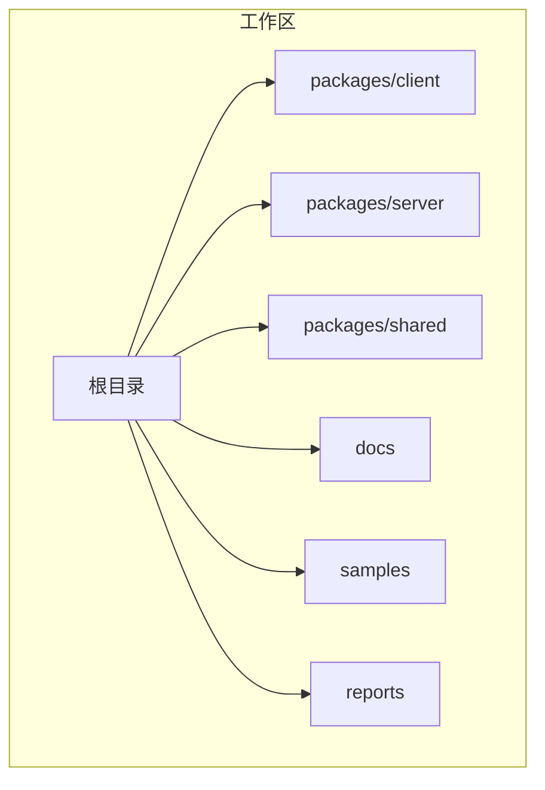
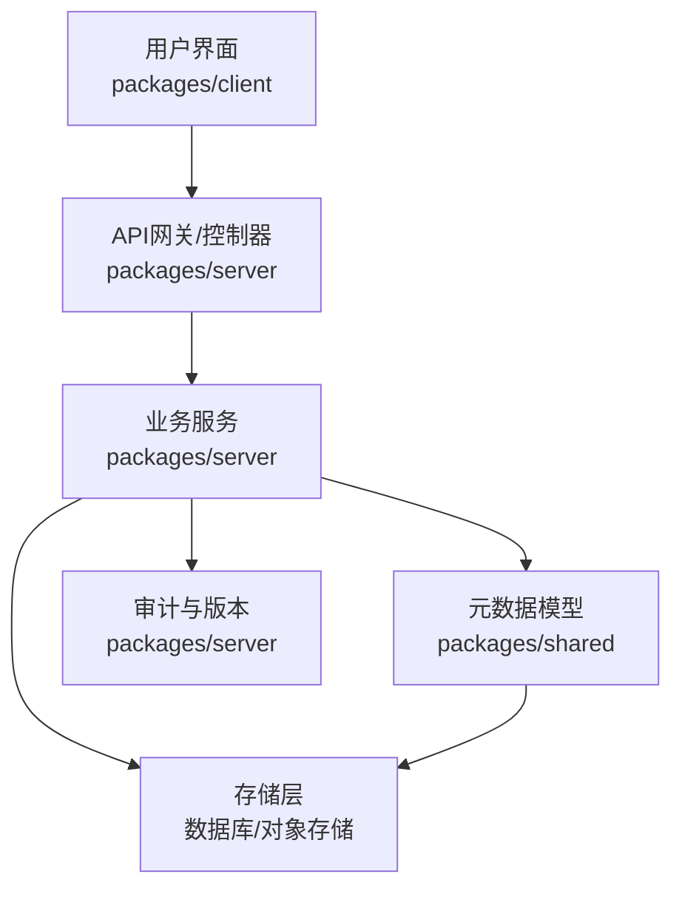
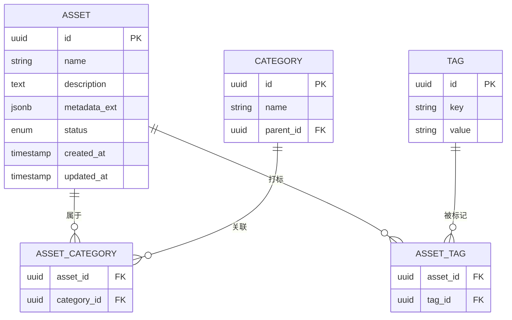
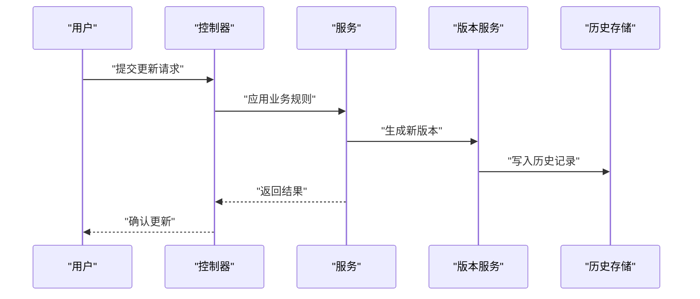
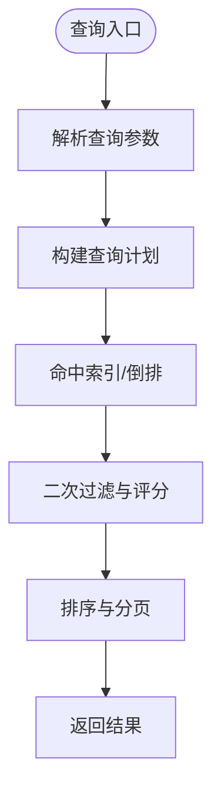
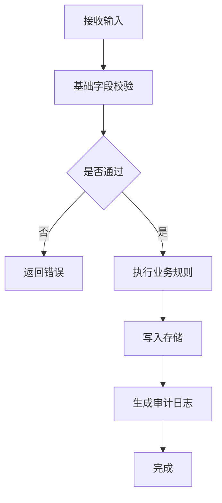
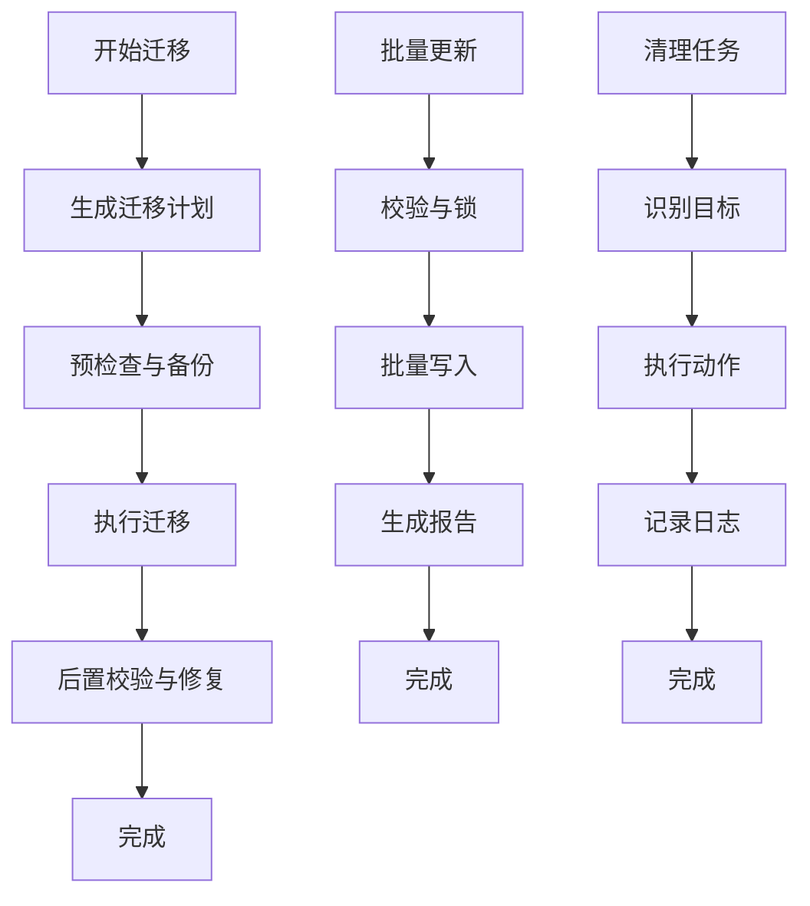
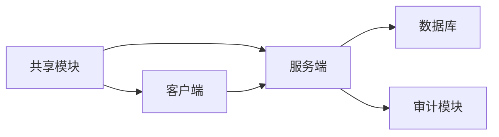

# 资产元数据

<cite>
**本文档引用的文件**
- [README.md](file://README.md)
- [docs/_implementation-notes.md](file://docs/_implementation-notes.md)
- [docs/superpowers/plans/2026-06-15-generic-record-architecture.md](file://docs/superpowers/plans/2026-06-15-generic-record-architecture.md)
- [docs/superpowers/specs/2026-06-16-sillytavern-import-design.md](file://docs/superpowers/specs/2026-06-16-sillytavern-import-design.md)
- [samples/sillytavern/Izumi 0503.json](file://samples/sillytavern/Izumi 0503.json)
- [docs/superpowers/plans/2026-06-17-scribe-final-roadmap.md](file://docs/superpowers/plans/2026-06-17-scribe-final-roadmap.md)
</cite>

## 目录
1. [简介](#简介)
2. [项目结构](#项目结构)
3. [核心组件](#核心组件)
4. [架构总览](#架构总览)
5. [详细组件分析](#详细组件分析)
6. [依赖分析](#依赖分析)
7. [性能考虑](#性能考虑)
8. [故障排除指南](#故障排除指南)
9. [结论](#结论)
10. [附录](#附录)

## 简介
本文件面向Scribe的资产元数据系统，基于仓库中的规划与设计文档进行技术梳理，聚焦于数据模型设计、版本控制与变更追踪、索引与查询、验证与一致性、最佳实践以及迁移与维护策略。由于当前仓库未包含后端代码实现细节，本文以现有规划文档为依据，构建可落地的设计蓝图，并给出与代码实现对接的指导。

## 项目结构
Scribe采用多包工作区组织，资产元数据相关能力将主要由服务端与共享模块承载，客户端负责交互与展示。规划文档中明确了通用记录架构与导入设计，为元数据系统的演进提供了方向性支撑。

**章节来源**
- [README.md](file://README.md)
- [docs/_implementation-notes.md](file://docs/_implementation-notes.md)

## 核心组件
围绕资产元数据系统，建议的核心组件如下（基于规划文档的架构意图）：

- 元数据模型层：定义资产的基础属性、扩展字段与关系，确保可扩展性与一致性。
- 版本与审计层：实现版本控制、变更追踪与历史记录，支持回溯与合规。
- 索引与检索层：建立高效索引策略与查询接口，满足多维检索需求。
- 验证与约束层：制定校验规则与约束条件，保障数据质量与一致性。
- 迁移与运维层：提供迁移脚本、批量更新与清理策略，确保系统可持续演进。

**章节来源**
- [docs/superpowers/plans/2026-06-15-generic-record-architecture.md](file://docs/superpowers/plans/2026-06-15-generic-record-architecture.md)
- [docs/superpowers/specs/2026-06-16-sillytavern-import-design.md](file://docs/superpowers/specs/2026-06-16-sillytavern-import-design.md)

## 架构总览
资产元数据系统建议采用分层架构：数据模型层、服务层、持久化层与展示层。通过通用记录架构抽象，统一不同来源的资产元数据；通过导入设计规范，确保外部数据（如示例文件）能够被标准化接入。

## 详细组件分析

### 数据模型设计
- 基础属性：标识符、名称、描述、创建时间、修改时间、状态等。
- 扩展字段：预留键值对扩展区域，支持动态字段与自定义标签。
- 关系定义：资产间的关系（如依赖、派生、归档）通过关系表或图模型表达。
- 分类与标签：建立分类树与标签体系，支持多级分类与标签组合查询。

**章节来源**
- [docs/superpowers/plans/2026-06-15-generic-record-architecture.md](file://docs/superpowers/plans/2026-06-15-generic-record-architecture.md)

### 版本控制与变更追踪
- 版本控制：为每个资产生成版本号，支持快照式保存与增量变更记录。
- 变更追踪：记录操作者、时间戳、字段变更详情，支持差异对比。
- 历史记录：保留完整历史，支持回滚到任意版本，满足审计与合规要求。

**章节来源**
- [docs/superpowers/plans/2026-06-15-generic-record-architecture.md](file://docs/superpowers/plans/2026-06-15-generic-record-architecture.md)

### 索引策略与查询接口
- 索引策略：对常用查询字段（名称、分类、标签、状态、时间范围）建立复合索引与倒排索引。
- 查询接口：提供结构化查询语言与过滤器组合，支持分页、排序与聚合统计。
- 搜索优化：结合全文检索与向量检索，提升跨文本与语义检索效率。

**章节来源**
- [docs/superpowers/specs/2026-06-16-sillytavern-import-design.md](file://docs/superpowers/specs/2026-06-16-sillytavern-import-design.md)

### 验证规则与一致性保证
- 验证规则：必填字段校验、格式校验、长度限制、枚举值约束。
- 一致性保证：事务性写入、幂等性设计、冲突检测与自动合并策略。
- 外部数据校验：导入时执行Schema校验与冲突检测，失败回滚并输出诊断报告。

**章节来源**
- [docs/superpowers/specs/2026-06-16-sillytavern-import-design.md](file://docs/superpowers/specs/2026-06-16-sillytavern-import-design.md)

### 最佳实践
- 命名约定：统一大小写、使用下划线分隔、避免保留字。
- 分类标准：建立清晰的分类层级与命名规范，避免歧义。
- 标签系统：采用键值对形式，限定键集合与值枚举，便于检索与统计。
- 版本管理：强制版本号递增，保留关键变更摘要，定期归档旧版本。

**章节来源**
- [docs/superpowers/plans/2026-06-15-generic-record-architecture.md](file://docs/superpowers/plans/2026-06-15-generic-record-architecture.md)

### 迁移、批量更新与清理策略
- 迁移策略：版本化迁移脚本，支持向前/向后兼容，带预检查与回滚。
- 批量更新：基于事务的批量写入，支持断点续传与进度跟踪。
- 清理策略：基于生命周期的自动清理（软删除、归档、物理删除），配合回收站与审计日志。

**章节来源**
- [docs/superpowers/plans/2026-06-15-generic-record-architecture.md](file://docs/superpowers/plans/2026-06-15-generic-record-architecture.md)

## 依赖分析
- 组件耦合：模型层与服务层低耦合，通过共享模块解耦UI与业务逻辑。
- 外部依赖：导入设计文档中提及的外部数据源（如示例文件）需纳入依赖管理与版本控制。
- 循环依赖：避免模型与服务间的循环引用，采用单向依赖与接口隔离。

**章节来源**
- [docs/superpowers/specs/2026-06-16-sillytavern-import-design.md](file://docs/superpowers/specs/2026-06-16-sillytavern-import-design.md)

## 性能考虑
- 写入性能：批量写入、异步处理、背压控制。
- 查询性能：合理索引、缓存热点数据、延迟物化视图。
- 存储成本：压缩存储、冷热分层、定期归档。

## 故障排除指南
- 导入失败：检查Schema一致性、字段映射与唯一性约束，查看审计日志定位问题。
- 查询异常：核对索引状态、查询计划与权限配置。
- 版本冲突：启用幂等更新与冲突检测，必要时回滚到稳定版本。

**章节来源**
- [docs/superpowers/specs/2026-06-16-sillytavern-import-design.md](file://docs/superpowers/specs/2026-06-16-sillytavern-import-design.md)

## 结论
资产元数据系统应以通用记录架构为基础，结合版本控制、索引优化与严格验证，形成可扩展、可审计、高性能的元数据管理体系。通过导入设计规范与迁移策略，确保外部数据与内部流程的无缝衔接，支撑Scribe的长期演进目标。

## 附录
- 示例数据参考：示例文件展示了外部数据的典型结构，可用于导入测试与Schema验证。
  
**章节来源**
- [samples/sillytavern/Izumi 0503.json](file://samples/sillytavern/Izumi 0503.json)
- [docs/superpowers/plans/2026-06-17-scribe-final-roadmap.md](file://docs/superpowers/plans/2026-06-17-scribe-final-roadmap.md)