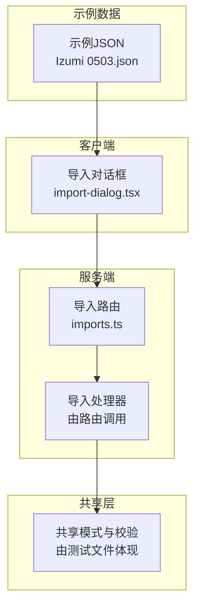
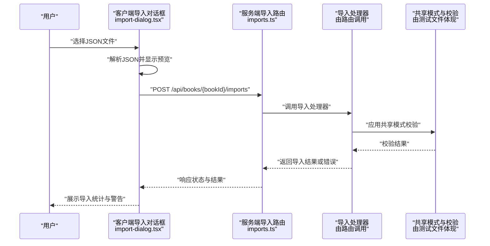
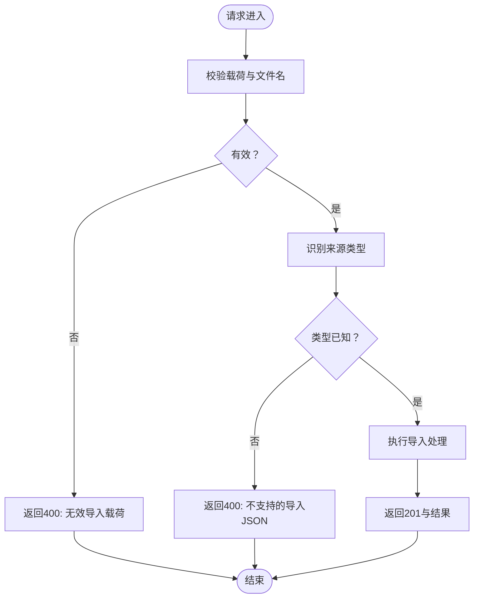
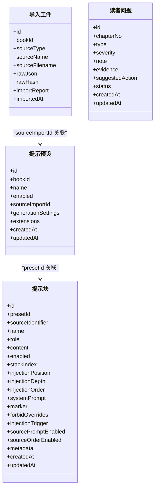
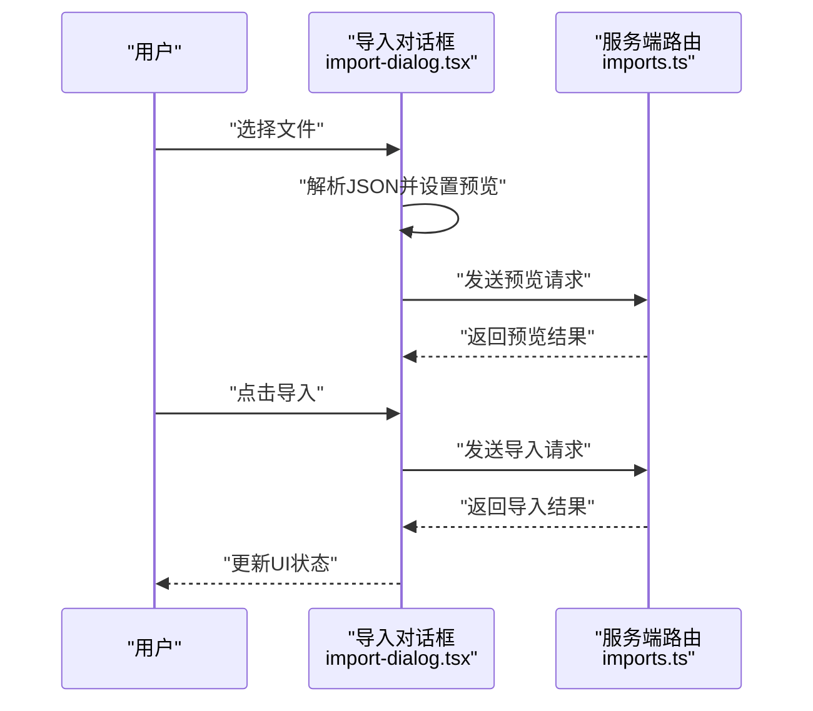
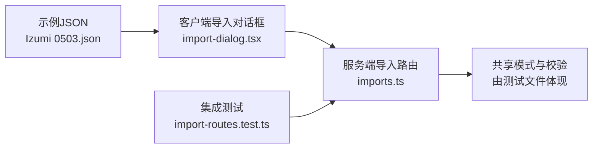

# 资产管理

<cite>
**本文引用的文件**
- [2026-06-16-sillytavern-import-design.md](file://docs/superpowers/specs/2026-06-16-sillytavern-import-design.md)
- [2026-06-16-sillytavern-import.md](file://docs/superpowers/plans/2026-06-16-sillytavern-import.md)
- [2026-06-16-sillytavern-full-compatibility.md](file://docs/superpowers/plans/2026-06-16-sillytavern-full-compatibility.md)
- [imports.ts](file://packages/server/src/http/routes/imports.ts)
- [import-dialog.tsx](file://packages/client/src/components/import/import-dialog.tsx)
- [import-routes.test.ts](file://packages/server/tests/integration/import-routes.test.ts)
- [sillytavern-import.test.ts](file://packages/shared/tests/sillytavern-import.test.ts)
- [Izumi 0503.json](file://samples/sillytavern/Izumi 0503.json)
</cite>

## 目录
1. [简介](#简介)
2. [项目结构](#项目结构)
3. [核心组件](#核心组件)
4. [架构总览](#架构总览)
5. [详细组件分析](#详细组件分析)
6. [依赖分析](#依赖分析)
7. [性能考虑](#性能考虑)
8. [故障排除指南](#故障排除指南)
9. [结论](#结论)
10. [附录](#附录)

## 简介
本文件面向Scribe的资产管理能力，重点覆盖Silently Tavern兼容性导入系统与项目包导出功能。文档从设计到实现逐层展开，涵盖格式转换、数据映射、错误恢复、API接口、配置选项与安全考量，并提供迁移指南、扩展开发与故障排除方法。为确保可追溯性，所有技术细节均对应仓库中的具体文件与行号。

## 项目结构
资产管理相关的关键位置与职责如下：
- 文档与规格：位于docs目录，包含导入设计规范、全兼容规划与路线图等
- 服务端路由：packages/server/src/http/routes/imports.ts提供导入接口
- 客户端导入对话框：packages/client/src/components/import/import-dialog.tsx负责用户交互与预览
- 集成测试：packages/server/tests/integration/import-routes.test.ts验证导入流程
- 共享测试：packages/shared/tests/sillytavern-import.test.ts验证共享模式与校验
- 示例数据：samples/sillytavern/Izumi 0503.json用于演示导入

图表来源
- [imports.ts:39-65](file://packages/server/src/http/routes/imports.ts#L39-L65)
- [import-dialog.tsx:2330-2387](file://packages/client/src/components/import/import-dialog.tsx#L2330-L2387)
- [sillytavern-import.test.ts:71-144](file://packages/shared/tests/sillytavern-import.test.ts#L71-L144)
- [Izumi 0503.json](file://samples/sillytavern/Izumi 0503.json)

章节来源
- [imports.ts:39-65](file://packages/server/src/http/routes/imports.ts#L39-L65)
- [import-dialog.tsx:2330-2387](file://packages/client/src/components/import/import-dialog.tsx#L2330-L2387)
- [sillytavern-import.test.ts:71-144](file://packages/shared/tests/sillytavern-import.test.ts#L71-L144)
- [Izumi 0503.json](file://samples/sillytavern/Izumi 0503.json)

## 核心组件
- 导入路由与处理器
  - 路由接收客户端上传的文件名与JSON内容，进行基础参数校验后调用导入处理器
  - 处理器根据JSON内容识别来源类型，返回预览或执行导入，并对不支持的JSON类型给出明确错误码
- 共享模式与校验
  - 通过共享层的Zod模式定义导入工件、提示预设、提示块与读者问题等结构，保证前后端一致的数据契约
- 客户端导入对话框
  - 支持文件选择、JSON解析、预览展示与确认导入；对异常进行用户友好提示
- 集成测试与示例
  - 测试覆盖预览与导入流程，示例JSON用于演示提示块与世界簿条目的导入

章节来源
- [imports.ts:39-65](file://packages/server/src/http/routes/imports.ts#L39-L65)
- [sillytavern-import.test.ts:71-144](file://packages/shared/tests/sillytavern-import.test.ts#L71-L144)
- [import-dialog.tsx:2330-2387](file://packages/client/src/components/import/import-dialog.tsx#L2330-L2387)
- [import-routes.test.ts:927-1052](file://packages/server/tests/integration/import-routes.test.ts#L927-L1052)

## 架构总览
下图展示了从用户上传到服务端处理再到数据持久化的整体流程：

图表来源
- [imports.ts:39-65](file://packages/server/src/http/routes/imports.ts#L39-L65)
- [import-dialog.tsx:2330-2387](file://packages/client/src/components/import/import-dialog.tsx#L2330-L2387)
- [sillytavern-import.test.ts:71-144](file://packages/shared/tests/sillytavern-import.test.ts#L71-L144)

## 详细组件分析

### 导入路由与错误处理
- 参数校验：要求提供有效的文件名；若载荷无效则返回相应错误码
- 来源类型识别：导入处理器会识别来源类型；当类型未知时返回“不支持的导入JSON”
- 异常捕获：对JSON解析或处理异常进行统一捕获并返回错误信息
- 成功响应：成功导入后返回201及导入结果，包含来源类型与统计信息

图表来源
- [imports.ts:39-65](file://packages/server/src/http/routes/imports.ts#L39-L65)

章节来源
- [imports.ts:39-65](file://packages/server/src/http/routes/imports.ts#L39-L65)

### 共享模式与数据映射
- 导入工件：记录导入来源类型、名称、文件名、原始JSON与哈希、导入报告与时间戳
- 提示预设：包含启用状态、生成设置、扩展字段等，支持与提示块关联
- 提示块：包含角色、内容、注入位置、标记等属性，支持启用/禁用与排序
- 读者问题：记录章节编号、类型、严重程度、证据与建议动作等

图表来源
- [sillytavern-import.test.ts:71-144](file://packages/shared/tests/sillytavern-import.test.ts#L71-L144)

章节来源
- [sillytavern-import.test.ts:71-144](file://packages/shared/tests/sillytavern-import.test.ts#L71-L144)

### 客户端导入对话框
- 文件选择与解析：支持JSON文件选择，解析失败时向用户展示错误
- 预览展示：显示来源类型、名称与统计信息，以及潜在警告
- 确认导入：用户确认后触发导入请求，导入完成后回调通知

图表来源
- [import-dialog.tsx:2330-2387](file://packages/client/src/components/import/import-dialog.tsx#L2330-L2387)
- [imports.ts:39-65](file://packages/server/src/http/routes/imports.ts#L39-L65)

章节来源
- [import-dialog.tsx:2330-2387](file://packages/client/src/components/import/import-dialog.tsx#L2330-L2387)
- [imports.ts:39-65](file://packages/server/src/http/routes/imports.ts#L39-L65)

### 集成测试与示例
- 预览与导入：测试覆盖基于示例JSON的预览与导入流程，验证统计信息与启用状态
- 世界簿导入：测试将外部世界簿条目导入为本地条目，并保留来源元数据

章节来源
- [import-routes.test.ts:927-1052](file://packages/server/tests/integration/import-routes.test.ts#L927-L1052)
- [Izumi 0503.json](file://samples/sillytavern/Izumi 0503.json)

## 依赖分析
- 客户端依赖服务端路由：导入对话框通过API与服务端交互
- 服务端依赖共享模式：导入处理器在执行前依赖共享层的模式校验
- 测试依赖真实流程：集成测试模拟客户端行为，验证端到端导入路径

图表来源
- [import-dialog.tsx:2330-2387](file://packages/client/src/components/import/import-dialog.tsx#L2330-L2387)
- [imports.ts:39-65](file://packages/server/src/http/routes/imports.ts#L39-L65)
- [sillytavern-import.test.ts:71-144](file://packages/shared/tests/sillytavern-import.test.ts#L71-L144)
- [import-routes.test.ts:927-1052](file://packages/server/tests/integration/import-routes.test.ts#L927-L1052)
- [Izumi 0503.json](file://samples/sillytavern/Izumi 0503.json)

章节来源
- [import-dialog.tsx:2330-2387](file://packages/client/src/components/import/import-dialog.tsx#L2330-L2387)
- [imports.ts:39-65](file://packages/server/src/http/routes/imports.ts#L39-L65)
- [sillytavern-import.test.ts:71-144](file://packages/shared/tests/sillytavern-import.test.ts#L71-L144)
- [import-routes.test.ts:927-1052](file://packages/server/tests/integration/import-routes.test.ts#L927-L1052)
- [Izumi 0503.json](file://samples/sillytavern/Izumi 0503.json)

## 性能考虑
- 建议对大体积JSON进行分块处理与流式解析，避免一次性加载导致内存峰值过高
- 在导入前进行轻量级预检（如基本字段存在性与类型检查），减少无效请求
- 对重复导入进行去重与增量更新策略，降低数据库写入压力
- 将导入任务异步化并在前端轮询进度，提升用户体验

## 故障排除指南
- 常见错误与定位
  - 无效导入载荷：检查请求体是否包含字符串类型的文件名
  - 不支持的导入JSON：确认JSON结构符合共享模式定义
  - JSON解析异常：检查文件编码与语法，确保为合法JSON
- 日志与诊断
  - 服务端返回的错误消息可用于快速定位问题
  - 使用集成测试中的示例JSON复现问题，缩小范围
- 回滚与恢复
  - 导入失败时保持现有数据不变，必要时回滚事务
  - 对关键表增加备份策略，便于恢复

章节来源
- [imports.ts:39-65](file://packages/server/src/http/routes/imports.ts#L39-L65)
- [import-routes.test.ts:927-1052](file://packages/server/tests/integration/import-routes.test.ts#L927-L1052)

## 结论
Scribe的资产管理以“共享模式+路由处理+客户端交互”为核心，实现了Silently Tavern兼容的导入能力。通过严格的模式校验、清晰的错误处理与完善的测试覆盖，系统在可用性与稳定性之间取得平衡。后续可在异步导入、增量更新与元数据版本控制方面进一步增强。

## 附录

### 导入与导出API参考
- 导入接口
  - 方法与路径：POST /api/books/{bookId}/imports
  - 请求体字段：filename（字符串）、json（对象）
  - 成功响应：201，包含sourceType与统计信息
  - 错误响应：400，包含错误码与可选消息
- 预览接口
  - 方法与路径：POST /api/books/{bookId}/imports/preview
  - 请求体字段：filename、json
  - 成功响应：200，包含sourceType与统计信息
  - 错误响应：400，包含错误码与可选消息

章节来源
- [imports.ts:39-65](file://packages/server/src/http/routes/imports.ts#L39-L65)
- [import-routes.test.ts:927-1052](file://packages/server/tests/integration/import-routes.test.ts#L927-L1052)

### 配置选项与安全考虑
- 配置选项
  - 文件类型限制：仅接受JSON文件
  - 预览优先：先预览再导入，降低风险
- 安全考虑
  - 输入校验：严格校验文件名与JSON结构
  - 错误隔离：异常被捕获并返回标准化错误
  - 数据最小化：仅存储必要的元数据与哈希

章节来源
- [import-dialog.tsx:2330-2387](file://packages/client/src/components/import/import-dialog.tsx#L2330-L2387)
- [imports.ts:39-65](file://packages/server/src/http/routes/imports.ts#L39-L65)

### 实际导入示例与最佳实践
- 示例文件：samples/sillytavern/Izumi 0503.json
- 最佳实践
  - 使用预览接口先行评估导入影响
  - 对提示块启用状态与注入顺序进行审阅
  - 世界簿条目导入后检查来源元数据保留情况
  - 在批量导入前准备备份，以便回滚

章节来源
- [import-routes.test.ts:927-1052](file://packages/server/tests/integration/import-routes.test.ts#L927-L1052)
- [Izumi 0503.json](file://samples/sillytavern/Izumi 0503.json)

### 资产迁移指南
- 迁移策略
  - 以共享模式为基准，逐步替换旧有结构
  - 保留历史导入工件与哈希，便于审计与回溯
- 版本控制与依赖
  - 通过导入报告记录版本与变更
  - 对依赖项（如提示块）建立唯一标识与映射关系

章节来源
- [2026-06-16-sillytavern-full-compatibility.md:18-22](file://docs/superpowers/plans/2026-06-16-sillytavern-full-compatibility.md#L18-L22)
- [sillytavern-import.test.ts:71-144](file://packages/shared/tests/sillytavern-import.test.ts#L71-L144)

### 格式扩展开发
- 扩展步骤
  - 在共享层新增模式定义与校验逻辑
  - 在服务端路由中识别新来源类型并调用相应处理器
  - 在客户端对话框中完善预览与导入UI
- 设计原则
  - 向后兼容：保留旧格式的兼容入口
  - 可观测性：通过导入报告与日志记录扩展点

章节来源
- [2026-06-16-sillytavern-import-design.md](file://docs/superpowers/specs/2026-06-16-sillytavern-import-design.md)
- [2026-06-16-sillytavern-full-compatibility.md:18-22](file://docs/superpowers/plans/2026-06-16-sillytavern-full-compatibility.md#L18-L22)