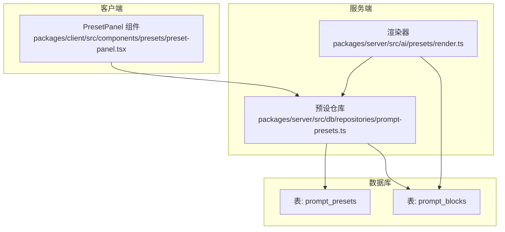
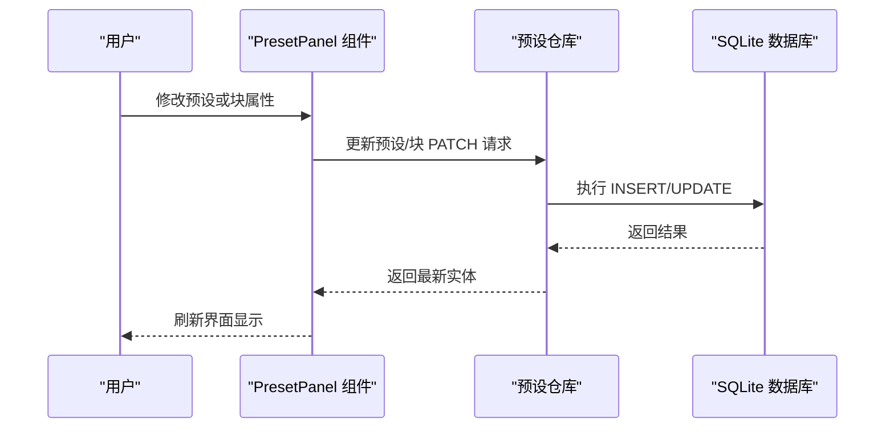
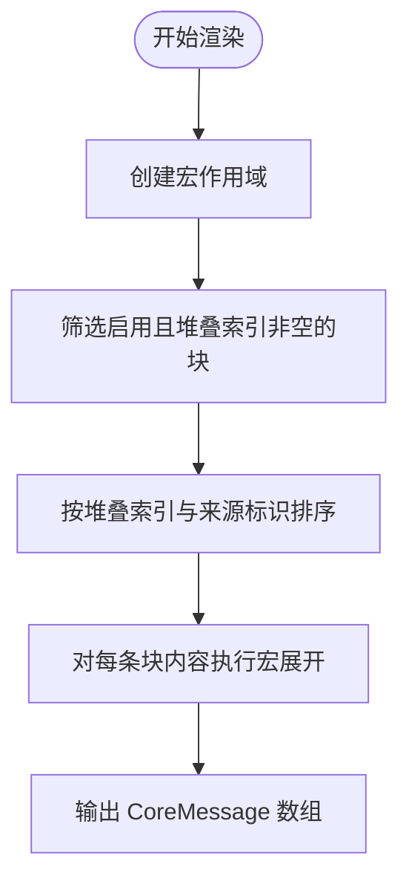
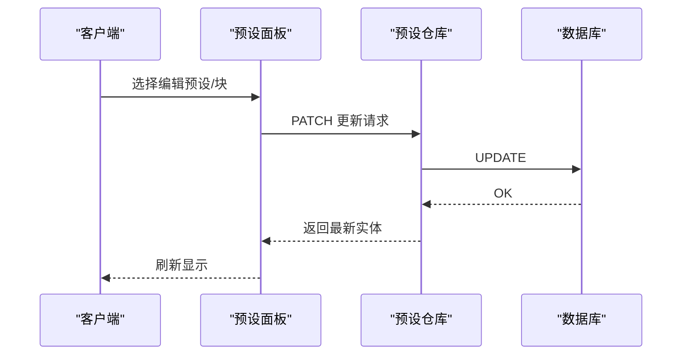
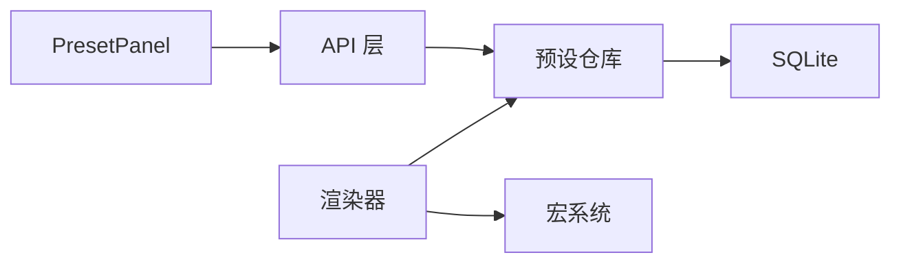
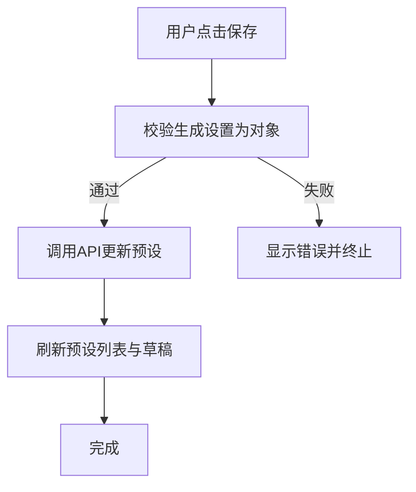

# 预设管理

<cite>
**本文引用的文件**
- [prompt-presets.ts](file://packages/server/src/db/repositories/prompt-presets.ts)
- [preset-panel.tsx](file://packages/client/src/components/presets/preset-panel.tsx)
- [render.ts](file://packages/server/src/ai/presets/render.ts)
- [render.test.ts](file://packages/server/tests/unit/ai/presets/render.test.ts)
- [prompt-presets.test.ts](file://packages/server/tests/unit/db/repositories/prompt-presets.test.ts)
</cite>

## 目录
1. [简介](#简介)
2. [项目结构](#项目结构)
3. [核心组件](#核心组件)
4. [架构总览](#架构总览)
5. [详细组件分析](#详细组件分析)
6. [依赖关系分析](#依赖关系分析)
7. [性能考虑](#性能考虑)
8. [故障排查指南](#故障排查指南)
9. [结论](#结论)
10. [附录](#附录)

## 简介
本文件面向Scribe的“预设管理”能力，系统性说明提示预设的存储结构、分类与检索机制，以及预设模板系统的变量替换、条件渲染与动态内容生成。同时覆盖预设的创建、编辑、删除与复制流程，导入导出与分享机制（基于现有字段的扩展思路），并给出命名规范、分类管理与版本控制的最佳实践建议。最后提供性能优化、缓存策略与并发访问处理的指导。

## 项目结构
预设管理涉及三层：客户端UI交互层、服务端数据持久化与业务逻辑层、AI渲染与宏展开层。核心文件分布如下：
- 客户端：预设面板组件负责加载、编辑与保存预设与块（Prompt Block）。
- 服务端：数据库仓库封装了预设与块的增删改查；渲染模块负责将启用的块按栈顺序拼接并执行宏替换。
- 测试：单元测试覆盖渲染行为与仓库操作。

图表来源
- [prompt-presets.ts:117-291](file://packages/server/src/db/repositories/prompt-presets.ts#L117-L291)
- [render.ts:9-25](file://packages/server/src/ai/presets/render.ts#L9-L25)
- [preset-panel.tsx:17-258](file://packages/client/src/components/presets/preset-panel.tsx#L17-L258)

章节来源
- [prompt-presets.ts:117-291](file://packages/server/src/db/repositories/prompt-presets.ts#L117-L291)
- [render.ts:9-25](file://packages/server/src/ai/presets/render.ts#L9-L25)
- [preset-panel.tsx:17-258](file://packages/client/src/components/presets/preset-panel.tsx#L17-L258)

## 核心组件
- 预设仓库（Prompt Presets Repository）
  - 负责预设与块的创建、查询、更新与删除，并对JSON字段进行序列化/反序列化。
  - 支持按书目（book_id）隔离数据，确保多作品场景下的数据安全。
- 预设面板（Preset Panel）
  - 提供预设列表展示、启用状态切换、正则脚本开关与配置、生成设置编辑、块级启用/禁用与内容编辑、保存等交互。
- 渲染器（Render）
  - 将启用且已设定栈索引的块按顺序拼接，保留角色信息，并通过宏系统进行内容替换。

章节来源
- [prompt-presets.ts:117-291](file://packages/server/src/db/repositories/prompt-presets.ts#L117-L291)
- [preset-panel.tsx:17-258](file://packages/client/src/components/presets/preset-panel.tsx#L17-L258)
- [render.ts:9-25](file://packages/server/src/ai/presets/render.ts#L9-L25)

## 架构总览
下图展示了从用户在前端修改预设到后端持久化与渲染的关键路径：

图表来源
- [prompt-presets.ts:117-291](file://packages/server/src/db/repositories/prompt-presets.ts#L117-L291)
- [preset-panel.tsx:53-81](file://packages/client/src/components/presets/preset-panel.tsx#L53-L81)

## 详细组件分析

### 存储结构与分类体系
- 表结构要点
  - 预设表（prompt_presets）：包含书目标识、名称、启用状态、来源导入ID、生成设置JSON、扩展字段（含正则脚本开关）、创建/更新时间等。
  - 块表（prompt_blocks）：包含所属预设ID、来源标识、名称、角色、内容、启用状态、堆叠索引、注入位置/深度/顺序、是否系统提示、标记位、禁止覆盖、触发条件数组、源提示/顺序开关、元数据JSON、创建/更新时间等。
- 分类与检索
  - 按书目隔离：所有查询均绑定 book_id，避免跨作品污染。
  - 预设检索：支持仅启用项过滤；默认按更新时间倒序。
  - 块检索：支持仅启用项过滤；排序规则为先按堆叠索引升序，再按来源标识字典序，空索引排在后。
- 字段解析与序列化
  - JSON字段统一通过解析函数进行安全反序列化，未命中时回退为空对象或空数组，保证运行时健壮性。

章节来源
- [prompt-presets.ts:117-291](file://packages/server/src/db/repositories/prompt-presets.ts#L117-L291)

### 预设模板系统：变量替换、条件渲染与动态内容生成
- 变量替换
  - 渲染阶段使用宏作用域与宏展开函数，将块内容中的占位符替换为上下文值。
- 条件渲染
  - 仅启用的块参与渲染；块的堆叠索引非空时才进入排序与输出。
- 动态内容生成
  - 块按堆叠顺序与来源标识排序后映射为消息对象，保留原始角色，形成最终的对话消息序列。
- 单元测试验证
  - 测试覆盖了启用块的顺序、角色保持、宏作用域跨块共享等关键行为。

图表来源
- [render.ts:9-25](file://packages/server/src/ai/presets/render.ts#L9-L25)
- [render.test.ts:30-33](file://packages/server/tests/unit/ai/presets/render.test.ts#L30-L33)

章节来源
- [render.ts:9-25](file://packages/server/src/ai/presets/render.ts#L9-L25)
- [render.test.ts:30-33](file://packages/server/tests/unit/ai/presets/render.test.ts#L30-L33)

### 创建、编辑、删除与复制操作实现逻辑
- 创建
  - 预设：生成唯一ID，写入基础字段与JSON字段，返回新建实体。
  - 块：校验所属预设存在，生成唯一ID，写入块字段与JSON字段，返回新建块。
- 编辑
  - 预设/块：合并当前状态与PATCH补丁，统一更新时间戳，执行UPDATE。
  - 客户端侧：面板组件维护草稿状态，保存时进行JSON合法性校验（生成设置必须为对象），随后调用API更新。
- 删除
  - 块：通过JOIN约束确保删除发生在同一书目内，防止越权删除。
- 复制
  - 当前仓库未提供专用复制接口；可通过读取目标预设与块，重新创建新预设与块的方式实现复制（属于上层业务建议，非现有实现）。

图表来源
- [prompt-presets.ts:155-178](file://packages/server/src/db/repositories/prompt-presets.ts#L155-L178)
- [prompt-presets.ts:243-277](file://packages/server/src/db/repositories/prompt-presets.ts#L243-L277)
- [preset-panel.tsx:60-81](file://packages/client/src/components/presets/preset-panel.tsx#L60-L81)

章节来源
- [prompt-presets.ts:117-291](file://packages/server/src/db/repositories/prompt-presets.ts#L117-L291)
- [preset-panel.tsx:53-81](file://packages/client/src/components/presets/preset-panel.tsx#L53-L81)

### 导入与导出（分享与同步）
- 现状
  - 仓库具备“来源导入ID”字段，可用于记录外部导入来源，便于后续识别与去重。
- 建议方案
  - 导出：将预设与块的必要字段打包为结构化JSON（含生成设置、扩展配置、块列表等），可直接分享。
  - 导入：解析外部JSON，校验结构完整性，利用现有创建接口批量导入；若存在相同来源ID，则可按策略进行覆盖或跳过。
  - 同步：基于来源导入ID与更新时间，实现增量同步与冲突解决。

章节来源
- [prompt-presets.ts:12-19](file://packages/server/src/db/repositories/prompt-presets.ts#L12-L19)
- [prompt-presets.ts:180-217](file://packages/server/src/db/repositories/prompt-presets.ts#L180-L217)

### 最佳实践
- 命名规范
  - 预设：清晰表达用途与场景（如“叙事风格-正式体裁”），避免过长或无意义命名。
  - 块：以角色+来源标识组合命名（如“system-main”、“assistant-背景设定”），便于排序与定位。
- 分类管理
  - 使用堆叠索引明确块的优先级与顺序；空索引用于“兜底/默认”块。
  - 合理使用来源标识区分不同来源（如主干、背景、角色卡等），配合排序提升可维护性。
- 版本控制
  - 通过“来源导入ID”与“更新时间”实现版本追踪；导入时比较两者决定覆盖策略。
  - 对生成设置与扩展配置进行语义化分组，减少不必要的变更扩散。

## 依赖关系分析
- 组件耦合
  - 预设面板依赖API层发起请求；API层依赖仓库层；仓库层依赖数据库。
  - 渲染器依赖仓库提供的块集合与宏系统。
- 外部依赖
  - better-sqlite3用于本地数据库访问；ai包的CoreMessage类型用于消息结构。
- 潜在循环
  - 当前结构为单向依赖，未见循环依赖迹象。

图表来源
- [prompt-presets.ts:117-291](file://packages/server/src/db/repositories/prompt-presets.ts#L117-L291)
- [render.ts:1-7](file://packages/server/src/ai/presets/render.ts#L1-L7)
- [preset-panel.tsx:1-2](file://packages/client/src/components/presets/preset-panel.tsx#L1-L2)

章节来源
- [prompt-presets.ts:117-291](file://packages/server/src/db/repositories/prompt-presets.ts#L117-L291)
- [render.ts:1-7](file://packages/server/src/ai/presets/render.ts#L1-L7)
- [preset-panel.tsx:1-2](file://packages/client/src/components/presets/preset-panel.tsx#L1-L2)

## 性能考虑
- 查询与排序
  - 块列表按堆叠索引与来源标识排序，建议在数据库层面建立复合索引以优化排序与过滤性能。
- JSON字段处理
  - 统一的JSON序列化/反序列化可减少重复解析开销；对大体积生成设置与扩展配置建议分页或懒加载。
- 渲染效率
  - 渲染器对启用块进行过滤与排序，复杂宏展开可能带来CPU开销；可在渲染前缓存宏作用域或对热点块进行缓存。
- 并发访问
  - SQLite为单机数据库，建议在应用层引入乐观锁（如基于更新时间戳）或串行化事务，避免竞态。
  - 对高频读取的预设列表可增加内存缓存（带失效策略），写入后主动失效相关缓存。

## 故障排查指南
- 常见错误与定位
  - “预设/块不存在”：通常由ID不匹配或跨书目访问导致；检查传入ID与所属书目是否一致。
  - JSON格式错误：生成设置必须为对象；客户端保存前会进行JSON解析校验，失败时需修正输入。
  - 排序异常：确认堆叠索引是否正确设置；空索引会排在末尾。
- 单元测试参考
  - 渲染行为测试覆盖宏展开与顺序逻辑，可作为回归验证的基准。
  - 仓库测试覆盖创建、更新与列表查询，便于定位数据一致性问题。

章节来源
- [prompt-presets.ts:155-178](file://packages/server/src/db/repositories/prompt-presets.ts#L155-L178)
- [prompt-presets.ts:243-277](file://packages/server/src/db/repositories/prompt-presets.ts#L243-L277)
- [render.test.ts:30-33](file://packages/server/tests/unit/ai/presets/render.test.ts#L30-L33)
- [prompt-presets.test.ts:39-67](file://packages/server/tests/unit/db/repositories/prompt-presets.test.ts#L39-L67)

## 结论
Scribe的预设管理以“预设-块”两级结构为核心，结合堆叠索引与来源标识实现了灵活的模板拼装与渲染。客户端提供直观的编辑体验，服务端通过仓库层保障数据一致性与可扩展性。建议在现有基础上完善导入导出与版本控制机制，并针对渲染与查询进行索引与缓存优化，以进一步提升性能与可维护性。

## 附录
- 关键流程图（客户端保存流程）

图表来源
- [preset-panel.tsx:60-81](file://packages/client/src/components/presets/preset-panel.tsx#L60-L81)