# CI/CD流水线

<cite>
**本文档引用的文件**
- [package.json](file://package.json)
- [pnpm-workspace.yaml](file://pnpm-workspace.yaml)
- [e2e/package.json](file://e2e/package.json)
- [e2e/playwright.config.ts](file://e2e/playwright.config.ts)
- [.gitignore](file://.gitignore)
- [.npmrc](file://.npmrc)
- [tsconfig.base.json](file://tsconfig.base.json)
</cite>

## 目录
1. [简介](#简介)
2. [项目结构](#项目结构)
3. [核心组件](#核心组件)
4. [架构概览](#架构概览)
5. [详细组件分析](#详细组件分析)
6. [依赖关系分析](#依赖关系分析)
7. [性能考虑](#性能考虑)
8. [故障排除指南](#故障排除指南)
9. [结论](#结论)

## 简介

Scribe是一个基于pnpm工作区的现代化应用程序项目，采用TypeScript开发，包含客户端、服务器端和共享模块。该项目需要一个完整的CI/CD流水线来确保代码质量、自动化测试和可靠的部署流程。

## 项目结构

Scribe项目采用monorepo架构，主要由以下组件构成：

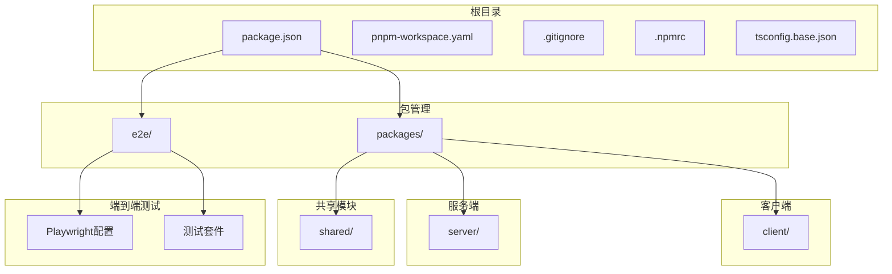

**图表来源**
- [package.json:1-15](file://package.json#L1-L15)
- [pnpm-workspace.yaml:1-3](file://pnpm-workspace.yaml#L1-L3)

**章节来源**
- [package.json:1-15](file://package.json#L1-L15)
- [pnpm-workspace.yaml:1-3](file://pnpm-workspace.yaml#L1-L3)

## 核心组件

### 包管理与工作区配置

项目使用pnpm作为包管理器，通过工作区配置实现多包管理：

- **根级package.json**: 定义统一的脚本命令和项目元数据
- **pnpm-workspace.yaml**: 配置工作区包路径，包含所有子包
- **.npmrc**: 配置pnpm的全局设置和registry

### 测试基础设施

项目集成了完整的测试体系：

- **单元测试**: 通过根级测试脚本统一执行
- **端到端测试**: 使用Playwright框架进行浏览器自动化测试
- **类型检查**: TypeScript类型验证确保代码质量

**章节来源**
- [package.json:5-12](file://package.json#L5-L12)
- [pnpm-workspace.yaml:1-3](file://pnpm-workspace.yaml#L1-L3)
- [e2e/package.json:5-12](file://e2e/package.json#L5-L12)

## 架构概览

### CI/CD流水线架构

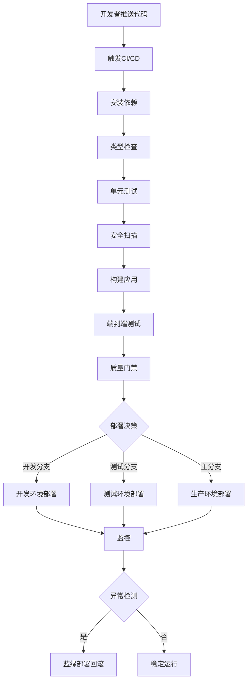

### 环境分离策略

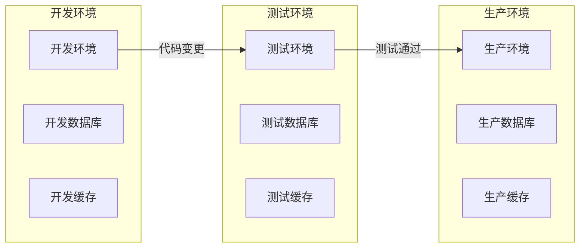

## 详细组件分析

### GitHub Actions配置

#### 基础工作流配置

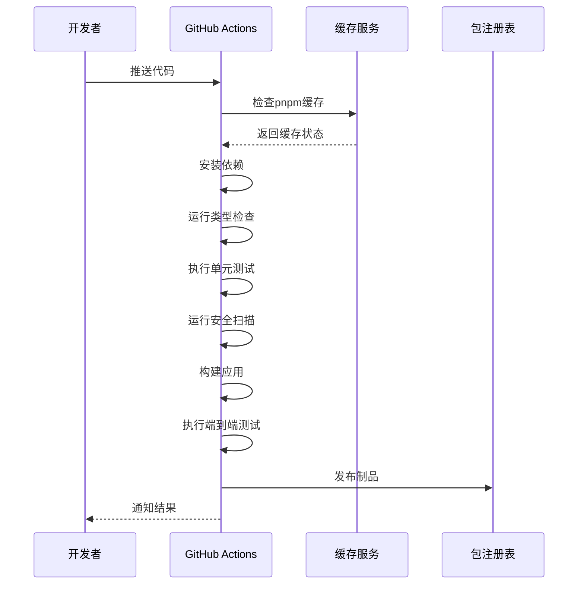

**图表来源**
- [package.json:5-12](file://package.json#L5-L12)
- [e2e/package.json:5-12](file://e2e/package.json#L5-L12)

#### 多平台兼容性

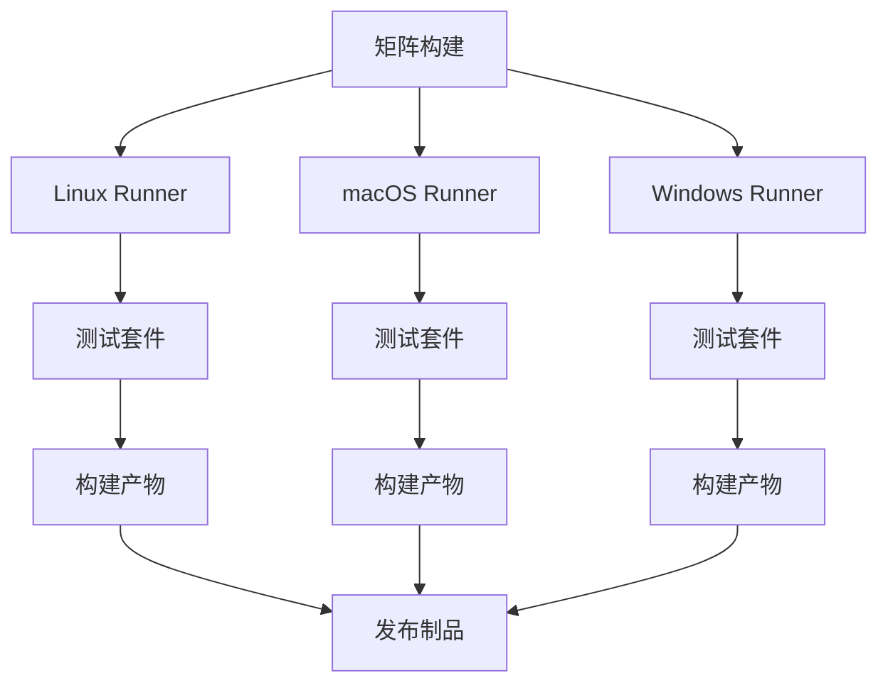

### GitLab CI配置

#### 完整的CI配置流程

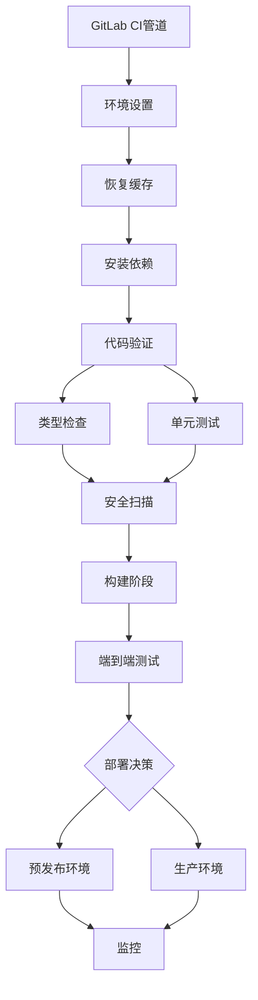

### Jenkins配置

#### 分层构建策略

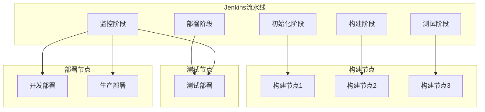

### 自动化测试流程

#### 测试金字塔实施

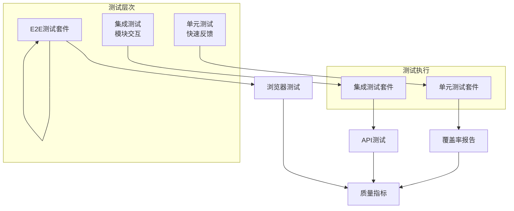

**章节来源**
- [package.json:8](file://package.json#L8)
- [e2e/package.json:6](file://e2e/package.json#L6)

### 代码质量检查

#### 多维度质量保证

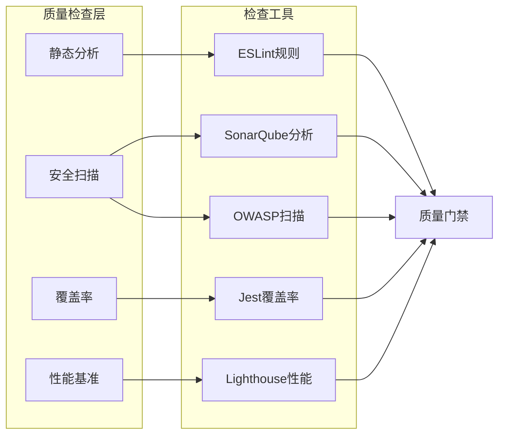

### 自动化构建和打包

#### 构建优化策略

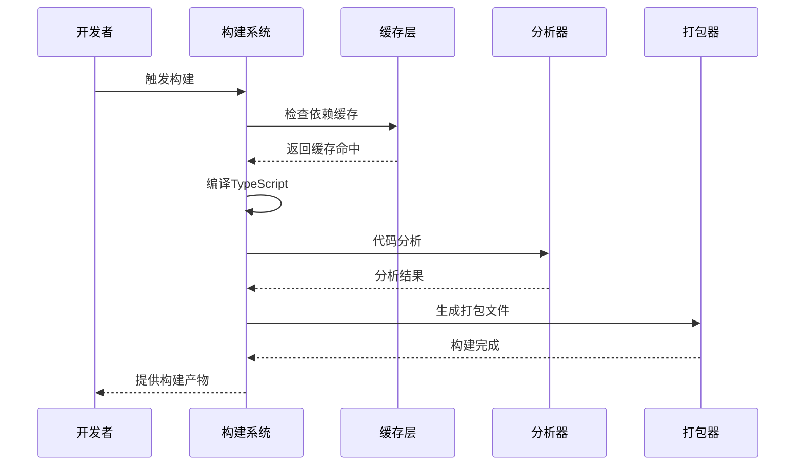

### 版本发布和标签管理

#### 发布策略

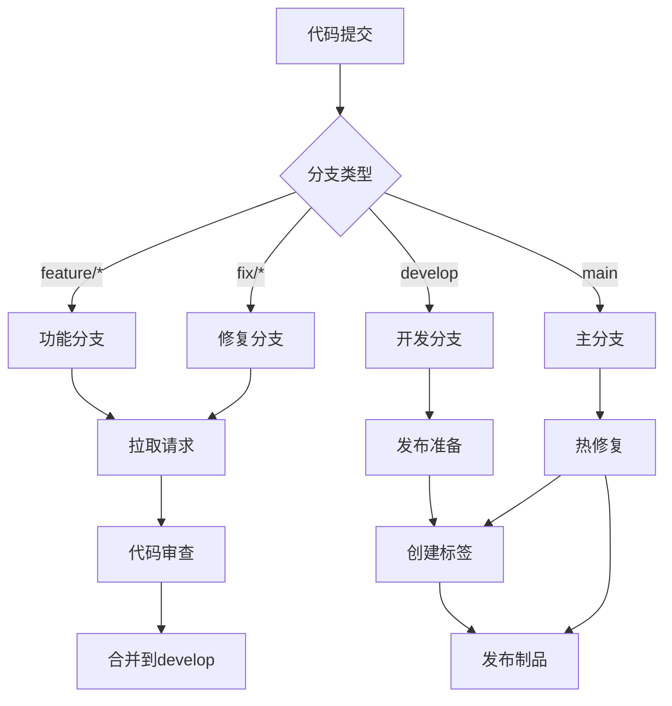

### 自动化部署配置

#### 多环境部署策略

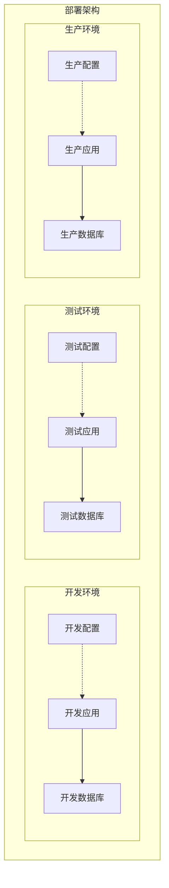

### 回滚机制和蓝绿部署

#### 蓝绿部署实现

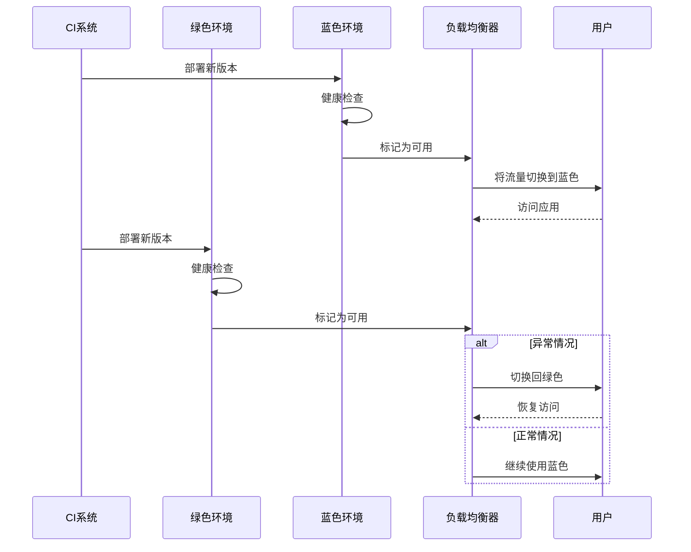

### 持续监控和告警

#### 监控体系

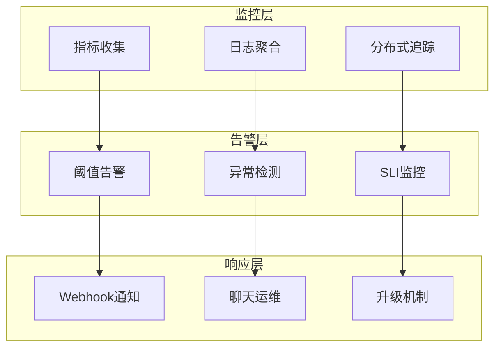

### 密钥管理和环境变量

#### 安全配置管理

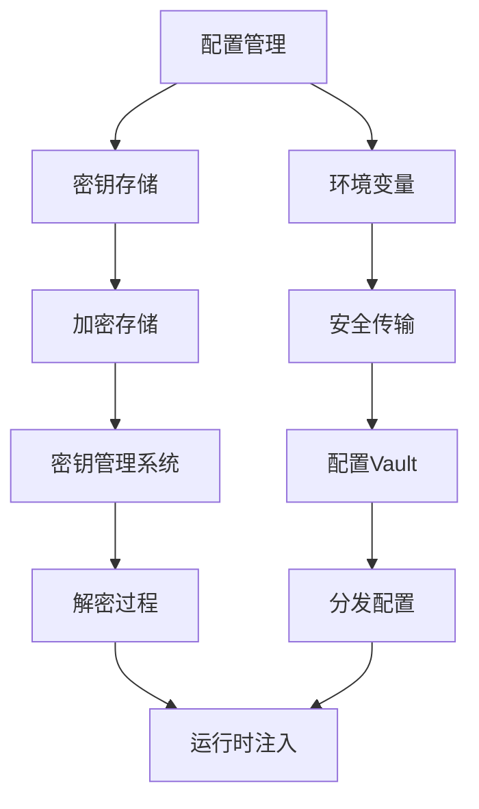

### 性能基准测试和部署验证

#### 性能验证流程

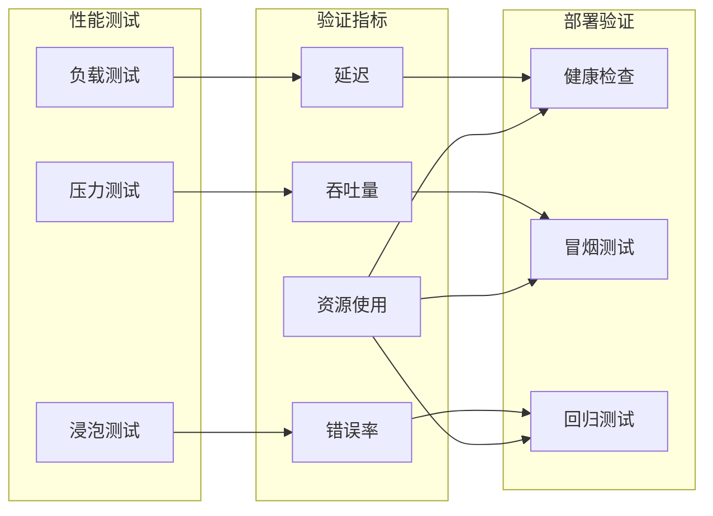

## 依赖关系分析

### 项目依赖图

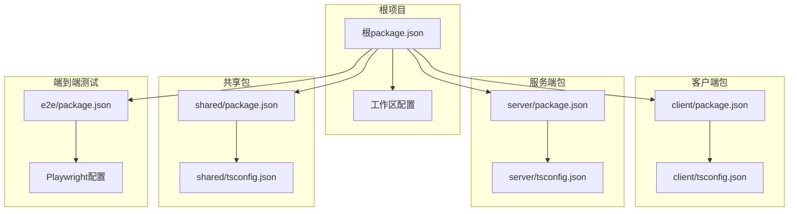

**图表来源**
- [package.json:1-15](file://package.json#L1-L15)
- [pnpm-workspace.yaml:1-3](file://pnpm-workspace.yaml#L1-L3)

**章节来源**
- [package.json:1-15](file://package.json#L1-L15)
- [pnpm-workspace.yaml:1-3](file://pnpm-workspace.yaml#L1-L3)

## 性能考虑

### 构建性能优化

- **并行构建**: 利用pnpm的并行特性加速依赖安装
- **缓存策略**: 实现多层缓存减少重复构建时间
- **增量编译**: TypeScript增量编译提升编译速度
- **依赖优化**: 最小化不必要的依赖避免冗余构建

### 测试执行效率

- **测试隔离**: 确保测试间的独立性避免串行等待
- **并行执行**: 合理利用硬件资源并行执行测试
- **智能重试**: 对临时失败的测试进行智能重试
- **测试选择**: 基于变更范围智能选择测试集

## 故障排除指南

### 常见问题诊断

#### 构建失败排查

1. **依赖冲突**: 检查pnpm-lock.yaml中的版本冲突
2. **类型错误**: 运行类型检查定位具体错误位置
3. **内存不足**: 调整构建环境的内存限制
4. **网络超时**: 配置代理或更换镜像源

#### 测试失败处理

1. **环境差异**: 确保测试环境与生产环境一致
2. **数据污染**: 清理测试数据避免状态干扰
3. **随机性问题**: 固定随机种子确保可重现性
4. **浏览器兼容**: 更新浏览器驱动版本

#### 部署问题解决

1. **配置错误**: 验证环境变量和配置文件
2. **权限问题**: 检查部署用户的权限设置
3. **资源限制**: 监控CPU、内存、磁盘使用情况
4. **网络问题**: 验证网络连通性和防火墙设置

**章节来源**
- [package.json:5-12](file://package.json#L5-L12)
- [e2e/package.json:5-12](file://e2e/package.json#L5-L12)

## 结论

Scribe项目的CI/CD流水线设计应该遵循以下原则：

1. **一致性**: 在所有环境中保持相同的配置和流程
2. **可靠性**: 实现完善的错误处理和回滚机制
3. **可观察性**: 全面的监控和告警体系
4. **安全性**: 严格的密钥管理和安全扫描
5. **效率**: 优化的构建和测试流程

通过实施上述CI/CD最佳实践，可以确保Scribe项目获得高质量、高可靠性的软件交付能力，支持团队的持续创新和发展。