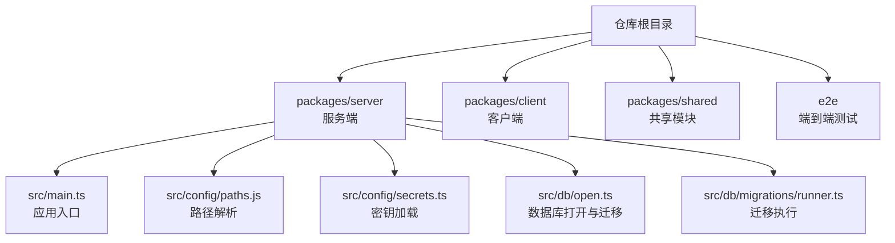
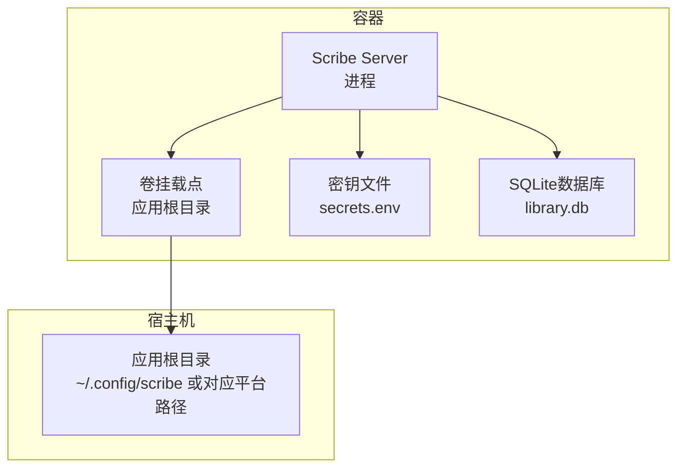
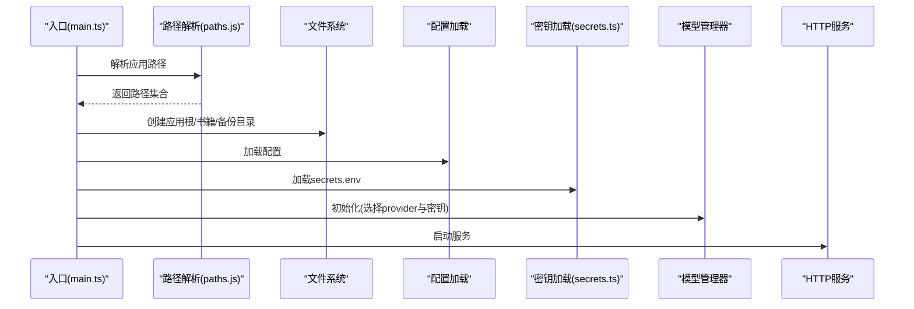
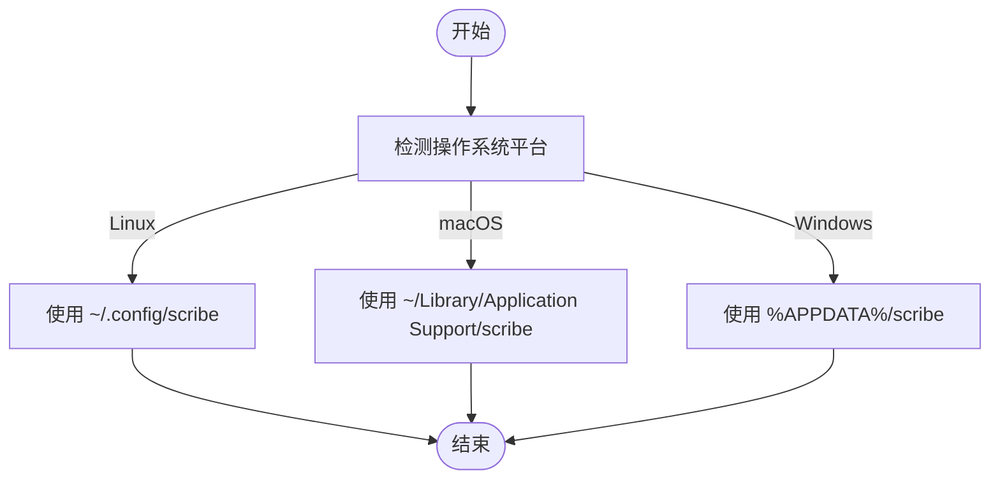
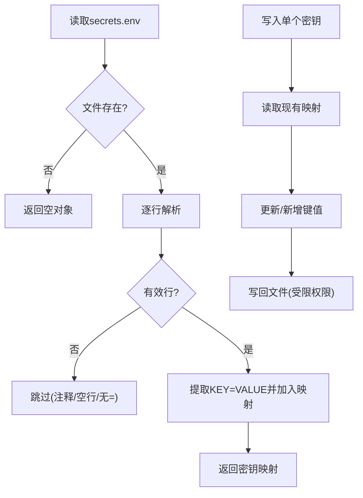
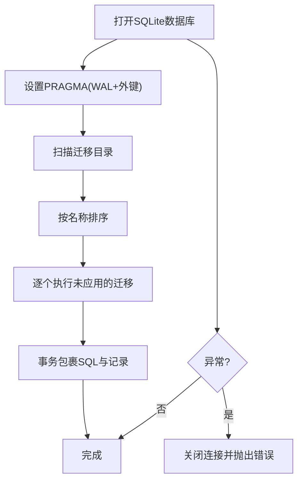
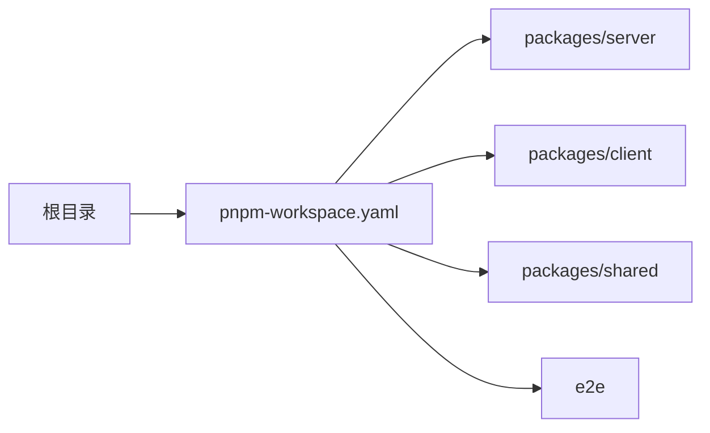

# 容器化部署

<cite>
**本文引用的文件**
- [package.json](file://package.json)
- [pnpm-workspace.yaml](file://pnpm-workspace.yaml)
- [packages/server/src/main.ts](file://packages/server/src/main.ts)
- [packages/server/src/config/paths.js](file://packages/server/src/config/paths.js)
- [packages/server/src/config/secrets.ts](file://packages/server/src/config/secrets.ts)
- [packages/server/src/db/open.ts](file://packages/server/src/db/open.ts)
- [packages/server/src/db/migrations/runner.ts](file://packages/server/src/db/migrations/runner.ts)
- [packages/server/tests/unit/config/paths.test.ts](file://packages/server/tests/unit/config/paths.test.ts)
</cite>

## 目录
1. [简介](#简介)
2. [项目结构](#项目结构)
3. [核心组件](#核心组件)
4. [架构总览](#架构总览)
5. [详细组件分析](#详细组件分析)
6. [依赖关系分析](#依赖关系分析)
7. [性能考量](#性能考量)
8. [故障排查指南](#故障排查指南)
9. [结论](#结论)
10. [附录](#附录)

## 简介
本指南面向Scribe项目的容器化部署，围绕以下目标展开：  
- Dockerfile编写与多阶段构建优化，控制镜像体积  
- docker-compose.yml服务编排、网络与卷挂载配置  
- 环境变量与敏感信息的安全管理（含secrets.env）  
- Kubernetes部署清单（Deployment、Service、Ingress）  
- 健康检查、资源限制与滚动更新最佳实践  
- 容器监控与日志收集建议  
- 容器间通信与网络拓扑设计  
- 容器安全（非root运行、只读根文件系统等）

## 项目结构
Scribe采用monorepo结构，使用pnpm工作区组织多个包。服务端位于packages/server，客户端位于packages/client，共享逻辑位于packages/shared。  
- 工作区配置：packages/* 与 e2e  
- 服务端入口：packages/server/src/main.ts  
- 配置与路径解析：packages/server/src/config/paths.js  
- 密钥加载：packages/server/src/config/secrets.ts  
- 数据库初始化与迁移：packages/server/src/db/open.ts、packages/server/src/db/migrations/runner.ts  

**图示来源**
- [pnpm-workspace.yaml:1-3](file://pnpm-workspace.yaml#L1-L3)
- [packages/server/src/main.ts:1-33](file://packages/server/src/main.ts#L1-L33)
- [packages/server/src/config/paths.js](file://packages/server/src/config/paths.js)
- [packages/server/src/config/secrets.ts:1-29](file://packages/server/src/config/secrets.ts#L1-L29)
- [packages/server/src/db/open.ts:1-34](file://packages/server/src/db/open.ts#L1-L34)
- [packages/server/src/db/migrations/runner.ts:1-23](file://packages/server/src/db/migrations/runner.ts#L1-L23)

**章节来源**
- [pnpm-workspace.yaml:1-3](file://pnpm-workspace.yaml#L1-L3)
- [package.json](file://package.json)

## 核心组件
- 应用入口与启动流程：从环境变量解析应用路径，创建必要目录，加载配置与密钥，初始化模型管理器与HTTP服务。  
- 路径解析：根据平台（Linux/macOS/Windows）确定应用根目录、数据库文件、书籍与备份目录、密钥文件位置。  
- 密钥管理：支持从secrets.env按行KEY=VALUE格式读取，并以受限权限写回；提供打码显示能力。  
- 数据库与迁移：打开SQLite数据库，启用WAL与外键约束，自动应用迁移脚本。

**章节来源**
- [packages/server/src/main.ts:13-33](file://packages/server/src/main.ts#L13-L33)
- [packages/server/src/config/paths.js](file://packages/server/src/config/paths.js)
- [packages/server/src/config/secrets.ts:1-29](file://packages/server/src/config/secrets.ts#L1-L29)
- [packages/server/src/db/open.ts:18-34](file://packages/server/src/db/open.ts#L18-L34)
- [packages/server/src/db/migrations/runner.ts:1-23](file://packages/server/src/db/migrations/runner.ts#L1-L23)

## 架构总览
下图展示容器化部署视角的服务架构：  
- Scribe Server容器承载业务逻辑、数据库与迁移、密钥文件  
- 数据持久化通过卷挂载到宿主机目录  
- 网络通过单一端口暴露，可由反向代理或Ingress统一接入  
- 安全方面通过非root运行、只读根文件系统、最小权限访问实现

**图示来源**
- [packages/server/src/main.ts:14-17](file://packages/server/src/main.ts#L14-L17)
- [packages/server/src/config/paths.js](file://packages/server/src/config/paths.js)
- [packages/server/src/config/secrets.ts:18-23](file://packages/server/src/config/secrets.ts#L18-L23)
- [packages/server/src/db/open.ts:22-34](file://packages/server/src/db/open.ts#L22-L34)

## 详细组件分析

### 组件A：应用入口与启动流程
- 启动时序要点：创建应用根目录、书籍目录、备份目录；加载配置与密钥；初始化模型管理器；启动HTTP服务。  
- 关键行为：根据provider选择不同密钥来源；将master prompt注入模型管理器；注册书籍相关路由。

**图示来源**
- [packages/server/src/main.ts:13-33](file://packages/server/src/main.ts#L13-L33)
- [packages/server/src/config/paths.js](file://packages/server/src/config/paths.js)
- [packages/server/src/config/secrets.ts:1-29](file://packages/server/src/config/secrets.ts#L1-L29)

**章节来源**
- [packages/server/src/main.ts:13-33](file://packages/server/src/main.ts#L13-L33)

### 组件B：路径解析与平台适配
- Linux：使用用户配置目录  
- macOS：使用应用支持目录  
- Windows：使用应用数据目录  
- 测试验证了各平台路径解析结果，确保容器内路径一致性

**图示来源**
- [packages/server/tests/unit/config/paths.test.ts:15-33](file://packages/server/tests/unit/config/paths.test.ts#L15-L33)

**章节来源**
- [packages/server/tests/unit/config/paths.test.ts:15-33](file://packages/server/tests/unit/config/paths.test.ts#L15-L33)

### 组件C：密钥管理与安全
- 读取：按行解析secrets.env，跳过注释与空行，提取KEY=VALUE  
- 写入：原子性更新，保留其他条目，写回时设置受限权限  
- 打码：对密钥进行掩码显示，便于日志与UI展示

**图示来源**
- [packages/server/src/config/secrets.ts:1-29](file://packages/server/src/config/secrets.ts#L1-L29)

**章节来源**
- [packages/server/src/config/secrets.ts:1-29](file://packages/server/src/config/secrets.ts#L1-L29)

### 组件D：数据库打开与迁移
- 打开数据库后设置PRAGMA（WAL模式、外键约束）  
- 自动扫描迁移目录并按名称排序执行，记录已应用迁移  
- 异常时关闭连接，避免句柄泄漏

**图示来源**
- [packages/server/src/db/open.ts:18-34](file://packages/server/src/db/open.ts#L18-L34)
- [packages/server/src/db/migrations/runner.ts:1-23](file://packages/server/src/db/migrations/runner.ts#L1-L23)

**章节来源**
- [packages/server/src/db/open.ts:18-34](file://packages/server/src/db/open.ts#L18-L34)
- [packages/server/src/db/migrations/runner.ts:1-23](file://packages/server/src/db/migrations/runner.ts#L1-L23)

## 依赖关系分析
- 工作区范围：packages/* 与 e2e  
- 服务端依赖：Hono服务器、better-sqlite3、AI模型管理器、HTTP路由与作业调度等  
- 客户端与共享模块：分别位于client与shared目录，需在构建阶段统一处理

**图示来源**
- [pnpm-workspace.yaml:1-3](file://pnpm-workspace.yaml#L1-L3)

**章节来源**
- [pnpm-workspace.yaml:1-3](file://pnpm-workspace.yaml#L1-L3)
- [package.json](file://package.json)

## 性能考量
- 多阶段构建：利用pnpm安装依赖，仅在最终阶段复制运行时产物，显著减小镜像体积  
- 运行时精简：仅打包运行时必需文件，移除开发依赖与源码  
- 数据库性能：启用WAL模式与外键约束，提升并发与一致性  
- 启动优化：延迟初始化非关键组件，缩短冷启动时间

## 故障排查指南
- 启动失败：检查应用根目录是否可写、secrets.env是否存在且格式正确  
- 数据库异常：确认迁移脚本执行顺序与权限，查看迁移记录表状态  
- 平台路径问题：核对容器内平台识别与路径解析逻辑，确保与宿主机一致  
- 权限问题：确认密钥文件写回权限与掩码显示是否正常

**章节来源**
- [packages/server/src/main.ts:14-17](file://packages/server/src/main.ts#L14-L17)
- [packages/server/src/config/secrets.ts:18-23](file://packages/server/src/config/secrets.ts#L18-L23)
- [packages/server/src/db/open.ts:30-34](file://packages/server/src/db/open.ts#L30-L34)
- [packages/server/tests/unit/config/paths.test.ts:15-33](file://packages/server/tests/unit/config/paths.test.ts#L15-L33)

## 结论
通过多阶段构建、最小权限与只读根文件系统、卷挂载与secrets.env安全存储、健康检查与滚动更新策略，Scribe可在Docker与Kubernetes中实现稳定、安全、可观测的生产级部署。建议结合CI/CD流水线自动化构建与发布，并持续完善监控与告警体系。

## 附录

### A. Dockerfile编写指南（多阶段构建与镜像瘦身）
- 使用pnpm安装依赖，分层缓存优化  
- 最终镜像仅包含运行时产物，剔除源码、测试与开发依赖  
- 设置非root用户运行，禁用setuid/setgid位  
- 将应用根目录映射为卷，确保secrets.env与数据库持久化  
- 示例步骤（请参考实际构建脚本与依赖清单）：  
  - 构建阶段：安装依赖、编译TS、生成静态资源  
  - 运行阶段：复制运行时产物、设置非root用户、创建应用根目录与密钥文件、启动命令

**章节来源**
- [package.json](file://package.json)
- [pnpm-workspace.yaml:1-3](file://pnpm-workspace.yaml#L1-L3)

### B. docker-compose.yml配置要点
- 服务编排：定义Scribe Server服务，设置环境变量与端口映射  
- 网络：使用自定义桥接网络，隔离容器间通信  
- 卷挂载：将宿主机应用根目录挂载至容器内对应路径，确保secrets.env与数据库持久化  
- 健康检查：基于HTTP探针，定期探测服务可用性  
- 资源限制：设置CPU与内存上限，避免资源争用  
- 滚动更新：配置更新策略，保证服务连续性

### C. 环境变量与敏感信息安全管理
- 环境变量：通过compose或Kubernetes Secret注入，避免硬编码  
- secrets.env：仅在容器内读取，写回时设置受限权限；在Kubernetes中使用Secret资源管理  
- 掩码显示：对密钥进行掩码处理，降低泄露风险  
- 访问控制：限制密钥文件权限，避免被其他用户读取

**章节来源**
- [packages/server/src/config/secrets.ts:18-29](file://packages/server/src/config/secrets.ts#L18-L29)

### D. Kubernetes部署配置
- Deployment：定义副本数、滚动更新策略、资源请求与限制、健康检查探针  
- Service：暴露端口，支持ClusterIP或LoadBalancer类型  
- Ingress：通过反向代理统一入口，配置TLS与路径转发规则  
- Secret与ConfigMap：分离敏感配置与普通配置，按需挂载为环境变量或卷

### E. 容器监控与日志收集
- 日志：STDOUT/STDERR输出，结合集中式日志系统采集  
- 指标：暴露Prometheus指标端点，配合Exporter收集运行时指标  
- 告警：基于阈值与趋势建立告警规则，及时响应异常

### F. 容器间通信与网络拓扑
- 单容器部署：容器内进程通过localhost通信  
- 多容器部署：通过Service名称或ClusterIP进行服务发现与通信  
- Ingress：统一入口，支持域名与路径路由，实现外部访问

### G. 容器安全配置
- 非root运行：以非特权用户启动进程，降低提权风险  
- 只读根文件系统：禁止写入，减少恶意修改面  
- 最小权限：仅授予必要的文件与目录访问权限  
- 安全上下文：在Kubernetes中设置Pod安全策略与容器安全上下文