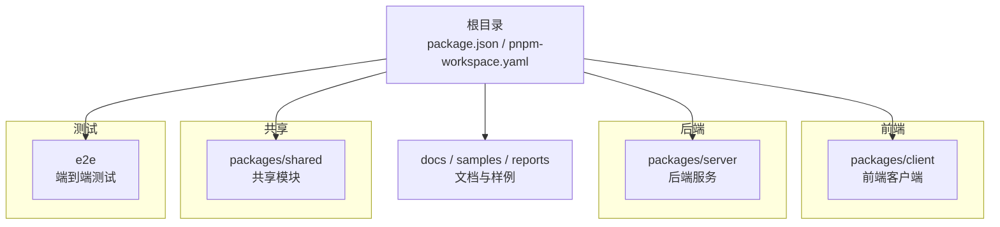
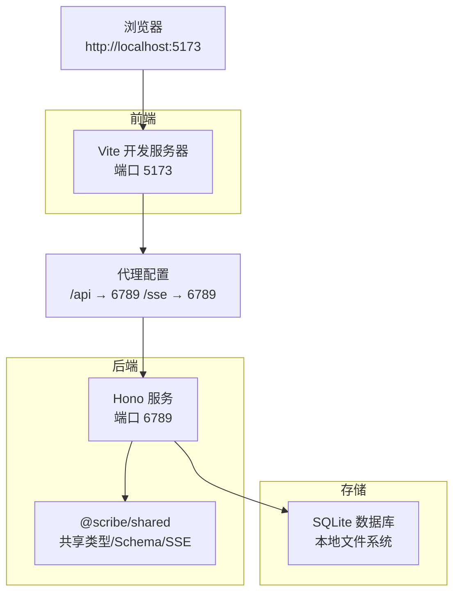
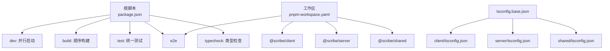

# 本地部署

<cite>
**本文引用的文件**
- [package.json](file://package.json)
- [pnpm-workspace.yaml](file://pnpm-workspace.yaml)
- [.npmrc](file://.npmrc)
- [tsconfig.base.json](file://tsconfig.base.json)
- [packages/client/package.json](file://packages/client/package.json)
- [packages/client/tsconfig.json](file://packages/client/tsconfig.json)
- [packages/client/vite.config.ts](file://packages/client/vite.config.ts)
- [packages/server/package.json](file://packages/server/package.json)
- [packages/server/tsconfig.json](file://packages/server/tsconfig.json)
- [packages/server/tsconfig.build.json](file://packages/server/tsconfig.build.json)
- [packages/shared/package.json](file://packages/shared/package.json)
- [e2e/playwright.config.ts](file://e2e/playwright.config.ts)
- [README.md](file://README.md)
</cite>

## 目录
1. [简介](#简介)
2. [项目结构](#项目结构)
3. [核心组件](#核心组件)
4. [架构总览](#架构总览)
5. [详细组件分析](#详细组件分析)
6. [依赖分析](#依赖分析)
7. [性能考虑](#性能考虑)
8. [故障排查指南](#故障排查指南)
9. [结论](#结论)
10. [附录](#附录)

## 简介
本指南面向希望在本地完整运行 Scribe 的开发者，覆盖从环境准备、依赖安装、开发环境变量与本地数据库设置、前后端启动顺序、热重载与调试，到常见问题排查与性能优化建议的全流程。Scribe 是一个以“本地优先”的长篇小说创作工作台，采用多包工作区（pnpm workspaces）组织，包含前端客户端、后端服务与共享模块，并通过 SQLite 存储本地数据。

## 项目结构
仓库采用 pnpm 工作区组织，顶层定义了脚本与引擎版本要求；packages 目录下包含 client、server、shared 三个子包；e2e 提供端到端测试配置；docs、samples、reports 等目录用于文档、示例与报告。

图表来源
- [pnpm-workspace.yaml:1-4](file://pnpm-workspace.yaml#L1-L4)
- [package.json:1-21](file://package.json#L1-L21)

章节来源
- [pnpm-workspace.yaml:1-4](file://pnpm-workspace.yaml#L1-L4)
- [package.json:1-21](file://package.json#L1-L21)
- [README.md:44-56](file://README.md#L44-L56)

## 核心组件
- 前端客户端（@scribe/client）
  - 使用 Vite 进行开发与构建，内置 React 插件与代理配置，开发时默认监听 5173 端口。
  - 通过代理将 /api 与 /sse 请求转发至后端 6789 端口。
- 后端服务（@scribe/server）
  - 使用 Hono 作为 Web 框架，基于 Node.js 运行时，开发时通过 tsx 监听源码变更实现热重载。
  - 默认监听 6789 端口，提供健康检查等接口。
- 共享模块（@scribe/shared）
  - 提供前后端共享的类型、Zod Schema、SSE 事件与命令表等。
- 工作区与脚本
  - 顶层 package.json 定义了统一的开发、构建、测试与类型检查脚本，支持并行执行。
  - pnpm-workspace.yaml 声明工作区范围，.npmrc 控制 peer 依赖行为。

章节来源
- [packages/client/package.json:1-39](file://packages/client/package.json#L1-L39)
- [packages/client/vite.config.ts:1-20](file://packages/client/vite.config.ts#L1-L20)
- [packages/server/package.json:1-33](file://packages/server/package.json#L1-L33)
- [packages/shared/package.json:1-19](file://packages/shared/package.json#L1-L19)
- [package.json:6-12](file://package.json#L6-L12)
- [pnpm-workspace.yaml:1-4](file://pnpm-workspace.yaml#L1-L4)
- [.npmrc:1-3](file://.npmrc#L1-L3)

## 架构总览
下图展示了本地开发时的请求流：浏览器访问前端开发服务器，Vite 将 /api 与 /sse 代理到后端；后端服务处理业务逻辑并访问本地 SQLite 数据库；共享模块在两端复用。

图表来源
- [packages/client/vite.config.ts:7-13](file://packages/client/vite.config.ts#L7-L13)
- [packages/server/package.json:6-12](file://packages/server/package.json#L6-L12)
- [packages/shared/package.json:1-19](file://packages/shared/package.json#L1-L19)

## 详细组件分析

### 前端开发服务器（@scribe/client）
- 启动方式
  - 开发脚本直接调用 Vite，无需额外参数即可启动。
  - 代理规则将 /api 与 /sse 转发至后端 6789 端口。
- 热重载与调试
  - Vite 内置 HMR，修改源码后自动刷新。
  - 测试使用 jsdom 环境，便于 DOM 相关组件测试。
- 关键配置要点
  - 端口：5173
  - 代理：/api → http://127.0.0.1:6789，/sse → http://127.0.0.1:6789
  - 测试环境：jsdom，全局启用，支持 setup 文件

章节来源
- [packages/client/package.json:5-11](file://packages/client/package.json#L5-L11)
- [packages/client/vite.config.ts:6-18](file://packages/client/vite.config.ts#L6-L18)
- [packages/client/tsconfig.json:1-10](file://packages/client/tsconfig.json#L1-L10)

### 后端 API 服务（@scribe/server）
- 启动方式
  - 开发脚本使用 tsx 监听源码变更，自动重启服务。
  - 默认监听 6789 端口，提供健康检查等接口。
- 数据与存储
  - 使用 better-sqlite3 访问 SQLite 数据库。
  - 数据根目录可通过环境变量 SCRIBE_HOME 指定，默认位置见 README。
- 关键配置要点
  - 主入口：src/main.ts
  - 依赖：Hono、SQLite、AI SDK、Zod、Pino 等
  - 构建：先 TypeScript 编译，再执行迁移脚本复制

章节来源
- [packages/server/package.json:6-12](file://packages/server/package.json#L6-L12)
- [packages/server/package.json:13-24](file://packages/server/package.json#L13-L24)
- [packages/server/tsconfig.json:1-8](file://packages/server/tsconfig.json#L1-L8)
- [packages/server/tsconfig.build.json](file://packages/server/tsconfig.build.json)

### 共享模块（@scribe/shared）
- 作用
  - 在前后端之间共享类型、Zod Schema、SSE 事件与命令表等。
- 构建与测试
  - 提供独立的测试与类型检查脚本，不包含运行时逻辑。

章节来源
- [packages/shared/package.json:1-19](file://packages/shared/package.json#L1-L19)

### 端到端测试（e2e）
- 启动方式
  - Playwright 通过 webServer 字段自动启动后端服务，访问健康检查接口确认就绪。
  - 测试基地址指向 http://127.0.0.1:6789。
- 环境变量
  - SCRIBE_HOME 指向 e2e 专用数据目录，PORT 设为 6789。
- 报告与超时
  - 设置超时与重试策略，HTML 报告输出但不自动打开。

章节来源
- [e2e/playwright.config.ts:9-26](file://e2e/playwright.config.ts#L9-L26)

## 依赖分析
- 工作区与包管理
  - pnpm 工作区声明 packages/* 与 e2e，统一安装与链接。
  - .npmrc 关闭严格 peer 依赖校验，开启自动安装 peer，降低安装冲突概率。
- 顶层脚本
  - dev：并行启动所有包的 dev 脚本
  - build：依次构建所有包
  - test：统一执行单元与集成测试
  - test:e2e：仅执行 e2e 测试
  - typecheck：全工作区类型检查
- 类型系统
  - 基础 tsconfig 配置于根目录，各包继承扩展，确保一致的编译选项与严格性。

图表来源
- [package.json:6-12](file://package.json#L6-L12)
- [pnpm-workspace.yaml:1-4](file://pnpm-workspace.yaml#L1-L4)
- [tsconfig.base.json:1-16](file://tsconfig.base.json#L1-L16)
- [packages/client/tsconfig.json:1-10](file://packages/client/tsconfig.json#L1-L10)
- [packages/server/tsconfig.json:1-8](file://packages/server/tsconfig.json#L1-L8)
- [packages/shared/package.json:1-19](file://packages/shared/package.json#L1-L19)

章节来源
- [package.json:6-12](file://package.json#L6-L12)
- [pnpm-workspace.yaml:1-4](file://pnpm-workspace.yaml#L1-L4)
- [.npmrc:1-3](file://.npmrc#L1-L3)
- [tsconfig.base.json:1-16](file://tsconfig.base.json#L1-L16)

## 性能考虑
- 并行开发启动
  - 顶层 dev 脚本使用并行执行，缩短整体启动时间。
- Vite 热重载
  - 前端使用 React 插件与 HMR，修改源码即时生效。
- TypeScript 编译
  - 分包独立编译，减少全量重建成本；生产构建前先做类型检查。
- SQLite 本地存储
  - 本地文件系统访问，避免网络延迟；建议在 SSD 上运行以提升 I/O 性能。
- 端到端测试
  - webServer 自动拉起后端，减少手动干预；合理设置超时与重试，平衡稳定性与速度。

章节来源
- [package.json:7](file://package.json#L7)
- [packages/client/vite.config.ts:3](file://packages/client/vite.config.ts#L3)
- [e2e/playwright.config.ts:16-25](file://e2e/playwright.config.ts#L16-L25)

## 故障排查指南
- Node.js 版本不满足要求
  - 现象：安装或运行时报错，提示 Node 版本过低。
  - 解决：升级 Node.js 至 20 或以上版本。
  - 参考：顶层 engines 字段与 README 环境要求。
- pnpm 版本或工作区未正确识别
  - 现象：安装失败、包未被链接或脚本无法执行。
  - 解决：确保使用 pnpm 9；确认 pnpm-workspace.yaml 正确声明 packages/* 与 e2e。
- 代理端口冲突
  - 现象：前端代理 /api 与 /sse 无法转发至后端。
  - 解决：检查后端是否已在 6789 端口运行；如冲突请调整任一端口并同步更新代理配置。
- SQLite 权限或路径问题
  - 现象：无法创建或读取数据库文件。
  - 解决：确认 SCRIBE_HOME 指向的目录存在且具备读写权限；默认路径见 README。
- 端到端测试无法启动后端
  - 现象：Playwright 报告超时，健康检查接口不可达。
  - 解决：查看 webServer 命令与环境变量（SCRIBE_HOME、PORT），确保后端可正常启动并暴露 /api/health。
- 类型检查失败
  - 现象：typecheck 报错，影响构建。
  - 解决：逐包修复类型错误；必要时暂时关闭严格模式定位问题，再逐步恢复。

章节来源
- [package.json:18](file://package.json#L18)
- [README.md:5-8](file://README.md#L5-L8)
- [packages/client/vite.config.ts:10-12](file://packages/client/vite.config.ts#L10-L12)
- [packages/server/package.json:6-8](file://packages/server/package.json#L6-L8)
- [e2e/playwright.config.ts:16-25](file://e2e/playwright.config.ts#L16-L25)
- [README.md:57-62](file://README.md#L57-L62)

## 结论
通过本指南，您可以在本地完成 Scribe 的完整部署与开发。遵循环境要求、正确安装与链接工作区包、配置好开发环境变量与本地数据库路径后，按照“先启动后端、再启动前端”的顺序即可进入开发状态。遇到问题时，可依据本指南中的排查步骤快速定位并解决。

## 附录

### 环境准备与安装步骤
- Node.js 版本要求：≥ 20（推荐使用 24）
- 包管理器：pnpm 9
- 项目克隆与安装
  - 执行 pnpm install 安装全部依赖
  - 顶层脚本支持并行开发、构建、测试与类型检查

章节来源
- [README.md:5-14](file://README.md#L5-L14)
- [package.json:18-19](file://package.json#L18-L19)
- [package.json:6-12](file://package.json#L6-L12)

### 开发环境变量与本地数据库设置
- API Key 配置
  - 在数据目录创建 secrets.env（默认路径见 README），添加所需 API 密钥
- 数据根目录
  - 默认根目录：Windows %APPDATA%\scribe，Linux ~/.config/scribe
  - 可通过环境变量 SCRIBE_HOME 修改根目录
- 端口与代理
  - 前端默认端口：5173
  - 后端默认端口：6789
  - 前端代理：/api 与 /sse 转发至 6789

章节来源
- [README.md:16-34](file://README.md#L16-L34)
- [packages/client/vite.config.ts:7-13](file://packages/client/vite.config.ts#L7-L13)
- [packages/server/package.json:6-8](file://packages/server/package.json#L6-L8)

### 启动流程与热重载
- 启动顺序
  - 后端：pnpm --filter @scribe/server exec tsx src/main.ts
  - 前端：pnpm --filter @scribe/client dev
- 热重载
  - 前端：Vite HMR，修改即刷新
  - 后端：tsx 监听文件变更，自动重启

章节来源
- [README.md:24-34](file://README.md#L24-L34)
- [packages/client/package.json:6](file://packages/client/package.json#L6)
- [packages/server/package.json:7](file://packages/server/package.json#L7)

### 调试设置
- 前端
  - 测试环境：jsdom，支持全局测试与 setup 文件
- 后端
  - 开发模式：tsx watch，便于断点调试
- 端到端
  - Playwright 自动启动后端，访问 /api/health 确认就绪

章节来源
- [packages/client/vite.config.ts:14-18](file://packages/client/vite.config.ts#L14-L18)
- [packages/server/package.json:7](file://packages/server/package.json#L7)
- [e2e/playwright.config.ts:16-25](file://e2e/playwright.config.ts#L16-L25)

### 开发模式下的性能优化建议
- 使用并行脚本加速开发启动
- 仅在需要时进行全量构建，日常开发以增量编译为主
- 将数据目录置于 SSD，减少 SQLite I/O 延迟
- 合理设置端到端测试超时与重试，避免长时间等待

章节来源
- [package.json:7](file://package.json#L7)
- [e2e/playwright.config.ts:11-12](file://e2e/playwright.config.ts#L11-L12)