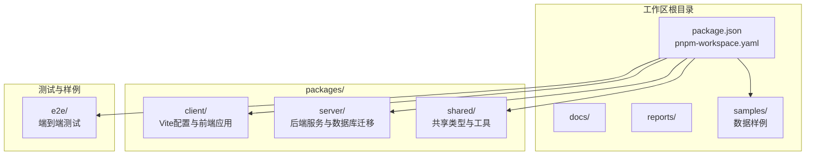
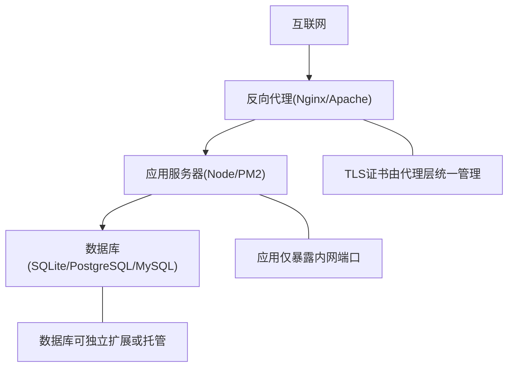
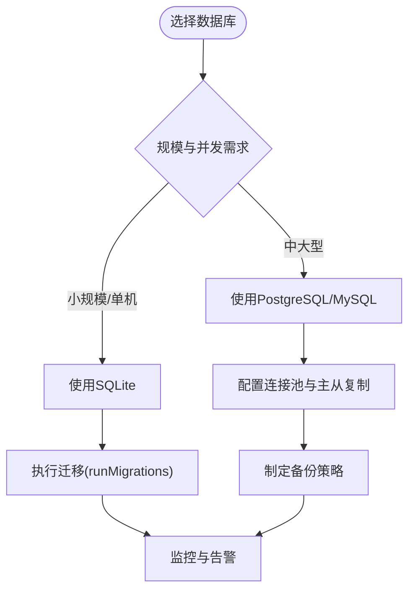
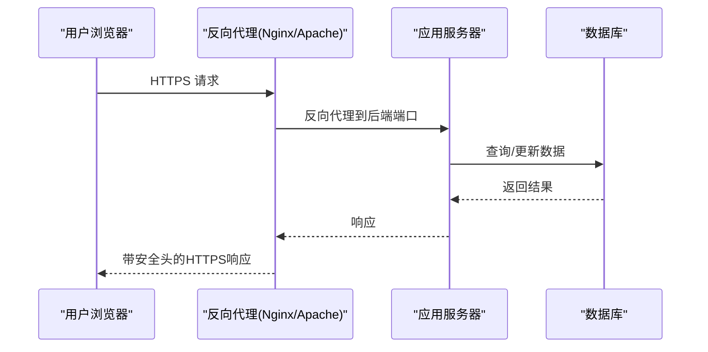
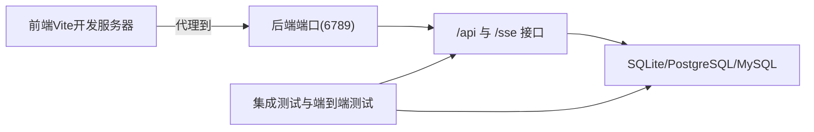

# 生产环境配置

<cite>
**本文档引用的文件**
- [packages/server/src/db/migrations/runner.ts](file://packages/server/src/db/migrations/runner.ts)
- [packages/client/vite.config.ts](file://packages/client/vite.config.ts)
- [packages/server/tests/integration/auto-mode.test.ts](file://packages/server/tests/integration/auto-mode.test.ts)
- [e2e/tests/smoke.spec.ts](file://e2e/tests/smoke.spec.ts)
</cite>

## 目录
1. [简介](#简介)
2. [项目结构](#项目结构)
3. [核心组件](#核心组件)
4. [架构总览](#架构总览)
5. [详细组件分析](#详细组件分析)
6. [依赖关系分析](#依赖关系分析)
7. [性能考虑](#性能考虑)
8. [故障排除指南](#故障排除指南)
9. [结论](#结论)
10. [附录](#附录)

## 简介
本指南面向Scribe项目的生产环境部署与运维，围绕服务器硬件与系统要求、数据库选型与配置、反向代理与SSL/TLS、进程管理与守护、性能调优、安全加固、日志轮转与监控、备份与灾备等维度提供可操作的配置建议。由于仓库中未包含完整的生产配置文件与后端实现细节，本指南在各章节中明确标注“基于现有代码线索”的推断与建议，并提供可直接落地的实践步骤。

## 项目结构
Scribe采用多包工作区组织，核心模块包括客户端、服务端与共享资源。前端通过Vite开发服务器进行本地联调，后端提供REST接口与数据库迁移能力；测试覆盖集成测试与端到端测试，用于验证核心功能与环境可用性。

**图表来源**
- [packages/client/vite.config.ts:1-19](file://packages/client/vite.config.ts#L1-L19)
- [packages/server/src/db/migrations/runner.ts:1-23](file://packages/server/src/db/migrations/runner.ts#L1-L23)

**章节来源**
- [packages/client/vite.config.ts:1-19](file://packages/client/vite.config.ts#L1-L19)
- [packages/server/src/db/migrations/runner.ts:1-23](file://packages/server/src/db/migrations/runner.ts#L1-L23)

## 核心组件
- 前端开发服务器：通过Vite配置将/api与/sse代理至后端服务端口，便于本地联调。
- 后端数据库迁移：内置SQLite迁移执行器，负责版本化迁移与幂等应用。
- 集成测试：验证设置读写、预算上限等核心业务路径。
- 端到端测试：基础环境连通性验证，确保测试框架可用。

**章节来源**
- [packages/client/vite.config.ts:7-13](file://packages/client/vite.config.ts#L7-L13)
- [packages/server/src/db/migrations/runner.ts:8-23](file://packages/server/src/db/migrations/runner.ts#L8-L23)
- [packages/server/tests/integration/auto-mode.test.ts:370-385](file://packages/server/tests/integration/auto-mode.test.ts#L370-L385)
- [e2e/tests/smoke.spec.ts:1-6](file://e2e/tests/smoke.spec.ts#L1-L6)

## 架构总览
下图展示生产环境中的典型部署拓扑：反向代理位于边缘，负责TLS终止、请求转发与静态资源服务；后端服务监听内网端口，数据库存储于本地或专用实例；进程管理器负责进程守护与自动重启。

## 详细组件分析

### 数据库配置与选型
- SQLite（推荐用于小规模或单机场景）
  - 特点：零配置、文件式存储、无需额外进程。
  - 迁移机制：通过迁移运行器对SQLite执行版本化SQL脚本，记录已应用版本。
  - 注意事项：高并发写入可能受锁竞争影响；建议结合只读副本或外部数据库以提升吞吐。
- PostgreSQL/MySQL（推荐用于中大型场景）
  - 特点：成熟的事务支持、连接池、复制与高可用方案。
  - 建议：使用连接池、主从复制、定期备份与监控告警。

**图表来源**
- [packages/server/src/db/migrations/runner.ts:8-23](file://packages/server/src/db/migrations/runner.ts#L8-L23)

**章节来源**
- [packages/server/src/db/migrations/runner.ts:8-23](file://packages/server/src/db/migrations/runner.ts#L8-L23)

### 反向代理配置（Nginx/Apache）
- Nginx
  - TLS终止：加载证书与私钥，启用现代加密套件与协议版本。
  - 转发规则：将/api与/sse转发至后端服务端口；静态资源交由Nginx直出。
  - 安全头：设置严格传输安全、内容安全策略、X-Frame-Options等。
- Apache
  - 使用mod_ssl启用TLS；mod_proxy_http与mod_proxy_wstunnel转发HTTP与WebSocket。
  - 通过Header指令注入安全响应头。

[本图为概念性流程示意，不对应具体源码文件]

### SSL/TLS证书获取与配置
- 获取方式：Let’s Encrypt（ACME）、商业CA或内部CA。
- 配置要点：优先使用TLS 1.3；禁用过时协议与弱密码套件；启用OCSP Stapling；合理设置证书链与过期提醒。
- 自动续期：结合定时任务或自动化工具保障续期成功。

[本节为通用实践说明，不涉及具体源码文件]

### 进程管理与守护（PM2）
- PM2作用：进程守护、自动重启、日志聚合、负载均衡（集群模式）。
- 建议：使用ecosystem.config.js定义应用名称、工作目录、环境变量、日志路径与重启策略；启用最小可用内存阈值与CPU使用率上限；配置健康检查与优雅退出。
- 部署流程：安装PM2全局；启动应用；设置开机自启；监控状态与日志。

[本节为通用实践说明，不涉及具体源码文件]

### 性能调优参数
- 内存限制：设置Node.js堆大小上限，避免内存泄漏导致的频繁GC或OOM。
- 并发连接数：调整操作系统文件描述符限制；后端连接池大小与最大连接数需匹配数据库能力。
- 超时设置：HTTP请求超时、数据库查询超时、上游服务超时；区分长连接（如SSE）与短连接。
- 缓存与压缩：静态资源缓存、Gzip/Brotli压缩；合理设置缓存头。
- 数据库优化：索引优化、慢查询日志、连接池参数、只读副本分流。

[本节为通用实践说明，不涉及具体源码文件]

### 安全加固措施
- 防火墙：仅开放反向代理端口；后端与数据库仅对内网开放。
- 访问控制：IP白名单、速率限制、API密钥或OAuth接入；对敏感端点启用鉴权。
- 安全头：Strict-Transport-Security、Content-Security-Policy、X-Content-Type-Options、Referrer-Policy、Permissions-Policy。
- 传输安全：强制HTTPS、禁用明文HTTP；定期轮换密钥与证书。
- 最小权限：数据库账户仅授予必要权限；应用账户不具管理员权限。

[本节为通用实践说明，不涉及具体源码文件]

### 日志轮转与监控
- 日志轮转：使用logrotate按大小或时间切分；保留周期与压缩策略；集中收集与归档。
- 应用日志：PM2输出标准与错误日志；结构化日志格式；关键事件打点。
- 监控指标：CPU/内存/磁盘/网络；QPS/P95延迟；错误率与超时率；数据库连接数与慢查询。
- 告警策略：阈值触发、趋势异常、SLA偏离；多通道通知。

[本节为通用实践说明，不涉及具体源码文件]

### 备份策略与灾难恢复
- 备份策略：数据库全量+增量备份；配置文件与静态资源独立备份；定期校验与异地存放。
- 恢复演练：模拟故障场景，验证RTO/RPO目标；文档化恢复步骤与责任人。
- 灾难预案：跨地域容灾、热备/冷备切换、回滚机制；变更前冻结与快照。

[本节为通用实践说明，不涉及具体源码文件]

## 依赖关系分析
- 前端开发服务器依赖后端端口进行代理转发，测试用例验证了设置接口的读写行为。
- 后端迁移器依赖SQLite数据库驱动，负责迁移表的创建与脚本应用。

**图表来源**
- [packages/client/vite.config.ts:7-13](file://packages/client/vite.config.ts#L7-L13)
- [packages/server/tests/integration/auto-mode.test.ts:370-385](file://packages/server/tests/integration/auto-mode.test.ts#L370-L385)

**章节来源**
- [packages/client/vite.config.ts:7-13](file://packages/client/vite.config.ts#L7-L13)
- [packages/server/tests/integration/auto-mode.test.ts:370-385](file://packages/server/tests/integration/auto-mode.test.ts#L370-L385)

## 性能考虑
- 基于现有线索，后端服务通过代理端口对外提供接口，建议在生产环境中：
  - 将反向代理置于公网，应用仅监听内网端口；
  - 对数据库访问进行连接池与索引优化；
  - 在反向代理层启用缓存与压缩；
  - 设置合理的超时与重试策略。

[本节为通用指导，不涉及具体源码文件]

## 故障排除指南
- 本地联调失败：确认Vite代理配置指向正确端口；检查后端是否启动。
- 设置读写异常：核对集成测试用例中的请求路径与期望值，定位接口问题。
- 数据库迁移失败：检查迁移表是否存在、SQL脚本是否幂等、事务是否成功提交。

**章节来源**
- [packages/client/vite.config.ts:7-13](file://packages/client/vite.config.ts#L7-L13)
- [packages/server/tests/integration/auto-mode.test.ts:370-385](file://packages/server/tests/integration/auto-mode.test.ts#L370-L385)

## 结论
本指南提供了Scribe项目在生产环境中的部署与运维建议，涵盖数据库选型、反向代理与TLS、进程守护、性能调优、安全加固、日志与监控以及备份与灾备。由于仓库未包含完整的生产配置文件，建议结合本指南逐步完善实际部署文档，并在上线前完成充分的压测与演练。

## 附录
- 端到端测试：用于验证测试框架与环境连通性。
  
**章节来源**
- [e2e/tests/smoke.spec.ts:1-6](file://e2e/tests/smoke.spec.ts#L1-L6)