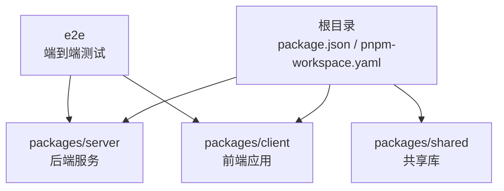
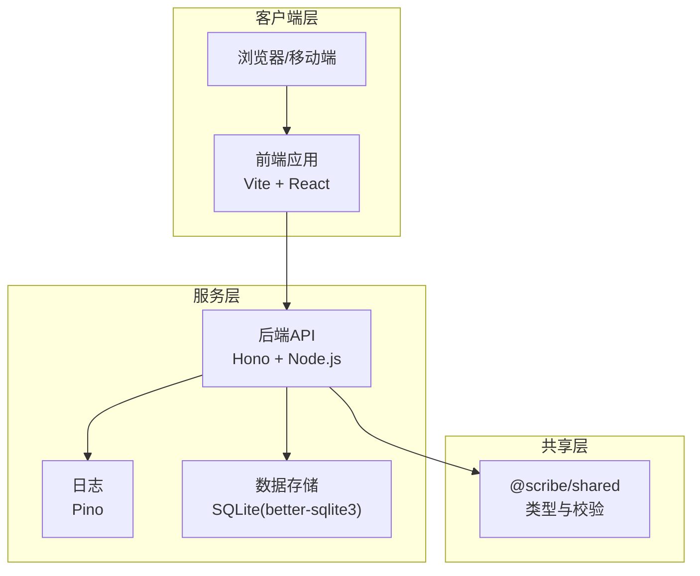
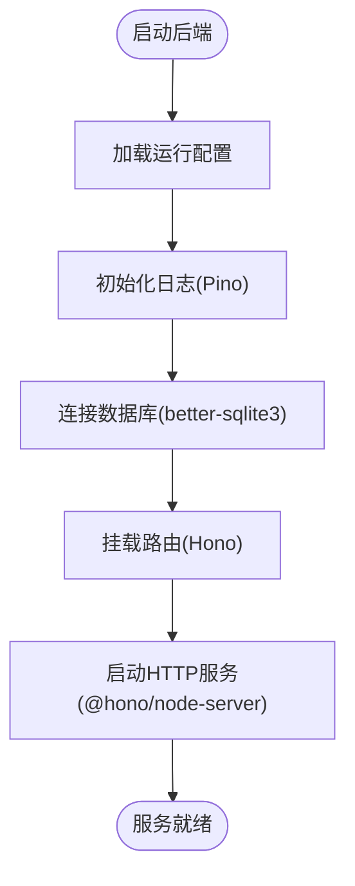
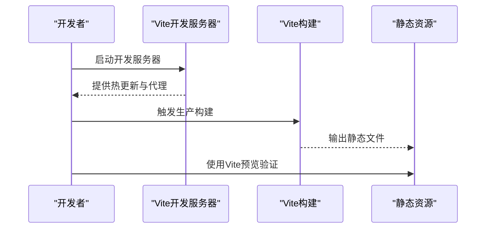
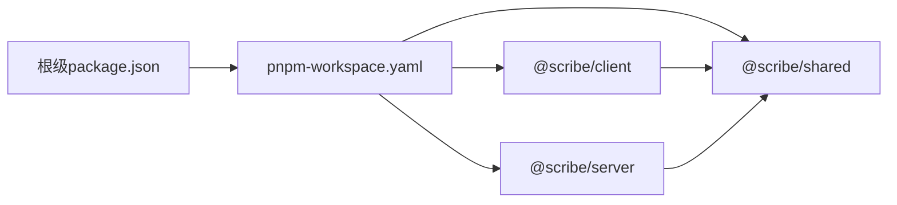

# 部署指南

<cite>
**本文档引用的文件**
- [package.json](file://package.json)
- [pnpm-workspace.yaml](file://pnpm-workspace.yaml)
- [packages/server/package.json](file://packages/server/package.json)
- [packages/client/package.json](file://packages/client/package.json)
- [packages/shared/package.json](file://packages/shared/package.json)
- [packages/server/tsconfig.json](file://packages/server/tsconfig.json)
- [packages/server/tsconfig.build.json](file://packages/server/tsconfig.build.json)
- [packages/client/vite.config.ts](file://packages/client/vite.config.ts)
- [e2e/playwright.config.ts](file://e2e/playwright.config.ts)
- [pnpm-lock.yaml](file://pnpm-lock.yaml)
- [tsconfig.base.json](file://tsconfig.base.json)
</cite>

## 目录
1. [简介](#简介)
2. [项目结构](#项目结构)
3. [核心组件](#核心组件)
4. [架构总览](#架构总览)
5. [详细组件分析](#详细组件分析)
6. [依赖关系分析](#依赖关系分析)
7. [性能考虑](#性能考虑)
8. [故障排除指南](#故障排除指南)
9. [结论](#结论)
10. [附录](#附录)

## 简介
本指南面向Scribe项目的部署与运维团队，覆盖从本地开发到生产部署的完整流程，包括环境准备、依赖安装、启动配置、容器化与Kubernetes部署、CI/CD流水线、性能优化、监控日志、安全配置以及不同部署场景的最佳实践模板。文档基于仓库中的实际配置文件进行分析与总结。

## 项目结构
Scribe采用monorepo结构，使用pnpm工作区管理多包（packages/server、packages/client、packages/shared），并通过根级脚本统一执行开发、构建与测试任务。客户端为前端应用，服务端为后端API与数据处理模块，共享层提供跨包复用的类型与工具。

**图表来源**
- [pnpm-workspace.yaml:1-4](file://pnpm-workspace.yaml#L1-L4)
- [package.json:1-21](file://package.json#L1-L21)

**章节来源**
- [pnpm-workspace.yaml:1-4](file://pnpm-workspace.yaml#L1-L4)
- [package.json:1-21](file://package.json#L1-L21)

## 核心组件
- 后端服务（packages/server）
  - 使用Hono作为Web框架，Node.js运行时，内置Pino日志，支持SQLite数据库（better-sqlite3）。
  - 提供开发模式（tsx watch）、构建（TypeScript编译+迁移脚本复制）与测试脚本。
- 前端应用（packages/client）
  - 基于Vite构建，React 18生态，包含路由、编辑器扩展等依赖。
- 共享库（packages/shared）
  - 提供跨包复用的类型定义与校验逻辑（如Zod）。
- 工作区与脚本
  - 根级脚本统一触发各包的开发、构建、测试与类型检查；pnpm工作区确保依赖版本一致性。

**章节来源**
- [packages/server/package.json:1-33](file://packages/server/package.json#L1-L33)
- [packages/client/package.json:1-39](file://packages/client/package.json#L1-L39)
- [packages/shared/package.json:1-19](file://packages/shared/package.json#L1-L19)
- [package.json:6-12](file://package.json#L6-L12)

## 架构总览
下图展示了Scribe在部署层面的典型分层：客户端通过HTTP请求与后端交互，后端负责业务逻辑与数据持久化，共享库提供跨层的类型与校验能力。

**图表来源**
- [packages/server/package.json:13-24](file://packages/server/package.json#L13-L24)
- [packages/client/package.json:12-24](file://packages/client/package.json#L12-L24)
- [packages/shared/package.json:11-12](file://packages/shared/package.json#L11-L12)

## 详细组件分析

### 后端服务（packages/server）
- 运行时与框架
  - Node.js运行时要求：根级引擎声明要求Node版本≥20。
  - Web框架：Hono + @hono/node-server。
  - 数据库：better-sqlite3（本地开发/轻量生产可用）。
  - 日志：Pino。
- 构建与开发
  - 开发：tsx watch自动重启监听。
  - 构建：TypeScript编译并执行迁移脚本复制。
  - 测试：Vitest。
- 关键依赖与用途
  - AI相关SDK：ai、@ai-sdk/openai-compatible，用于模型集成。
  - 序列化与解析：zod（类型校验）、gray-matter（内容解析）、tar（归档处理）。

**图表来源**
- [packages/server/package.json:7-10](file://packages/server/package.json#L7-L10)
- [packages/server/package.json:13-24](file://packages/server/package.json#L13-L24)

**章节来源**
- [packages/server/package.json:1-33](file://packages/server/package.json#L1-L33)
- [packages/server/tsconfig.json](file://packages/server/tsconfig.json)
- [packages/server/tsconfig.build.json](file://packages/server/tsconfig.build.json)

### 前端应用（packages/client）
- 技术栈
  - Vite构建，React 18，React Router v7，Tiptap富文本编辑器生态。
- 构建与开发
  - 开发：Vite开发服务器。
  - 构建：先TypeScript编译再Vite打包。
  - 测试：Vitest。
- 资源与产物
  - 生产构建输出静态资源，可通过Vite预览验证。

**图表来源**
- [packages/client/package.json:5-11](file://packages/client/package.json#L5-L11)
- [packages/client/vite.config.ts](file://packages/client/vite.config.ts)

**章节来源**
- [packages/client/package.json:1-39](file://packages/client/package.json#L1-L39)
- [packages/client/vite.config.ts](file://packages/client/vite.config.ts)

### 共享库（packages/shared）
- 作用
  - 提供跨包复用的类型定义与校验逻辑，减少重复实现。
- 依赖
  - Zod用于运行时类型校验。

**章节来源**
- [packages/shared/package.json:1-19](file://packages/shared/package.json#L1-L19)

### 端到端测试（e2e）
- 工具链
  - Playwright配置文件位于根级e2e目录，用于浏览器自动化测试。
- 与工作流集成
  - 根级脚本提供test:e2e，可直接在CI中执行。

**章节来源**
- [e2e/playwright.config.ts](file://e2e/playwright.config.ts)
- [package.json:10](file://package.json#L10)

## 依赖关系分析
- monorepo与包管理
  - pnpm工作区统一管理依赖，根级脚本并行执行各包任务。
  - 锁定文件保证依赖版本一致性。
- 包间依赖
  - 客户端依赖共享库；服务端依赖共享库与AI/数据库/日志等运行时依赖。
- TypeScript配置
  - 根tsconfig与各包tsconfig分别定义全局与局部编译选项。

**图表来源**
- [pnpm-workspace.yaml:1-4](file://pnpm-workspace.yaml#L1-L4)
- [package.json:1-21](file://package.json#L1-L21)
- [packages/client/package.json:12](file://packages/client/package.json#L12)
- [packages/server/package.json:13-14](file://packages/server/package.json#L13-L14)

**章节来源**
- [pnpm-workspace.yaml:1-4](file://pnpm-workspace.yaml#L1-L4)
- [pnpm-lock.yaml](file://pnpm-lock.yaml)
- [tsconfig.base.json](file://tsconfig.base.json)

## 性能考虑
- 缓存策略
  - 前端静态资源应启用长期缓存与版本化命名；服务端可利用内存缓存热点数据（需结合业务场景评估）。
- 数据库调优
  - SQLite适用于中小规模数据与单实例部署；高并发或大数据量建议迁移到PostgreSQL/MySQL，并开启连接池与索引优化。
- 资源分配
  - 合理设置Node.js堆大小与并发线程数；容器部署时为前后端分别设置CPU/内存限制与HPA策略。
- 构建优化
  - 前端启用代码分割与懒加载；后端按需加载模块，避免冷启动延迟。

## 故障排除指南
- 常见问题定位
  - 端口占用：确认开发/生产端口未被占用，必要时修改配置。
  - 依赖缺失：执行根级安装并同步工作区依赖。
  - 数据库权限：确保SQLite文件路径可写，或切换至远程数据库并正确配置连接参数。
- 日志与可观测性
  - 后端使用Pino输出结构化日志，建议接入集中式日志系统（如ELK/Fluent Bit）。
  - 前端错误可通过浏览器控制台与网络面板排查；结合后端日志定位问题。
- 回滚与应急
  - 保留最近N个版本的构建产物；变更回滚优先使用蓝绿/滚动发布策略。

## 结论
Scribe提供了清晰的monorepo结构与现代化技术栈，适合快速迭代与规模化部署。建议在生产环境中完善数据库选型、引入负载均衡与容器编排、建立完善的CI/CD与监控体系，并持续优化缓存与资源分配以提升用户体验与系统稳定性。

## 附录

### 本地部署流程
- 环境准备
  - Node.js版本满足根级引擎要求；安装pnpm并启用工作区。
- 依赖安装
  - 在根目录执行依赖安装，确保所有包依赖一致。
- 启动配置
  - 并行启动前后端：根级开发脚本会同时启动各包开发进程。
  - 或分别进入各包执行对应脚本（如服务端开发、前端开发）。

**章节来源**
- [package.json:6-12](file://package.json#L6-L12)
- [pnpm-workspace.yaml:1-4](file://pnpm-workspace.yaml#L1-L4)

### 生产环境部署最佳实践
- 服务器配置
  - 使用反向代理（Nginx/Caddy）统一入口，开启Gzip/HTTP/2，配置健康检查。
- 数据库设置
  - SQLite仅限小规模；推荐PostgreSQL/MySQL，启用连接池、只读副本与备份策略。
- 负载均衡
  - 多实例横向扩展，配合会话粘性或无状态设计；健康检查失败自动摘除。

### 容器化部署方案
- Docker镜像构建
  - 前端：使用多阶段构建，基础镜像选择官方Node与Nginx，输出静态资源。
  - 后端：基于Node官方镜像，安装运行时依赖，暴露端口并设置非root用户。
- Kubernetes部署
  - Deployment：副本数、滚动更新策略、探针配置。
  - Service：ClusterIP/LoadBalancer暴露服务。
  - ConfigMap/Secret：存放配置与密钥。
  - Ingress：域名与TLS终止。

### CI/CD流水线设置
- 触发条件
  - 分支保护规则：主分支推送触发构建与测试；PR触发单元与端到端测试。
- 步骤建议
  - 安装依赖 → 类型检查 → 单元测试 → 端到端测试 → 构建前端与后端 → 打包镜像 → 推送镜像 → 发布到K8s。
- 自动化部署
  - 使用GitOps（如ArgoCD/Flux）实现声明式部署与回滚。

### 监控与日志配置
- 指标采集
  - CPU/内存/请求量/错误率/数据库连接数。
- 日志管理
  - 结构化日志输出，集中收集与检索；敏感信息脱敏。
- 告警策略
  - 基于阈值与趋势的告警，结合SLA设定。

### 安全配置
- SSL/TLS
  - 反向代理终止TLS，使用Let's Encrypt自动续期。
- 访问控制
  - IP白名单、速率限制、API网关鉴权；对敏感接口启用认证与授权。
- 数据安全
  - 数据库加密、传输加密、密钥轮换与最小权限原则。

### 不同部署场景的配置模板与最佳实践
- 小型团队/演示环境
  - 单机部署，SQLite + Nginx + PM2/Docker Compose。
- 中型企业
  - 多实例 + 负载均衡 + PostgreSQL + Redis缓存 + Kubernetes + CI/CD。
- 高可用/超大规模
  - 多可用区部署、读写分离、分布式缓存、APM监控、灾备演练。