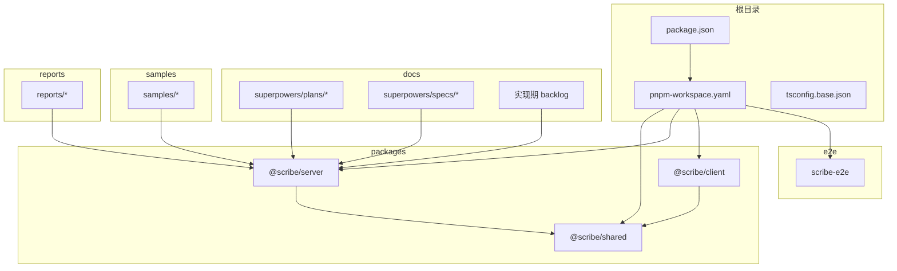
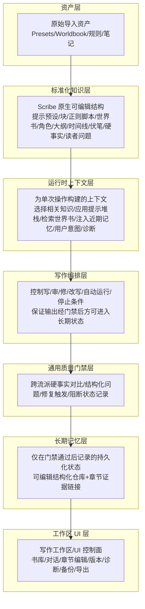
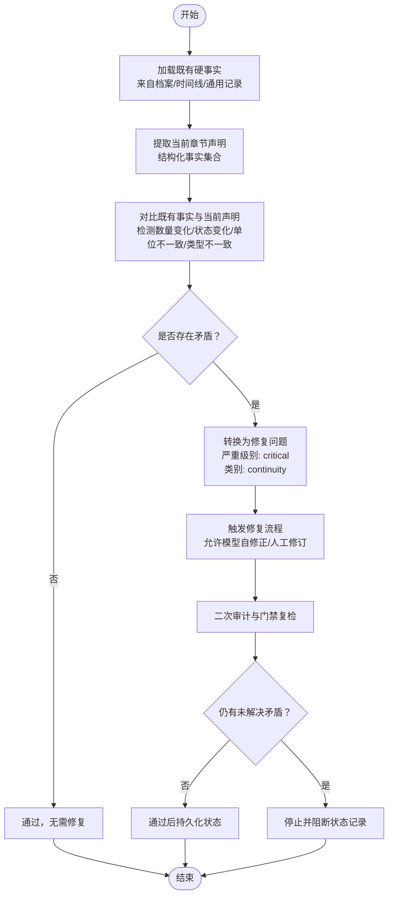
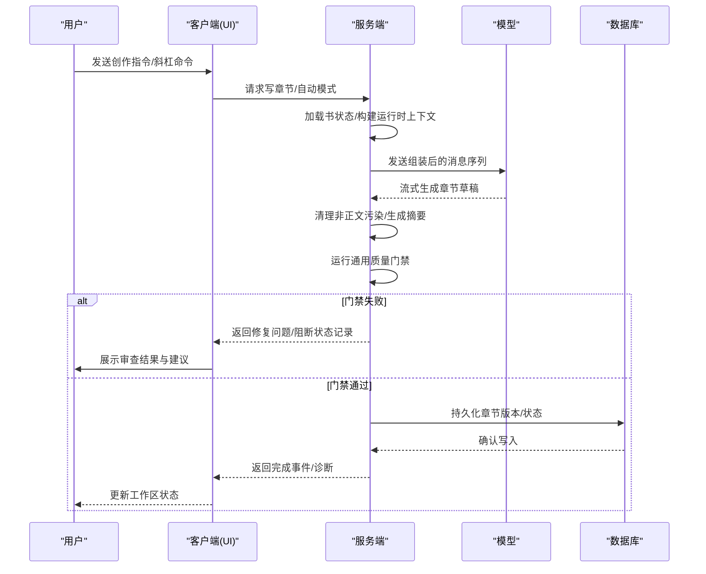
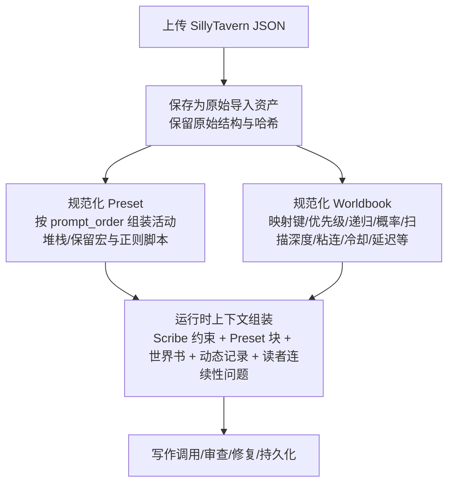
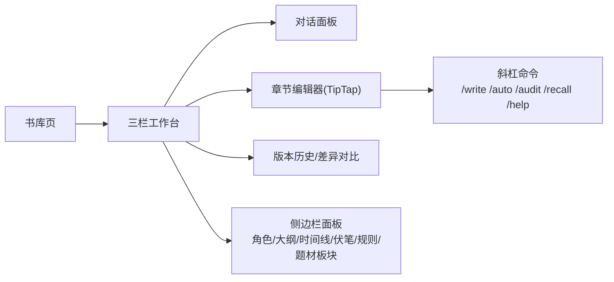
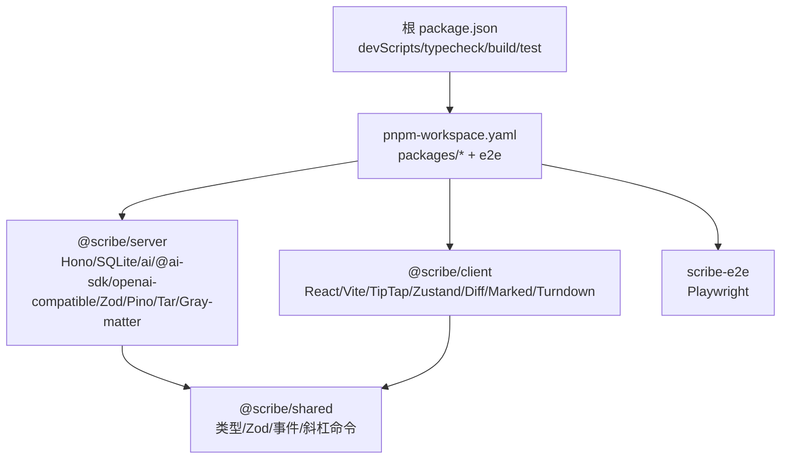

# 产品介绍与价值主张

<cite>
**本文引用的文件**
- [README.md](file://README.md)
- [package.json](file://package.json)
- [pnpm-workspace.yaml](file://pnpm-workspace.yaml)
- [tsconfig.base.json](file://tsconfig.base.json)
- [docs/superpowers/specs/2026-06-17-scribe-ultimate-product-goal.md](file://docs/superpowers/specs/2026-06-17-scribe-ultimate-product-goal.md)
- [docs/superpowers/plans/2026-06-17-scribe-final-roadmap.md](file://docs/superpowers/plans/2026-06-17-scribe-final-roadmap.md)
- [docs/superpowers/plans/2026-06-17-scribe-phase1-generic-continuity-gates.md](file://docs/superpowers/plans/2026-06-17-scribe-phase1-generic-continuity-gates.md)
- [docs/superpowers/specs/2026-06-16-sillytavern-import-design.md](file://docs/superpowers/specs/2026-06-16-sillytavern-import-design.md)
- [docs/_implementation-notes.md](file://docs/_implementation-notes.md)
- [packages/client/package.json](file://packages/client/package.json)
- [packages/server/package.json](file://packages/server/package.json)
- [packages/shared/package.json](file://packages/shared/package.json)
- [e2e/package.json](file://e2e/package.json)
</cite>

## 目录
1. [引言](#引言)
2. [项目结构](#项目结构)
3. [核心组件](#核心组件)
4. [架构总览](#架构总览)
5. [详细组件分析](#详细组件分析)
6. [依赖分析](#依赖分析)
7. [性能考虑](#性能考虑)
8. [故障排查指南](#故障排查指南)
9. [结论](#结论)
10. [附录](#附录)

## 引言
Scribe 是一款“本地优先”的长篇小说创作工作空间，旨在将设定、世界书、预设、对话意图、章节正文、审查结果与长期记忆有机整合，形成可持续推进的长篇写作项目。它不是单章生成器，也不是聊天包装器，而是一个以“对话驱动创作、长期记忆管理、通用质量门禁”为核心能力的本地 AI 小说工作室。

Scribe 的价值主张围绕以下设计哲学展开：
- 本地优先：数据驻留在本地，离线可用，隐私可控。
- 创作者至上：用户是最终决策者，AI 是编辑、草稿助手与连续性守护者。
- 可持续长篇：通过可审计的生成工作流、通用质量门禁与可编辑的长期记忆，保障跨章节一致性。
- 可见即可控：所有生成、检索、审查与状态变更均可被用户查看与纠正。

## 项目结构
Scribe 采用 monorepo 结构，包含前后端与共享层，配合端到端测试与实现期笔记，支撑从 MVP 到完整工作空间的演进。

**图表来源**
- [pnpm-workspace.yaml:1-4](file://pnpm-workspace.yaml#L1-L4)
- [package.json:1-21](file://package.json#L1-L21)
- [tsconfig.base.json:1-16](file://tsconfig.base.json#L1-L16)

**章节来源**
- [README.md:44-56](file://README.md#L44-L56)
- [pnpm-workspace.yaml:1-4](file://pnpm-workspace.yaml#L1-L4)
- [package.json:1-21](file://package.json#L1-L21)
- [tsconfig.base.json:1-16](file://tsconfig.base.json#L1-L16)

## 核心组件
- 本地数据与持久化
  - 跨平台应用路径解析与数据库：支持 Windows/macOS/Linux，统一在用户配置目录下管理 library.db 与各书的 workspace.db，迁移脚本幂等执行，保证项目可恢复。
  - 章节文件与规则：章节以 Markdown 存储，配套 rules.md、版本历史与快照，确保可审计与可回溯。
- 写作编排与质量门禁
  - 写作流水线：加载书状态 → 组装运行时上下文 → 生成草稿 → 清理非正文污染 → 审查与摘要 → 通用质量门禁 → 修复与再审查 → 通过后持久化状态 → 产出诊断。
  - 通用质量门禁：基于“硬事实”（数量、状态、位置、所有权、关系、截止、冷却、伤害、任务）的跨流派对比，检测未显式解释的变化，阻止错误记忆进入长期存储。
- SillyTavern 兼容层
  - 完整导入与规范化：Presets（含宏与正则脚本）、Worldbook（含常量、触发、选择性、概率、递归、扫描深度、粘连/冷却/延迟等）均被导入并保留原始结构，同时映射到 Scribe 原生知识层。
  - 运行时融合：Scrib 的系统约束、动态记录与读者连续性问题，与导入的预设与世界书在每次写作调用前进行确定性组装。
- 用户工作区与可观测性
  - 三栏工作台：书库、写作工作区、侧边栏（角色、大纲、时间线、伏笔、规则、题材板块等），支持版本历史、差异对比与选段改写。
  - 可视化诊断：章节审查横幅、运行时诊断、成本与令牌用量、快照与导出。

**章节来源**
- [docs/superpowers/specs/2026-06-17-scribe-ultimate-product-goal.md:104-126](file://docs/superpowers/specs/2026-06-17-scribe-ultimate-product-goal.md#L104-L126)
- [docs/superpowers/specs/2026-06-17-scribe-ultimate-product-goal.md:127-143](file://docs/superpowers/specs/2026-06-17-scribe-ultimate-product-goal.md#L127-L143)
- [docs/superpowers/specs/2026-06-16-sillytavern-import-design.md:134-288](file://docs/superpowers/specs/2026-06-16-sillytavern-import-design.md#L134-L288)
- [docs/superpowers/specs/2026-06-17-scribe-ultimate-product-goal.md:144-167](file://docs/superpowers/specs/2026-06-17-scribe-ultimate-product-goal.md#L144-L167)

## 架构总览
Scribe 的最终架构围绕稳定分层组织，从资产层到工作区 UI，层层解耦、职责清晰：

**图表来源**
- [docs/superpowers/specs/2026-06-17-scribe-ultimate-product-goal.md:212-247](file://docs/superpowers/specs/2026-06-17-scribe-ultimate-product-goal.md#L212-L247)

**章节来源**
- [docs/superpowers/specs/2026-06-17-scribe-ultimate-product-goal.md:212-247](file://docs/superpowers/specs/2026-06-17-scribe-ultimate-product-goal.md#L212-L247)

## 详细组件分析

### 组件A：通用质量门禁（硬事实对比）
Scribe 的第一阶段关键能力之一是“通用质量门禁”，通过跨流派的“硬事实”对比，阻止错误记忆进入长期存储，确保连续性。

**图表来源**
- [docs/superpowers/plans/2026-06-17-scribe-phase1-generic-continuity-gates.md:169-330](file://docs/superpowers/plans/2026-06-17-scribe-phase1-generic-continuity-gates.md#L169-L330)
- [docs/superpowers/plans/2026-06-17-scribe-phase1-generic-continuity-gates.md:618-654](file://docs/superpowers/plans/2026-06-17-scribe-phase1-generic-continuity-gates.md#L618-L654)

**章节来源**
- [docs/superpowers/plans/2026-06-17-scribe-phase1-generic-continuity-gates.md:1-800](file://docs/superpowers/plans/2026-06-17-scribe-phase1-generic-continuity-gates.md#L1-L800)

### 组件B：写作编排与审查流程
Scribe 的章节生成并非一次性调用，而是一条受控流水线，贯穿上下文组装、生成、审查、修复与持久化。

**图表来源**
- [docs/superpowers/specs/2026-06-17-scribe-ultimate-product-goal.md:104-126](file://docs/superpowers/specs/2026-06-17-scribe-ultimate-product-goal.md#L104-L126)
- [docs/_implementation-notes.md:218-228](file://docs/_implementation-notes.md#L218-L228)

**章节来源**
- [docs/superpowers/specs/2026-06-17-scribe-ultimate-product-goal.md:104-126](file://docs/superpowers/specs/2026-06-17-scribe-ultimate-product-goal.md#L104-L126)
- [docs/_implementation-notes.md:218-228](file://docs/_implementation-notes.md#L218-L228)

### 组件C：SillyTavern 导入与运行时兼容
Scribe 将 SillyTavern 的 Preset 与 Worldbook 作为资产层导入，经过规范化后融入运行时上下文，确保与 Scribe 的动态记录与连续性质量层协同。

**图表来源**
- [docs/superpowers/specs/2026-06-16-sillytavern-import-design.md:134-288](file://docs/superpowers/specs/2026-06-16-sillytavern-import-design.md#L134-L288)

**章节来源**
- [docs/superpowers/specs/2026-06-16-sillytavern-import-design.md:1-548](file://docs/superpowers/specs/2026-06-16-sillytavern-import-design.md#L1-L548)

### 组件D：工作区 UI 与交互
Scribe 的前端采用三栏工作台，提供书库、写作工作区与侧边栏面板，支持版本历史、差异对比、选段改写与斜杠命令，使创作流程可视化、可追溯。

**图表来源**
- [docs/superpowers/specs/2026-06-17-scribe-ultimate-product-goal.md:144-167](file://docs/superpowers/specs/2026-06-17-scribe-ultimate-product-goal.md#L144-L167)
- [README.md:63-72](file://README.md#L63-L72)

**章节来源**
- [docs/superpowers/specs/2026-06-17-scribe-ultimate-product-goal.md:144-167](file://docs/superpowers/specs/2026-06-17-scribe-ultimate-product-goal.md#L144-L167)
- [README.md:63-72](file://README.md#L63-L72)

## 依赖分析
Scribe 的依赖分布清晰，前后端与共享层职责明确，测试与端到端覆盖贯穿开发流程。

**图表来源**
- [packages/shared/package.json:1-19](file://packages/shared/package.json#L1-L19)
- [packages/server/package.json:1-33](file://packages/server/package.json#L1-L33)
- [packages/client/package.json:1-39](file://packages/client/package.json#L1-L39)
- [e2e/package.json:1-15](file://e2e/package.json#L1-L15)
- [package.json:1-21](file://package.json#L1-L21)
- [pnpm-workspace.yaml:1-4](file://pnpm-workspace.yaml#L1-L4)

**章节来源**
- [packages/shared/package.json:1-19](file://packages/shared/package.json#L1-L19)
- [packages/server/package.json:1-33](file://packages/server/package.json#L1-L33)
- [packages/client/package.json:1-39](file://packages/client/package.json#L1-L39)
- [e2e/package.json:1-15](file://e2e/package.json#L1-L15)
- [package.json:1-21](file://package.json#L1-L21)
- [pnpm-workspace.yaml:1-4](file://pnpm-workspace.yaml#L1-L4)

## 性能考虑
- 上下文组装与预算控制：通过上下文预算与裁剪，避免超长上下文导致的性能与成本问题；token 估算用于预算决策，实际成本以使用量为准。
- 迁移与数据库：SQLite 迁移幂等执行，WAL 模式与外键开启提升可靠性；版本唯一约束防止并发写入冲突。
- 流式输出与 SSE：使用流式传输减少等待，结合错误分类与重试策略，提升稳定性。
- 本地优先与离线可用：所有数据与模型调用可在本地完成，降低网络抖动影响。

**章节来源**
- [docs/_implementation-notes.md:321-331](file://docs/_implementation-notes.md#L321-L331)
- [docs/_implementation-notes.md:144-149](file://docs/_implementation-notes.md#L144-L149)
- [docs/_implementation-notes.md:180-197](file://docs/_implementation-notes.md#L180-L197)

## 故障排查指南
- 环境与安装
  - Node.js 版本要求与 pnpm 版本：确保 Node ≥ 20，pnpm 9；必要时在 .npmrc 中启用 node-linker=hoisted 以规避 Windows 原生模块安装问题。
  - API Key 配置：在数据目录 secrets.env 中配置模型密钥，确保服务端可访问。
- 数据与路径
  - 跨平台路径：确认 SCRIBE_HOME 环境变量优先于默认路径；检查 library.db 与各书 workspace.db 是否存在。
  - 迁移与数据库：如遇迁移失败，检查迁移脚本与数据库权限；确认 WAL 与外键设置。
- 写作与审查
  - 门禁阻断：当门禁返回阻断问题时，先修复后再继续；检查修复建议与证据来源。
  - 流式事件：关注 done/error 事件唯一终止约定，避免重复收尾。
- 端到端与测试
  - e2e 测试：确保 Playwright 浏览器安装与 baseURL 正确；运行 test:e2e 验证端到端流程。
  - 单元/集成测试：按包运行测试，确保类型检查与覆盖率符合要求。

**章节来源**
- [README.md:5-42](file://README.md#L5-L42)
- [docs/_implementation-notes.md:35-45](file://docs/_implementation-notes.md#L35-L45)
- [docs/_implementation-notes.md:104-134](file://docs/_implementation-notes.md#L104-L134)
- [docs/_implementation-notes.md:260-298](file://docs/_implementation-notes.md#L260-L298)
- [e2e/package.json:1-15](file://e2e/package.json#L1-L15)

## 结论
Scribe 以“本地优先、创作者至上、可见即可控”为核心，通过对话驱动创作、长期记忆管理与通用质量门禁，有效解决 AI 写作中的“遗忘”“漂移”“不可控”等痛点。其分层架构与可审计的生成工作流，使其既能满足个人作家的创作效率，也能支撑团队与工作室的协作与交付需求。随着 SillyTavern 兼容层与工作区 UI 的完善，Scribe 将成为一款真正可持续推进长篇小说创作的本地 AI 小说工作室。

## 附录
- 适用场景与收益
  - 个人作家：离线可用、隐私可控、创作流程自动化、长期记忆可编辑，降低反复提醒与上下文漂移成本。
  - 团队创作者：统一的知识层与可审计流程，便于多人协作与版本管理；质量门禁减少返工。
  - 内容工作室：可导入丰富资产（Presets/Worldbook），结合动态记录与读者连续性问题，保障跨章节一致性与交付质量。
- 使用案例与成功故事
  - 通过通用质量门禁与修复流程，避免资源/状态/时间线等硬事实在多章节间发生“静默重置”，显著提升长篇连续性。
  - 以 SillyTavern 导入资产为基础，结合 Scribe 的动态记录与审查，实现跨流派（都市/仙侠/推理/科幻）的稳定生成与持续改进。
  - 以三栏工作台与版本历史，帮助用户快速定位问题、进行选段改写与差异对比，缩短迭代周期。