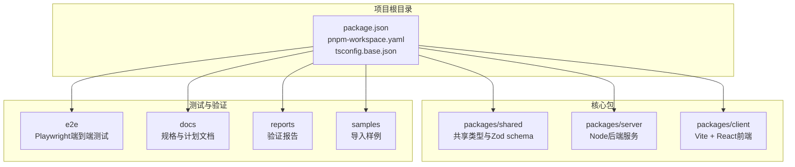
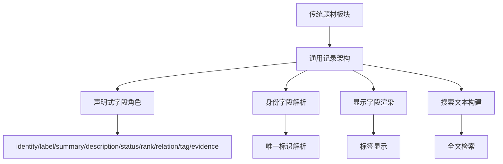
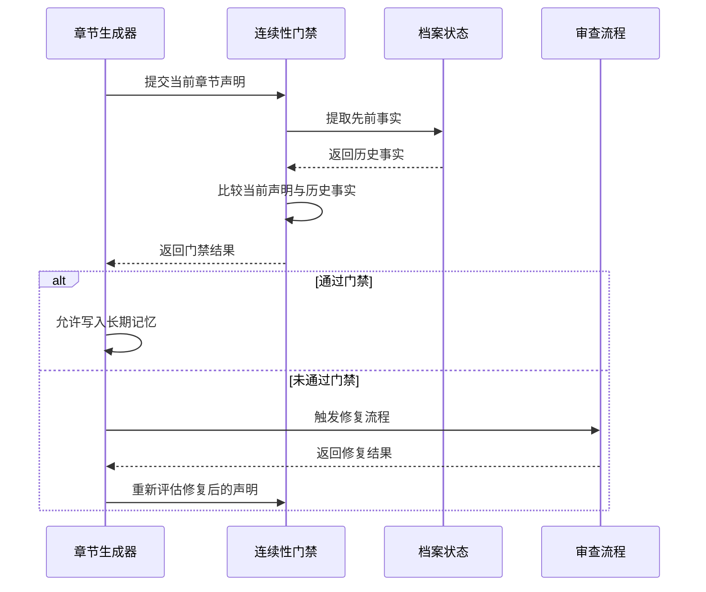
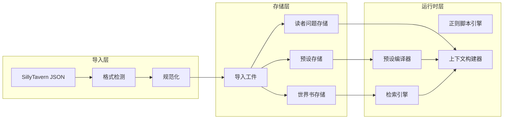
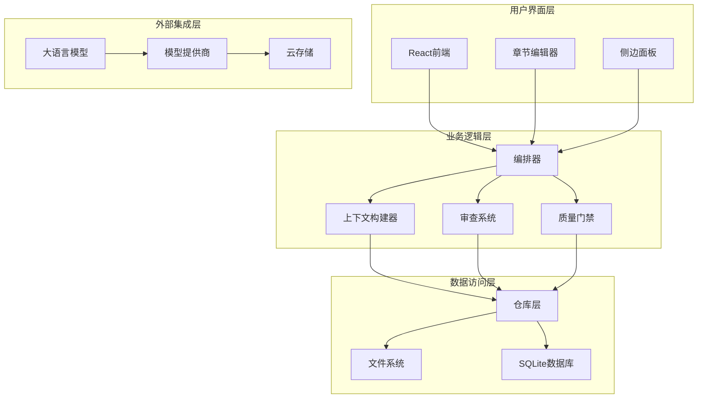
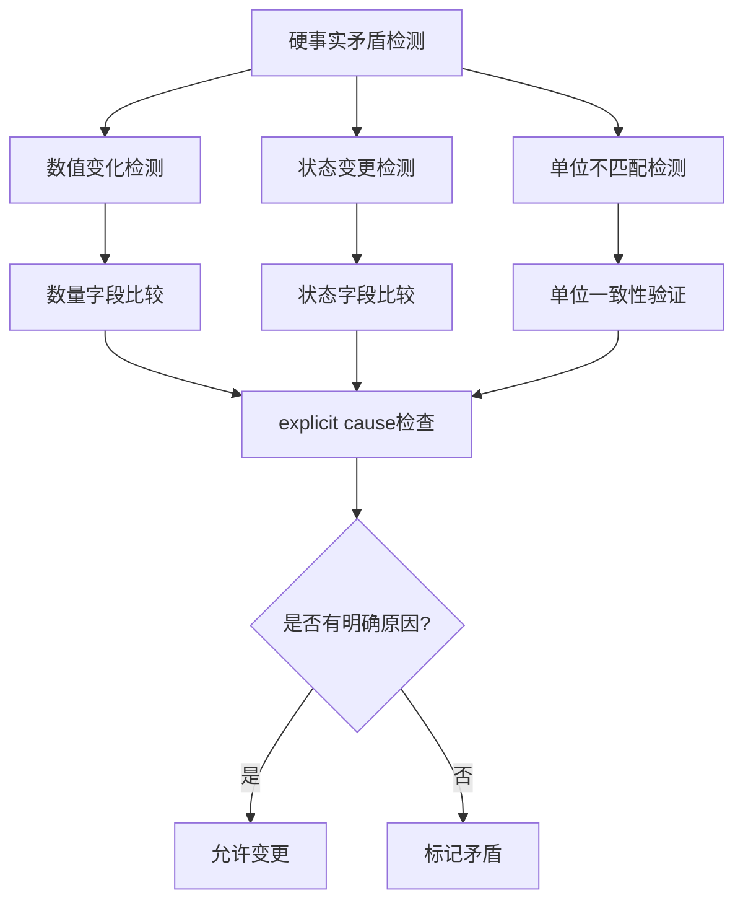
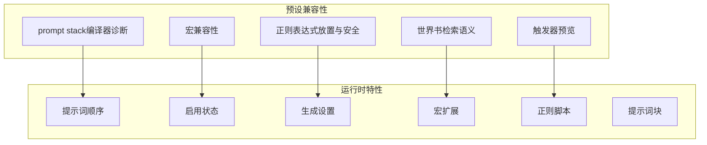
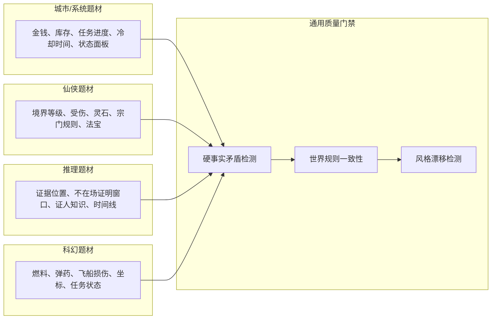
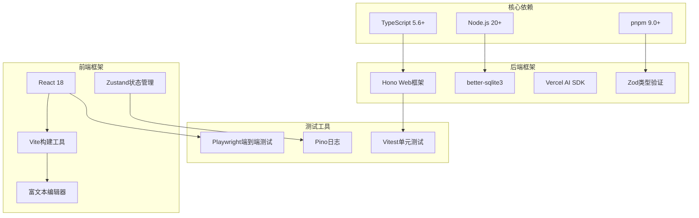
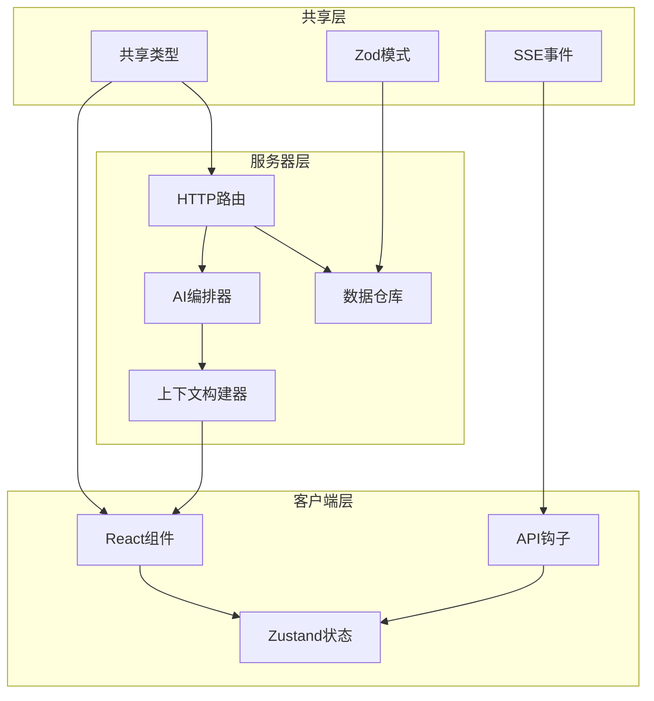

# 发展规划与路线图

<cite>
**本文档引用的文件**
- [2026-06-17-scribe-final-roadmap.md](file://docs/superpowers/plans/2026-06-17-scribe-final-roadmap.md)
- [2026-06-15-generic-record-architecture.md](file://docs/superpowers/plans/2026-06-15-generic-record-architecture.md)
- [2026-06-17-scribe-phase1-generic-continuity-gates.md](file://docs/superpowers/plans/2026-06-17-scribe-phase1-generic-continuity-gates.md)
- [2026-06-17-scribe-ultimate-product-goal.md](file://docs/superpowers/specs/2026-06-17-scribe-ultimate-product-goal.md)
- [2026-06-16-sillytavern-import.md](file://docs/superpowers/plans/2026-06-16-sillytavern-import.md)
- [2026-06-16-sillytavern-full-compatibility.md](file://docs/superpowers/plans/2026-06-16-sillytavern-full-compatibility.md)
- [2026-06-16-sillytavern-import-design.md](file://docs/superpowers/specs/2026-06-16-sillytavern-import-design.md)
- [2026-06-04-scribe-mvp.md](file://docs/superpowers/plans/2026-06-04-scribe-mvp.md)
- [README.md](file://README.md)
- [_implementation-notes.md](file://docs/_implementation-notes.md)
</cite>

## 目录
1. [引言](#引言)
2. [项目结构](#项目结构)
3. [核心组件](#核心组件)
4. [架构概览](#架构概览)
5. [详细组件分析](#详细组件分析)
6. [依赖分析](#依赖分析)
7. [性能考虑](#性能考虑)
8. [故障排除指南](#故障排除指南)
9. [结论](#结论)
10. [附录](#附录)

## 引言

Scribe是一个本地优先的AI长篇小说创作工作台，旨在将设定、世界书、预设、对话意图、章节正文、审查结果和长期记忆组织成一个可持续推进的写作项目。该项目采用渐进式发展策略，通过明确的阶段划分和里程碑目标，确保技术架构的稳定性和功能的完整性。

基于官方规划文档，Scribe项目制定了从MVP到最终产品的完整发展路线图，重点关注通用记录架构、连续性门禁系统等关键技术的实施进度和预期成果。

## 项目结构

Scribe项目采用monorepo架构，包含前后端分离的完整开发环境：



**图表来源**
- [README.md:44-55](file://README.md#L44-L55)

项目采用分层架构设计，每个阶段都有明确的交付物和验收标准：

**阶段划分与交付物**

| 阶段 | 名称 | 主要任务 | 交付物 |
|------|------|----------|--------|
| 0 | 项目骨架 | 初始化仓库、依赖管理、基础结构 | 完整的monorepo环境 |
| 1 | 数据层 | SQLite schema、文件IO、备份调度 | 数据存储基础设施 |
| 2 | DeepSeek适配器 | Provider接口、模型列表、错误分类 | LLM集成能力 |
| 3 | 简单写作链路 | 对话API + SSE、章节生成 | 基础写作功能 |
| 4 | 审查与摘要 | 7维审查、摘要生成、状态更新 | 质量控制体系 |
| 5 | 上下文构建 | 完整prompt组装、章节召回 | 上下文管理能力 |
| 6 | 题材板块 | AI自创工具、UI交互 | 动态知识管理 |
| 7 | 新建书流程 | 对话引导、信息判定、跳过机制 | 项目初始化流程 |
| 8 | 前端三栏 | 书架页、工作台、编辑器 | 完整UI界面 |
| 9 | 自动模式 | 状态机、版本管理、用量统计 | 自动化写作能力 |
| 10 | 备份导出 | 快照、导出、收尾工作 | 完整产品功能 |

**章节来源**
- [2026-06-04-scribe-mvp.md:37-51](file://docs/superpowers/plans/2026-06-04-scribe-mvp.md#L37-L51)

## 核心组件

### 通用记录架构（Generic Record Architecture）

通用记录架构是Scribe项目的核心技术基石，旨在将现有的题材板块状态系统重构为完全通用的声明驱动记录架构。

**架构目标**
- 移除特定题材的硬编码逻辑
- 实现领域无关的记录管理
- 支持AI动态创建和维护记录集合
- 保持向后兼容性

**关键技术特性**



**图表来源**
- [2026-06-15-generic-record-architecture.md:5-23](file://docs/superpowers/plans/2026-06-15-generic-record-architecture.md#L5-L23)

**约束条件**
- 不在生产逻辑中编码小说题材、设定类型或书本特定概念
- 不从"第一个必需字段"推断身份、标签或显示字段
- 不允许`add`语义在AI提及相同记录时创建重复项
- 关系必须通过本地接口解决，而非仅限于提示词行为

**章节来源**
- [2026-06-15-generic-record-architecture.md:25-33](file://docs/superpowers/plans/2026-06-15-generic-record-architecture.md#L25-L33)

### 连续性门禁系统（Generic Continuity Gates）

连续性门禁系统是Scribe项目质量保证的核心组件，专门设计用于检测和阻止破坏故事连续性的章节进入长期记忆。

**系统架构**



**图表来源**
- [2026-06-17-scribe-phase1-generic-continuity-gates.md:675-775](file://docs/superpowers/plans/2026-06-17-scribe-phase1-generic-continuity-gates.md#L675-L775)

**门禁类型**
- 硬事实矛盾检测：数量变化、状态变更、单位不匹配
- 世界规则矛盾：机制改变、能力限制破坏、约束不一致
- 角色连续性漂移：行为、关系、知识、言语、动机变化
- 故事情节错误：事件重复、后果缺失、因果关系不完整

**章节来源**
- [2026-06-17-scribe-phase1-generic-continuity-gates.md:127-154](file://docs/superpowers/plans/2026-06-17-scribe-phase1-generic-continuity-gates.md#L127-L154)

### SillyTavern兼容性系统

SillyTavern兼容性系统实现了完整的导入、编辑和运行时兼容，确保用户可以自由使用SillyTavern的预设和世界书。

**兼容性层次**



**图表来源**
- [2026-06-16-sillytavern-import.md:13-59](file://docs/superpowers/plans/2026-06-16-sillytavern-import.md#L13-L59)

**章节来源**
- [2026-06-16-sillytavern-import.md:61-609](file://docs/superpowers/plans/2026-06-16-sillytavern-import.md#L61-L609)

## 架构概览

Scribe项目采用分层架构设计，确保各层之间的职责分离和松耦合：



**图表来源**
- [2026-06-17-scribe-ultimate-product-goal.md:212-247](file://docs/superpowers/specs/2026-06-17-scribe-ultimate-product-goal.md#L212-L247)

**章节来源**
- [2026-06-17-scribe-ultimate-product-goal.md:212-247](file://docs/superpowers/specs/2026-06-17-scribe-ultimate-product-goal.md#L212-L247)

## 详细组件分析

### 阶段1：通用连续性门禁

阶段1专注于构建产品关键的基础层，实现跨题材的通用硬事实质量门禁。

**实施进度**

| 任务 | 描述 | 状态 | 关键文件 |
|------|------|------|----------|
| 任务1 | 通用硬事实域模型 | 已完成 | hard-facts.ts |
| 任务2 | 从档案状态提取硬事实 | 已完成 | archive-hard-facts.ts |
| 任务3 | 质量门禁管道适配器 | 已完成 | pipeline.ts |
| 任务4 | 阻止状态记录的门禁守卫 | 已完成 | record-state.ts |
| 任务5 | 证明writeWithAudit修复门禁问题 | 已完成 | write-then-audit.test.ts |

**技术挑战与解决方案**



**图表来源**
- [2026-06-17-scribe-phase1-generic-continuity-gates.md:259-314](file://docs/superpowers/plans/2026-06-17-scribe-phase1-generic-continuity-gates.md#L259-L314)

**章节来源**
- [2026-06-17-scribe-phase1-generic-continuity-gates.md:36-350](file://docs/superpowers/plans/2026-06-17-scribe-phase1-generic-continuity-gates.md#L36-L350)

### 阶段2：模型辅助硬事实提取

阶段2的目标是使用题材中性的模式从散文中提取当前章节声明。

**核心功能**

| 功能 | 描述 | 实现要点 |
|------|------|----------|
| 提示词与解析器 | 从文本中提取硬事实声明 | 支持结构化状态面板的确定性回退 |
| 证据跨度 | 标识支持声明的事实来源 | 提供可信度阈值 |
| 修复循环集成 | 将门禁结果集成到修复流程 | 自动触发必要的修复操作 |

**章节来源**
- [2026-06-17-scribe-final-roadmap.md:19-29](file://docs/superpowers/plans/2026-06-17-scribe-final-roadmap.md#L19-L29)

### 阶段3：SillyTavern运行时兼容性

阶段3专注于完成预设和世界书运行时兼容性，作为资产/运行时层。

**兼容性范围**



**图表来源**
- [2026-06-17-scribe-final-roadmap.md:31-42](file://docs/superpowers/plans/2026-06-17-scribe-final-roadmap.md#L31-L42)

**章节来源**
- [2026-06-16-sillytavern-full-compatibility.md:21-54](file://docs/superpowers/plans/2026-06-16-sillytavern-full-compatibility.md#L21-L54)

### 阶段4：内存与诊断UI

阶段4的目标是使内存可检查和可纠正，为用户提供直观的操作界面。

**界面组件**

| 组件 | 功能 | 用户价值 |
|------|------|----------|
| 硬事实面板 | 显示和管理硬事实记录 | 帮助用户理解AI记住的内容 |
| 质量门禁报告面板 | 显示门禁检查结果 | 提供质量控制反馈 |
| 内存锁定/删除/更正操作 | 直接编辑长期记忆 | 用户控制创作方向 |
| 章节诊断视图 | 显示章节生成过程 | 增强透明度和可调试性 |

**章节来源**
- [2026-06-17-scribe-final-roadmap.md:43-52](file://docs/superpowers/plans/2026-06-17-scribe-final-roadmap.md#L43-L52)

### 阶段5：工作区完成

阶段5将应用程序转变为完整的长篇写作工作区。

**核心功能**

| 功能 | 描述 | 技术实现 |
|------|------|----------|
| 改进的书籍设置 | 更好的项目初始化体验 | 优化的引导流程 |
| 版本/差异工作流 | 章节版本管理和对比 | 基于SQLite的版本控制 |
| 导出包 | 完整的项目打包功能 | 支持多种导出格式 |
| 备份/恢复UX | 用户友好的数据保护 | 自动快照和手动备份 |
| 成本诊断 | 用量统计和成本分析 | 实时token使用跟踪 |

**章节来源**
- [2026-06-17-scribe-final-roadmap.md:54-64](file://docs/superpowers/plans/2026-06-17-scribe-final-roadmap.md#L54-L64)

### 阶段6：验收测试框架

阶段6的目标是通过不同题材的多章节验证工作流，证明系统的长期写作质量。

**多题材测试场景**



**图表来源**
- [2026-06-17-scribe-final-roadmap.md:66-78](file://docs/superpowers/plans/2026-06-17-scribe-final-roadmap.md#L66-L78)

**章节来源**
- [2026-06-17-scribe-final-roadmap.md:66-78](file://docs/superpowers/plans/2026-06-17-scribe-final-roadmap.md#L66-L78)

## 依赖分析

### 技术栈依赖

Scribe项目采用现代化的技术栈，确保开发效率和运行性能：



**图表来源**
- [2026-06-04-scribe-mvp.md:9](file://docs/superpowers/plans/2026-06-04-scribe-mvp.md#L9)

### 模块间依赖关系



**图表来源**
- [2026-06-04-scribe-mvp.md:57-233](file://docs/superpowers/plans/2026-06-04-scribe-mvp.md#L57-L233)

**章节来源**
- [2026-06-04-scribe-mvp.md:57-233](file://docs/superpowers/plans/2026-06-04-scribe-mvp.md#L57-L233)

## 性能考虑

### 数据库性能优化

Scribe项目采用SQLite作为主要数据存储，通过以下策略确保性能：

- **WAL模式**：启用写-ahead logging提高并发性能
- **外键约束**：确保数据完整性的同时保持查询效率
- **索引优化**：为常用查询字段建立适当索引
- **事务管理**：合理使用事务减少磁盘I/O

### 内存管理

- **分页加载**：大量数据采用分页策略避免内存溢出
- **懒加载**：非关键数据延迟加载
- **缓存策略**：热点数据缓存，定期清理过期数据

### 网络性能

- **连接池**：数据库连接池管理
- **请求合并**：相似请求合并减少网络往返
- **压缩传输**：大文件传输启用压缩

## 故障排除指南

### 常见问题与解决方案

**环境配置问题**
- 确保Node.js版本≥20，pnpm版本≥9
- 检查环境变量`SCRIBE_HOME`是否正确设置
- 验证API密钥配置文件存在且格式正确

**数据库问题**
- SQLite版本兼容性：确保better-sqlite3≥v11.7
- 数据库文件权限：确保应用程序有读写权限
- 迁移失败：检查SQL语法和数据类型

**性能问题**
- 监控token使用量，避免超出预算
- 检查索引是否有效
- 优化复杂查询的执行计划

**章节来源**
- [_implementation-notes.md:11-46](file://docs/_implementation-notes.md#L11-L46)

### 调试工具

- **类型检查**：使用`tsc --noEmit`进行类型验证
- **单元测试**：`pnpm test`运行所有单元测试
- **端到端测试**：`pnpm test:e2e`运行UI测试
- **覆盖率**：`pnpm --filter @scribe/server test -- --coverage`

## 结论

Scribe项目通过明确的阶段性发展规划，建立了从MVP到完整产品的完整技术路径。项目的核心优势在于：

1. **架构前瞻性**：通用记录架构确保了跨题材的可扩展性
2. **质量保证**：连续性门禁系统提供了强大的质量控制机制
3. **用户体验**：完整的UI界面和工作流程提升了创作体验
4. **兼容性**：SillyTavern兼容性确保了丰富的生态系统支持

项目的实施遵循渐进式开发原则，每个阶段都有明确的里程碑和验收标准。通过持续的测试和验证，确保了技术架构的稳定性和功能的完整性。

对于潜在贡献者和合作伙伴，Scribe项目提供了清晰的发展方向和参与机会。项目采用开放的协作模式，鼓励社区参与和贡献。

## 附录

### 开发环境设置

**系统要求**
- Node.js ≥ 20（建议24）
- pnpm 9
- TypeScript 5.6+

**安装步骤**
```bash
# 克隆仓库
git clone https://github.com/your-repo/scribe.git
cd scribe

# 安装依赖
pnpm install

# 配置API密钥
echo "DEEPSEEK_API_KEY=sk-xxxx" > ~/.config/scribe/secrets.env

# 启动开发服务器
pnpm dev
```

**章节来源**
- [README.md:5-34](file://README.md#L5-L34)

### 贡献指南

项目欢迎各种形式的贡献：

1. **代码贡献**：修复bug、添加新功能、改进现有功能
2. **文档贡献**：完善用户文档、技术文档、API文档
3. **测试贡献**：编写测试用例、改进测试覆盖率
4. **设计贡献**：UI/UX设计、图标、品牌元素
5. **社区贡献**：帮助其他用户、参与讨论、提供反馈

**章节来源**
- [README.md:63-72](file://README.md#L63-L72)

### 未来发展方向

基于当前的发展规划，Scribe项目将继续演进：

1. **增强AI能力**：集成更多模型提供商，提升生成质量
2. **扩展生态系统**：支持更多外部工具和插件
3. **优化用户体验**：持续改进界面设计和交互流程
4. **强化质量保证**：扩展测试覆盖，提升系统稳定性
5. **国际化支持**：增加多语言支持，扩大用户群体

通过持续的努力和社区协作，Scribe项目将成为一个强大而易用的AI长篇小说创作平台。