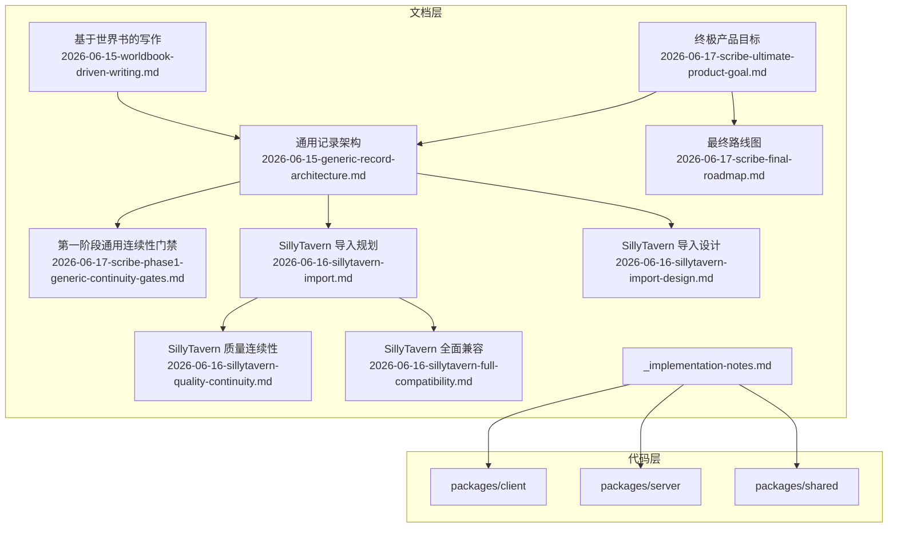
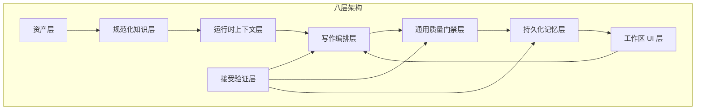
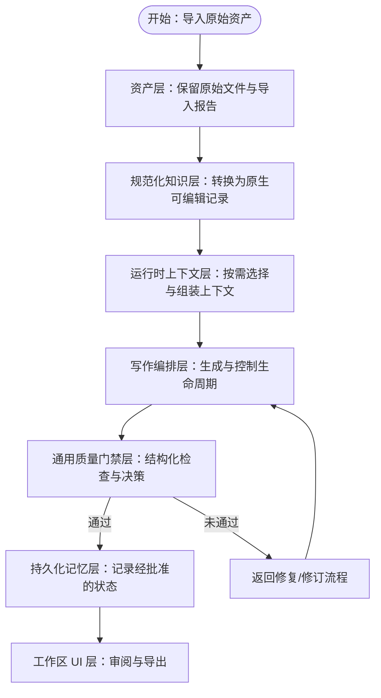
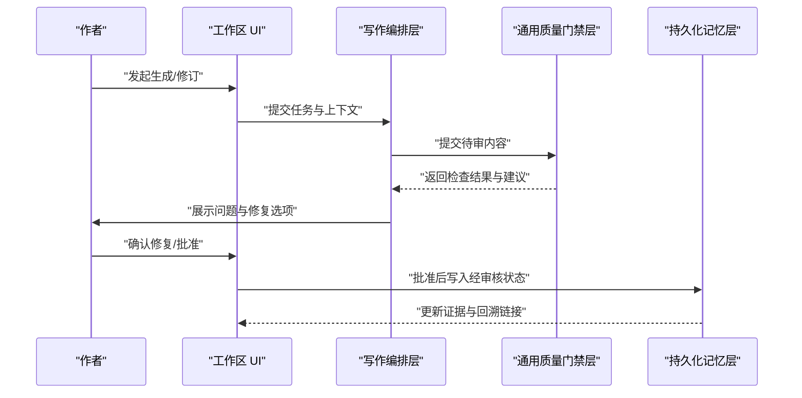
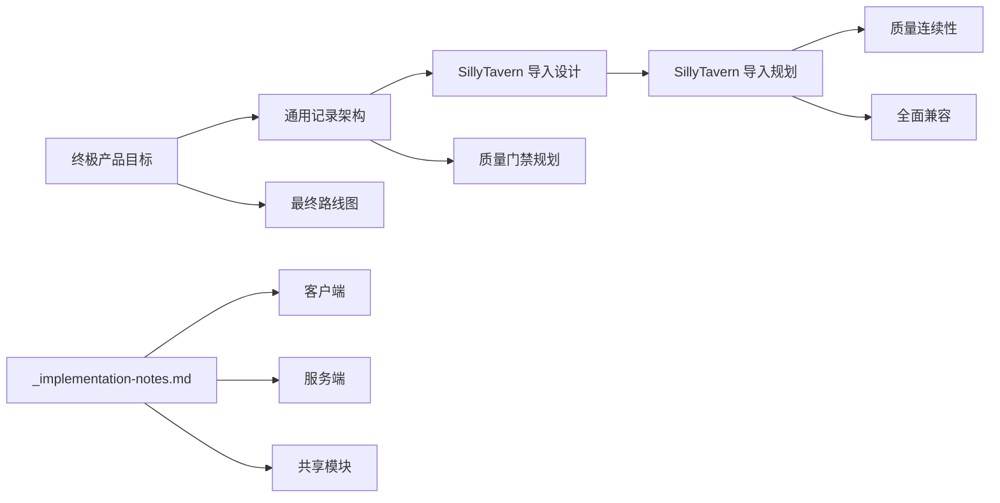

# 技术愿景与创新理念

<cite>
**本文档引用的文件**
- [README.md](file://README.md)
- [2026-06-17-scribe-ultimate-product-goal.md](file://docs/superpowers/specs/2026-06-17-scribe-ultimate-product-goal.md)
- [2026-06-15-generic-record-architecture.md](file://docs/superpowers/plans/2026-06-15-generic-record-architecture.md)
- [2026-06-17-scribe-final-roadmap.md](file://docs/superpowers/plans/2026-06-17-scribe-final-roadmap.md)
- [2026-06-17-scribe-phase1-generic-continuity-gates.md](file://docs/superpowers/plans/2026-06-17-scribe-phase1-generic-continuity-gates.md)
- [2026-06-15-worldbook-driven-writing.md](file://docs/superpowers/plans/2026-06-15-worldbook-driven-writing.md)
- [2026-06-16-sillytavern-import.md](file://docs/superpowers/plans/2026-06-16-sillytavern-import.md)
- [2026-06-16-sillytavern-quality-continuity.md](file://docs/superpowers/plans/2026-06-16-sillytavern-quality-continuity.md)
- [2026-06-16-sillytavern-full-compatibility.md](file://docs/superpowers/plans/2026-06-16-sillytavern-full-compatibility.md)
- [2026-06-16-sillytavern-import-design.md](file://docs/superpowers/specs/2026-06-16-sillytavern-import-design.md)
- [_implementation-notes.md](file://docs/_implementation-notes.md)
</cite>

## 目录
1. [引言](#引言)
2. [项目结构](#项目结构)
3. [核心组件](#核心组件)
4. [架构总览](#架构总览)
5. [详细组件分析](#详细组件分析)
6. [依赖关系分析](#依赖关系分析)
7. [性能考量](#性能考量)
8. [故障排除指南](#故障排除指南)
9. [结论](#结论)
10. [附录](#附录)

## 引言
本文件面向技术决策者与架构师，系统阐述 Scribe 的技术愿景与创新理念，聚焦以下主题：
- 八层架构设计的创新点与技术优势
- 本地优先架构在数据安全与离线可用性方面的保障机制及其对 AI 写作生态的影响
- 通用记录架构的灵活性与可扩展性，以及对未来功能演进的支持
- 质量门禁系统的智能化设计原理，如何提升创作质量与效率
- 基于仓库现有文档的实现路径与验收标准，帮助读者快速把握系统全貌与落地策略

Scribe 的最终目标是成为“本地优先的 AI 长篇小说创作工作室”，帮助用户以可控、可审计、可延续的方式完成从素材导入到章节生成、修订、连续性保护、状态固化与成品导出的全流程。

**章节来源**
- [README.md:1-30](file://README.md#L1-L30)
- [2026-06-17-scribe-ultimate-product-goal.md:1-42](file://docs/superpowers/specs/2026-06-17-scribe-ultimate-product-goal.md#L1-L42)

## 项目结构
Scribe 采用多包（monorepo）结构，包含客户端、服务端与共享模块，配合完善的文档体系支撑产品目标与路线图的落地。项目文档覆盖“终极产品目标”“通用记录架构”“最终路线图”“质量连续性门禁”等关键主题，形成从愿景到实施的完整知识闭环。

**图表来源**
- [2026-06-17-scribe-ultimate-product-goal.md:212-247](file://docs/superpowers/specs/2026-06-17-scribe-ultimate-product-goal.md#L212-L247)
- [2026-06-15-generic-record-architecture.md:25-32](file://docs/superpowers/plans/2026-06-15-generic-record-architecture.md#L25-L32)
- [2026-06-17-scribe-final-roadmap.md](file://docs/superpowers/plans/2026-06-17-scribe-final-roadmap.md)
- [2026-06-17-scribe-phase1-generic-continuity-gates.md](file://docs/superpowers/plans/2026-06-17-scribe-phase1-generic-continuity-gates.md)
- [2026-06-15-worldbook-driven-writing.md](file://docs/superpowers/plans/2026-06-15-worldbook-driven-writing.md)
- [2026-06-16-sillytavern-import.md](file://docs/superpowers/plans/2026-06-16-sillytavern-import.md)
- [2026-06-16-sillytavern-quality-continuity.md](file://docs/superpowers/plans/2026-06-16-sillytavern-quality-continuity.md)
- [2026-06-16-sillytavern-full-compatibility.md](file://docs/superpowers/plans/2026-06-16-sillytavern-full-compatibility.md)
- [2026-06-16-sillytavern-import-design.md](file://docs/superpowers/specs/2026-06-16-sillytavern-import-design.md)
- [_implementation-notes.md](file://docs/_implementation-notes.md)

**章节来源**
- [README.md:1-30](file://README.md#L1-L30)
- [2026-06-17-scribe-ultimate-product-goal.md:212-247](file://docs/superpowers/specs/2026-06-17-scribe-ultimate-product-goal.md#L212-L247)

## 核心组件
围绕“终极产品目标”，Scribe 将系统能力抽象为八层稳定架构，自下而上逐层递进，确保从素材导入到最终交付的每个环节都具备可审计、可控制、可延续的工程化能力。

- 资产层：保存原始导入与源材料，保留原始文件与导入报告、哈希、警告及未支持字段，便于审计与重导回放。
- 规范化知识层：将原始资产转换为 Scribe 原生可编辑结构（如提示预设、提示块、正则脚本、世界书条目、角色记录、大纲记录、时间线事件、伏笔、通用硬事实、读者问题等），统一语义与交互方式。
- 运行时上下文层：为具体操作构建模型上下文，选择相关规范化知识、应用提示栈、检索世界书条目、注入近期记忆、应用用户意图并输出诊断信息。
- 写作编排层：控制写入、审核、修复、修订、自动运行与停止条件；保证模型输出必须通过门禁后方可进入持久化状态。
- 通用质量门禁层：对草稿与修复后的章节执行确定性与模型辅助检查，产出结构化问题，触发修复、阻断状态记录或交由用户决策。
- 持久化记忆层：仅在门禁通过后记录经批准的故事状态，存储在可编辑的结构化仓库中并回溯到章节证据链接。
- 工作区 UI 层：提供作者对写作、编辑、记忆修正、诊断、导入、设置、版本与导出的控制界面。
- 接受验证层：执行跨题材、跨章节的验证工作流，证明系统在不同故事类型中的稳定性与泛化能力。

上述分层既体现了“本地优先”的工程边界，也明确了“作者主导、AI 辅助、系统守护”的产品定位。

**章节来源**
- [2026-06-17-scribe-ultimate-product-goal.md:212-247](file://docs/superpowers/specs/2026-06-17-scribe-ultimate-product-goal.md#L212-L247)

## 架构总览
下图展示了八层架构在一次典型“生成—审核—记录—继续”的创作循环中的协作关系与数据流向。

**图表来源**
- [2026-06-17-scribe-ultimate-product-goal.md:212-247](file://docs/superpowers/specs/2026-06-17-scribe-ultimate-product-goal.md#L212-L247)

**章节来源**
- [2026-06-17-scribe-ultimate-product-goal.md:212-247](file://docs/superpowers/specs/2026-06-17-scribe-ultimate-product-goal.md#L212-L247)

## 详细组件分析

### 本地优先架构：数据安全与离线可用性
- 数据主权与隐私：资产层保留原始导入与源材料，避免云端泄露；所有生成与记忆处理在本地进行，满足本地优先的设计约束。
- 离线可用性：运行时上下文与写作编排可在无网络情况下继续，仅在需要外部模型推理时连接云端；持久化记忆与 UI 提供离线编辑与审阅能力。
- 可审计与可追溯：导入报告、哈希校验、诊断日志与证据链贯穿各层，确保每一步变更均可回溯与复现。
- 对生态的影响：本地优先使作者对创作过程拥有完全控制权，降低对外部服务的耦合度，提升长期写作项目的稳定性与可迁移性。

**章节来源**
- [2026-06-17-scribe-ultimate-product-goal.md:212-247](file://docs/superpowers/specs/2026-06-17-scribe-ultimate-product-goal.md#L212-L247)

### 通用记录架构：灵活性与可扩展性
- 设计原则
  - 不在生产逻辑中编码特定体裁、设定类型或书籍特有概念，确保跨项目与跨题材的通用性。
  - 新模式不通过“首个必填字段”推断身份、标签或显示字段，避免脆弱的启发式规则。
  - “添加”语义不应产生重复；当 AI 再次提及同一记录时，本地工具需执行去重与合并。
  - 关系必须通过通用本地接口解析并写入，而非仅停留在提示层面；若 AI 需要连接两条记录，必须通过声明式字段完成。
  - 保留已稳定且跨小说通用的专用系统（角色、伏笔、时间线、大纲），与通用记录共存。
- 扩展路径
  - 通过新增记录类型与关系字段，平滑引入新领域知识（如地点、物品、势力、规则等）。
  - 通过标准化的规范化流程，持续增强对 SillyTavern 等外部资产的导入与兼容能力。
  - 通过接受验证层对不同题材与长度的测试，逐步完善跨场景的适配与优化。

**图表来源**
- [2026-06-17-scribe-ultimate-product-goal.md:212-247](file://docs/superpowers/specs/2026-06-17-scribe-ultimate-product-goal.md#L212-L247)
- [2026-06-15-generic-record-architecture.md:25-32](file://docs/superpowers/plans/2026-06-15-generic-record-architecture.md#L25-L32)

**章节来源**
- [2026-06-15-generic-record-architecture.md:25-32](file://docs/superpowers/plans/2026-06-15-generic-record-architecture.md#L25-L32)

### 质量门禁系统：智能化设计与效率提升
- 结构化检查：对草稿与修复后的章节执行确定性规则（如连续性、一致性、风格与禁忌）与模型辅助检查，产出结构化问题清单。
- 决策闭环：问题可触发自动修复、人工干预或阻断状态记录；必要时交由作者决策，确保最终进入持久化状态的内容符合质量门槛。
- 效率提升：通过门禁前置拦截低质量输出，减少反复返工；同时提供诊断证据，帮助作者快速定位与修复问题。
- 与写作编排协同：门禁作为“质量守门人”，与编排层共同定义“生成—审核—记录”的可靠闭环。

**图表来源**
- [2026-06-17-scribe-ultimate-product-goal.md:232-238](file://docs/superpowers/specs/2026-06-17-scribe-ultimate-product-goal.md#L232-L238)
- [2026-06-17-scribe-phase1-generic-continuity-gates.md](file://docs/superpowers/plans/2026-06-17-scribe-phase1-generic-continuity-gates.md)

**章节来源**
- [2026-06-17-scribe-ultimate-product-goal.md:232-238](file://docs/superpowers/specs/2026-06-17-scribe-ultimate-product-goal.md#L232-L238)
- [2026-06-17-scribe-phase1-generic-continuity-gates.md](file://docs/superpowers/plans/2026-06-17-scribe-phase1-generic-continuity-gates.md)

### 世界书驱动的写作与 SillyTavern 生态集成
- 世界书驱动写作：通过世界书条目与运行时上下文层的组合，确保生成内容与设定一致、可检索、可解释。
- SillyTavern 导入与兼容：提供导入规划、设计与质量连续性保障，确保外部资产在本地优先环境中被正确归一化与利用。
- 全面兼容：在保持本地优先与质量门禁的前提下，最大化复用现有生态资产，降低迁移成本。

**章节来源**
- [2026-06-15-worldbook-driven-writing.md](file://docs/superpowers/plans/2026-06-15-worldbook-driven-writing.md)
- [2026-06-16-sillytavern-import.md](file://docs/superpowers/plans/2026-06-16-sillytavern-import.md)
- [2026-06-16-sillytavern-quality-continuity.md](file://docs/superpowers/plans/2026-06-16-sillytavern-quality-continuity.md)
- [2026-06-16-sillytavern-full-compatibility.md](file://docs/superpowers/plans/2026-06-16-sillytavern-full-compatibility.md)
- [2026-06-16-sillytavern-import-design.md](file://docs/superpowers/specs/2026-06-16-sillytavern-import-design.md)

## 依赖关系分析
- 文档到实现的映射：通用记录架构与质量门禁等高层设计，通过导入设计、路线图与实现笔记等文档逐步细化到可执行方案与落地步骤。
- 组件内聚与解耦：八层架构将“数据采集—知识建模—上下文组装—生成编排—质量控制—状态固化—交互—验证”清晰分层，降低耦合度，提升可维护性。
- 外部生态集成：通过 SillyTavern 导入与兼容规划，将外部资产与本地优先系统有效衔接，形成“本地主导、生态复用”的平衡。

**图表来源**
- [2026-06-15-generic-record-architecture.md:25-32](file://docs/superpowers/plans/2026-06-15-generic-record-architecture.md#L25-L32)
- [2026-06-16-sillytavern-import-design.md](file://docs/superpowers/specs/2026-06-16-sillytavern-import-design.md)
- [2026-06-17-scribe-phase1-generic-continuity-gates.md](file://docs/superpowers/plans/2026-06-17-scribe-phase1-generic-continuity-gates.md)
- [2026-06-16-sillytavern-import.md](file://docs/superpowers/plans/2026-06-16-sillytavern-import.md)
- [2026-06-16-sillytavern-quality-continuity.md](file://docs/superpowers/plans/2026-06-16-sillytavern-quality-continuity.md)
- [2026-06-16-sillytavern-full-compatibility.md](file://docs/superpowers/plans/2026-06-16-sillytavern-full-compatibility.md)
- [2026-06-17-scribe-ultimate-product-goal.md:212-247](file://docs/superpowers/specs/2026-06-17-scribe-ultimate-product-goal.md#L212-L247)
- [2026-06-17-scribe-final-roadmap.md](file://docs/superpowers/plans/2026-06-17-scribe-final-roadmap.md)
- [_implementation-notes.md](file://docs/_implementation-notes.md)

**章节来源**
- [2026-06-15-generic-record-architecture.md:25-32](file://docs/superpowers/plans/2026-06-15-generic-record-architecture.md#L25-L32)
- [2026-06-17-scribe-ultimate-product-goal.md:212-247](file://docs/superpowers/specs/2026-06-17-scribe-ultimate-product-goal.md#L212-L247)
- [2026-06-17-scribe-final-roadmap.md](file://docs/superpowers/plans/2026-06-17-scribe-final-roadmap.md)
- [_implementation-notes.md](file://docs/_implementation-notes.md)

## 性能考量
- 上下文构建与检索：通过运行时上下文层的按需选择与缓存策略，减少无关信息带来的计算开销，提升生成响应速度。
- 门禁检查的批量化与增量化：对草稿与修复内容的检查应支持批量与增量执行，结合结构化问题的分类与优先级排序，提高审阅效率。
- 本地优先的资源管理：在离线或弱网环境下，优先使用本地缓存与历史证据，避免频繁远程调用导致的延迟与失败。
- 可扩展性与并发：通用记录架构与质量门禁的模块化设计，便于在未来引入更多检查维度与并行处理能力，而不影响核心流程稳定性。

[本节为通用指导，无需列出章节来源]

## 故障排除指南
- 导入失败或字段丢失：检查资产层的导入报告与哈希校验，确认未支持字段是否被正确保留与标记；必要时通过规范化知识层进行手动补全。
- 连续性冲突：在质量门禁层查看结构化问题清单，优先解决硬事实冲突与读者问题；必要时回溯到证据链接，定位具体章节来源。
- 记忆未更新：确认门禁是否通过、状态记录是否被阻断；检查持久化记忆层的证据链接与回溯信息，确保批准流程完整。
- UI 卡顿或响应慢：检查运行时上下文层的选择范围与缓存命中率，适当缩小上下文规模或启用增量更新策略。

**章节来源**
- [2026-06-17-scribe-ultimate-product-goal.md:262-268](file://docs/superpowers/specs/2026-06-17-scribe-ultimate-product-goal.md#L262-L268)

## 结论
Scribe 的技术愿景以“本地优先”为核心，通过八层稳定架构实现从素材导入到成品交付的全链路可控与可审计。通用记录架构确保了跨项目、跨题材的可扩展性；质量门禁系统将智能化检查与人工决策有机结合，显著提升创作质量与效率。面向技术决策者与架构师，Scribe 提供了一套可落地、可验证、可演进的工程框架，既能满足当前需求，也为未来生态融合与能力扩展预留空间。

[本节为总结性内容，无需列出章节来源]

## 附录
- 最终用户体验与验收标准：涵盖创建工作簿、导入 SillyTavern 资产、生成/修订/批准/导出章节、检查与纠正记忆、自动多章生成与停止条件、跨题材验证等关键指标。
- 实施要点：以文档为纲，逐步细化到导入设计、质量门禁与接受验证的具体步骤，配套实现笔记与代码包划分，确保设计与实现的一致性。

**章节来源**
- [2026-06-17-scribe-ultimate-product-goal.md:15-42](file://docs/superpowers/specs/2026-06-17-scribe-ultimate-product-goal.md#L15-L42)
- [2026-06-17-scribe-ultimate-product-goal.md:248-268](file://docs/superpowers/specs/2026-06-17-scribe-ultimate-product-goal.md#L248-L268)
- [_implementation-notes.md](file://docs/_implementation-notes.md)