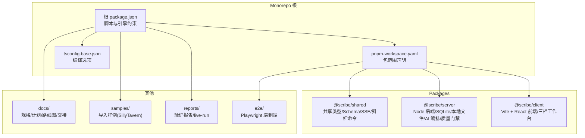
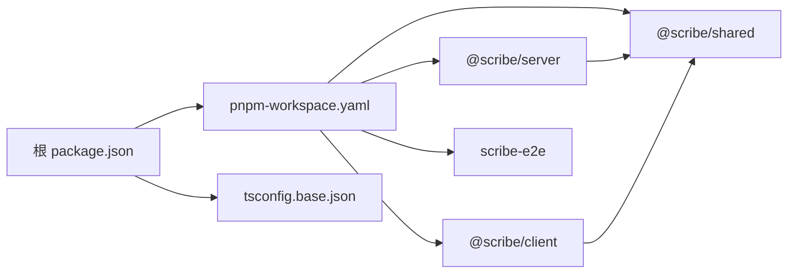

# 项目概述

<cite>
**本文引用的文件**
- [README.md](file://README.md)
- [package.json](file://package.json)
- [pnpm-workspace.yaml](file://pnpm-workspace.yaml)
- [tsconfig.base.json](file://tsconfig.base.json)
- [docs/superpowers/specs/2026-06-17-scribe-ultimate-product-goal.md](file://docs/superpowers/specs/2026-06-17-scribe-ultimate-product-goal.md)
- [docs/superpowers/plans/2026-06-17-scribe-final-roadmap.md](file://docs/superpowers/plans/2026-06-17-scribe-final-roadmap.md)
- [docs/_implementation-notes.md](file://docs/_implementation-notes.md)
- [samples/README.md](file://samples/README.md)
- [samples/sillytavern/Izumi 0503.json](file://samples/sillytavern/Izumi 0503.json)
- [reports/README.md](file://reports/README.md)
</cite>

## 目录
1. [引言](#引言)
2. [项目结构](#项目结构)
3. [核心组件](#核心组件)
4. [架构总览](#架构总览)
5. [详细组件分析](#详细组件分析)
6. [依赖关系分析](#依赖关系分析)
7. [性能考虑](#性能考虑)
8. [故障排查指南](#故障排查指南)
9. [结论](#结论)
10. [附录](#附录)

## 引言
Scribe 是一个“本地优先”的长篇小说创作工作空间，目标不是单一章节生成器，而是将设定、世界书、预设、对话意图、章节正文、审查结果与长期记忆整合为可持续推进的写作项目。其核心价值在于：
- 本地优先：数据与计算尽可能保留在本地，降低隐私与可移植性风险
- 对话驱动创作：以自然语言指令控制创作方向，减少重复提示负担
- 长期记忆管理：建立可编辑、可追溯、可锁定的“小说级”事实库
- 通用质量门禁：在进入持久化之前，对连续性、结构与风格进行跨题材的判定
- 八层架构：从资产层到工作区 UI 层，层层解耦、职责清晰、可演进

产品定位是“私有的本地 AI 小说工作室”，帮助作者在可控的创作方向下，完成从导入创意资产、与 AI 编辑协作、生成与修订章节、持续维护记忆、到最终交付成品的全流程。

## 项目结构
仓库采用 monorepo 结构，通过 pnpm workspace 管理多包，核心目录如下：
- packages：前后端与共享代码
  - client：Vite + React 前端（三栏写作工作台）
  - server：Node 后端（SQLite、本地文件、AI 编排、质量门禁）
  - shared：前后端共享类型、Zod schema、SSE 事件、斜杠命令表等
- e2e：Playwright 端到端测试与截图证据
- docs：规格、计划、路线图、交接文档
- samples：可复现实验导入样例（如 SillyTavern 预设与世界书）
- reports：历史验证报告与 live-run 证据

图表来源
- [pnpm-workspace.yaml:1-4](file://pnpm-workspace.yaml#L1-L4)
- [package.json:1-21](file://package.json#L1-L21)
- [tsconfig.base.json:1-16](file://tsconfig.base.json#L1-L16)

章节来源
- [README.md:44-55](file://README.md#L44-L55)
- [pnpm-workspace.yaml:1-4](file://pnpm-workspace.yaml#L1-L4)
- [package.json:1-21](file://package.json#L1-L21)
- [tsconfig.base.json:1-16](file://tsconfig.base.json#L1-L16)

## 核心组件
- 本地优先与数据治理
  - 数据目录默认位于系统配置目录，每本书独立工作区，包含数据库、章节 Markdown 与规则文件；支持自动快照与备份
  - API Key 通过本地 secrets 文件管理，避免硬编码与泄露
- 对话驱动创作
  - 支持斜杠命令（如续写、自动写若干章、审查、检索）；自然语言指令转化为上下文组装、生成、修订、记录等操作
- 长期记忆管理
  - 记忆涵盖角色状态、关系、地点、时间线、资源与任务进度、契约与规则、伤害与能力、情节弧线与伏笔、世界规则与章节摘要等
  - 记忆可查看、编辑、锁定、删除、注释，并与章节证据关联
- 通用质量门禁
  - 覆盖硬事实矛盾、世界规则矛盾、角色连续性漂移、情节连续性错误、输出结构缺失、元输出污染、风格漂移、长篇退化等
  - 门禁失败时阻止持久化，必要时触发修复与二次审查
- 八层架构
  - 资产层、规范化知识层、运行时上下文层、写作编排层、通用质量门禁层、持久化记忆层、工作区 UI 层、验收测试层
  - 每层职责明确，接口稳定，便于跨题材验证与演进

章节来源
- [README.md:16-34](file://README.md#L16-L34)
- [README.md:57-62](file://README.md#L57-L62)
- [docs/superpowers/specs/2026-06-17-scribe-ultimate-product-goal.md:68-143](file://docs/superpowers/specs/2026-06-17-scribe-ultimate-product-goal.md#L68-L143)
- [docs/superpowers/specs/2026-06-17-scribe-ultimate-product-goal.md:212-247](file://docs/superpowers/specs/2026-06-17-scribe-ultimate-product-goal.md#L212-L247)

## 架构总览
八层架构自下而上，形成“资产→知识→上下文→编排→门禁→记忆→界面→验收”的闭环。验收层通过多题材、多章节的验证工作流，确保系统在不同故事类型中的稳定性与一致性。

图表来源
- [docs/superpowers/specs/2026-06-17-scribe-ultimate-product-goal.md:212-247](file://docs/superpowers/specs/2026-06-17-scribe-ultimate-product-goal.md#L212-L247)

## 详细组件分析

### 1) 资产层与导入兼容性
- 目标：保留原始导入文件，规范化为可编辑结构，证明其对写作调用的影响
- 支持来源：SillyTavern 预设与世界书、角色卡、既有章节、Markdown 笔记、规则与风格指南、手动世界构建文档、散落剧情想法
- 设计要点：区分“原始制品”“规范化模型”“运行时上下文”“诊断证据”，确保可审计与可回溯

章节来源
- [docs/superpowers/specs/2026-06-17-scribe-ultimate-product-goal.md:46-67](file://docs/superpowers/specs/2026-06-17-scribe-ultimate-product-goal.md#L46-L67)
- [samples/README.md](file://samples/README.md)
- [samples/sillytavern/Izumi 0503.json](file://samples/sillytavern/Izumi%200503.json)

### 2) 规范化知识层与运行时上下文
- 规范化知识：将导入材料转换为 Scribe 原生记录（提示预设、提示块、正则脚本、世界书条目、角色记录、大纲记录、时间线事件、伏笔、通用硬事实、读者/审计问题）
- 运行时上下文：为特定操作构建实际模型上下文，选择相关知识、应用提示堆栈、检索世界书、注入近期记忆、应用用户意图并产出诊断

章节来源
- [docs/superpowers/specs/2026-06-17-scribe-ultimate-product-goal.md:220-227](file://docs/superpowers/specs/2026-06-17-scribe-ultimate-product-goal.md#L220-L227)

### 3) 写作编排层与章节生成工作流
- 目标：章节生成是一个受控流水线，而非单次模型调用
- 流程：加载书籍状态 → 编译运行时上下文 → 生成草稿 → 清洗非正文污染 → 审查质量与连续性 → 运行通用质量门禁 → 修复（如有）→ 二次审查与门禁 → 停止（如仍不安全）→ 持久化已批准章节版本 → 从批准文本记录持久化状态 → 产出用户可读诊断
- 关键原则：失败章节不得污染持久化记忆；坏记忆比缺失记忆更危险

章节来源
- [docs/superpowers/specs/2026-06-17-scribe-ultimate-product-goal.md:104-126](file://docs/superpowers/specs/2026-06-17-scribe-ultimate-product-goal.md#L104-L126)

### 4) 通用质量门禁层
- 覆盖维度：硬事实矛盾、世界规则矛盾、角色连续性漂移、情节连续性错误、必需输出结构缺失、元输出污染、风格漂移、长篇退化
- 要求：门禁必须跨题材通用，不依附于样本故事、世界书或关键词集合；样本失败应提炼抽象，而非打补丁

章节来源
- [docs/superpowers/specs/2026-06-17-scribe-ultimate-product-goal.md:127-143](file://docs/superpowers/specs/2026-06-17-scribe-ultimate-product-goal.md#L127-L143)

### 5) 持久化记忆层
- 仅在门禁通过后记录经批准的故事状态
- 记录存储在可编辑的结构化仓库中，并保留指向章节证据的链接
- 支持编辑、锁定、删除与注释，确保可审计与可追溯

章节来源
- [docs/superpowers/specs/2026-06-17-scribe-ultimate-product-goal.md:236-239](file://docs/superpowers/specs/2026-06-17-scribe-ultimate-product-goal.md#L236-L239)

### 6) 工作区 UI 层
- 提供写作工作区而非单一文本框
- 暴露：书籍库、引导与书籍设置、与 AI 编辑的对话、带版本历史与差异/重写工具的章节编辑器、角色、世界书与导入知识、大纲与章节计划、时间线、伏笔、通用记录与硬事实、读者/审计问题、提示预设与模型设置、运行时诊断、成本与令牌用量、备份与导出
- 用户可查看、编辑、锁定、删除、恢复与导出项目状态

章节来源
- [docs/superpowers/specs/2026-06-17-scribe-ultimate-product-goal.md:144-167](file://docs/superpowers/specs/2026-06-17-scribe-ultimate-product-goal.md#L144-L167)

### 7) 验收测试层
- 多题材验证：都市/系统、仙侠、推理/悬疑、科幻等场景下的跨题材一致性
- 多章节验证：5 章烟雾测试、15 章接受性测试；在第 1、5、10、15 章进行人工快速审阅
- 覆盖范围：导入、运行时上下文、检索、门禁、状态记录与 UI 编辑流程的单元与集成测试

章节来源
- [docs/superpowers/specs/2026-06-17-scribe-ultimate-product-goal.md:285-292](file://docs/superpowers/specs/2026-06-17-scribe-ultimate-product-goal.md#L285-L292)
- [docs/superpowers/specs/2026-06-17-scribe-ultimate-product-goal.md:293-305](file://docs/superpowers/specs/2026-06-17-scribe-ultimate-product-goal.md#L293-L305)

### 8) 路线图与实施阶段
- 阶段 1：通用连续性门禁（防止坏章节污染持久化记忆）
- 阶段 2：模型辅助硬事实提取（基于题材中性的模式）
- 阶段 3：SillyTavern 运行时兼容（完成预设与世界书运行时层）
- 阶段 4：记忆与诊断 UI（可查看与纠正的记忆面板）
- 阶段 5：工作区完善（版本/差异工作流、导出包、备份/恢复 UX、成本诊断）
- 阶段 6：验收测试（多题材与多章节验证）

章节来源
- [docs/superpowers/plans/2026-06-17-scribe-final-roadmap.md:1-79](file://docs/superpowers/plans/2026-06-17-scribe-final-roadmap.md#L1-L79)

## 依赖关系分析
- 包管理与工作区
  - 根 package.json 定义统一脚本与 Node 版本要求；pnpm workspace 声明 packages/* 与 e2e
  - tsconfig.base.json 统一编译选项，确保类型安全与模块解析一致性
- 依赖与耦合
  - shared 为 server 与 client 提供共享类型与协议；server 依赖 SQLite 与本地文件系统；client 依赖 Vite/React 生态
  - e2e 依赖真实 server，确保端到端行为一致
- 外部集成
  - 文档中多次强调 SillyTavern 兼容性与 OpenRouter/模型计费细节，体现对外部生态的兼容与可观测性

图表来源
- [package.json:1-21](file://package.json#L1-L21)
- [pnpm-workspace.yaml:1-4](file://pnpm-workspace.yaml#L1-L4)
- [tsconfig.base.json:1-16](file://tsconfig.base.json#L1-L16)

章节来源
- [package.json:1-21](file://package.json#L1-L21)
- [pnpm-workspace.yaml:1-4](file://pnpm-workspace.yaml#L1-L4)
- [tsconfig.base.json:1-16](file://tsconfig.base.json#L1-L16)

## 性能考虑
- 本地优先与 I/O：通过 SQLite 与本地文件系统减少网络抖动影响；建议合理设置预算与上下文窗口，避免超限导致的重试风暴
- 门禁与修复：在持久化前进行门禁与修复，可减少无效重算与回滚成本
- 并发与一致性：数据库迁移与索引约束（如章节版本唯一性）有助于在并发场景下维持一致性
- 估算与预算：提供经验级令牌估算公式，结合模型上下文窗口动态派生预算，平衡生成质量与成本

章节来源
- [docs/_implementation-notes.md:321-331](file://docs/_implementation-notes.md#L321-L331)
- [docs/_implementation-notes.md:144-149](file://docs/_implementation-notes.md#L144-L149)

## 故障排查指南
- 环境与安装
  - Node 版本要求与 pnpm 版本；Windows 下原生模块安装问题可通过 node-linker=hoisted 解决
  - 端到端测试包名需为 scribe-e2e，否则脚本会静默不执行
- 数据与配置
  - API Key 存放于本地 secrets.env；数据目录默认在系统配置目录，可用环境变量覆盖
  - 书籍工作区包含数据库、章节 Markdown 与规则文件；定期检查自动快照与备份
- 测试与构建
  - Vitest 与覆盖率、构建配置与 tsconfig 的协同；注意内置模块 spy 的 mock 方案
  - 数据库迁移与约束（如章节版本唯一索引）在并发场景下的重要性
- 运行时与诊断
  - SSE 事件终止契约与错误文案脱敏；工具调用错误恢复机制
  - 门禁失败时的修复与二次审查流程；审计与摘要的事务化保存

章节来源
- [README.md:5-34](file://README.md#L5-L34)
- [docs/_implementation-notes.md:11-27](file://docs/_implementation-notes.md#L11-L27)
- [docs/_implementation-notes.md:96-101](file://docs/_implementation-notes.md#L96-L101)
- [docs/_implementation-notes.md:218-228](file://docs/_implementation-notes.md#L218-L228)
- [docs/_implementation-notes.md:268-273](file://docs/_implementation-notes.md#L268-L273)
- [docs/_implementation-notes.md:347-354](file://docs/_implementation-notes.md#L347-L354)

## 结论
Scribe 以“本地优先”“对话驱动”“长期记忆”“通用门禁”为核心支柱，通过八层架构将创意资产、运行时上下文、生成编排、质量保障与工作区体验有机整合。路线图明确了从通用连续性门禁到验收测试的阶段性目标，确保系统在多题材、多章节场景下的稳定性与可交付性。对于初学者，Scribe 提供直观的斜杠命令与三栏工作台；对于有经验的开发者，其稳定的接口、可审计的数据流与严格的门禁体系提供了深入定制与扩展的空间。

## 附录

### A. 使用场景与案例研究
- 导入与设置：从 SillyTavern 预设与世界书导入，保留原始制品并规范化为可编辑结构，随后进行书籍引导与元数据设置
- 对话式创作：通过自然语言指令控制章节走向，系统自动组装上下文、生成草稿、审查质量与连续性、修复并再次审查
- 记忆维护：在章节完成后，系统将新事实记录到持久化记忆层，并与章节证据关联；作者可随时查看、编辑、锁定或删除
- 多题材验证：通过都市/系统、仙侠、推理/悬疑、科幻等题材的多章节运行，验证门禁与连续性保护的有效性

章节来源
- [docs/superpowers/specs/2026-06-17-scribe-ultimate-product-goal.md:17-32](file://docs/superpowers/specs/2026-06-17-scribe-ultimate-product-goal.md#L17-L32)
- [docs/superpowers/specs/2026-06-17-scribe-ultimate-product-goal.md:293-305](file://docs/superpowers/specs/2026-06-17-scribe-ultimate-product-goal.md#L293-L305)

### B. 设计原则与验收标准
- 设计原则：用户权威至上、原始资产保留、运行时行为可诊断、记忆可编辑且证据链完整、坏章节不得污染持久化、测试应保护写作质量与连续性、本地数据可恢复、可导出、可安全覆盖、偏好明确停止条件、每个功能都服务于完成长篇小说
- 验收标准：功能、连续性、兼容性、质量与验证五个维度的可量化指标，确保系统在真实长篇写作中的可靠性

章节来源
- [docs/superpowers/specs/2026-06-17-scribe-ultimate-product-goal.md:306-331](file://docs/superpowers/specs/2026-06-17-scribe-ultimate-product-goal.md#L306-L331)
- [docs/superpowers/specs/2026-06-17-scribe-ultimate-product-goal.md:248-292](file://docs/superpowers/specs/2026-06-17-scribe-ultimate-product-goal.md#L248-L292)